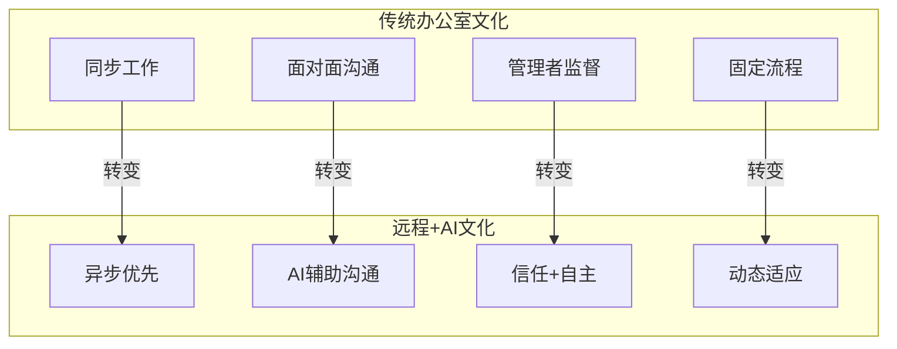
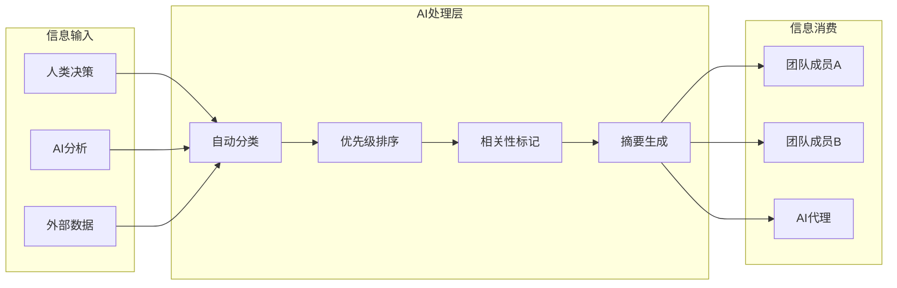
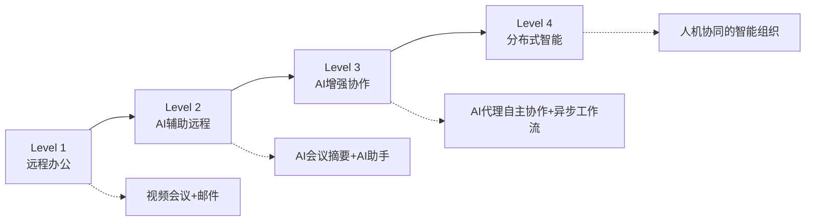

# 远程+AI协作文化

## 新常态：远程 + AI = 分布式智能

> [!key] 核心洞察
> 远程工作解决了"在哪里工作"的问题，AI解决了"如何工作"的问题。两者结合催生了全新的组织形态——**分布式智能组织**。在这种组织中，人类成员和AI代理分布在不同的时区和空间，通过异步协作和AI辅助，实现比传统办公室更高效率的协作。

---

## 远程+AI协作的四大支柱

### 支柱1：异步优先（Async-First）

异步协作是远程+AI文化的核心。AI可以扮演"异步放大器"的角色：

- **AI会议摘要**：AI自动记录和总结会议，让无法实时参会的人快速了解
- **AI知识库**：AI自动整理和索引团队知识，随时可查
- **AI问答机器人**：团队成员可以随时向AI询问项目状态，不需要打断其他人

> [!tip] 异步协作黄金法则
> - 所有重要决策必须有书面记录（AI自动生成决策日志）
> - 所有沟通默认异步，同步会议必须有明确议程
> - AI负责信息聚合和分发，人类负责判断和决策

### 支柱2：透明化信息流

在远程+AI环境中，信息流动的方式决定了协作效率：

### 支柱3：AI原生协作工具链

选择合适的工具是文化建设的基础。推荐的远程+AI工具栈：

| 功能域 | 推荐工具 | AI能力 |
|-------|---------|--------|
| 异步沟通 | Slack/Teams + AI插件 | 自动摘要、智能回复 |
| 项目管理 | Linear/Notion + AI | 自动分配、风险预测 |
| 知识管理 | Obsidian + AI插件 | 自动链接、知识发现 |
| 文档协作 | Google Docs + AI | 实时编辑、智能建议 |
| 会议 | Zoom/Meet + AI | 自动记录、行动项提取 |

### 支柱4：数字仪式感

远程团队缺乏物理空间中的"偶遇"和"仪式感"，AI可以帮助创造这些：

> [!example] 数字仪式实践
> - **AI早安简报**：每天早晨AI推送个性化团队动态
> - **虚拟咖啡时间**：AI随机配对团队成员进行非正式聊天
> - **AI成就墙**：自动识别和展示团队成员的贡献
> - **数字庆祝**：AI监控项目里程碑，自动触发庆祝活动

---

## 远程+AI文化的挑战与对策

### 挑战1：孤独感与归属感

远程工作容易导致孤独感，AI可以部分缓解但不能完全解决。

**对策**：
- 建立"AI buddy"系统——每个成员分配一个AI助手，不仅用于工作，也用于日常交流
- 定期线下聚会（季度/半年一次）
- 创建"虚拟办公室"——AI驱动的虚拟空间，成员可以随时"偶遇"

### 挑战2：信息过载

AI可能产生大量信息，反而增加认知负担。

**对策**：
- 实施"信息节食"——AI需要自动过滤和优先级排序
- 建立"推送规则"——什么信息需要立即通知，什么可以汇总阅读
- 参考[[03-HR人事/AI时代领导力与管理/02_决策模式变革：数据驱动与人性判断的平衡]]中的信息处理框架

### 挑战3：时区差异

全球分布式团队面临时区挑战，AI可以成为"跨时区粘合剂"。

> [!warning] 时区管理要点
> - 建立"重叠工作时间"窗口（至少4小时）
> - AI异步任务交接——当一个时区的工作结束时，AI自动交接给下一个时区
> - 避免"跟进疲劳"——AI自动追踪任务状态，减少人类之间的催促

---

## 分布式智能组织的成熟度模型

| 级别 | 特征 | AI角色 | 文化成熟度 |
|------|------|--------|-----------|
| L1 | 远程办公 | 基础工具 | 探索 |
| L2 | AI辅助远程 | 个人助手 | 适应 |
| L3 | AI增强协作 | 团队协作者 | 成熟 |
| L4 | 分布式智能 | 自主代理 | 领先 |

---

## 远程+AI文化的领导力要求

管理者在远程+AI文化中需要具备以下能力，这些与[[03-HR人事/AI时代领导力与管理/06_管理者AI素养：从会用到善用]]中讨论的素养框架一脉相承：

1. **异步沟通设计**：设计有效的异步沟通流程
2. **AI工具配置**：选择和配置适合团队的AI工具
3. **文化守护者**：主动维护团队文化，而非依赖物理环境
4. **连接者**：在数字环境中建立人与人、人与AI的连接
5. **节奏设计师**：设计团队的工作节奏，平衡同步和异步

---

## 跨知识库联动

- [[03-HR人事/AI时代领导力与管理/03_混合团队管理：如何带领人+AI的团队]] 探讨了混合团队在远程环境中的具体管理方法
- [[03-HR人事/AI时代领导力与管理/04_AI时代的授权与信任：从控制到信任]] 的信任框架是远程协作的基础
- [[05-产品与开发/独立开发者生存指南/05_分发渠道与冷启动：产品做出来没人知道怎么办]] 中的传播策略也适用于远程团队的文化建设

---

*最后更新: 2026-07-31*