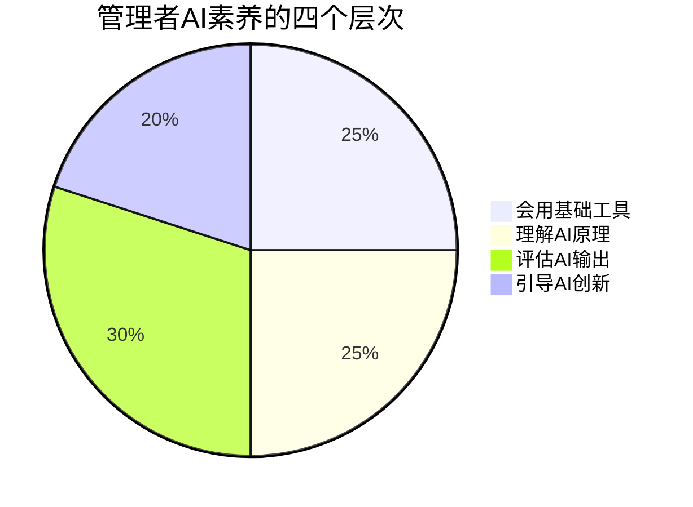
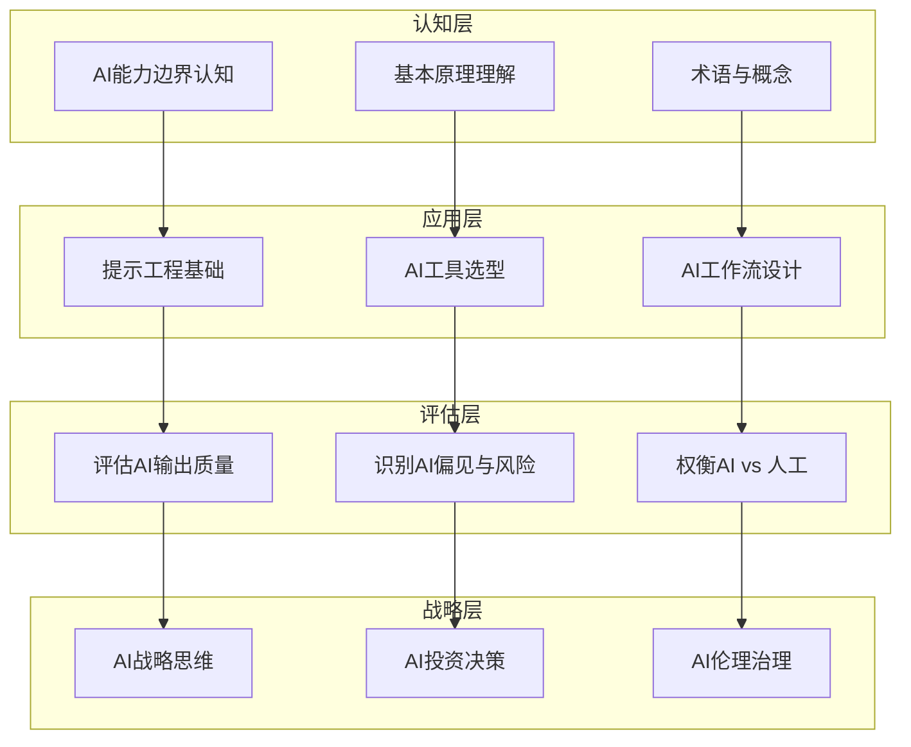
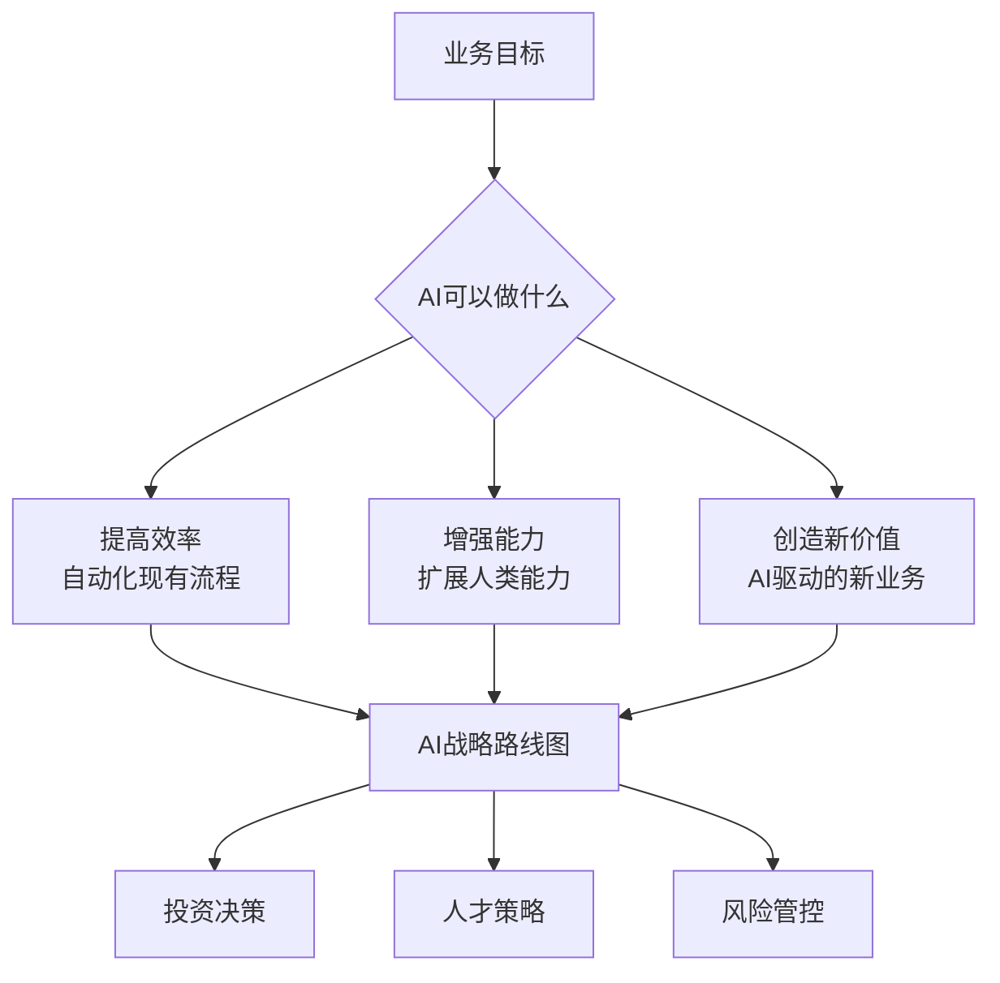

# 管理者AI素养：从会用到善用

## 为什么管理者需要AI素养？

> [!key] 核心洞察
> 2026年，AI已经像互联网一样无处不在。但"会用"和"善用"之间存在巨大鸿沟。管理者需要的不是成为AI专家，而是建立**AI判断力**——知道什么时候用AI、用什么AI、如何评估AI输出、以及如何引导团队用好AI。



---

## 管理者AI素养金字塔



---

## 认知层：理解AI

### 管理者需要知道的核心概念

| 概念 | 通俗理解 | 为什么管理者需要知道 |
|------|---------|-------------------|
| 大语言模型（LLM） | 根据概率预测下一个词的AI | 理解AI"胡说八道"的原因 |
| 训练数据 | AI学习的材料 | 知道AI的知识边界 |
| 幻觉 | AI生成看似合理但错误的内容 | 对AI输出保持批判 |
| 上下文窗口 | AI一次能"记住"的信息量 | 有效管理AI的注意力 |
| 温度参数 | AI的创造力控制 | 调节AI的输出风格 |

> [!tip] 管理者的AI认知速成
> 不需要理解技术细节，但需要理解三个核心原则：
> 1. **AI不是万能的**——它有明确的边界
> 2. **AI不是完美的**——它会有错误和偏见
> 3. **AI不是被动的**——它能主动提供洞察

---

## 应用层：使用AI

### 提示工程基础

管理者需要掌握[[01-AI技术/Prompt Engineering深度/01_Prompt的本质与设计原则]]中的核心技能，但不需要像Prompt工程师那样深入。

> [!example] 管理者的提示工程三要素
> ```
> 1. 明确角色：你是一位[角色]
> 2. 明确任务：请[具体任务]
> 3. 明确格式：以[格式]输出
> ```

### AI工具选型原则

| 选择维度 | 评估标准 | 常见陷阱 |
|---------|---------|---------|
| 能力匹配 | 工具能否完成需要的任务 | 功能过剩/不足 |
| 数据安全 | 数据是否在企业内处理 | 忽略数据合规 |
| 集成性 | 是否与现有工具链兼容 | 工具孤岛 |
| 可扩展性 | 能否随团队规模增长 | 早期过度投入 |
| 学习曲线 | 团队上手难度 | 低估培训成本 |

---

## 评估层：判断AI输出

### 评估AI输出质量框架

管理者需要建立系统化的AI输出评估能力：

1. **准确性检查**：AI输出的事实是否准确？
2. **完整性检查**：AI是否遗漏了关键信息？
3. **逻辑性检查**：AI的推理是否合理？
4. **适用性检查**：AI的输出是否适合当前场景？
5. **安全性检查**：AI输出是否存在风险？

> [!warning] 评估陷阱
> 管理者最容易犯的错误是"AI确认偏差"——当AI输出符合自己的预期时，降低评估标准。需要建立"魔鬼代言人"机制，主动寻找AI输出的问题。

### 识别AI偏见

AI偏见可能来自：
- **训练数据偏见**：数据本身的不平衡
- **标注偏见**：人类标注者的主观判断
- **提示偏见**：提示词引导了特定方向
- **确认偏见**：AI倾向于迎合用户的预期

---

## 战略层：引领AI创新

### AI战略思维

管理者需要将AI能力与业务战略对齐：



### AI伦理治理

管理者需要建立团队的AI使用伦理框架：

1. **透明度**：什么时候使用了AI？使用了什么AI？
2. **公平性**：AI决策是否公平？是否存在偏见？
3. **问责制**：AI出错时，谁负责？
4. **隐私保护**：数据使用是否符合规范？
5. **人类主导**：关键决策是否保留了人类判断？

---

## 管理者AI素养发展路径

| 阶段 | 时间 | 学习重点 | 实践目标 |
|------|------|---------|---------|
| 认知期 | 第1-2周 | 理解AI基本概念 | 每天使用AI完成1个任务 |
| 应用期 | 第3-4周 | 掌握提示工程 | 用AI优化3个工作流程 |
| 评估期 | 第2-3月 | 评估AI输出质量 | 建立AI输出评估标准 |
| 战略期 | 第3-6月 | AI战略思维 | 制定团队AI路线图 |
| 引领期 | 6个月+ | AI创新与治理 | 带领团队AI转型 |

> [!example] 每日AI素养练习
> 管理者可以每天花15分钟做以下练习：
> - **周一**：用AI分析一个业务数据
> - **周二**：让AI扮演一个专家角色
> - **周三**：评估AI输出的准确性
> - **周四**：设计一个AI工作流
> - **周五**：分享AI使用心得

---

## 跨知识库联动

- [[01-AI技术/Prompt Engineering深度/01_Prompt的本质与设计原则]] 提供了提示工程的基础知识
- [[03-HR人事/AI时代领导力与管理/01_领导力范式转移：从管理到赋能]] 探讨了AI素养如何改变领导力
- [[05-产品与开发/独立开发者生存指南/06_用户支持与社区运营：小团队的大服务]] 中的AI辅助支持策略也适用于管理者建立AI素养

---

*最后更新: 2026-07-31*