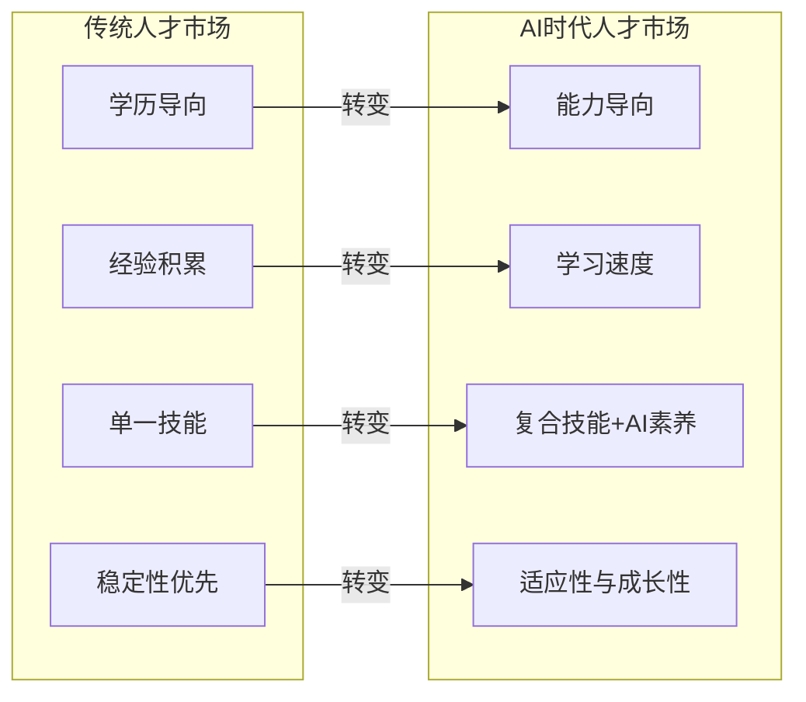
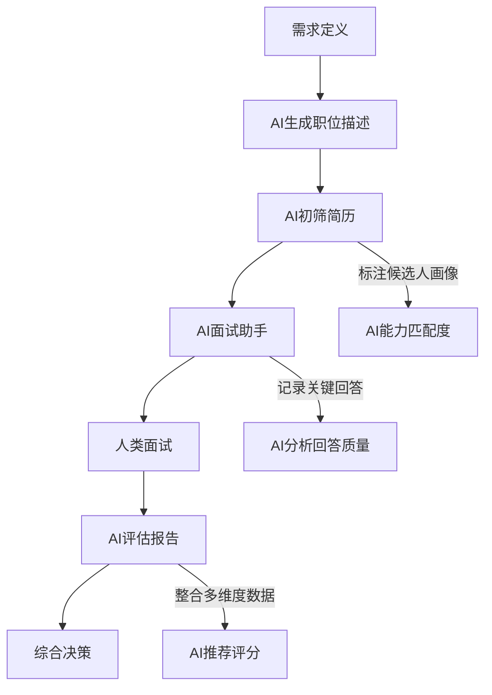
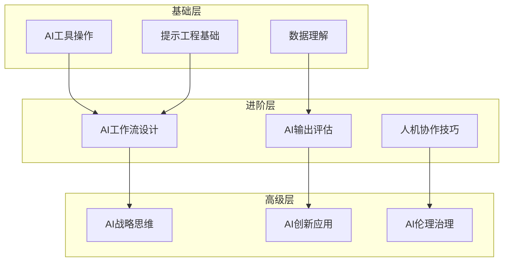
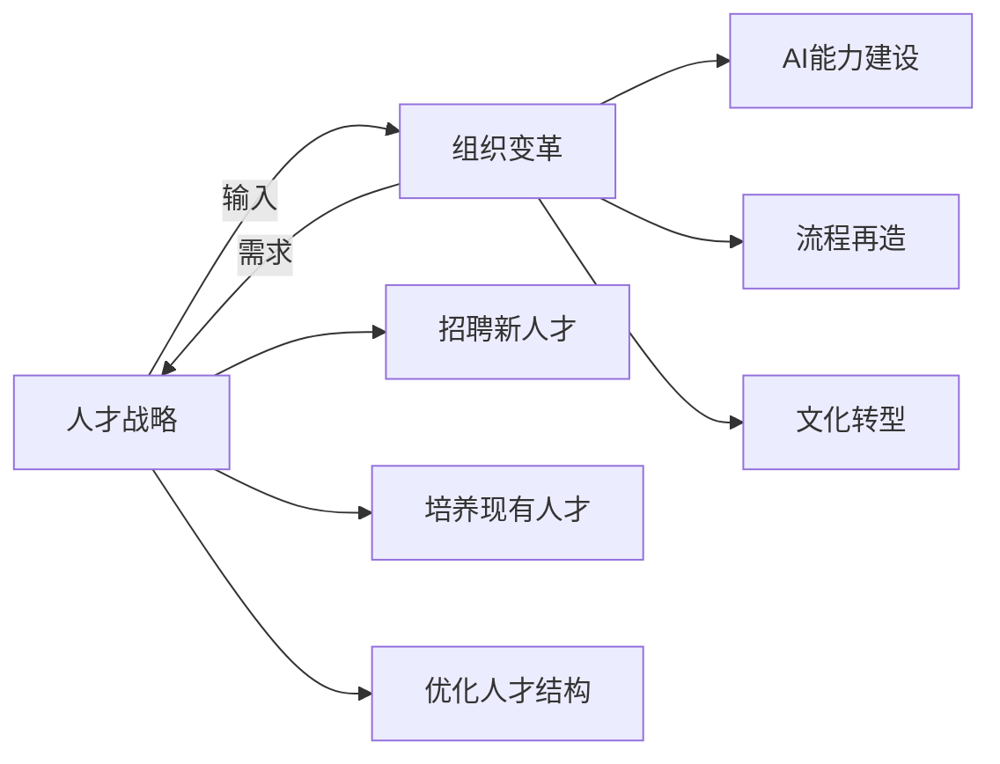

# 人才战略：AI时代如何招聘、培养和留住人才

## AI时代的人才市场巨变

> [!key] 核心洞察
> AI正在重新定义"什么是人才"。传统的学历、经验、技能组合评价体系正在瓦解。AI时代的人才战略需要回答三个根本问题：**我们需要什么样的人？**（招聘标准）、**如何让他们持续成长？**（培养体系）、**如何让他们愿意留下？**（保留策略）。

---

## 招聘：找到"AI时代的人才"

### 新的人才评估维度

| 评估维度 | 传统标准 | AI时代标准 | 评估方法 |
|---------|---------|-----------|---------|
| 认知能力 | 学历、知识储备 | 学习速度、适应能力 | 情境测试 |
| 技能组合 | 单一专业技能 | T型+AI素养 | 实操项目 |
| 工作方式 | 独立执行 | 人机协作能力 | AI协作模拟 |
| 问题解决 | 已知问题解决 | 未知问题探索 | 开放性问题 |
| 价值观 | 文化适配 | 成长心态+伦理意识 | 行为面试 |

### AI辅助招聘流程

> [!tip] AI在招聘中的角色
> AI负责"筛选"和"分析"，人类负责"判断"和"决策"。AI可以高效处理大量简历，但最终人选的决定必须由人类做出。

### 面试中的AI素养评估

在面试中评估候选人的AI素养：

> [!example] AI素养面试问题
> - "请分享一个你使用AI工具解决实际问题的例子。"
> - "如果AI给出了一个看起来合理但实际上错误的答案，你会怎么处理？"
> - "你认为AI在你这个岗位上能做哪些事情？不能做什么？"

---

## 培养：构建AI时代的成长体系

### 技能发展金字塔

### 学习路径设计

| 角色 | 基础必修 | 进阶选修 | 高级方向 |
|------|---------|---------|---------|
| 所有员工 | AI工具使用、提示工程基础 | AI协作技巧 | - |
| 团队负责人 | 以上 + AI工作流设计 | AI输出评估、AI项目管理 | AI战略 |
| 技术专家 | 深度提示工程、AI集成 | 模型微调、AI架构 | AI创新 |
| 高管 | AI战略思维、AI投资 | AI治理、变革管理 | 行业AI趋势 |

### 建立"AI学习文化"

参考[[03-HR人事/AI时代领导力与管理/06_管理者AI素养：从会用到善用]]中的素养框架，建立持续学习的文化：

- **每周AI分享会**：团队成员轮流分享AI使用心得
- **AI实验预算**：每个团队有固定的"AI实验时间"
- **AI技能认证**：建立内部AI技能认证体系
- **失败分享**：鼓励分享AI使用失败案例，促进学习

---

## 保留：让AI时代的人才愿意留下

### 人才保留的三大驱动力

**1. 成长机会**
AI时代的人才最担心的是"技能过时"。企业需要提供清晰的成长路径。

**2. 工作意义**
AI可以替代重复性工作，让人更专注于创造性工作。企业需要帮助员工找到"AI之外的独特价值"。

**3. 自主权**
AI时代的人才更渴望自主权。这与[[03-HR人事/AI时代领导力与管理/04_AI时代的授权与信任：从控制到信任]]中的授权理念一致。

### 保留策略框架

| 策略 | 具体措施 | 成效衡量 |
|------|---------|---------|
| 技能投资 | 提供AI学习预算、内部培训 | 技能提升速度 |
| 职业路径 | 设计AI时代的新职业阶梯 | 内部晋升率 |
| 工作设计 | 用AI解放重复工作，聚焦创造性 | 工作满意度 |
| 文化塑造 | 建立AI驱动的创新文化 | 员工留存率 |
| 激励体系 | 将AI使用和创新纳入考核 | AI采纳率 |

> [!warning] 人才流失预警
> AI时代的人才流失信号包括：
> - 对AI工具的抵触或过度依赖
> - 学习曲线停滞
> - 频繁质疑"AI会取代我吗"
> - 对新技术缺乏好奇心

---

## 人才战略与组织变革的协同

人才战略不是孤立的，它与[[03-HR人事/AI时代领导力与管理/08_组织变革领导力：引领AI转型的路线图]]紧密相连：

---

## 跨知识库联动

- [[03-HR人事/AI时代领导力与管理/08_组织变革领导力：引领AI转型的路线图]] 详细阐述了组织变革的路线图
- [[03-HR人事/AI时代领导力与管理/06_管理者AI素养：从会用到善用]] 提供了管理者素养框架
- [[05-产品与开发/独立开发者生存指南/07_时间与精力管理：独立开发者的一人公司运营]] 中的个人效率策略也适用于人才发展

---

*最后更新: 2026-07-31*