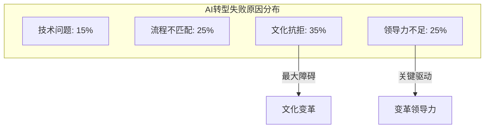
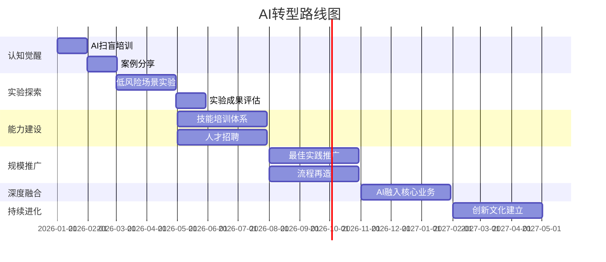
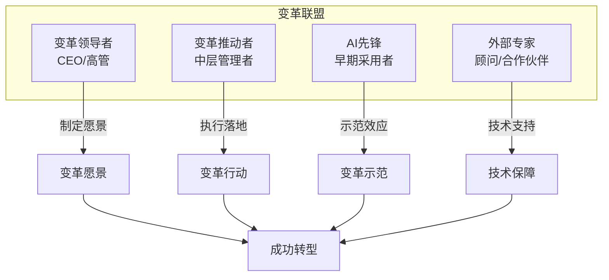

# 组织变革领导力：引领AI转型的路线图

## AI转型不是技术项目，而是领导力挑战

> [!key] 核心洞察
> 大多数AI转型失败的原因不是技术不够好，而是**变革管理没做好**。员工抗拒、流程不适应、文化不匹配——这些才是真正的障碍。引领AI转型需要的是**变革领导力**，而非技术管理能力。

---

## AI转型的六个阶段

### 阶段1：认知觉醒（1-2个月）

**目标**：让组织意识到AI的潜力和挑战

**关键行动**：
- AI扫盲培训（全员覆盖）
- AI应用案例分享
- 建立"AI先锋"小组

**领导力重点**：愿景沟通

> [!tip] 认知觉醒的技巧
> 不要用"AI会取代你"来制造焦虑，而要用"AI可以让你做更有价值的工作"来激发期待。

### 阶段2：实验探索（2-4个月）

**目标**：通过小规模实验验证AI的价值

**关键行动**：
- 选择3-5个低风险场景进行AI实验
- 建立"AI实验基金"
- 记录实验成果和教训

**领导力重点**：容错文化

### 阶段3：能力建设（3-6个月）

**目标**：建立组织的AI能力基础

**关键行动**：
- AI技能培训体系（参考[[03-HR人事/AI时代领导力与管理/06_管理者AI素养：从会用到善用]]）
- 招聘AI人才（参考[[03-HR人事/AI时代领导力与管理/07_人才战略：AI时代如何招聘、培养和留住人才]]）
- 建立AI工具栈

### 阶段4：规模推广（6-9个月）

**目标**：将成功的AI实践推广到整个组织

**关键行动**：
- 将最佳实践标准化
- 建立AI治理框架
- 优化流程

**领导力重点**：变革管理

### 阶段5：深度融合（9-12个月）

**目标**：AI成为组织运营的基础设施

**关键行动**：
- AI融入核心业务流程
- 建立AI持续监控体系
- AI绩效评估

**领导力重点**：系统思维

### 阶段6：持续进化（12个月+）

**目标**：建立持续学习和创新的文化

**关键行动**：
- AI创新实验室
- 外部生态连接
- 持续迭代

**领导力重点**：愿景引领

---

## AI转型的变革管理框架

### 利益相关者分析

| 角色 | 常见顾虑 | 赋能策略 |
|------|---------|---------|
| 高管 | 投资回报不明确 | 展示速赢案例 |
| 中层管理者 | 被绕过或取代 | 赋能他们成为AI变革推动者 |
| 一线员工 | 担心失业 | 展示AI如何减轻工作负担 |
| 技术团队 | 实施难度大 | 提供资源和支持 |

### 变革阻力应对

> [!warning] 常见变革阻力及应对
> - **"AI不靠谱"**：展示成功的行业案例，从小场景开始积累信任
> - **"我们不需要AI"**：用数据揭示现有流程的效率损失
> - **"太忙了没时间学"**：将AI学习嵌入日常工作，而非额外培训
> - **"AI会取代我们"**：坦诚沟通，明确AI增强而非替代

### 建立变革联盟

---

## 变革领导力核心能力

### 1. 战略耐心

AI转型不是短跑，而是马拉松。需要平衡短期成果和长期愿景。

### 2. 共情能力

理解不同角色的顾虑和期待，这是[[03-HR人事/AI时代领导力与管理/01_领导力范式转移：从管理到赋能]]中提到的核心能力。

### 3. 系统思维

理解AI转型对组织各个部分的连锁影响。

### 4. 沟通能力

用简单清晰的语言解释复杂的AI转型。

### 5. 决策勇气

在不确定中做出决策，容忍失败。

---

## 衡量AI转型成功

| 维度 | 衡量指标 | 目标值 |
|------|---------|-------|
| 采纳率 | 主动使用AI的员工比例 | >80% |
| 效率提升 | 关键流程效率提升幅度 | >30% |
| 员工满意度 | AI工具使用满意度 | >4.0/5.0 |
| 创新产出 | AI驱动的新项目数量 | 季度增长>20% |
| ROI | AI投资回报率 | >3x |

---

## 跨知识库联动

- [[03-HR人事/AI时代领导力与管理/07_人才战略：AI时代如何招聘、培养和留住人才]] 提供了变革中的人才策略
- [[03-HR人事/AI时代领导力与管理/01_领导力范式转移：从管理到赋能]] 探讨了变革中的领导力本质
- [[05-产品与开发/独立开发者生存指南/08_财务与合规：从银行开户到税务申报]] 中的合规框架也适用于AI转型中的风险管理

---

*最后更新: 2026-07-31*