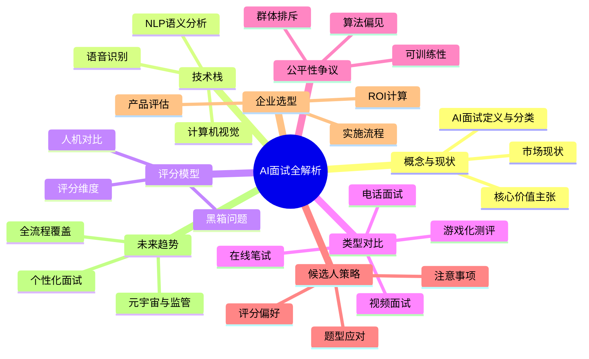
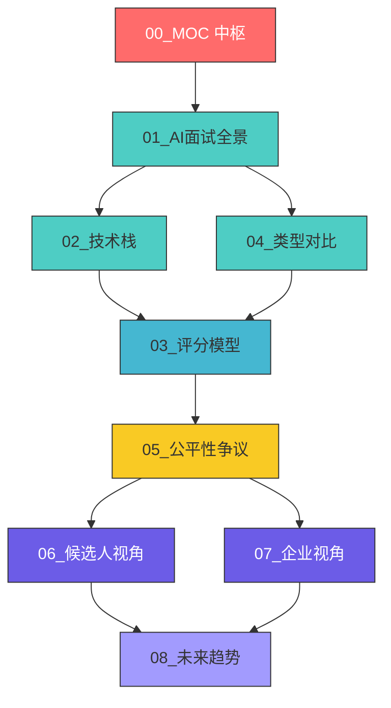
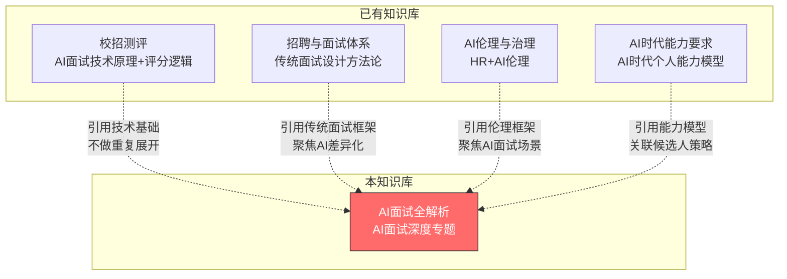
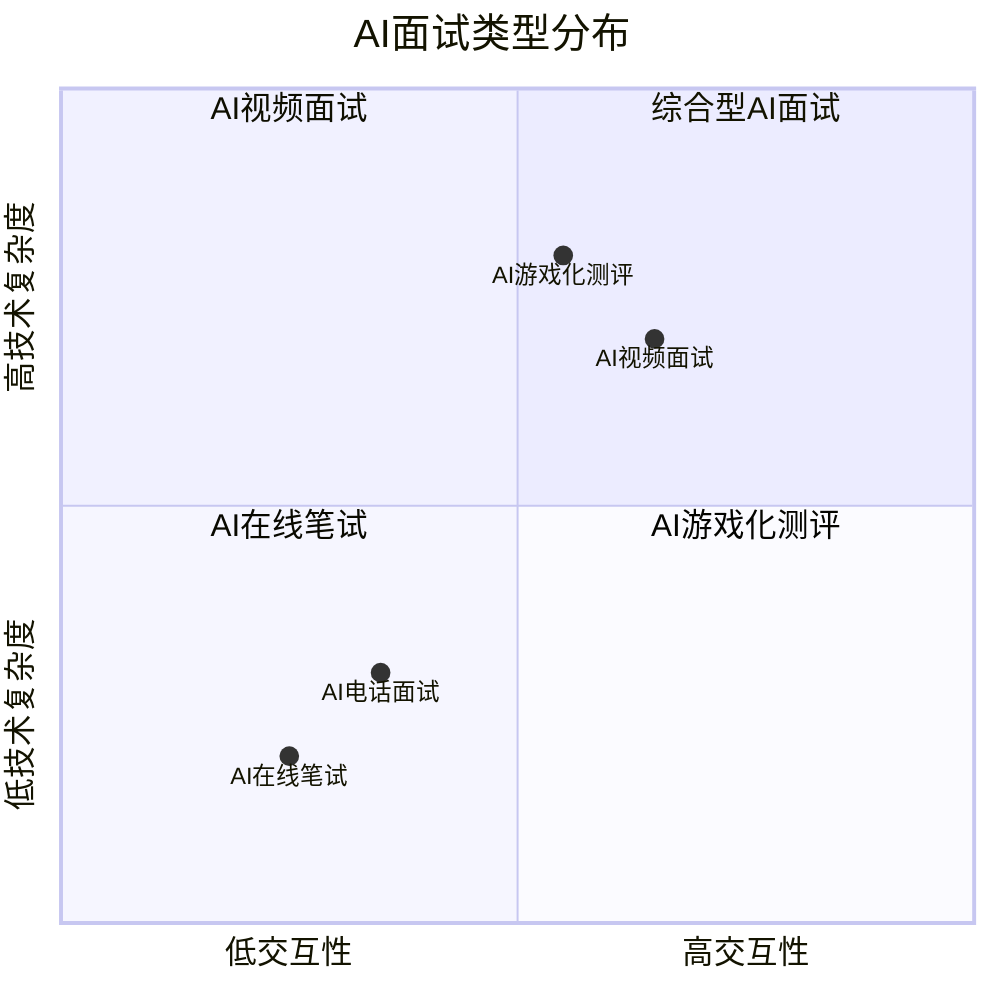
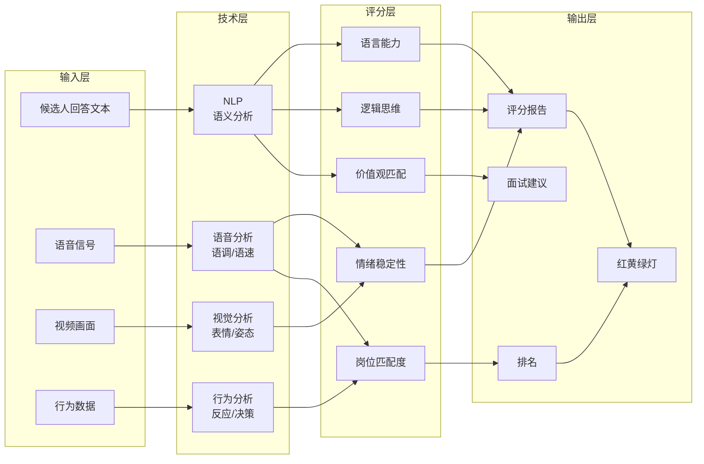
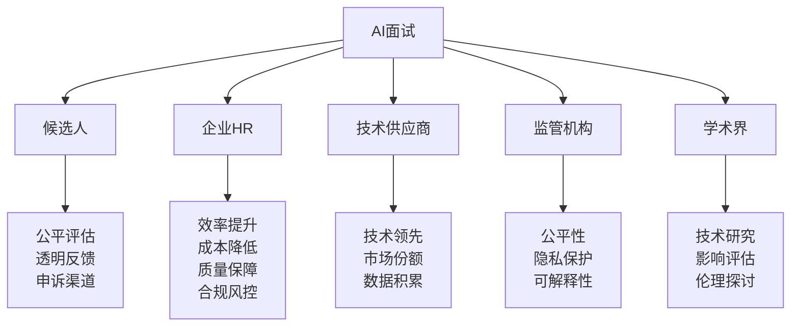
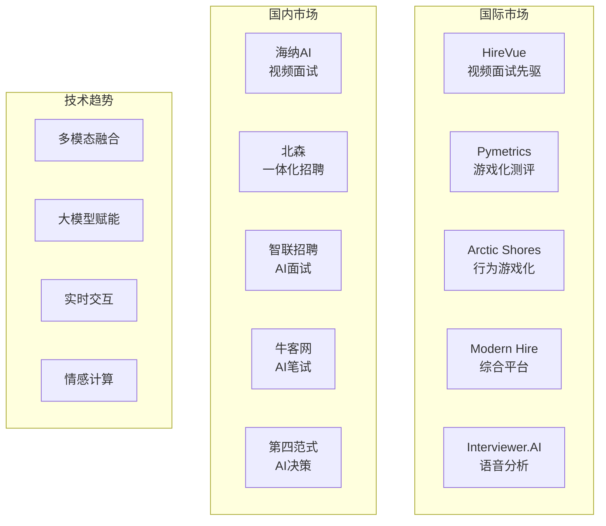

# AI面试全解析中枢

> [!abstract] 知识库定位
> 本知识库是 **AI面试的深度专题**，定位为"HR+AI"差异化内容。它不只是技术原理的科普，而是从技术原理、评分机制、类型对比、公平性争议、候选人策略、企业选型、未来趋势等多个维度，对AI面试进行系统性展开。本知识库与已有的 [[03-HR人事/校招测评/校招测评知识库_建设方案_v2]]（AI面试技术原理与评分逻辑）、[[03-HR人事/招聘与面试体系/00_MOC_招聘与面试体系中枢]]（传统面试设计方法论）、[[02-AI趋势与素养/AI伦理与治理/00_MOC_AI伦理与治理中枢]]（HR+AI伦理）形成互补关系——**本库不重复基础，而是做深度专题**。

---

## 一、知识库导航

---

## 二、文档清单与阅读路径

### 2.1 推荐阅读路径

### 2.2 文档清单

| 编号 | 文档 | 核心内容 | 角色定位 |
|------|------|----------|----------|
| 00 | [[03-HR人事/AI面试全解析/00_MOC_AI面试全解析中枢]] | 知识库总览与导航 | 中枢 |
| 01 | [[03-HR人事/AI面试全解析/01_AI面试全景：从概念到现状]] | 定义、分类、市场、价值 | 入门 |
| 02 | [[03-HR人事/AI面试全解析/02_AI面试的技术栈：NLP、语音、视觉的融合]] | NLP、语音、视觉技术应用 | 技术基础 |
| 03 | [[03-HR人事/AI面试全解析/03_AI面试的评分模型：AI如何评价候选人]] | 评分维度、人机对比、黑箱 | 核心机制 |
| 04 | [[03-HR人事/AI面试全解析/04_AI面试的类型对比：视频、电话、游戏化]] | 四类AI面试对比分析 | 实践指南 |
| 05 | [[03-HR人事/AI面试全解析/05_AI面试的公平性争议]] | 偏见、可训练性、排斥 | 批判视角 |
| 06 | [[03-HR人事/AI面试全解析/06_候选人视角：如何应对AI面试]] | 应对策略与实操指南 | 候选人 |
| 07 | [[03-HR人事/AI面试全解析/07_企业视角：AI面试的选型与实施]] | 选型、实施、ROI | 企业HR |
| 08 | [[03-HR人事/AI面试全解析/08_AI面试的未来：从筛选到全流程]] | 趋势、个性化、监管 | 前瞻 |

---

## 三、与已有知识库的关联

> [!important] 差异化定位
> 本知识库与以下已有知识库形成**互补而非重复**的关系。在阅读本库之前，建议先了解已有知识库的基本内容，以便理解本库的差异化定位。

### 3.1 与 [[03-HR人事/校招测评/校招测评知识库_建设方案_v2]] 的关系

- **已有内容**：AI面试的技术原理（NLP/语音/视觉算法细节）、评分逻辑（算法架构）、题库（情景题、行为题、高频题）
- **本库不重复**：技术算法的底层细节、评分算法的数学原理
- **本库引用**：在讨论技术栈和评分模型时，会引用校招测评中的技术基础，但聚焦于**技术应用层面**和**评分维度分析**
- **关键链接**：[[03-HR人事/校招测评/AI面试/AI面试_技术篇]]、[[03-HR人事/校招测评/AI面试/AI面试_评分逻辑]]

### 3.2 与 [[03-HR人事/招聘与面试体系/00_MOC_招聘与面试体系中枢]] 的关系

- **已有内容**：传统面试设计方法论（结构化面试、行为面试、STAR法则）、面试官培训、评估决策
- **本库不重复**：传统面试设计的理论框架
- **本库引用**：在讨论AI面试与人工面试融合时，会引用传统面试方法论作为对比参照
- **关键链接**：[[03-HR人事/招聘与面试体系/04_面试设计方法论]]、[[03-HR人事/招聘与面试体系/08_AI如何改变招聘]]

### 3.3 与 [[02-AI趋势与素养/AI伦理与治理/00_MOC_AI伦理与治理中枢]] 的关系

- **已有内容**：算法偏见根源、AI决策透明性、数据隐私、责任归属、全球监管政策、HR+AI伦理特别议题
- **本库不重复**：伦理理论的深度讨论、全球监管政策的全面梳理
- **本库引用**：在讨论AI面试公平性时，会引用伦理框架，但聚焦于**AI面试场景下的具体争议和案例**
- **关键链接**：[[02-AI趋势与素养/AI伦理与治理/02_算法偏见：AI如何继承并放大人类的偏见]]、[[02-AI趋势与素养/AI伦理与治理/08_HR+AI的伦理特别议题]]

### 3.4 与 [[02-AI趋势与素养/AI时代能力要求/00_MOC_AI时代能力要求中枢]] 的关系

- **已有内容**：AI时代的能力模型重构、硬技能与软技能变化、AI素养
- **本库不重复**：通用能力模型的讨论
- **本库引用**：在讨论候选人策略和企业视角时，关联AI时代的能力要求
- **关键链接**：[[02-AI趋势与素养/AI时代能力要求/05_AI素养：新时代的基础能力]]、[[02-AI趋势与素养/AI时代能力要求/08_个人发展建议：如何构建AI时代的竞争力]]

---

## 四、核心概念速览

### 4.1 AI面试的定义

> [!note] AI面试（AI-Powered Interview）
> AI面试是指利用人工智能技术（包括自然语言处理、语音识别、计算机视觉、机器学习等）对候选人进行自动化或半自动化评估的面试方式。它不同于传统的"视频面试"（只是把面对面改成视频通话），AI面试的核心在于 **AI参与评估和决策**。

### 4.2 AI面试的四种形态

### 4.3 AI面试的核心矛盾

| 矛盾 | 正方观点 | 反方观点 |
|------|----------|----------|
| 效率 vs 公平 | AI大幅提升筛选效率，降低招聘成本 | AI可能引入算法偏见，加剧不公 |
| 标准化 vs 个性化 | AI提供统一评估标准，减少主观偏差 | AI无法捕捉候选人的独特性和潜力 |
| 客观 vs 黑箱 | AI评分基于数据，客观公正 | AI评分逻辑不透明，候选人无法申诉 |
| 技术 vs 人性 | AI解放HR，聚焦高价值工作 | 面试应该有人性温度，AI冷冰冰 |

---

## 五、核心框架

### 5.1 AI面试分析框架

### 5.2 AI面试利益相关者地图

---

## 六、AI面试核心问题清单

### 6.1 候选人最关心的10个问题

1. AI面试怎么评分？评分标准是什么？ -- 详见 [[03-HR人事/AI面试全解析/03_AI面试的评分模型：AI如何评价候选人]]
2. AI面试公平吗？会不会有偏见？ -- 详见 [[03-HR人事/AI面试全解析/05_AI面试的公平性争议]]
3. AI面试喜欢什么样的回答？ -- 详见 [[03-HR人事/AI面试全解析/06_候选人视角：如何应对AI面试]]
4. AI面试能"作弊"吗？可以训练自己应对AI吗？ -- 详见 [[03-HR人事/AI面试全解析/05_AI面试的公平性争议]]
5. AI面试的通过率是多少？ -- 详见 [[03-HR人事/AI面试全解析/01_AI面试全景：从概念到现状]]
6. 不同类型的AI面试有什么区别？ -- 详见 [[03-HR人事/AI面试全解析/04_AI面试的类型对比：视频、电话、游戏化]]
7. AI面试结果可以申诉吗？ -- 详见 [[03-HR人事/AI面试全解析/05_AI面试的公平性争议]]
8. AI面试会取代人工面试吗？ -- 详见 [[03-HR人事/AI面试全解析/08_AI面试的未来：从筛选到全流程]]
9. AI面试的技术原理是什么？ -- 详见 [[03-HR人事/AI面试全解析/02_AI面试的技术栈：NLP、语音、视觉的融合]]
10. AI面试有哪些常见的坑？ -- 详见 [[03-HR人事/AI面试全解析/06_候选人视角：如何应对AI面试]]

### 6.2 企业HR最关心的10个问题

1. AI面试产品怎么选？ -- 详见 [[03-HR人事/AI面试全解析/07_企业视角：AI面试的选型与实施]]
2. AI面试的ROI怎么算？ -- 详见 [[03-HR人事/AI面试全解析/07_企业视角：AI面试的选型与实施]]
3. AI面试和人工面试怎么融合？ -- 详见 [[03-HR人事/AI面试全解析/07_企业视角：AI面试的选型与实施]]
4. AI面试的合规风险有哪些？ -- 详见 [[03-HR人事/AI面试全解析/05_AI面试的公平性争议]]
5. AI面试适合什么岗位？ -- 详见 [[03-HR人事/AI面试全解析/01_AI面试全景：从概念到现状]]
6. AI面试的准确率有多高？ -- 详见 [[03-HR人事/AI面试全解析/03_AI面试的评分模型：AI如何评价候选人]]
7. AI面试供应商怎么对比？ -- 详见 [[03-HR人事/AI面试全解析/04_AI面试的类型对比：视频、电话、游戏化]]
8. AI面试的实施流程是什么？ -- 详见 [[03-HR人事/AI面试全解析/07_企业视角：AI面试的选型与实施]]
9. AI面试的数据安全怎么保障？ -- 详见 [[03-HR人事/AI面试全解析/05_AI面试的公平性争议]]
10. AI面试的未来趋势是什么？ -- 详见 [[03-HR人事/AI面试全解析/08_AI面试的未来：从筛选到全流程]]

---

## 七、AI面试市场格局

> [!info] 市场参与者
> AI面试市场正在快速增长，主要参与者包括国际巨头和国内创新企业。

---

## 八、阅读建议

### 8.1 按角色推荐

| 角色 | 推荐阅读顺序 | 重点文档 |
|------|------------|----------|
| **候选人** | 01 -> 06 -> 04 -> 05 | [[03-HR人事/AI面试全解析/06_候选人视角：如何应对AI面试]] |
| **HR/招聘负责人** | 01 -> 07 -> 03 -> 04 | [[03-HR人事/AI面试全解析/07_企业视角：AI面试的选型与实施]] |
| **技术/产品负责人** | 01 -> 02 -> 03 -> 08 | [[03-HR人事/AI面试全解析/02_AI面试的技术栈：NLP、语音、视觉的融合]] |
| **管理者/决策者** | 01 -> 07 -> 05 -> 08 | [[03-HR人事/AI面试全解析/07_企业视角：AI面试的选型与实施]] |
| **研究者/学生** | 01 -> 02 -> 03 -> 05 -> 08 | 全系列 |

### 8.2 按场景推荐

| 场景 | 推荐阅读 |
|------|----------|
| 明天要参加AI面试 | [[03-HR人事/AI面试全解析/06_候选人视角：如何应对AI面试]] |
| 公司在选AI面试产品 | [[03-HR人事/AI面试全解析/07_企业视角：AI面试的选型与实施]] + [[03-HR人事/AI面试全解析/04_AI面试的类型对比：视频、电话、游戏化]] |
| 想了解AI面试的原理 | [[03-HR人事/AI面试全解析/02_AI面试的技术栈：NLP、语音、视觉的融合]] + [[03-HR人事/AI面试全解析/03_AI面试的评分模型：AI如何评价候选人]] |
| 关注AI面试公平性 | [[03-HR人事/AI面试全解析/05_AI面试的公平性争议]] |
| 想了解AI面试趋势 | [[03-HR人事/AI面试全解析/08_AI面试的未来：从筛选到全流程]] |

---

## 九、关键概念索引

| 概念 | 英文 | 出现在 |
|------|------|--------|
| 自然语言处理 | NLP | [[03-HR人事/AI面试全解析/02_AI面试的技术栈：NLP、语音、视觉的融合]] |
| 语音识别 | ASR | [[03-HR人事/AI面试全解析/02_AI面试的技术栈：NLP、语音、视觉的融合]] |
| 计算机视觉 | CV | [[03-HR人事/AI面试全解析/02_AI面试的技术栈：NLP、语音、视觉的融合]] |
| 多模态AI | Multimodal AI | [[03-HR人事/AI面试全解析/02_AI面试的技术栈：NLP、语音、视觉的融合]] |
| 算法偏见 | Algorithmic Bias | [[03-HR人事/AI面试全解析/05_AI面试的公平性争议]] |
| 可解释性 | Explainability | [[03-HR人事/AI面试全解析/03_AI面试的评分模型：AI如何评价候选人]] |
| 游戏化测评 | Gamified Assessment | [[03-HR人事/AI面试全解析/04_AI面试的类型对比：视频、电话、游戏化]] |
| 情感计算 | Affective Computing | [[03-HR人事/AI面试全解析/02_AI面试的技术栈：NLP、语音、视觉的融合]] |
| 数字孪生 | Digital Twin | [[03-HR人事/AI面试全解析/08_AI面试的未来：从筛选到全流程]] |
| AI监管 | AI Regulation | [[03-HR人事/AI面试全解析/05_AI面试的公平性争议]] |

---

## 十、延伸阅读

- [[03-HR人事/校招测评/校招测评知识库_建设方案_v2]] -- AI面试技术基础与评分逻辑
- [[03-HR人事/招聘与面试体系/00_MOC_招聘与面试体系中枢]] -- 传统面试设计方法论
- [[02-AI趋势与素养/AI伦理与治理/00_MOC_AI伦理与治理中枢]] -- HR+AI伦理框架
- [[02-AI趋势与素养/AI时代能力要求/00_MOC_AI时代能力要求中枢]] -- AI时代个人能力模型
- [[02-AI趋势与素养/AI应用发展阶段演进/00_MOC_AI应用发展阶段演进中枢]] -- AI应用成熟度框架
- [[02-AI趋势与素养/人机协作阶段演进/00_MOC_人机协作阶段演进中枢]] -- 人机协作模式演变
- [[02-AI趋势与素养/非技术人员与技术边界/00_MOC_非技术人员与技术边界中枢]] -- AI能做什么、不能做什么

---

> [!tip] 知识库建设说明
> 本知识库采用 Obsidian 格式编写，充分利用 frontmatter、mermaid 图表、callout 语法和双向链接。所有文档之间通过 `[[ ]]` 互相链接，形成完整的知识网络。建议使用 Obsidian 的图谱视图（Graph View）来探索知识库的关联结构。
>
> 最后更新：2026-07-27
> 维护者：AI面试研究组