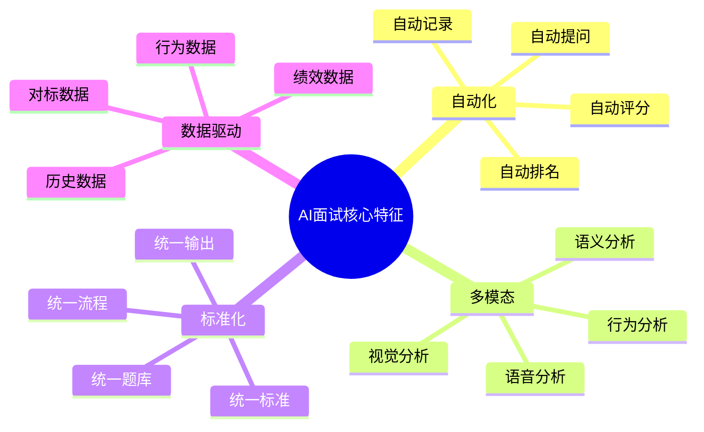
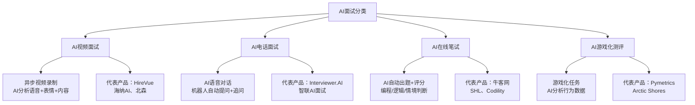
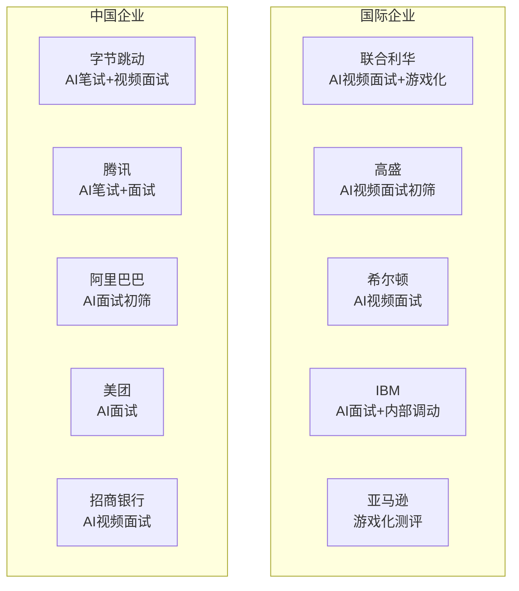
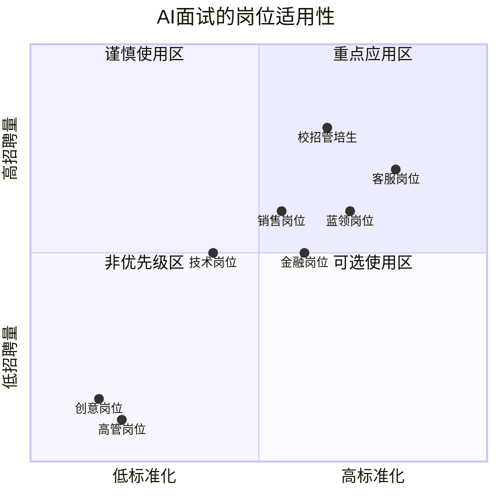
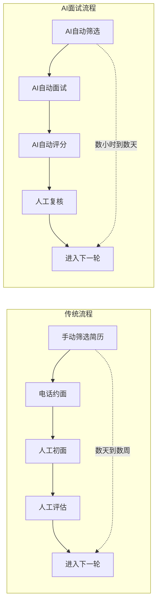
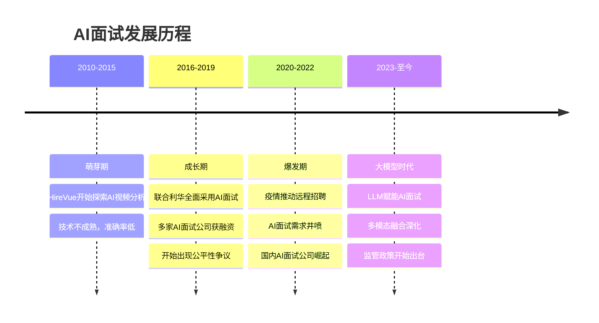

# 01 AI面试全景：从概念到现状

> [!abstract] 本章概要
> 本章从AI面试的**定义与分类**出发，梳理AI面试的**市场现状**（哪些公司在用、用在什么岗位和环节），并分析AI面试的**核心价值主张**（效率、标准化、成本）。这是整个知识库的"入门地图"，帮助读者建立对AI面试领域的基本认知。

---

## 一、AI面试的定义

### 1.1 什么是AI面试

> [!note] 核心定义
> **AI面试**（AI-Powered Interview）是指利用人工智能技术对候选人进行自动化或半自动化评估的面试方式。其核心特征在于：**AI参与评估和决策**，而非仅仅充当沟通媒介。

AI面试与传统"视频面试"有本质区别：

| 维度 | 传统视频面试 | AI面试 |
|------|-------------|--------|
| 技术本质 | 视频通话工具 | 多模态AI评估系统 |
| 评估主体 | 人类面试官 | AI算法 + 人类（可选） |
| 交互方式 | 实时对话 | 实时/异步均可 |
| 评估维度 | 面试官主观判断 | 多维度量化分析 |
| 数据输出 | 主观印象+笔记 | 结构化评分报告 |
| 可复制性 | 低（依赖面试官） | 高（标准化算法） |

> [!warning] 常见误解
> 很多人以为"用视频通话面试"就是AI面试，这其实是一个常见误解。AI面试的核心是**AI在做评估**，而不是**AI在做媒介**。打个比方：用微信视频面试是"视频面试"；用HireVue面试才是"AI面试"——因为你面对的是AI驱动的评估系统，而非单纯的人类面试官。

### 1.2 AI面试的核心特征

---

## 二、AI面试的分类

### 2.1 四大类型

AI面试并非单一形态，而是涵盖了多种技术路线和应用场景。根据技术实现和应用场景，可以将AI面试分为以下四大类型：

### 2.2 各类AI面试简介

**AI视频面试**：候选人通过视频录制回答预设问题，AI分析视频中的语音、语义、面部表情等信号，生成综合评分。这是目前最主流、应用最广的AI面试形式。

**AI电话面试**：AI通过语音对话与候选人交互，自动提问、追问、记录并评分。适合初筛阶段，成本低、效率高。

**AI在线笔试**：AI自动生成或适配题目（编程、逻辑推理、情境判断等），自动评分和排名。技术相对成熟，争议较小。

**AI游戏化测评**：通过游戏化任务收集候选人的行为数据（决策速度、风险偏好、认知模式等），AI分析行为模式并预测岗位匹配度。这是目前增长最快的AI面试形式。

> [!tip] 详细对比
> 四种AI面试类型的特点、优缺点和适用场景，将在 [[03-HR人事/AI面试全解析/04_AI面试的类型对比：视频、电话、游戏化]] 中展开详细讨论。

---

## 三、AI面试的市场现状

### 3.1 全球市场规模

AI面试市场正在经历快速增长。根据行业研究数据：

| 指标 | 数据 |
|------|------|
| 全球AI招聘市场规模（2024） | 约 6.5 亿美元 |
| 预计2029年规模 | 约 11.3 亿美元 |
| 年复合增长率（CAGR） | 约 11.7% |
| AI面试渗透率（500强企业） | 超过 60% |
| AI面试渗透率（中国500强企业）| 约 35-40% |

> [!info] 数据说明
> 以上数据为综合多个行业报告（Grand View Research、MarketsandMarkets等）的估算值，具体数字可能因统计口径不同而有差异。但整体趋势明确：AI面试市场正在高速增长。

### 3.2 哪些公司在使用AI面试

**使用AI面试的典型企业画像**：
- 年招聘量超过1000人的大型企业
- 校招规模大、岗位标准化程度高的企业
- 对招聘效率和一致性要求高的企业
- 处于数字化转型进程中的企业

### 3.3 用在什么岗位和环节

**AI面试在不同招聘环节的应用**：

| 招聘环节 | AI面试应用 | 典型场景 |
|----------|-----------|----------|
| 简历筛选后 | AI电话/视频初筛 | 海量候选人快速筛选 |
| 笔试环节 | AI在线笔试 | 技术/逻辑能力测评 |
| 初面环节 | AI视频面试 | 结构化面试替代人工初面 |
| 测评环节 | AI游戏化测评 | 认知能力/行为模式分析 |
| 终面辅助 | AI辅助评估 | 为人面试官提供数据参考 |
| 入职后 | AI行为预测 | 预测新员工绩效/离职风险 |

### 3.4 市场驱动因素

> [!important] 为什么AI面试在快速增长？

**供给端驱动**：
1. NLP和语音识别技术的成熟（准确率大幅提升）
2. 计算机视觉技术的进步（面部表情分析更精准）
3. 大模型（LLM）的出现带来质的飞跃（语义理解更深刻）
4. 云计算和SaaS模式的普及（降低使用门槛）

**需求端驱动**：
1. 招聘规模扩大，HR人力成本上升
2. 校招季海量候选人筛选压力
3. 对招聘标准化和公平性的诉求
4. 疫情后远程招聘习惯的固化
5. 企业对数据驱动决策的追求

---

## 四、AI面试的核心价值主张

### 4.1 效率提升

**效率提升的具体数据**：

| 指标 | 传统面试 | AI面试 | 提升幅度 |
|------|---------|--------|---------|
| 单个候选人初筛时间 | 30-60分钟 | 15-30分钟（异步） | 50%+ |
| 千人校招初筛周期 | 2-4周 | 3-5天 | 70%+ |
| HR时间投入 | 100% | 20-30% | 70-80% |
| 候选人等待时间 | 3-7天 | 24小时内 | 显著缩短 |

### 4.2 标准化

> [!note] 标准化的价值
> 人类面试官存在天然的"面试官偏差"：同一位候选人在不同面试官面前可能得到截然不同的评价。AI面试通过统一标准，最大限度减少这种偏差。

**AI面试如何实现标准化**：

1. **统一题库**：所有候选人面对相同或同质的问题
2. **统一标准**：评分维度和权重预先设定，不受个人情绪影响
3. **统一流程**：面试时长、问题顺序、追问逻辑一致
4. **统一输出**：评分报告格式标准化，便于横向对比

**标准化场景举例**：

| 场景 | 传统面试的问题 | AI面试的改善 |
|------|--------------|-------------|
| 不同面试官打分差异大 | 面试官A打8分，B打5分 | AI统一评分，差异可控 |
| 面试官疲劳效应 | 下午面试的候选人吃亏 | AI不受疲劳影响 |
| 先入为主偏见 | 前一个候选人影响后续判断 | 每个候选人独立评分 |
| "聊得来"偏差 | 喜欢=高分，但未必胜任 | AI不受个人好感影响 |

### 4.3 成本降低

**AI面试的ROI框架**：

| 成本项目 | 传统面试 | AI面试 | 节约比例 |
|----------|---------|--------|---------|
| 面试官时间成本 | 100% | 30-50% | 50-70% |
| 差旅/场地成本 | 有 | 0（远程） | 100% |
| 协调调度成本 | 高 | 低（异步） | 60-80% |
| 培训面试官成本 | 持续投入 | 一次配置 | 80%+ |
| 错误招聘成本 | 基准 | 降低20-30% | 20-30% |

> [!warning] 成本考量提醒
> AI面试不是"免费"的。企业需要支付SaaS订阅费或按使用量付费。对于招聘量较小的企业，AI面试的成本可能高于传统面试。详细的ROI计算请参考 [[03-HR人事/AI面试全解析/07_企业视角：AI面试的选型与实施]]。

### 4.4 候选人体验

AI面试对候选人体验的影响是双面的：

**正面影响**：
- 灵活安排面试时间（异步面试）
- 减少等待焦虑（快速反馈）
- 避免面试官主观偏见
- 统一的体验标准

**负面影响**：
- 缺乏人际互动，感觉"冷冰冰"
- 面对机器说话不自然
- 担心AI评分不公平
- 技术故障影响面试体验

---

## 五、AI面试的局限性

> [!warning] AI面试不是万能的

### 5.1 当前AI面试的主要局限

1. **只能评估"可量化"的维度**：AI擅长评估语言流畅度、关键词匹配、微表情等可量化信号，但难以评估创造力、领导力、文化契合度等软性维度。

2. **对"非典型"候选人不利**：AI基于历史数据训练，对不符合"标准模式"但实际优秀的候选人可能评分偏低。

3. **技术门槛和成本**：高质量AI面试系统部署成本不低，中小企业可能难以承受。

4. **候选人接受度**：部分候选人（尤其是资深人才）对AI面试持抵触态度。

5. **监管不确定性**：各国对AI面试的监管政策仍在演进中，存在合规风险。

### 5.2 AI面试 vs 人工面试：适用场景对比

| 场景 | 推荐AI面试 | 推荐人工面试 | 推荐混合 |
|------|-----------|-------------|---------|
| 校招大规模初筛 | 强烈推荐 | - | - |
| 社招初筛 | 推荐 | - | - |
| 技术岗位深度评估 | 辅助 | 推荐 | - |
| 高管面试 | - | 必须 | - |
| 文化匹配度评估 | - | 推荐 | 辅助 |
| 创意岗位评估 | - | 推荐 | - |
| 蓝领大规模招聘 | 推荐 | - | - |

---

## 六、AI面试的发展阶段

---

## 七、与已有知识库的关联

- [[03-HR人事/校招测评/AI面试/AI面试_技术篇]] -- AI面试的技术原理基础（本库不重复展开）
- [[03-HR人事/校招测评/AI面试/AI面试_评分逻辑]] -- AI面试评分算法细节（本库聚焦评分维度）
- [[03-HR人事/招聘与面试体系/08_AI如何改变招聘]] -- AI对招聘的宏观影响
- [[03-HR人事/招聘与面试体系/04_面试设计方法论]] -- 传统面试设计框架（对比参照）

---

## 八、本章小结

> [!summary] 核心要点
> 1. AI面试是AI参与评估的面试方式，本质区别于传统视频面试
> 2. AI面试分为视频、电话、笔试、游戏化四大类型
> 3. 全球AI面试市场正以超过10%的年增长率快速发展
> 4. AI面试的核心价值在于效率、标准化和成本降低
> 5. AI面试当前仍有显著局限，不适合所有场景
> 6. 大模型时代的到来正在重塑AI面试的能力边界

**下一步阅读**：
- 想了解AI面试的技术原理 → [[03-HR人事/AI面试全解析/02_AI面试的技术栈：NLP、语音、视觉的融合]]
- 想了解不同类型的AI面试 → [[03-HR人事/AI面试全解析/04_AI面试的类型对比：视频、电话、游戏化]]
- 返回中枢 → [[03-HR人事/AI面试全解析/00_MOC_AI面试全解析中枢]]