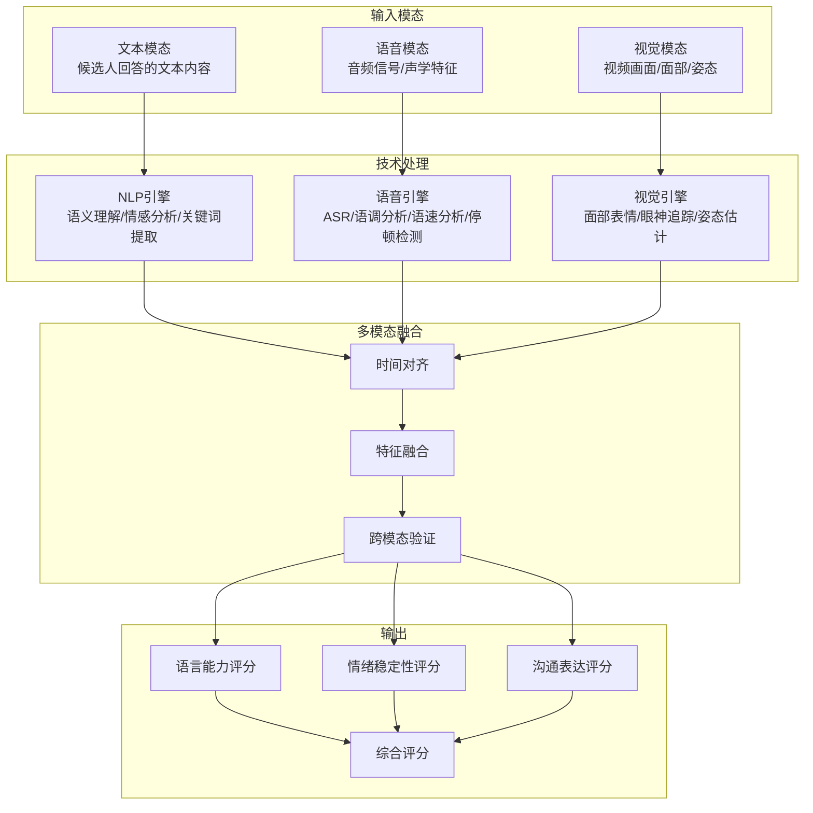
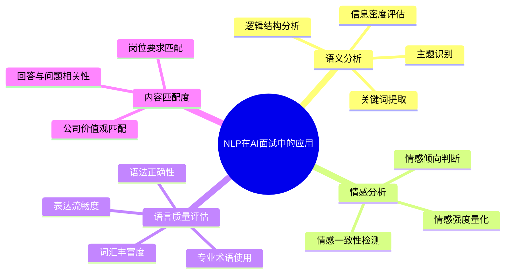
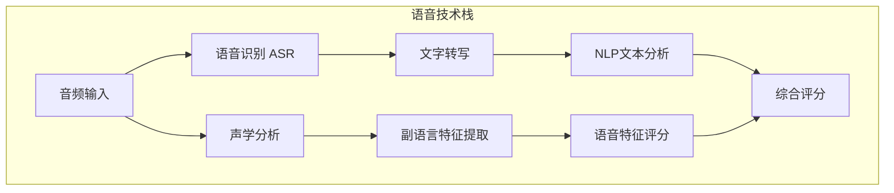
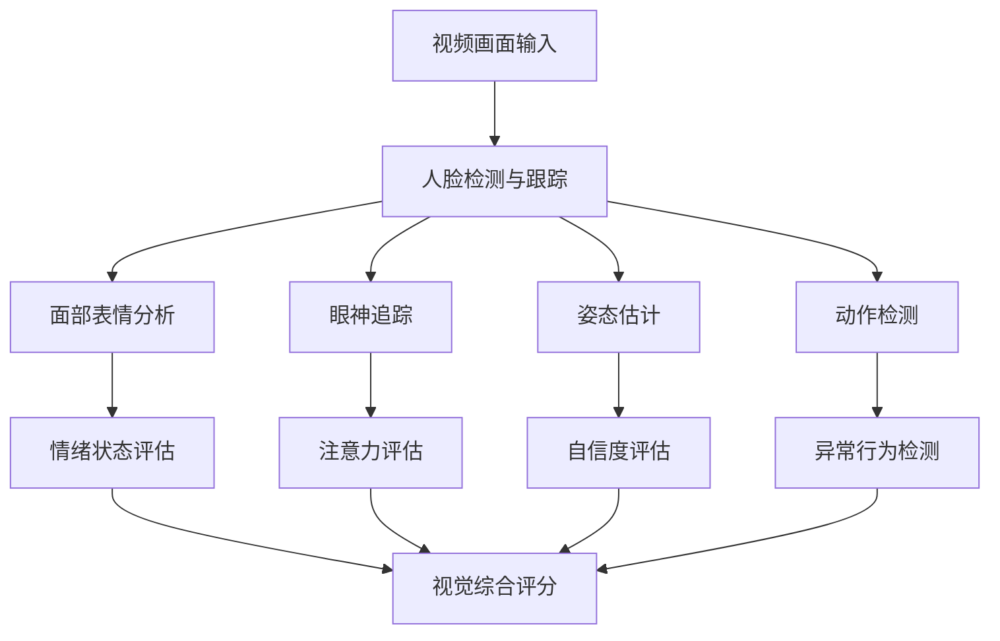
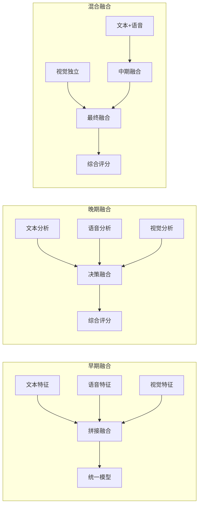
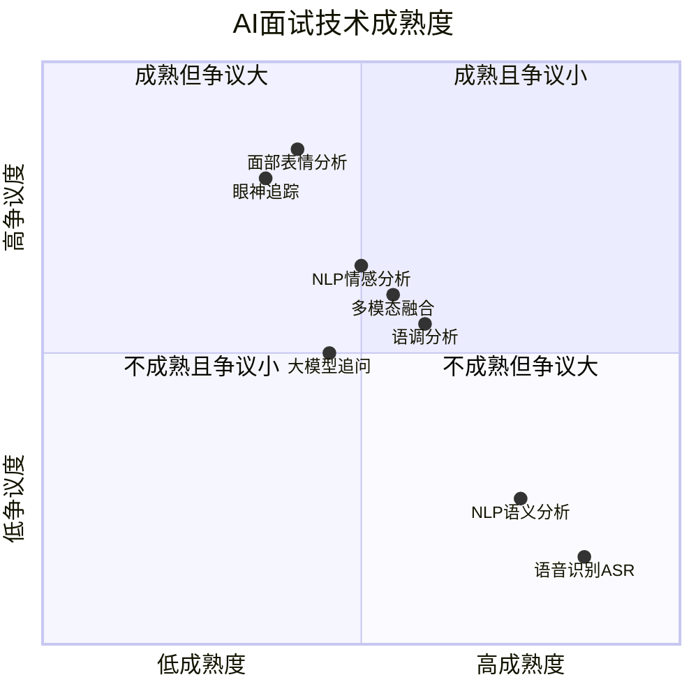

# 02 AI面试的技术栈：NLP、语音、视觉的融合

> [!abstract] 本章概要
> 本章从**技术应用层面**梳理AI面试的底层技术栈，包括自然语言处理（语义分析/情感分析）、语音识别与分析（语音转文字/语调/语速/停顿）和计算机视觉（面部表情/眼神/姿势）。**注意**：本章聚焦技术应用层面，不重复 [[03-HR人事/校招测评/AI面试/AI面试_技术篇]] 中的算法底层细节。如果你想了解AI面试算法的数学原理，请参考校招测评中的技术文档。

---

## 一、AI面试的技术架构全景

### 1.1 多模态技术架构

现代AI面试系统是一个**多模态AI系统**，它同时处理文本、语音、视觉三种信号，并在融合后进行综合评估。

### 1.2 三模态的分工与协作

| 模态 | 分析内容 | 核心能力 | 在AI面试中的角色 |
|------|----------|----------|-----------------|
| **文本（NLP）** | 回答内容、用词、逻辑结构 | 语义理解 | 评估"说了什么"——内容质量 |
| **语音（Audio）** | 语调、语速、停顿、音量 | 声学分析 | 评估"怎么说"——表达方式 |
| **视觉（Vision）** | 表情、眼神、姿势、动作 | 视觉理解 | 评估"表现如何"——非语言信号 |

> [!note] 多模态的核心价值
> 单一模态的分析容易产生误判。例如，候选人说"我很自信"但语音颤抖、眼神躲闪——多模态融合可以捕捉到这种"言行不一"的信号。但这也带来了争议：**AI是否有权解读候选人的微表情和肢体语言？** 相关讨论见 [[03-HR人事/AI面试全解析/05_AI面试的公平性争议]]。

---

## 二、自然语言处理（NLP）在AI面试中的应用

### 2.1 NLP在AI面试中的角色

NLP是AI面试中**最核心的技术模块**，因为它直接分析候选人"说了什么"——这是面试评估中最关键的维度。

> [!important] 技术定位
> 关于NLP的底层算法原理（如Transformer架构、BERT、GPT等），请参考 [[03-HR人事/校招测评/AI面试/AI面试_技术篇]]。本节聚焦于NLP在AI面试中的**应用方式**和**分析维度**。

### 2.2 NLP在AI面试中的四大应用

### 2.3 语义分析：AI如何理解候选人的回答

**语义分析的核心任务**：判断候选人的回答是否"有内容"、是否"有逻辑"、是否"切题"。

| 分析维度 | 具体指标 | AI如何评估 | 示例 |
|----------|----------|-----------|------|
| 关键词覆盖 | 回答中是否包含预期关键词 | 与预设关键词库匹配 | "团队协作"问题中是否出现"沟通""协调""分工" |
| 逻辑结构 | 回答是否有清晰的结构 | 检测逻辑连接词、段落结构 | STAR结构（情境-任务-行动-结果） |
| 信息密度 | 单位时间内有效信息量 | 去除停用词后有效词汇占比 | 避免"然后...然后...然后"的流水账 |
| 主题相关性 | 回答是否围绕问题展开 | 计算回答与问题的语义相似度 | 判断是否跑题或答非所问 |

> [!tip] 候选人的启示
> AI喜欢**结构化、信息密度高、关键词丰富**的回答。这就是为什么STAR法则在AI面试中同样有效——它天然符合AI对逻辑结构的偏好。详细策略见 [[03-HR人事/AI面试全解析/06_候选人视角：如何应对AI面试]]。

### 2.4 情感分析：AI如何感知候选人的情绪

情感分析在AI面试中用于评估候选人的**情绪状态**和**态度倾向**。

**情感分析的两个层次**：

| 层次 | 分析内容 | 输出示例 |
|------|----------|---------|
| 浅层情感 | 正面/负面/中性 | "这段回答整体偏正面，积极情绪占比72%" |
| 深层情感 | 自信/焦虑/热情/敷衍 | "回答中表现出中等的自信程度，伴随轻微焦虑信号" |

**情感分析如何辅助面试评估**：
- 情绪稳定性：整场面试中情绪波动是否剧烈
- 态度积极性：对公司和岗位是否表现出真实的兴趣
- 压力应对：面对难题时情绪是否保持稳定

> [!warning] 情感分析的争议
> 情感分析是AI面试中最具争议的技术之一。批评者认为：
> 1. 情感表达的**文化差异**巨大（不同文化对"自信"的表达方式不同）
> 2. 情感分析可能对**神经多样性**人群（如自闭症谱系）产生偏见
> 3. 面试焦虑是**正常现象**，不应被负面评价
>
> 更多讨论见 [[03-HR人事/AI面试全解析/05_AI面试的公平性争议]]。

---

## 三、语音识别与分析在AI面试中的应用

### 3.1 语音分析的两大任务

**语音分析在AI面试中承担两大任务**：

1. **语音识别（ASR）**：将候选人的语音转为文字，供NLP模块分析
2. **声学分析**：分析语音的"副语言特征"——语调、语速、停顿、音量等

### 3.2 语音分析的评估维度

| 维度 | 评估内容 | 高分特征 | 低分特征 |
|------|----------|----------|----------|
| 语速 | 每分钟字数 | 适中（120-160字/分钟） | 过快或过慢 |
| 语调变化 | 音调起伏 | 自然有变化，富有表现力 | 单调平淡 |
| 停顿 | 停顿频率和时长 | 适当停顿，逻辑分段 | 频繁停顿（卡壳）或无停顿 |
| 音量 | 声音大小 | 适中清晰 | 过小（不自信）或过大 |
| 流利度 | 口语流畅程度 | 流畅自然，少重复 | 频繁"嗯啊"、重复、自我纠正 |
| 发音清晰度 | 语音识别准确率 | 发音标准，易于识别 | 口音重、含混不清 |

### 3.3 语音分析的"隐藏信号"

> [!note] AI能听到的"弦外之音"
> 人类面试官能感知到候选人的紧张或自信，但往往难以量化。AI语音分析能精确捕捉到一些人类不易察觉的信号：

- **基频变化**：紧张时声带紧张，基频升高，变化幅度增大
- **语速变化模式**：面对熟悉话题时语速自然加快，面对陌生话题时突然变慢
- **填充词密度**：每分钟"嗯""啊""那个"等填充词的使用频率
- **呼吸模式**：深呼吸频率反映紧张程度

**但请注意**：这些信号的分析准确性和公平性存在争议，详见 [[03-HR人事/AI面试全解析/05_AI面试的公平性争议]]。

---

## 四、计算机视觉在AI面试中的应用

### 4.1 视觉分析在AI面试中的角色

计算机视觉在AI面试中分析候选人的**非语言行为**——面部表情、眼神方向、头部姿态、身体动作等。

### 4.2 视觉分析的评估维度

| 维度 | 评估内容 | 高分特征 | 低分特征 | 争议程度 |
|------|----------|----------|----------|---------|
| 面部表情 | 表情丰富度和自然度 | 自然微笑、适当表情变化 | 面无表情、紧张僵硬 | 高 |
| 眼神方向 | 是否看向摄像头 | 大部分时间直视摄像头 | 频繁低头或看别处 | 高 |
| 头部姿态 | 头部角度和稳定性 | 正面、稳定、自然点头 | 频繁晃动、低头、歪头 | 中 |
| 身体姿态 | 坐姿是否端正 | 自然端正、适度前倾 | 瘫坐、过于僵硬 | 中 |
| 手势 | 手势使用 | 自然辅助表达 | 手势过多或完全没有 | 低 |

### 4.3 视觉分析的技术争议

> [!warning] 视觉分析：AI面试中最敏感的技术
> 计算机视觉分析是AI面试中最具争议的部分。2020年，HireVue在受到广泛批评后宣布**停止使用面部表情分析**功能。这反映了行业对视觉分析伦理问题的重新审视。

**核心争议点**：

1. **文化差异**：不同文化中"自信"的身体语言完全不同（如眼神接触在东亚文化中可能被视为不礼貌）
2. **神经多样性**：自闭症谱系人群可能有不同的表情和眼神模式
3. **预测有效性**：面部表情与工作绩效之间的相关性缺乏充分的科学证据
4. **隐私侵犯**：AI分析候选人的微表情是否构成隐私侵犯？

> [!important] 行业趋势
> 越来越多的AI面试供应商正在**弱化或移除**面部表情分析功能，转而聚焦于**语义分析**和**语音分析**——这些被认为更可靠、争议更小。关于视觉分析的公平性争议，详见 [[03-HR人事/AI面试全解析/05_AI面试的公平性争议]]。

---

## 五、多模态融合：AI面试的"大脑"

### 5.1 多模态融合的必要性

单一模态的信息是片面的，多模态融合才能形成完整评估。一个典型的例子：

> [!example] 多模态融合的价值
> 候选人A回答"我对这个岗位非常有热情"：
> - **文本分析**：正面表达，关键词匹配 ✓
> - **语音分析**：语调平淡，缺乏热情 ✗
> - **视觉分析**：面无表情，眼神游离 ✗
> - **融合结论**：文本与语音/视觉不一致，候选人可能是在"背诵"而非真心表达
>
> 如果只看文本，AI会给出高分；但多模态融合揭示了"言行不一"。

### 5.2 多模态融合的技术路线

| 融合策略 | 优点 | 缺点 | 应用场景 |
|----------|------|------|---------|
| 早期融合 | 模态间交互充分 | 计算量大、数据对齐难 | 对准确率要求高的场景 |
| 晚期融合 | 各模态独立、灵活 | 模态间交互不足 | 模态可靠度差异大时 |
| 混合融合 | 兼顾准确率和灵活性 | 架构复杂 | 主流AI面试系统 |

### 5.3 大模型时代的多模态融合

> [!note] 大模型（LLM）带来的变革
> 以GPT-4为代表的大语言模型的出现，正在重塑AI面试的技术栈。大模型对AI面试的影响体现在：

1. **语义理解质变**：从"关键词匹配"到"真正理解语义"
2. **追问能力提升**：AI能够根据候选人的回答进行智能追问
3. **多模态融合简化**：GPT-4V等多模态大模型可以原生处理文本+图像+语音
4. **个性化潜力**：大模型可以根据候选人的回答动态调整面试策略

**但大模型也带来了新问题**：幻觉（编造内容）、偏见放大、成本上升等。

---

## 六、AI面试技术栈的成熟度评估

---

## 七、与已有知识库的关联

- [[03-HR人事/校招测评/AI面试/AI面试_技术篇]] -- AI面试算法底层原理（NLP/语音/视觉的算法细节）
- [[02-AI趋势与素养/AI伦理与治理/02_算法偏见：AI如何继承并放大人类的偏见]] -- 算法偏见的根源（技术视角的伦理分析）
- [[02-AI趋势与素养/AI应用发展阶段演进/00_MOC_AI应用发展阶段演进中枢]] -- 从技术成熟度看AI面试的演进阶段

---

## 八、本章小结

> [!summary] 核心要点
> 1. AI面试是一个多模态AI系统，融合NLP、语音分析和计算机视觉
> 2. NLP是AI面试的核心——分析候选人"说了什么"
> 3. 语音分析评估"怎么说"——语调、语速、停顿等副语言特征
> 4. 视觉分析是最具争议的技术——面部表情分析已被部分厂商放弃
> 5. 多模态融合能捕捉"言行不一"的信号，但也增加了"黑箱"问题
> 6. 大模型正在重塑AI面试的技术栈，带来语义理解的质变

**下一步阅读**：
- 想了解AI如何基于这些技术评分 → [[03-HR人事/AI面试全解析/03_AI面试的评分模型：AI如何评价候选人]]
- 想了解不同类型AI面试的技术差异 → [[03-HR人事/AI面试全解析/04_AI面试的类型对比：视频、电话、游戏化]]
- 想了解技术带来的公平性问题 → [[03-HR人事/AI面试全解析/05_AI面试的公平性争议]]
- 返回中枢 → [[03-HR人事/AI面试全解析/00_MOC_AI面试全解析中枢]]