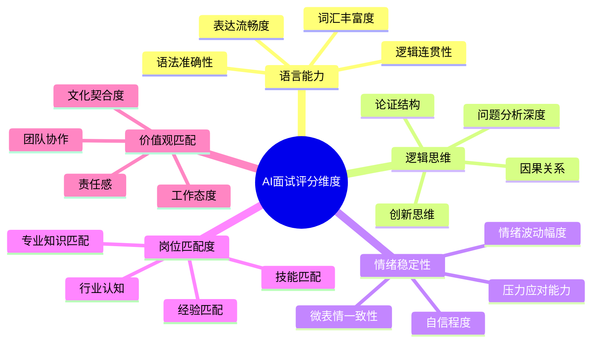
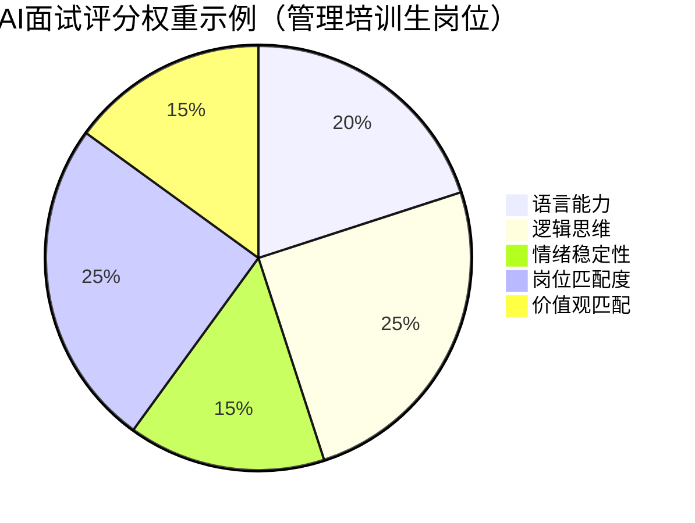
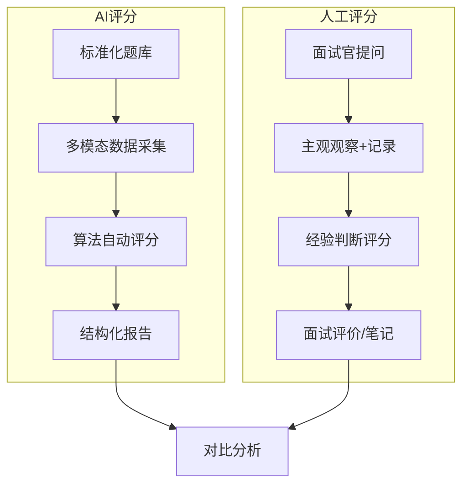
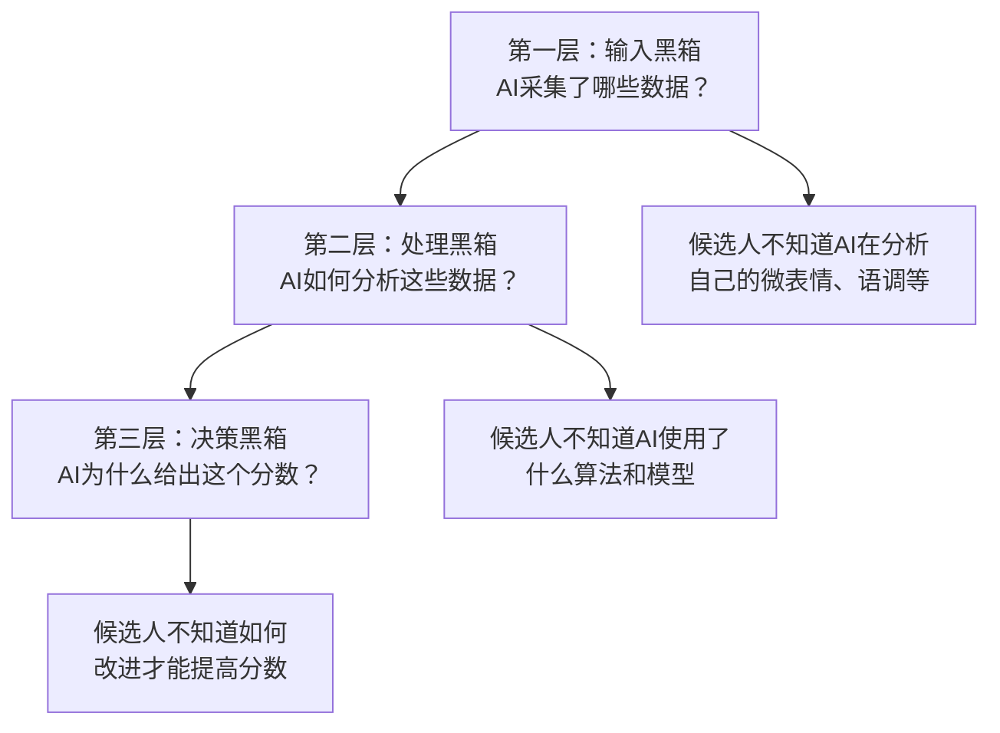

# 03 AI面试的评分模型：AI如何评价候选人

> [!abstract] 本章概要
> 本章深入分析AI面试的**评分维度**（语言能力、逻辑思维、情绪稳定性、岗位匹配度、价值观匹配），对比AI评分与人工评分的**差异与优劣**，并探讨AI评分的**"黑箱"问题**。**注意**：本章聚焦评分维度和应用层面，不重复 [[03-HR人事/校招测评/AI面试/AI面试_评分逻辑]] 中的算法架构细节。

---

## 一、AI面试评分的核心维度

### 1.1 五大核心评分维度

### 1.2 各维度的评分权重

不同岗位对五大维度的权重分配不同。以下是一个典型的权重分布示例：

> [!note] 权重是可配置的
> 实际应用中，企业可以根据岗位需求调整各个维度的权重。例如，销售岗位可能提高"语言能力"和"情绪稳定性"的权重，技术岗位可能提高"逻辑思维"和"岗位匹配度"的权重。

---

## 二、五大评分维度详解

### 2.1 语言能力评分

语言能力是AI面试中最基础、也最成熟的评分维度。

| 子维度 | 评分指标 | AI如何评分 | 高分特征 |
|--------|----------|-----------|---------|
| 词汇丰富度 | 不重复词汇占比 | 计算TTR（Type-Token Ratio） | 词汇多样，避免重复用词 |
| 语法准确性 | 语法错误率 | NLP语法检查 | 无明显语法错误 |
| 表达流畅度 | 停顿/填充词密度 | 语音分析（停顿频率+填充词计数） | 流畅自然，少"嗯啊" |
| 逻辑连贯性 | 逻辑连接词使用 | 检测"因为-所以""首先-其次"等 | 结构清晰，有逻辑链条 |

**语言能力评分示例**：

> [!example] 高分回答 vs 低分回答
> **问题**："请描述一次你解决团队冲突的经历"
>
> **高分回答特征**：
> - 使用STAR结构（情境→任务→行动→结果）
> - 词汇丰富（"分歧""协调""共识""妥协"等）
> - 逻辑连接词（"首先""然后""最终"）
> - 无语法错误，流畅自然
>
> **低分回答特征**：
> - 流水账式叙述，无结构
> - 词汇单一（反复使用"然后"）
> - 大量填充词（"嗯""那个""就是"）
> - 语法错误或逻辑跳跃

### 2.2 逻辑思维评分

逻辑思维是AI面试中**区分度最高**的维度，也是企业最看重的维度之一。

| 子维度 | 评分指标 | AI如何评分 | 高分特征 |
|--------|----------|-----------|---------|
| 问题分析深度 | 多角度分析 | 检测是否从多个维度展开 | 从2-3个角度分析问题 |
| 论证结构 | 论点-论据-结论 | 结构化检测 | 有明确的主张和支持证据 |
| 因果关系 | 因果链完整性 | 因果逻辑分析 | 不只是说"是什么"，还说"为什么" |
| 创新思维 | 新颖观点比例 | 与常见回答对比 | 有独到见解，不人云亦云 |

> [!tip] AI如何判断"逻辑"
> AI对逻辑的评估主要基于以下信号：
> 1. **结构信号**：是否使用了"首先/其次/最后"、"原因在于"、"因此"等逻辑标记
> 2. **因果信号**：是否能建立清晰的因果链
> 3. **深度信号**：是否从多个维度分析，而非停留在表面
> 4. **对比信号**：是否进行了对比分析（"一方面...另一方面..."）

### 2.3 情绪稳定性评分

情绪稳定性是AI面试中**最具争议**的评分维度，因为它涉及到对候选人情绪状态的解读。

| 子维度 | 评分指标 | AI如何评分 | 高分特征 |
|--------|----------|-----------|---------|
| 情绪波动 | 整场面试的情绪变化 | 语音+视觉全程分析 | 情绪稳定，无明显波动 |
| 压力应对 | 面对难题时的表现 | 对比简单题和难题的表现差异 | 难度增加时表现稳定 |
| 自信程度 | 语音和视觉的自信信号 | 语调、语速、眼神综合分析 | 不卑不亢，自然自信 |
| 微表情一致性 | 表情与言语是否一致 | 多模态交叉验证 | 表情与言语一致，无"假笑" |

> [!warning] 情绪评分的争议
> 情绪稳定性评分存在以下争议：
> 1. **文化差异**：不同文化对"自信"和"稳定"的表达方式不同
> 2. **面试焦虑**：面试紧张是正常现象，不应被过度负面评价
> 3. **神经多样性**：对自闭症谱系等群体的误判风险
> 4. **可训练性**：候选人可以通过练习"装"出稳定情绪
>
> 详细讨论见 [[03-HR人事/AI面试全解析/05_AI面试的公平性争议]]。

### 2.4 岗位匹配度评分

岗位匹配度是AI面试的**核心输出维度**，直接决定候选人是否通过。

| 子维度 | 评分指标 | AI如何评分 | 高分特征 |
|--------|----------|-----------|---------|
| 专业知识匹配 | 专业术语使用 | 与岗位知识图谱匹配 | 准确使用专业术语 |
| 技能匹配 | 技能描述 | 与岗位技能要求匹配 | 描述与岗位要求高度相关 |
| 经验匹配 | 经验描述 | 与岗位经验要求匹配 | 有相关经验，描述具体 |
| 行业认知 | 行业见解 | 与行业关键词库匹配 | 展现对行业趋势的理解 |

> [!note] 知识图谱驱动
> 岗位匹配度评分通常基于企业提供的**岗位知识图谱**（包含岗位所需的知识、技能、经验关键词）。AI将候选人的回答与知识图谱进行匹配，计算匹配度分数。这就是为什么在AI面试中**使用正确的专业术语**如此重要——详见 [[03-HR人事/AI面试全解析/06_候选人视角：如何应对AI面试]]。

### 2.5 价值观匹配评分

价值观匹配是AI面试中**最难量化**的维度，也是目前AI最不擅长评估的维度。

| 子维度 | 评分指标 | AI如何评分 | 高分特征 |
|--------|----------|-----------|---------|
| 工作态度 | 主动性、责任感 | 关键词+情感分析 | 展现积极主动的态度 |
| 团队协作 | 协作意识 | 协作相关词汇+实例 | 描述具体协作经历 |
| 责任感 | 担当意识 | 责任相关表述 | 主动承担责任 |
| 文化契合度 | 与公司文化的匹配 | 与公司价值观词库匹配 | 回答与公司价值观一致 |

> [!warning] 价值观评分的局限
> 价值观是最难被AI准确评估的维度，因为：
> 1. 候选人可能**表演**出符合公司价值观的回答
> 2. 价值观是**深层信念**，需要长期观察，而非一次面试能判断
> 3. 过度强调价值观匹配可能导致**文化同质化**，降低多样性

---

## 三、AI评分 vs 人工评分：对比分析

### 3.1 评分对比框架

### 3.2 AI评分与人工评分的优劣对比

| 维度 | AI评分 | 人工评分 |
|------|--------|---------|
| **一致性** | 高（同一标准，不受情绪影响） | 低（不同面试官差异大） |
| **疲劳效应** | 无（不受面试数量影响） | 有（越后面越疲劳） |
| **偏见控制** | 可控制（训练数据决定） | 难以控制（无意识偏见） |
| **深度理解** | 有限（表面信号分析） | 强（能理解潜台词和背景） |
| **灵活性** | 低（按预设规则） | 高（灵活追问和调整） |
| **人性温度** | 无 | 有（候选人感受更好） |
| **可解释性** | 低（黑箱问题） | 高（可以解释判断理由） |
| **成本** | 低（边际成本趋近于零） | 高（时间成本） |
| **速度** | 快（分钟级） | 慢（需要安排时间） |

### 3.3 AI评分与人工评分的一致性研究

> [!info] 研究数据
> 多项研究表明，AI面试评分与人工评分的一致性在**0.5-0.7**之间（相关系数），属于中度到高度相关。但这并不意味着AI评分就"准确"——因为人工评分本身也存在偏差，两者可能"一起错"。

**影响一致性的关键因素**：

1. **岗位类型**：标准化程度高的岗位（如客服、销售）一致性高；创意型岗位（如设计、研发）一致性低
2. **评分维度**：语言能力、逻辑思维一致性高；价值观匹配、情绪稳定性一致性低
3. **候选人特征**：对"典型"候选人一致性高；对"非典型"候选人一致性低

---

## 四、AI评分的"黑箱"问题

### 4.1 什么是"黑箱"问题

> [!important] 黑箱问题的定义
> AI评分的"黑箱"问题是指：**AI给出一个评分，但无法清楚地解释这个评分是如何得出的**。候选人被告知"你的语言能力得分是72分"，但不知道这72分具体意味着什么，也不知道为什么扣了28分。

### 4.2 "黑箱"问题的三个层次

### 4.3 "黑箱"问题的实际影响

| 影响对象 | 具体影响 |
|----------|----------|
| **候选人** | 不知道评分标准，无法针对性改进；被淘汰后无法申诉 |
| **企业HR** | 无法向候选人解释淘汰原因；难以说服业务部门信任AI评分 |
| **监管机构** | 难以验证AI面试是否公平、是否存在歧视 |
| **技术供应商** | 面临"可解释性"的技术挑战和合规压力 |

### 4.4 可解释AI（XAI）在AI面试中的应用

> [!note] 业界趋势：从黑箱到白箱
> 可解释AI（Explainable AI, XAI）是解决黑箱问题的主要技术方向。在AI面试领域，XAI的应用包括：

1. **特征重要性可视化**：展示哪些因素对评分影响最大
2. **自然语言解释**：生成文字说明（"您的逻辑思维得分较低，主要原因是回答中缺乏因果分析"）
3. **对比分析**：展示高分回答和低分回答的差异
4. **置信度标注**：标明AI对每个维度评分的信心程度

**但请注意**：目前的XAI技术仍处于早期阶段，大多数AI面试产品仍无法提供充分的评分解释。

---

## 五、AI面试评分结果的解读

### 5.1 评分结果的常见形式

| 输出形式 | 示例 | 用途 |
|----------|------|------|
| 综合评分 | 总分85/100 | 快速排名 |
| 维度评分 | 语言能力82、逻辑思维78、... | 了解候选人优劣势 |
| 红黄绿灯 | 绿灯（推荐）/黄灯（待定）/红灯（不推荐） | 快速决策 |
| 排名 | 在1000名候选人中排名第35 | 横向对比 |
| 面试建议 | "建议进入下一轮，重点关注其团队协作能力" | 辅助决策 |
| 风险标注 | "该候选人回答中多处与简历信息不一致" | 风险提示 |

### 5.2 如何正确使用AI评分

> [!tip] AI评分的使用原则
> 1. **AI评分是参考，不是判决**：AI评分应作为辅助决策工具，而非唯一依据
> 2. **关注维度评分，而非总分**：总分掩盖了候选人的优劣势分布
> 3. **AI评分 + 人工复核**：AI推荐通过的候选人，建议人工快速复核
> 4. **不只看排名，也看绝对值**：如果所有候选人得分都低，可能是题目或标准问题
> 5. **持续校准**：定期对比AI评分与入职后绩效，优化评分模型

---

## 六、与已有知识库的关联

- [[03-HR人事/校招测评/AI面试/AI面试_评分逻辑]] -- AI面试评分算法架构细节（本库不重复展开）
- [[03-HR人事/校招测评/AI面试/AI面试_高频题库_带答案]] -- AI面试常见题型与高分回答示例
- [[03-HR人事/招聘与面试体系/05_评估与决策：从面试到Offer]] -- 传统面试的评估与决策方法
- [[02-AI趋势与素养/AI伦理与治理/03_AI决策的透明性与可解释性]] -- AI决策透明性的伦理讨论

---

## 七、本章小结

> [!summary] 核心要点
> 1. AI面试评分涵盖五大维度：语言能力、逻辑思维、情绪稳定性、岗位匹配度、价值观匹配
> 2. 不同岗位对五大维度的权重分配不同，企业可根据需求调整
> 3. AI评分与人工评分各有优劣，最佳实践是"AI初筛+人工复核"
> 4. AI评分的"黑箱"问题是当前最大的信任障碍
> 5. 可解释AI（XAI）是解决黑箱问题的技术方向，但尚未成熟
> 6. AI评分应作为参考而非判决，需要结合人工判断

**下一步阅读**：
- 想了解不同类型AI面试的评分差异 → [[03-HR人事/AI面试全解析/04_AI面试的类型对比：视频、电话、游戏化]]
- 想了解AI评分的公平性问题 → [[03-HR人事/AI面试全解析/05_AI面试的公平性争议]]
- 想了解候选人如何应对AI评分 → [[03-HR人事/AI面试全解析/06_候选人视角：如何应对AI面试]]
- 返回中枢 → [[03-HR人事/AI面试全解析/00_MOC_AI面试全解析中枢]]