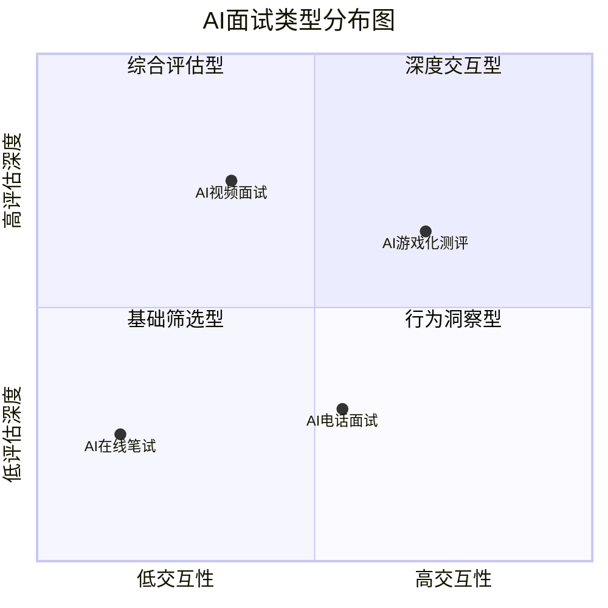
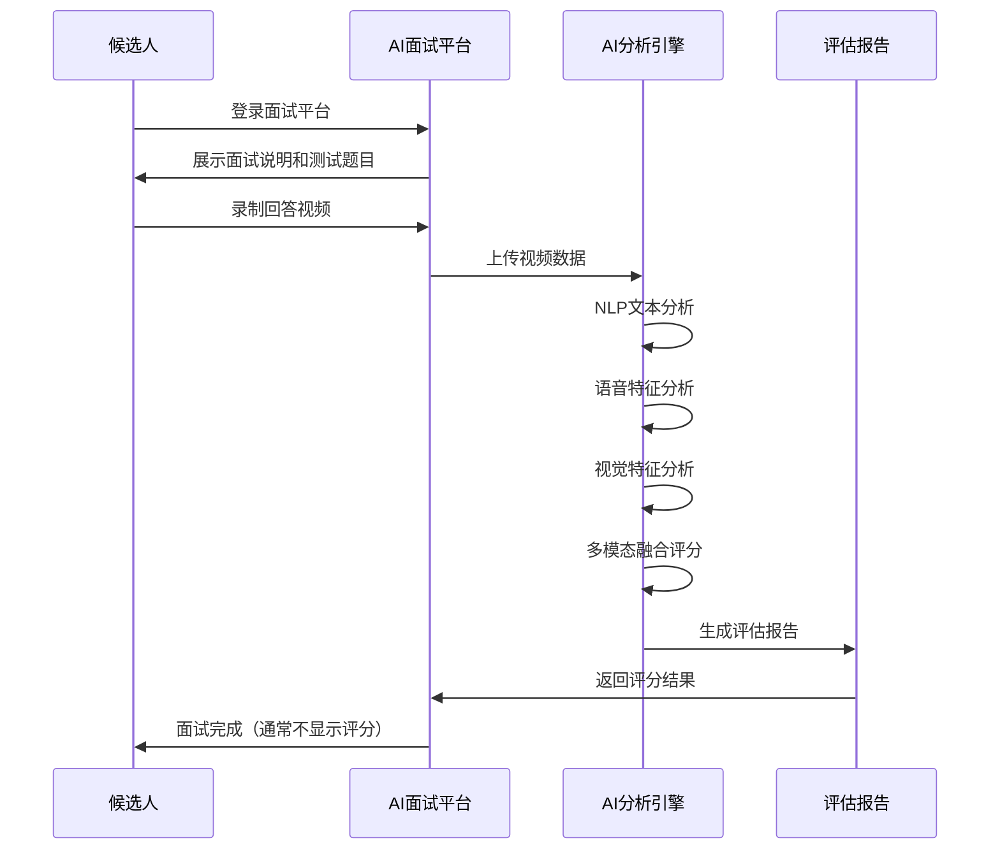
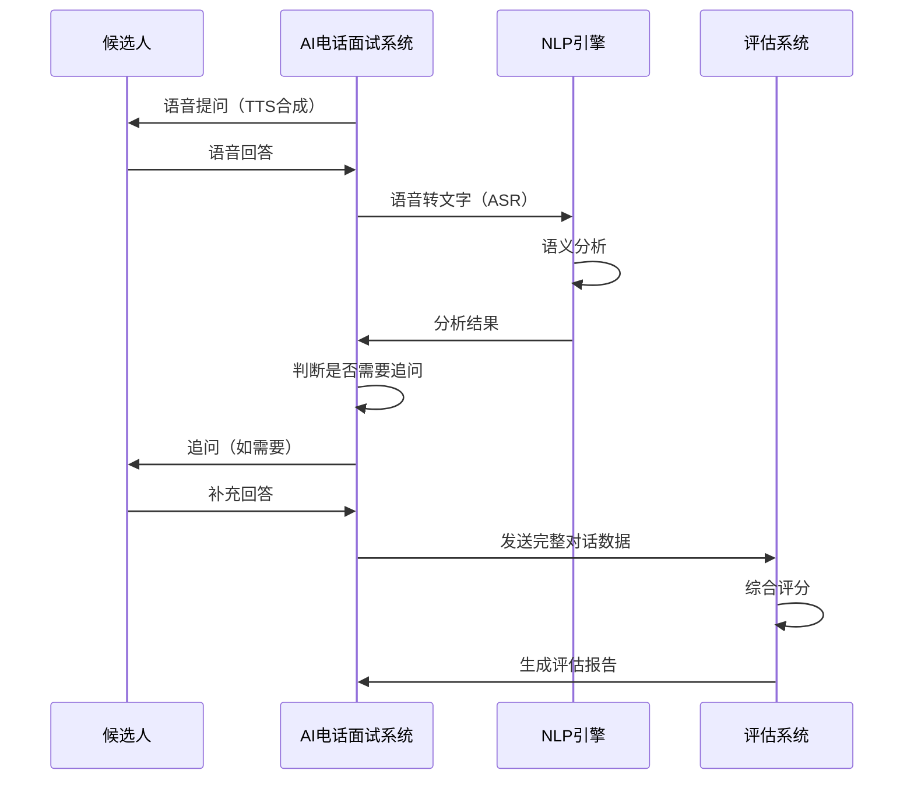
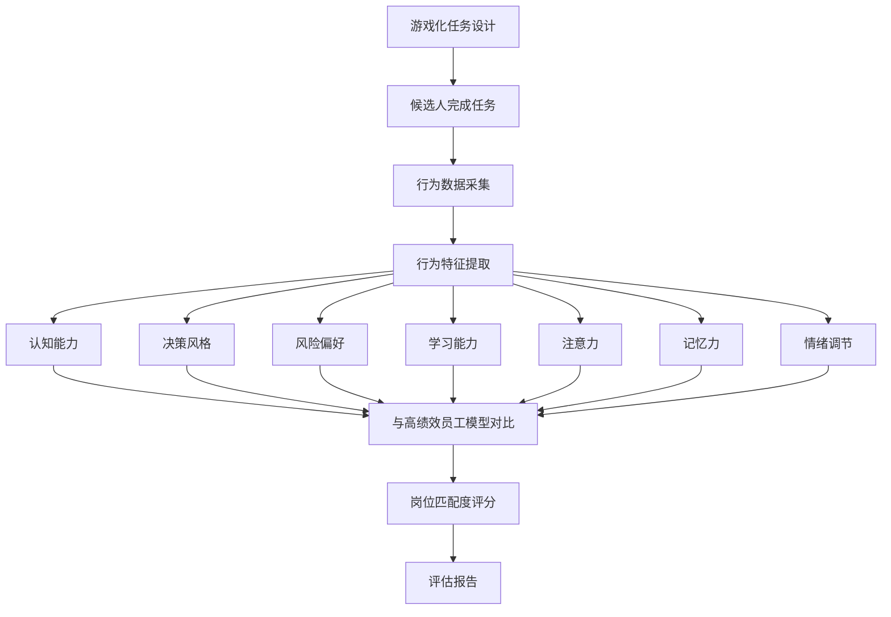
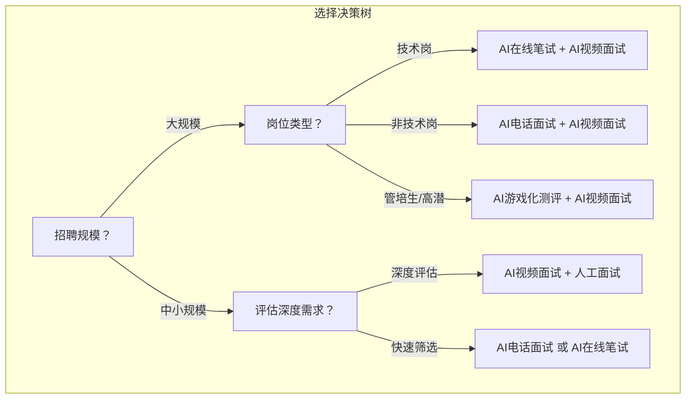

# 04 AI面试的类型对比：视频、电话、游戏化

> [!abstract] 本章概要
> 本章对四种主要AI面试类型进行**系统性对比**：AI视频面试（HireVue/海纳AI）、AI电话面试（AI语音对话）、AI游戏化测评（Pymetrics/Arctic Shores）、AI在线笔试（编程/逻辑/情境判断）。分析每种类型的**技术特点、优缺点、适用场景和代表产品**，帮助读者理解不同类型AI面试的差异和选择逻辑。

---

## 一、AI面试类型全景图

### 1.1 四种类型总览

### 1.2 四种类型对比总表

| 维度 | AI视频面试 | AI电话面试 | AI在线笔试 | AI游戏化测评 |
|------|-----------|-----------|-----------|------------|
| **交互方式** | 异步视频录制 | 实时语音对话 | 在线答题 | 游戏化任务 |
| **技术核心** | 多模态分析 | NLP+语音分析 | 知识图谱+规则引擎 | 行为数据分析 |
| **评估时长** | 15-30分钟 | 10-20分钟 | 30-90分钟 | 20-40分钟 |
| **候选人体验** | 中等 | 中等 | 偏负面 | 偏正面 |
| **评估深度** | 深 | 中等 | 中等 | 深 |
| **成本（每候选人）** | 中 | 低 | 低 | 高 |
| **公平性争议** | 高 | 中 | 低 | 中 |
| **适用规模** | 中大型 | 大规模 | 大规模 | 中大型 |
| **代表产品** | HireVue、海纳AI | Interviewer.AI | 牛客网、Codility | Pymetrics、Arctic Shores |

---

## 二、AI视频面试

### 2.1 什么是AI视频面试

> [!note] 定义
> AI视频面试是候选人通过视频录制回答预设问题，AI系统分析视频中的**语音、语义、面部表情**等多模态信号，生成综合评分的面试方式。这是目前**应用最广、争议也最大**的AI面试类型。

### 2.2 AI视频面试的工作流程

### 2.3 AI视频面试的优缺点

**优点**：

| 优点 | 说明 |
|------|------|
| 评估维度全面 | 文本+语音+视觉，多模态评估 |
| 异步灵活 | 候选人可自由安排时间，无需协调面试官 |
| 标准化程度高 | 同一套题、同一套标准，减少面试官偏差 |
| 可回看 | 人类面试官可回看视频，结合AI评分做决策 |
| 数据沉淀 | 每次面试都产生结构化数据，可用于持续优化 |

**缺点**：

| 缺点 | 说明 |
|------|------|
| 公平性争议大 | 面部表情分析最具争议，HireVue已放弃 |
| 候选人体验差 | 对着摄像头说话不自然，缺乏人际互动 |
| 技术门槛高 | 对网络、设备、环境要求高 |
| 成本较高 | 视频存储和AI分析成本较高 |
| "可训练性"强 | 候选人可以通过练习"表演"出高分 |

### 2.4 代表产品

| 产品 | 国家 | 核心特点 | 主要客户 |
|------|------|----------|----------|
| **HireVue** | 美国 | 全球AI视频面试先驱，2020年放弃面部表情分析 | 联合利华、高盛、希尔顿 |
| **海纳AI** | 中国 | 国内AI视频面试领导者，专注校招场景 | 字节跳动、美团、招商银行 |
| **北森** | 中国 | 一体化招聘平台，AI面试为模块之一 | 腾讯、阿里巴巴、华为 |
| **Modern Hire** | 美国 | 综合AI面试平台，支持多种面试形式 | 沃尔玛、CVS、Humana |

### 2.5 适用场景

> [!tip] AI视频面试最适合的场景
> 1. **校招大规模初筛**：面对数千甚至数万候选人，AI视频面试是最有效的初筛工具
> 2. **标准化岗位招聘**：客服、销售、管培生等标准化程度高的岗位
> 3. **跨地域招聘**：候选人分布在不同城市，无法集中面试
> 4. **高招聘量企业**：年招聘量超过500人的企业

---

## 三、AI电话面试

### 3.1 什么是AI电话面试

> [!note] 定义
> AI电话面试是通过AI语音对话系统与候选人进行实时交互，自动提问、追问、记录并评分的面试方式。它的核心是**NLP+语音合成+语音识别**技术的融合，模拟人类面试官的对话流程。

### 3.2 AI电话面试的工作流程

### 3.3 AI电话面试的优缺点

**优点**：

| 优点 | 说明 |
|------|------|
| 成本低 | 无需视频，带宽和存储成本低 |
| 门槛低 | 候选人只需电话，无需特殊设备和环境 |
| 实时交互 | 支持追问，比视频面试更灵活 |
| 公平性争议小 | 不分析面部表情，主要聚焦NLP |
| 大规模适用 | 可同时进行大量面试 |

**缺点**：

| 缺点 | 说明 |
|------|------|
| 评估维度少 | 缺少视觉信息，评估不够全面 |
| 语音识别挑战 | 方言、口音、噪音影响识别准确率 |
| "机器人感"强 | 语音合成不够自然，候选人体验一般 |
| 追问能力有限 | 相比人类面试官，追问深度和灵活性不足 |
| 网络安全 | 电话线路可能存在安全隐患 |

### 3.4 代表产品

| 产品 | 国家 | 核心特点 |
|------|------|----------|
| **Interviewer.AI** | 美国 | 专注AI语音面试，强调"类人对话"体验 |
| **智联招聘AI面试** | 中国 | 内置在智联招聘平台，与ATS系统打通 |
| **Mya** | 美国 | AI招聘助手，电话+文字聊天双模式 |
| **Paradox** | 美国 | AI招聘助手Olivia，支持电话面试 |

### 3.5 适用场景

> [!tip] AI电话面试最适合的场景
> 1. **蓝领/服务业大规模招聘**：候选人可能没有电脑或稳定网络，电话是门槛最低的方式
> 2. **初筛环节**：在简历筛选后、视频面试前的快速初筛
> 3. **补充信息收集**：对简历信息不全的候选人进行快速电话核实
> 4. **预算有限的企业**：电话面试成本远低于视频面试

---

## 四、AI游戏化测评

### 4.1 什么是AI游戏化测评

> [!note] 定义
> AI游戏化测评是通过设计一系列**游戏化任务**，收集候选人在完成任务过程中的**行为数据**（决策速度、风险偏好、认知模式、学习能力等），AI分析这些行为数据并预测候选人的岗位匹配度和潜力的测评方式。

### 4.2 AI游戏化测评的核心逻辑

> [!note] 游戏化测评的独特价值
> 与传统面试和AI视频面试不同，AI游戏化测评**不依赖于候选人"说什么"**，而是通过**行为数据**直接测量候选人的认知和性格特质。这在一定程度上避免了"表演"和"背诵"的问题，但也带来了新的争议。

### 4.3 AI游戏化测评的优缺点

**优点**：

| 优点 | 说明 |
|------|------|
| 难以"作弊" | 行为数据难以伪装，比"回答问题"更真实 |
| 候选人体验好 | 游戏化形式有趣，减少面试焦虑 |
| 预测效度高 | 行为数据与工作绩效的关联度较高 |
| 减少偏见 | 不看脸、不听声音，减少显性偏见 |
| 跨文化适用 | 游戏化任务设计可跨文化使用 |

**缺点**：

| 缺点 | 说明 |
|------|------|
| 成本高 | 游戏设计和数据分析成本高 |
| 候选人接受度 | 部分候选人认为"玩游戏"不严肃 |
| 预测有效性争议 | 游戏行为与真实工作行为的关联性仍有争议 |
| 技术门槛 | 需要专业心理学和游戏设计团队 |
| 对某些群体不友好 | 游戏经验少的人可能处于劣势 |

### 4.4 代表产品

| 产品 | 国家 | 核心特点 | 主要客户 |
|------|------|----------|----------|
| **Pymetrics** | 美国 | 神经科学+AI游戏化测评先驱 | 联合利华、埃森哲、摩根大通 |
| **Arctic Shores** | 英国 | 行为游戏化测评，强调"无偏见" | 德勤、西门子、BBC |
| **Aon测评** | 全球 | 传统测评巨头，游戏化测评模块 | 大量500强企业 |
| **Seedlink** | 中国 | 国内游戏化测评先行者 | 字节跳动、美团 |

### 4.5 典型游戏化任务

| 游戏名称 | 测量维度 | 游戏描述 |
|----------|----------|----------|
| 气球充气 | 风险偏好 | 点击充气获得奖励，但气球可能爆炸 |
| 数字记忆 | 短期记忆 | 快速记忆并复现数字序列 |
| 情绪识别 | 情绪智力 | 判断面部表情对应的情绪 |
| 金钱分配 | 公平意识 | 在利己和利他之间分配资源 |
| 多任务切换 | 注意力灵活性 | 同时处理多个任务 |

### 4.6 适用场景

> [!tip] AI游戏化测评最适合的场景
> 1. **校招管培生**：评估潜力而非经验，游戏化测评是最佳选择
> 2. **高潜力人才识别**：发现"非传统"背景的优秀人才
> 3. **大规模人才筛选**：联合利华通过Pymetrics将候选人池从25万缩小到数千人
> 4. **创新型岗位**：需要认知灵活性和创造力的岗位

---

## 五、AI在线笔试

### 5.1 什么是AI在线笔试

> [!note] 定义
> AI在线笔试是通过AI技术自动生成或适配题目，并对候选人的答题结果进行自动评分的在线测试方式。它是四种AI面试类型中**技术最成熟、争议最小**的一种。

### 5.2 AI在线笔试的类型

| 类型 | 内容 | AI的作用 | 代表产品 |
|------|------|----------|----------|
| **编程笔试** | 代码编写、算法设计 | 自动判题、代码分析、作弊检测 | 牛客网、Codility、HackerRank |
| **逻辑推理** | 图形推理、数字推理、言语推理 | 自动评分、难度自适应 | SHL、Aon、北森 |
| **情境判断（SJT）** | 模拟工作情境，选择最佳应对 | 自动评分、行为模式分析 | SHL、Aon |
| **专业知识** | 岗位相关专业知识 | 自动出题、自动评分 | 牛客网、赛码 |

### 5.3 AI在线笔试的优缺点

**优点**：

| 优点 | 说明 |
|------|------|
| 技术成熟 | 判定标准明确，准确率高 |
| 争议最小 | 客观题评分，公平性争议小 |
| 成本低 | 技术成熟，边际成本低 |
| 可大规模使用 | 支持数万人同时考试 |
| 作弊检测成熟 | 人脸识别、屏幕监控、代码相似度检测 |

**缺点**：

| 缺点 | 说明 |
|------|------|
| 评估维度有限 | 只能评估硬技能和逻辑能力，无法评估软技能 |
| 候选人体验 | 考试式体验，候选人压力大 |
| 作弊风险 | 远程笔试作弊难以完全杜绝 |
| 不适合所有岗位 | 创意类、管理类岗位不适合笔试 |
| 刷题效应 | 候选人可以通过大量刷题提高分数 |

### 5.4 代表产品

| 产品 | 国家 | 核心特点 |
|------|------|----------|
| **牛客网** | 中国 | 国内最大的校招笔试平台，AI判题+作弊检测 |
| **Codility** | 美国 | 全球领先的编程能力测评平台 |
| **HackerRank** | 美国 | 编程测评+面试一体化平台 |
| **SHL** | 英国 | 全球最大的测评公司之一，AI笔试+测评 |
| **赛码** | 中国 | 国内IT校招笔试平台 |

### 5.5 适用场景

> [!tip] AI在线笔试最适合的场景
> 1. **技术岗位招聘**：编程能力、算法思维是硬性要求
> 2. **校招海选**：数千人同时笔试，自动评分，快速筛选
> 3. **硬技能验证**：财务、数据分析等需要专业知识的岗位
> 4. **合规要求**：某些行业（如金融）对笔试有监管要求

---

## 六、四种类型的综合对比与选择建议

### 6.1 综合对比矩阵

### 6.2 按岗位类型推荐

| 岗位类型 | 推荐组合 | 理由 |
|----------|----------|------|
| 技术研发 | AI在线笔试 → AI视频面试 → 人工面试 | 先验证硬技能，再评估软技能 |
| 销售/客服 | AI电话/视频面试 → 人工面试 | 重点评估沟通能力和情绪稳定性 |
| 管培生 | AI游戏化测评 → AI视频面试 → 评估中心 | 全面评估潜力、认知和性格 |
| 蓝领/服务业 | AI电话面试 → 现场面试 | 低门槛、低成本、高效率 |
| 高管 | 人工面试（AI辅助） | 高管面试需要深度和灵活性 |

### 6.3 按企业规模推荐

| 企业规模 | 推荐方案 | 理由 |
|----------|----------|------|
| 大型企业（>5000人） | 多类型组合，按岗位定制 | 有足够预算和招聘量支撑 |
| 中型企业（500-5000人） | AI视频面试为主 + AI在线笔试 | 平衡成本与效果 |
| 小型企业（<500人） | AI电话面试 或 AI在线笔试 | 控制成本，聚焦核心需求 |

---

## 七、与已有知识库的关联

- [[03-HR人事/校招测评/AI面试/AI面试_技术篇]] -- 不同类型AI面试的底层技术原理
- [[03-HR人事/校招测评/AI面试/AI面试_情景题题库]] -- AI视频面试的情景题题库
- [[03-HR人事/校招测评/AI面试/AI面试_行为题题库]] -- AI视频面试的行为题题库
- [[03-HR人事/招聘与面试体系/02_渠道策略与人才sourcing]] -- 不同渠道的招聘策略
- [[03-HR人事/AI面试全解析/07_企业视角：AI面试的选型与实施]] -- 企业如何选择AI面试产品

---

## 八、本章小结

> [!summary] 核心要点
> 1. AI面试分为视频、电话、在线笔试、游戏化测评四种类型，各有优劣
> 2. AI视频面试应用最广，但公平性争议最大
> 3. AI电话面试成本最低，适合大规模初筛
> 4. AI游戏化测评候选人体验最好，最难"作弊"，但成本最高
> 5. AI在线笔试技术最成熟，争议最小，但评估维度有限
> 6. 最优实践是**组合使用多种类型**，而非单一依赖某种类型

**下一步阅读**：
- 想了解AI面试的公平性争议 → [[03-HR人事/AI面试全解析/05_AI面试的公平性争议]]
- 想了解候选人如何应对 → [[03-HR人事/AI面试全解析/06_候选人视角：如何应对AI面试]]
- 想了解企业如何选择 → [[03-HR人事/AI面试全解析/07_企业视角：AI面试的选型与实施]]
- 返回中枢 → [[03-HR人事/AI面试全解析/00_MOC_AI面试全解析中枢]]