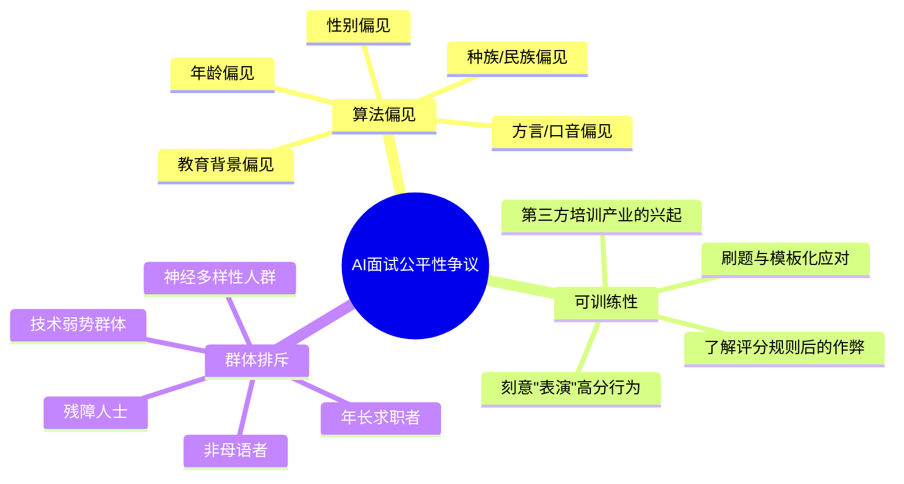
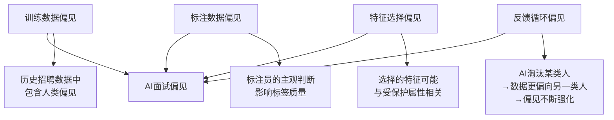
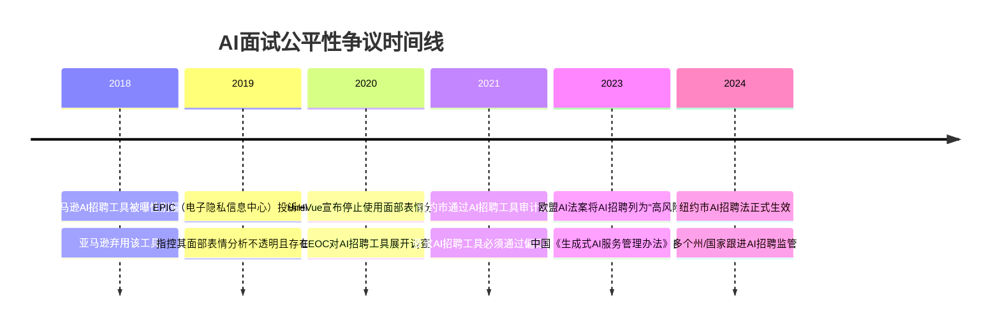

# 05 AI面试的公平性争议

> [!abstract] 本章概要
> 本章聚焦AI面试公平性的**核心争议**：算法偏见（性别/种族/年龄/方言）、AI面试的"可训练性"（知道AI怎么评分就能"作弊"）、AI面试对特定群体的排斥（如残障人士），以及相关案例与数据。**注意**：本章聚焦AI面试场景下的公平性争议，不重复 [[02-AI趋势与素养/AI伦理与治理/00_MOC_AI伦理与治理中枢]] 中的深层伦理理论讨论，但会引用其伦理框架作为分析工具。

---

## 一、AI面试公平性争议全景

### 1.1 为什么AI面试的公平性如此重要？

> [!important] 公平性的核心地位
> AI面试的公平性不仅是一个技术问题，更是一个**社会问题**。面试是人才选拔的入口，如果AI面试存在系统性偏见，它将放大社会不平等，剥夺特定群体的就业机会。这正是为什么AI面试的公平性争议在学术界、产业界和监管机构中引起了如此广泛的关注。

### 1.2 公平性争议的三个维度



---

## 二、算法偏见：AI如何继承并放大偏见

### 2.1 算法偏见的来源



> [!note] 与伦理框架的关联
> 关于算法偏见的深层根源分析，请参考 [[02-AI趋势与素养/AI伦理与治理/02_算法偏见：AI如何继承并放大人类的偏见]]。本节聚焦于AI面试场景下的偏见表现形式。

### 2.2 性别偏见

**表现形式**：

| 偏见类型 | 具体表现 | 案例 |
|----------|----------|------|
| 语言风格偏见 | AI偏好"男性化"语言风格 | 研究表明，AI面试可能对使用"果断""主导"等词汇的候选人评分更高 |
| 语音特征偏见 | AI对女性声音的评分偏差 | 语音识别对女性声音的准确率可能低于男性 |
| 职业刻板印象 | AI对不同性别在不同岗位的评分偏差 | AI可能降低女性在技术岗位的评分 |
| 面部表情偏见 | 对不同性别表情的解读偏差 | 女性"微笑"可能被解读为"不够自信" |

**真实案例**：

> [!example] 亚马逊AI招聘工具事件（2018年）
> 亚马逊开发的AI招聘工具被发现对女性候选人存在系统性偏见。该工具使用过去10年的招聘数据进行训练，由于历史数据中男性占多数，AI学会了"偏好男性"——它会降低包含"女子"一词（如"女子大学"）的简历评分。亚马逊最终于2018年弃用了该工具。

### 2.3 种族/民族偏见

**表现形式**：

| 偏见类型 | 具体表现 | 案例 |
|----------|----------|------|
| 面部特征偏见 | 对不同肤色面部分析的准确率差异 | 面部识别技术对深肤色人脸的准确率较低 |
| 语音特征偏见 | 对不同口音/方言的识别偏差 | 非标准口音可能被AI判定为"表达不清晰" |
| 文化表达差异 | 对不同文化表达方式的误判 | 某些文化中"谦虚"的表达可能被AI视为"不自信" |
| 姓名偏见 | 姓名可能暗示种族背景 | 即使AI不直接看到姓名，相关特征可能泄露种族信息 |

**数据佐证**：

> [!info] 研究数据
> 美国国家标准与技术研究院（NIST）的研究表明，主流面部识别算法在识别深肤色人脸的准确率比浅肤色人脸低10-100倍（取决于具体算法）。虽然AI面试通常不使用面部"识别"（而是面部"分析"），但底层技术面临类似的偏见风险。

### 2.4 方言/口音偏见

**这是AI面试在中国场景下特别突出的问题**：

| 偏见类型 | 具体表现 |
|----------|----------|
| 语音识别偏差 | 方言口音导致ASR准确率下降，影响后续NLP分析 |
| 流利度误判 | 轻微的方言口音可能被AI判定为"表达不流畅" |
| 地域歧视 | 某些方言可能与特定地域关联，引发地域偏见 |
| 多语言混合 | 中英夹杂或方言词汇混用可能被误判为"语言能力差" |

> [!warning] 中国场景的特殊性
> 中国地域广阔，方言众多。即使是普通话，不同地区的口音差异也很大。AI面试系统如果只用"标准普通话"训练，可能对来自特定地区的候选人产生系统性偏见。这是中国企业选择AI面试产品时**必须关注**的问题。

### 2.5 年龄偏见

| 偏见类型 | 具体表现 |
|----------|----------|
| 语音特征老化 | 年龄相关的语音变化可能被AI负面评价 |
| 回答模式差异 | 不同年龄段的表达习惯差异可能被误判 |
| 代际数字鸿沟 | 年长候选人可能对AI面试形式不熟悉，影响表现 |
| 经验≠优势 | AI可能无法识别丰富经验带来的隐性价值 |

---

## 三、AI面试的"可训练性"问题

### 3.1 什么是"可训练性"

> [!note] 定义
> AI面试的"可训练性"是指：当候选人了解AI面试的评分机制后，可以通过**刻意练习**和**策略性表演**来获得高分，而这些高分**不一定反映**候选人的真实能力和素质。

### 3.2 可训练性的三个层次

```mermaid
flowchart TD
    L1[第一层：了解评分规则] --> L2[第二层：刻意行为调整]
    L2 --> L3[第三层：系统性培训]
    
    L1 --> L1D[知道AI喜欢什么<br/>关键词、STAR结构、语速等]
    L2 --> L2D[在面试中刻意展示<br/>AI喜欢的行为模式<br/>如持续微笑、稳定语速]
    L3 --> L3D[参加AI面试培训<br/>使用AI面试模拟工具<br/>形成"肌肉记忆"]
```

### 3.3 可训练性的具体表现

| 可训练行为 | AI如何被"欺骗" | 对公平性的影响 |
|------------|---------------|---------------|
| 关键词堆砌 | 在回答中大量插入AI喜欢的关键词 | 内容空洞但得分高 |
| 模板化回答 | 使用STAR模板，套用万能案例 | AI无法区分真实和模板 |
| 表情管理 | 刻意保持微笑、直视摄像头 | 视觉分析被"表演"欺骗 |
| 语速控制 | 刻意保持120-160字/分钟的语速 | 语音分析被"表演"欺骗 |
| 提前准备 | 使用AI面试模拟工具反复练习 | 练习效应替代真实能力 |
| 第三方培训 | 参加AI面试培训班 | 有钱人获得不公平优势 |

### 3.4 可训练性引发的争议

> [!question] 核心问题：这是"作弊"还是"准备"？
> 支持者认为：了解AI面试的规则并针对性准备，就像传统面试前了解公司文化和岗位要求一样，是**合理的准备**。
>
> 反对者认为：AI面试的"可训练"不同于传统面试准备——前者是**利用算法的漏洞**，而非展现真实能力。这会导致AI面试筛选出"最会应对AI的人"而非"最适合岗位的人"。

**可训练性对公平性的三重影响**：

1. **信息不对称**：知道AI面试规则的人获得不公平优势
2. **经济门槛**：有钱参加AI面试培训的人获得不公平优势
3. **逆向筛选**：筛选出"最会表演的人"而非"最有能力的人"

---

## 四、AI面试对特定群体的排斥

### 4.1 残障人士

> [!warning] 这是一个严重但常被忽视的问题

| 残障类型 | 面临的挑战 |
|----------|-----------|
| 听力障碍 | 无法进行AI电话面试；AI视频面试依赖语音输入 |
| 视力障碍 | 无法看清视频面试的题目和提示 |
| 言语障碍 | 语音分析可能将言语障碍误判为"表达不流畅" |
| 面部差异 | 面部表情分析可能对面部差异者产生误判 |
| 自闭症谱系 | 眼神接触、表情和语调的差异可能被AI误判为"不自信" |
| 运动障碍 | 身体姿态的差异可能被AI负面评价 |

**案例**：2020年，美国平等就业机会委员会（EEOC）对HireVue等AI面试工具展开调查，重点关注其对残障人士的潜在歧视。

### 4.2 神经多样性人群

> [!note] 神经多样性的概念
> 神经多样性（Neurodiversity）是指人类大脑功能的自然差异，包括自闭症谱系、ADHD（注意力缺陷多动障碍）、阅读障碍等。这些人群在认知和行为模式上可能与"典型"人群不同，但**差异不等于缺陷**。

**AI面试如何误判神经多样性人群**：

| 特质 | AI的可能误判 | 实际含义 |
|------|-------------|---------|
| 较少眼神接触 | 不自信、不诚实 | 自闭症谱系人群的常见特征 |
| 语调平淡 | 缺乏热情 | 自闭症谱系人群的常见特征 |
| 回答细节丰富 | 啰嗦、抓不住重点 | 可能是深度思考的表现 |
| 思考时间较长 | 反应慢 | 可能是深入分析的表现 |

### 4.3 技术弱势群体

| 群体 | 面临的挑战 |
|------|-----------|
| 数字鸿沟 | 不熟悉技术操作的候选人，因操作问题影响表现 |
| 设备不足 | 没有高质量摄像头/麦克风的候选人，音视频质量影响评分 |
| 网络不稳定 | 偏远地区候选人网络不稳定，影响面试流畅度 |
| 环境受限 | 没有安静独立空间的候选人，背景噪音干扰AI分析 |

---

## 五、公平性争议的案例与数据

### 5.1 重大事件时间线



### 5.2 关键数据

| 研究/报告 | 核心发现 |
|-----------|----------|
| 哈佛商业评论（2020） | 如果AI招聘工具不做偏见审计，可能"自动化"而非"消除"偏见 |
| NIST（2019） | 面部识别算法对深肤色人脸的准确率显著低于浅肤色 |
| Brookings（2020） | 缺乏透明度是AI招聘工具最大的公平性风险 |
| 纽约市AI招聘法（2024） | 首个要求AI招聘工具必须通过独立偏见审计的法律 |

### 5.3 监管趋势

> [!important] 全球监管趋势
> 1. **欧盟AI法案**：将AI招聘列为"高风险"AI应用，需要满足透明度、准确性、公平性等要求
> 2. **纽约市AI招聘法**：要求AI招聘工具必须通过独立的偏见审计，并向候选人披露AI的使用
> 3. **中国**：《生成式AI服务管理办法》要求AI服务提供者防止歧视，但针对AI面试的专项监管尚未出台
> 4. **趋势**：越来越多的国家和地区将出台AI招聘的专项监管政策

---

## 六、如何提升AI面试的公平性

### 6.1 技术层面的改进

| 措施 | 说明 |
|------|------|
| 偏见审计 | 定期审计AI面试模型，检测并消除偏见 |
| 多样化训练数据 | 确保训练数据覆盖不同性别、种族、年龄、地域 |
| 移除敏感特征 | 从模型中移除与受保护属性相关的特征 |
| 可解释性 | 提供评分的解释，让候选人知道为什么得这个分数 |
| 公平性约束 | 在模型训练中加入公平性约束条件 |

### 6.2 制度层面的保障

| 措施 | 说明 |
|------|------|
| 候选人知情权 | 告知候选人正在使用AI面试，以及AI分析什么 |
| 申诉机制 | 建立候选人申诉渠道，允许对AI面试结果提出异议 |
| 人工复核 | AI面试结果必须经过人工复核才能做出最终决策 |
| 第三方审计 | 引入独立第三方对AI面试系统进行公平性审计 |
| 持续监控 | 持续监控AI面试的公平性指标，发现问题及时调整 |

---

## 七、与已有知识库的关联

- [[02-AI趋势与素养/AI伦理与治理/02_算法偏见：AI如何继承并放大人类的偏见]] -- 算法偏见的深层根源
- [[02-AI趋势与素养/AI伦理与治理/08_HR+AI的伦理特别议题]] -- HR场景下的AI伦理特别讨论
- [[02-AI趋势与素养/AI伦理与治理/03_AI决策的透明性与可解释性]] -- AI决策透明性的伦理框架
- [[02-AI趋势与素养/AI伦理与治理/06_全球AI监管政策对比]] -- 全球AI监管政策的全景对比
- [[02-AI趋势与素养/AI时代能力要求/05_AI素养：新时代的基础能力]] -- 候选人如何建立AI素养

---

## 八、本章小结

> [!summary] 核心要点
> 1. AI面试的公平性争议集中在三个领域：算法偏见、可训练性、群体排斥
> 2. 算法偏见可能影响性别、种族、年龄、方言等多个维度
> 3. AI面试的"可训练性"可能导致逆向筛选——选出"最会应对AI的人"而非"最适合岗位的人"
> 4. 残障人士和神经多样性人群面临AI面试的排斥风险
> 5. 全球监管趋势正在收紧，AI面试的合规要求将越来越严格
> 6. 提升公平性需要技术+制度双管齐下

**下一步阅读**：
- 想了解候选人如何应对AI面试 → [[03-HR人事/AI面试全解析/06_候选人视角：如何应对AI面试]]
- 想了解企业如何选择合规的AI面试产品 → [[03-HR人事/AI面试全解析/07_企业视角：AI面试的选型与实施]]
- 想了解AI面试的监管未来 → [[03-HR人事/AI面试全解析/08_AI面试的未来：从筛选到全流程]]
- 返回中枢 → [[03-HR人事/AI面试全解析/00_MOC_AI面试全解析中枢]]