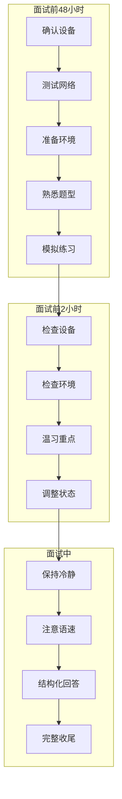
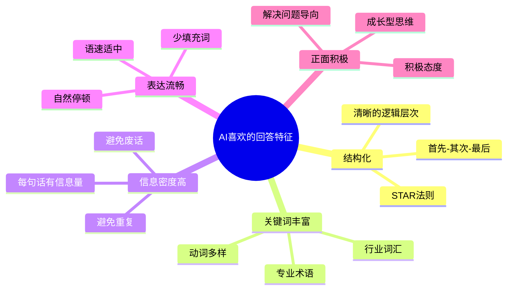
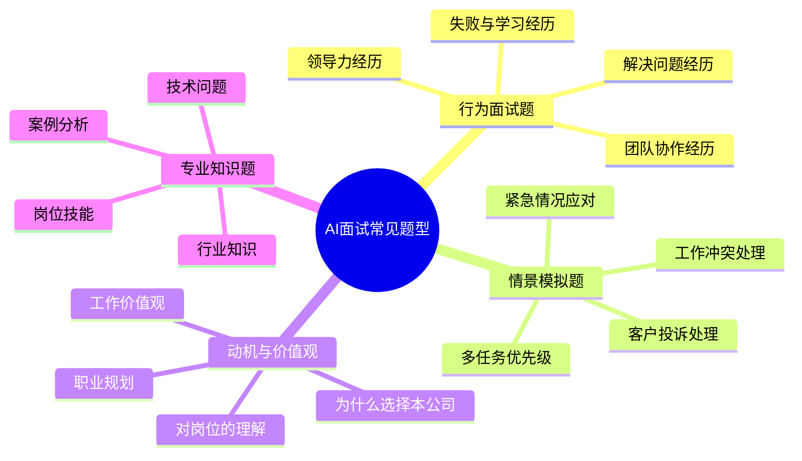

# 06 候选人视角：如何应对AI面试

> [!abstract] 本章概要
> 本章从**候选人视角**出发，提供AI面试的实操应对策略。内容包括：AI面试的评分偏好（AI喜欢什么样的回答）、AI面试的注意事项（环境/语速/关键词）、AI面试的常见题型与应对、AI面试的"反套路"策略。**注意**：这是给候选人的实操指南，不是技术分析。如果你明天就要参加AI面试，直接从本章开始阅读。

---

## 一、AI面试准备清单

### 1.1 面试前48小时准备清单

### 1.2 设备与环境准备

> [!important] 设备是AI面试的基础，设备问题可能导致面试失败

| 检查项 | 要求 | 为什么重要 |
|--------|------|-----------|
| 摄像头 | 高清（至少720p），正对脸部 | AI需要清晰的面部画面进行分析 |
| 麦克风 | 清晰无杂音，建议使用外接麦克风 | AI语音识别依赖清晰的音频输入 |
| 网络 | 稳定，上传速度至少2Mbps | 视频卡顿会影响AI分析 |
| 光线 | 正面均匀光线，避免逆光/侧光 | AI面部分析需要清晰的面部画面 |
| 背景 | 简洁干净，纯色或书架背景 | 复杂背景可能干扰AI视觉分析 |
| 浏览器 | 使用Chrome或Edge最新版 | 兼容性最好 |
| 噪音 | 确保安静，关闭门窗和通知 | 背景噪音干扰ASR精度 |

> [!tip] 设备检查清单
> 1. 提前测试摄像头和麦克风（使用平台自带的设备测试功能）
> 2. 准备备用设备（手机+电脑双保险）
> 3. 关闭所有通知（微信、邮件、消息弹窗）
> 4. 确保电量充足（笔记本插电使用）
> 5. 提前15分钟进入面试系统

---

## 二、AI喜欢什么样的回答

### 2.1 AI评分偏好的核心逻辑

> [!note] 理解AI的"口味"
> AI面试不是"理解"你的回答，而是从你的回答中**提取特征信号**进行评分。理解AI提取什么信号，是应对AI面试的第一步。

### 2.2 STAR法则：AI最喜欢的回答结构

> [!tip] STAR法则在AI面试中特别有效
> STAR法则不仅人类面试官喜欢，AI也特别"喜欢"——因为STAR结构天然提供了AI容易提取的逻辑信号。

**STAR法则拆解**：

| 要素 | 含义 | AI提取的信号 | 示例 |
|------|------|-------------|------|
| **S**ituation | 情境背景 | 上下文理解、角色定位 | "在我担任项目组长期间，团队面临一个紧迫的交付期限..." |
| **T**ask | 任务目标 | 目标明确性、责任意识 | "我的任务是确保项目在两周内完成，同时保证质量..." |
| **A**ction | 行动措施 | 问题解决能力、主动性 | "我首先分析了瓶颈所在，然后重新分配了任务..." |
| **R**esult | 结果成果 | 成果导向、数据意识 | "最终我们提前一天完成交付，客户满意度达到95%..." |

**STAR法则的AI评分优势**：

1. **结构信号清晰**：AI能轻松识别"情境-任务-行动-结果"的逻辑结构
2. **关键词覆盖**：STAR回答自然包含大量与"行动"和"结果"相关的关键词
3. **信息密度高**：每个部分都有明确的信息价值，避免废话
4. **逻辑连贯**：天然满足AI对因果逻辑的要求

### 2.3 关键词策略

> [!important] 关键词是AI评分的重要信号
> AI面试通过关键词匹配来评估你的回答是否"切题"和"有深度"。

**关键词使用原则**：

| 原则 | 说明 | 错误做法 |
|------|------|---------|
| 自然融入 | 关键词应自然融入回答中 | 机械堆砌关键词（"我擅长团队协作沟通协调组织管理..."） |
| 配合实例 | 每个关键词最好有实例支撑 | 空洞地罗列概念 |
| 语境匹配 | 使用与问题相关的关键词 | 使用与问题无关的"高级词汇" |
| 适度重复 | 核心关键词可以在不同位置出现 | 过度重复同一关键词 |

**不同岗位类型的关键词侧重点**：

| 岗位类型 | 核心关键词举例 |
|----------|---------------|
| 管理培训生 | 领导力、团队协作、沟通协调、项目管理、结果导向、数据分析 |
| 技术研发 | 算法、架构、性能优化、代码质量、技术创新、问题解决 |
| 销售/市场 | 客户导向、业绩达成、市场分析、竞品分析、渠道拓展、转化率 |
| 产品经理 | 用户需求、产品迭代、数据驱动、MVP、用户体验、跨部门协作 |
| 运营 | 效率提升、流程优化、用户增长、数据分析、A/B测试、复盘 |

---

## 三、AI面试的注意事项

### 3.1 语速与表达

> [!warning] 语速是AI评分的重要维度

| 语速问题 | AI的判断 | 建议 |
|----------|---------|------|
| 过慢（<100字/分钟） | 不自信、反应慢 | 保持120-160字/分钟，练习时用计时器 |
| 过快（>180字/分钟） | 紧张、急于表现 | 有意识地放慢，每句话后停顿0.5秒 |
| 忽快忽慢 | 情绪不稳定 | 全程保持节奏一致 |
| 频繁停顿 | 卡壳、准备不足 | 用"首先...其次..."等过渡词填充思考间隙 |

**填充词管理**：

| 填充词 | 影响 | 替代方案 |
|--------|------|---------|
| "嗯...""啊..." | 降低流畅度评分 | 用"让我想想""从...角度来看"替代 |
| "那个...""就是..." | 降低专业性评分 | 短暂停顿（1-2秒）比填充词更好 |
| 重复开头（"我觉得...我觉得..."） | 降低逻辑性评分 | 变换句式结构 |

### 3.2 表情与肢体语言

> [!note] 即使AI不分析面部表情，你的整体表现仍然重要

| 建议 | 原因 |
|------|------|
| 直视摄像头（而非屏幕） | 模拟"眼神接触"，给人自信的印象 |
| 自然微笑 | 语音中的微笑是"听得出来的" |
| 适当点头 | 自然辅助表达，但不要过度 |
| 坐姿端正 | 好的坐姿会让你说话更自信 |
| 手势自然 | 适度手势辅助表达，但不要夸张 |

> [!warning] 不要过度"表演"
> 刻意保持微笑30分钟会显得不自然。AI（尤其是训练良好的AI）可以检测到"不自然的微笑"。最好的策略是**专注于内容，让表情自然流露**。

### 3.3 时间管理

| 注意事项 | 建议 |
|----------|------|
| 回答时长 | 控制在1.5-2.5分钟/题，不超过3分钟 |
| 思考时间 | 看到题目后思考10-15秒再开始回答 |
| 完成度 | 确保每个回答完整收尾，不要戛然而止 |
| 剩余时间 | 关注时间提示，合理安排回答节奏 |

---

## 四、AI面试常见题型与应对

### 4.1 题型分类

### 4.2 行为面试题应对

**典型题目**：
- "请描述一次你成功解决团队冲突的经历"
- "举一个例子说明你在压力下工作的经历"
- "描述一次你主动承担额外责任的经历"

**AI评分重点**：
- 是否使用STAR结构
- 行动描述是否具体（"我做了什么"而非"我们做了什么"）
- 结果是否有量化（"提升30%"而非"做得很好"）
- 是否有反思和总结

**回答模板**：

> [!example] 行为面试题回答模板
> **S（情境）**：在我担任XX角色期间，团队面临一个XX挑战...
> **T（任务）**：我当时的任务是...
> **A（行动）**：首先，我分析了...；其次，我采取了...；最后，我协调了...
> **R（结果）**：最终，我们达成了XX目标，具体数据是...；这次经历让我学到了...
> **反思**：如果再做一次，我会...

### 4.3 情景模拟题应对

**典型题目**：
- "如果你发现同事在工作中偷懒，你会怎么做？"
- "如果你的方案被领导否决，你会怎么处理？"
- "如果你同时收到两个紧急任务，你会如何安排优先级？"

**AI评分重点**：
- 是否展现出分析和解决问题的逻辑
- 是否考虑多方因素（而非单一视角）
- 是否展现出积极的态度和责任感
- 回答是否具体可操作（而非空谈原则）

**应对原则**：

| 原则 | 说明 | 示例 |
|------|------|------|
| 先分析后行动 | 不要急于给出解决方案 | "首先我会分析偷懒的原因——是能力不足、动力不够，还是分工不合理..." |
| 多角度考虑 | 考虑不同利益相关者 | "我会从团队角度、同事角度和我自己的角度分别考虑..." |
| 具体可操作 | 给出具体的行动步骤 | "我会在私下场合，以关心的态度..." |
| 积极导向 | 展现解决问题的态度 | "我会以此为契机，推动团队流程优化..." |

### 4.4 动机与价值观题应对

**AI评分重点**：
- 回答是否与公司价值观匹配
- 是否有真实的动机（而非套话）
- 是否展现出对行业和岗位的理解
- 是否展现出长期发展意愿

> [!tip] 价值观题的"反套路"
> AI面试的价值观题最容易被"背诵"——候选人可以提前准备完美的"标准答案"。但AI可以通过以下方式检测"背诵"：
> 1. 语音流畅度异常（过度流畅=可能是背诵）
> 2. 情感与内容不一致（说"热爱"但语调平淡）
> 3. 缺乏具体细节（泛泛而谈=可能是背诵）
>
> 因此，**最好的策略是准备真实的思考，而非背诵模板**。

---

## 五、AI面试的"反套路"策略

### 5.1 理解AI的局限，发挥人的优势

> [!note] AI不会"理解"你，但你可以"理解"AI

| AI的局限 | 你的策略 |
|----------|---------|
| AI只看信号，不看本质 | 确保你的回答中**信号清晰**（关键词、结构、逻辑） |
| AI无法理解幽默和讽刺 | 避免使用幽默、反讽、双关语 |
| AI无法判断真实性 | 用具体细节和量化数据**增强可信度** |
| AI无法追问深层问题 | 你需要在回答中**主动展示深度** |
| AI无法感知"气场" | 通过语音和内容**传递你的能量** |

### 5.2 高级策略：信号强化

**核心原则**：在AI面试中，你需要**刻意强化**那些AI会采样的信号。

| 信号类型 | 强化方法 |
|----------|---------|
| 结构化信号 | 使用"首先...其次...最后..."、"原因有三..."等明确标记 |
| 关键词信号 | 在回答中自然融入岗位相关的核心关键词 |
| 量化信号 | 尽可能使用数据和百分比（"提升30%"而非"显著提升"） |
| 逻辑信号 | 使用"因为...所以..."、"基于...我决定..."等因果标记 |
| 反思信号 | 在回答末尾加入"这次经历让我学到了..." |
| 积极信号 | 结尾用积极向上的总结，展现成长型思维 |

### 5.3 常见错误与避免

| 错误 | AI的判断 | 正确做法 |
|------|---------|---------|
| 回答太短（<30秒） | 缺乏内容深度 | 确保每个回答至少1分钟 |
| 回答太长（>3分钟） | 啰嗦、抓不住重点 | 控制在2分钟左右 |
| 流水账叙述 | 缺乏逻辑结构 | 使用STAR法则 |
| 只说"我们"不说"我" | 个人贡献不清晰 | 区分"我的角色"和"团队成果" |
| 没有量化结果 | 成果不具体 | 加入数据和百分比 |
| 负面评价前公司/同事 | 态度不成熟 | 保持专业和客观 |
| 回答跑题 | 理解力差 | 先复述问题再回答 |
| 结尾仓促 | 完整性差 | 每个回答完整收尾 |

---

## 六、AI面试后的跟进

### 6.1 面试后的行动

| 行动 | 建议 |
|------|------|
| 记录复盘 | 记录面试题目和你的回答，为后续面试做准备 |
| 观念调整 | AI面试只是筛选环节，不通过不等于你不够好 |
| 申诉权利 | 如果认为AI面试结果不公，了解企业的申诉渠道 |
| 继续投递 | 不要因为一次AI面试失利而气馁 |

### 6.2 如果AI面试未通过

> [!note] 被AI面试淘汰不等于你不行
> 1. AI面试有"假阴性"（误淘汰）——你可能是一个优秀的候选人，只是不擅长AI面试
> 2. AI面试评分维度有限——它无法评估你的全部价值
> 3. 不同AI面试系统的评分标准不同——一个系统不通过，不代表其他系统也不通过
> 4. 持续练习和改进——AI面试也是一种可以通过练习提升的技能

---

## 七、AI面试模拟练习方法

### 7.1 自我练习

1. **录制练习**：用手机录制自己的回答，回看分析
2. **计时练习**：用计时器控制回答时长在1.5-2.5分钟
3. **关键词检查**：回看自己的回答，检查是否覆盖了核心关键词
4. **语速检查**：用语音转文字工具检查语速和填充词密度

### 7.2 使用AI面试模拟工具

- 市面上有多种AI面试模拟工具，可以模拟真实AI面试体验
- 通过模拟练习，适应"对着摄像头说话"的感觉
- 获取AI反馈，了解AI如何评价你的回答

> [!tip] 练习建议
> 至少进行3-5次完整的模拟练习，每次练习后复盘改进。关注趋势而非单次结果。

---

## 八、与已有知识库的关联

- [[03-HR人事/校招测评/AI面试/AI面试_高频题库_带答案]] -- AI面试常见题型和高分回答示例
- [[03-HR人事/校招测评/AI面试/AI面试_情景题题库]] -- 情景模拟题专项题库
- [[03-HR人事/校招测评/AI面试/AI面试_行为题题库]] -- 行为面试题专项题库
- [[03-HR人事/校招测评/备战/备战_模拟与复盘]] -- 面试模拟和复盘的方法论
- [[02-AI趋势与素养/AI时代能力要求/08_个人发展建议：如何构建AI时代的竞争力]] -- AI时代的个人竞争力构建
- [[03-HR人事/AI面试全解析/05_AI面试的公平性争议]] -- 理解AI面试的公平性争议，帮助调整心态

---

## 九、本章小结

> [!summary] 核心要点
> 1. AI面试是可以准备的——了解AI的评分偏好是成功的第一步
> 2. STAR法则是AI面试中最有效的回答结构
> 3. 关键词策略、语速控制、结构化表达是AI面试的三大核心技能
> 4. AI喜欢正面、积极、量化的表达
> 5. 不要背诵答案，而是准备真实的思考和经历
> 6. AI面试未通过不等于你不行——AI有"假阴性"
> 7. 至少进行3-5次模拟练习，适应AI面试的节奏

**下一步阅读**：
- 想了解AI面试的评分逻辑 → [[03-HR人事/AI面试全解析/03_AI面试的评分模型：AI如何评价候选人]]
- 想了解AI面试的公平性争议 → [[03-HR人事/AI面试全解析/05_AI面试的公平性争议]]
- 想了解AI面试的未来趋势 → [[03-HR人事/AI面试全解析/08_AI面试的未来：从筛选到全流程]]
- 返回中枢 → [[03-HR人事/AI面试全解析/00_MOC_AI面试全解析中枢]]