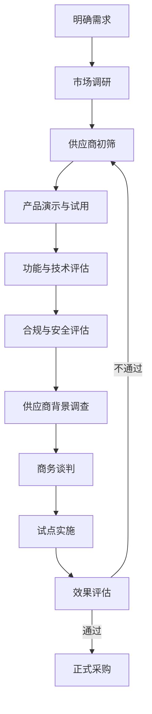
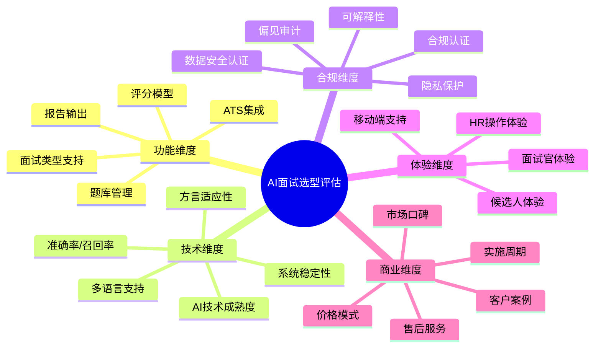
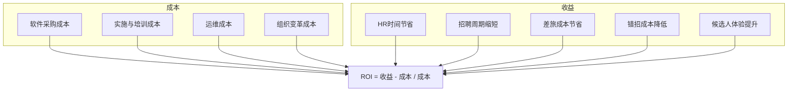
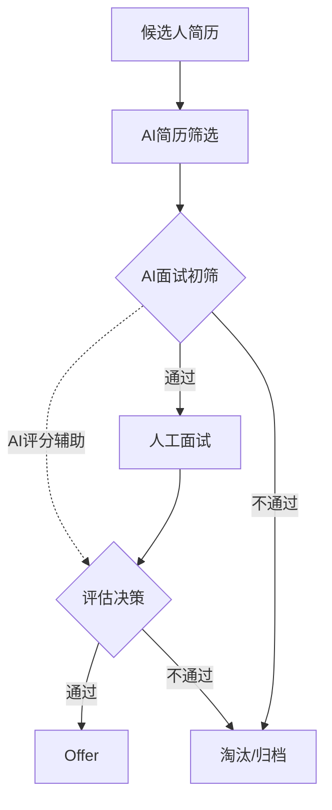

# 07 企业视角：AI面试的选型与实施

> [!abstract] 本章概要
> 本章从**企业HR/招聘负责人**的视角出发，讨论AI面试的选型与实施。内容包括：企业如何评估和选择AI面试产品（评估维度与框架）、AI面试的实施流程（试点→推广→优化）、AI面试的ROI计算、AI面试与人工面试的融合策略。**注意**：本章不重复 [[03-HR人事/招聘与面试体系/00_MOC_招聘与面试体系中枢]] 中传统面试设计方法论，而是聚焦AI面试特有的选型与实施问题。

---

## 一、AI面试产品选型框架

### 1.1 选型决策流程



### 1.2 选型评估的五大维度



---

## 二、选型评估维度详解

### 2.1 功能维度

| 评估项 | 关键问题 | 重要性 |
|--------|----------|--------|
| 面试类型 | 是否支持你需要的AI面试类型（视频/电话/笔试/游戏化）？ | 高 |
| 题库管理 | 是否提供题库？是否支持自定义题库？是否有行业题库？ | 高 |
| 评分模型 | 评分维度是否可配置？权重是否可调整？是否支持自定义评分标准？ | 高 |
| 报告输出 | 报告格式是否满足需求？是否支持多维度分析？是否支持导出？ | 中 |
| ATS集成 | 是否与企业现有ATS（招聘管理系统）集成？API是否完善？ | 高 |
| 面试管理 | 是否支持批量发送、进度追踪、结果管理？ | 中 |

### 2.2 技术维度

| 评估项 | 关键问题 | 重要性 |
|--------|----------|--------|
| AI技术成熟度 | 使用什么AI技术？是否有自主研发能力？ | 高 |
| 准确率/有效性 | AI面试评分与入职后绩效的相关性如何？是否有验证数据？ | 高 |
| 方言适应性 | 在中国场景下，是否支持不同方言/口音的识别？ | 高（中国） |
| 多语言支持 | 是否支持多语言面试？ | 中（跨国企业） |
| 系统稳定性 | 系统可用性（SLA）是多少？大并发下表现如何？ | 高 |
| 技术更新 | 是否有持续的技术迭代计划？ | 中 |

### 2.3 合规维度

> [!warning] 合规是AI面试选型的"一票否决"项

| 评估项 | 关键问题 | 重要性 |
|--------|----------|--------|
| 数据安全 | 是否通过ISO 27001/等保等安全认证？数据存储在哪里？ | 高 |
| 隐私保护 | 是否符合《个人信息保护法》？候选人数据如何管理？ | 高 |
| 偏见审计 | 是否做过独立的偏见审计？是否有审计报告？ | 高 |
| 可解释性 | 是否提供评分的解释？能否向候选人解释淘汰原因？ | 高 |
| 合规认证 | 是否通过相关行业或地区的合规认证？ | 高 |
| 数据删除 | 是否支持候选人数据删除请求？ | 中 |

> [!important] 中国场景的特别关注
> 1. **数据本地化**：数据存储必须在中国境内（或符合数据出境规定）
> 2. **个人信息保护法**：AI面试收集的语音、视频、面部表情等属于敏感个人信息
> 3. **等保要求**：系统需通过相应的等级保护认证
> 4. **算法备案**：关注AI面试是否需要算法备案的最新政策

### 2.4 体验维度

| 评估项 | 候选人视角 | HR视角 |
|--------|-----------|--------|
| 操作便捷性 | 面试流程简单吗？需要下载APP吗？ | 后台操作直观吗？学习成本高吗？ |
| 界面友好度 | 界面清晰吗？有引导说明吗？ | 数据看板一目了然吗？ |
| 移动端支持 | 支持手机面试吗？ | 支持手机审批吗？ |
| 反馈时效 | 面试后多久出结果？ | 结果推送及时吗？ |
| 帮助支持 | 面试中有问题怎么办？ | 遇到问题找谁解决？ |

### 2.5 商业维度

| 评估项 | 关键问题 |
|--------|----------|
| 价格模式 | 按人次、按年费、还是混合模式？ |
| 隐性成本 | 是否有实施费、培训费、定制费？ |
| 最小起订量 | 是否有最低购买量要求？ |
| 合同期限 | 最短合同期是多久？是否支持灵活调整？ |
| 售后服务 | 响应时间？是否有专属客户成功经理？ |
| 客户案例 | 同行业/同规模企业的使用案例？ |

---

## 三、AI面试的实施流程

### 3.1 实施三阶段模型

```mermaid
flowchart LR
    subgraph 阶段一：试点
        P1[选择试点岗位] --> P2[小范围试用]
        P2 --> P3[效果评估]
        P3 --> P4[优化调整]
    end
    
    subgraph 阶段二：推广
        S1[制定推广计划] --> S2[培训面试官和HR]
        S2 --> S3[逐步扩大范围]
        S3 --> S4[建立SOP]
    end
    
    subgraph 阶段三：优化
        O1[数据分析] --> O2[评分模型校准]
        O2 --> O3[流程优化]
        O3 --> O4[持续迭代]
    end
    
    P4 --> S1
    S4 --> O1
```

### 3.2 阶段一：试点（1-3个月）

**试点目标**：
- 验证AI面试在企业的适用性
- 评估AI面试的实际效果
- 发现并解决实施中的问题

**试点步骤**：

| 步骤 | 详细内容 | 时间 |
|------|----------|------|
| 选择试点岗位 | 选择标准化程度高、招聘量大的岗位（如校招管培生、客服等） | 第1周 |
| 小范围试用 | 50-200名候选人，AI面试+人工面试并行 | 第2-6周 |
| 效果评估 | 对比AI评分与人工评分的一致性、候选人体验反馈 | 第7-8周 |
| 优化调整 | 根据评估结果调整评分模型、题库、流程 | 第9-12周 |

**试点评估指标**：

| 指标 | 评估方法 | 目标值 |
|------|----------|--------|
| AI与人工评分一致性 | 相关系数 | >0.6 |
| 候选人通过率 | 统计 | 与人工面试相当 |
| 候选人体验NPS | 问卷调查 | >30 |
| 误淘汰率（假阴性） | 人工复核 | <10% |
| 系统稳定性 | 可用率 | >99.5% |

### 3.3 阶段二：推广（3-6个月）

**推广策略**：

| 推广方式 | 适用场景 | 优点 | 缺点 |
|----------|----------|------|------|
| 逐步推广 | 风险厌恶型企业 | 风险可控，逐步验证 | 周期长 |
| 全面推广 | 对AI面试信心充足 | 见效快 | 风险较高 |
| 按岗位推广 | 不同岗位差异大 | 灵活适配 | 管理复杂 |

**推广关键工作**：

1. **培训**：面试官和HR团队需要了解AI面试的评分逻辑和使用方法
2. **沟通**：向业务部门说明AI面试的价值和局限，管理预期
3. **SOP建立**：建立AI面试的标准操作流程，包括何时使用、如何使用、如何复用结果
4. **候选人告知**：在面试邀请中明确告知候选人将使用AI面试，提供必要的说明和指引

### 3.4 阶段三：优化（持续进行）

**优化方向**：

| 优化方向 | 具体措施 |
|----------|----------|
| 评分模型优化 | 根据入职后绩效数据，持续校准评分模型 |
| 题库优化 | 根据通过率和区分度，优化题库质量和难度 |
| 流程优化 | 根据HR和候选人反馈，优化面试流程 |
| 融合优化 | 优化AI面试与人工面试的衔接和分工 |
| 合规更新 | 跟进最新监管政策，确保合规 |

---

## 四、AI面试的ROI计算

### 4.1 ROI计算框架



### 4.2 ROI计算示例

**假设条件**：
- 企业年招聘量：2000人
- 校招初筛量：10000人
- 面试官时薪：200元/小时
- AI面试单价：30元/人

**成本计算**：

| 成本项目 | 计算方式 | 年度金额 |
|----------|----------|---------|
| AI面试软件费 | 10000人 x 30元 | 300,000元 |
| 实施与培训费 | 一次性投入 | 50,000元 |
| 运维成本 | 假设 | 30,000元 |
| **总成本** | | **380,000元** |

**收益计算**：

| 收益项目 | 计算方式 | 年度金额 |
|----------|----------|---------|
| HR时间节省 | 节省5000小时 x 200元 | 1,000,000元 |
| 招聘周期缩短 | 提前30天入职 x 人均产出 | 难以量化 |
| 差旅成本节省 | 减少现场面试1000人次 x 500元 | 500,000元 |
| 错招成本降低 | 假设降低2%错招率 | 难以量化 |
| **可量化收益** | | **1,500,000元+** |

**ROI**：
- 第一年ROI = (1,500,000 - 380,000) / 380,000 = **约295%**
- 第二年ROI（扣除一次性实施费）= (1,500,000 - 330,000) / 330,000 = **约355%**

> [!warning] ROI计算注意事项
> 1. 以上为简化计算，实际ROI因企业情况而异
> 2. 部分收益（如候选人体验提升、雇主品牌提升）难以量化
> 3. 错招成本的降低取决于基准错招率和AI面试的有效性
> 4. ROI会随使用规模扩大而提升（规模效应）

---

## 五、AI面试与人工面试的融合策略

### 5.1 融合模型



### 5.2 融合策略选择

| 策略 | 描述 | 适用场景 |
|------|------|---------|
| **AI前置+人工后置** | AI面试做初筛，通过者进入人工面试 | 大规模校招、标准化岗位 |
| **AI辅助+人工主导** | 人工面试为主，AI提供辅助评分 | 社招、中高端岗位 |
| **AI全程+人工抽检** | AI面试全程覆盖，人工抽检复核 | 蓝领大规模招聘 |
| **AI备用+人工常态** | 人工面试为常态，AI面试作为补充 | 招聘量小、岗位特殊 |

### 5.3 融合的关键原则

> [!important] 融合四原则
> 1. **AI做初筛，人做决策**：AI适合"筛掉不合适的人"，最终录用决策应由人做出
> 2. **AI提供数据，人提供判断**：AI提供客观评分数据，人结合经验和直觉做综合判断
> 3. **先标准化后个性化**：AI评估标准化维度，人评估个性化维度（如文化契合度）
> 4. **持续校准，而非一劳永逸**：定期对比AI评分与入职后绩效，持续优化

---

## 六、AI面试实施的常见坑与避坑指南

### 6.1 常见坑

| 坑 | 描述 | 避坑指南 |
|----|------|---------|
| 过度依赖AI | 将AI评分作为唯一决策依据 | 坚持"AI辅助+人工决策"原则 |
| 忽视合规 | 使用未经偏见审计的AI面试工具 | 将合规作为选型的"一票否决"项 |
| 忽视候选人体验 | 粗暴地让候选人"接受AI审判" | 提前告知、提供指引、建立申诉机制 |
| 一次配置永久使用 | 评分模型和题库长期不更新 | 建立定期评估和优化机制 |
| 忽视内部沟通 | 业务部门不信任AI面试结果 | 试点阶段就让业务部门参与评估 |
| 选型只看价格 | 选择最便宜的方案 | 综合评估功能、技术、合规、体验 |

### 6.2 实施成功的关键要素

1. **高层支持**：AI面试的实施需要高层推动，尤其是跨部门协作
2. **业务部门buy-in**：让业务部门参与试点和评估，建立信任
3. **充分的内部培训**：HR和面试官需要理解AI面试的工作原理和局限性
4. **透明的候选人沟通**：让候选人知道AI面试是什么、怎么评分、如何申诉
5. **持续的数据驱动优化**：用数据说话，持续改进

---

## 七、与已有知识库的关联

- [[03-HR人事/招聘与面试体系/04_面试设计方法论]] -- 传统面试设计方法论（AI面试的对比参照）
- [[03-HR人事/招聘与面试体系/08_AI如何改变招聘]] -- AI对招聘流程的整体影响
- [[03-HR人事/招聘与面试体系/07_招聘数据分析与效能衡量]] -- 招聘数据分析方法论
- [[03-HR人事/AI面试全解析/04_AI面试的类型对比：视频、电话、游戏化]] -- 不同类型AI面试的对比
- [[03-HR人事/AI面试全解析/05_AI面试的公平性争议]] -- 合规风险评估的参考
- [[02-AI趋势与素养/AI伦理与治理/07_企业AI伦理框架：从原则到落地]] -- 企业AI伦理框架

---

## 八、本章小结

> [!summary] 核心要点
> 1. AI面试选型需要从功能、技术、合规、体验、商业五个维度综合评估
> 2. 合规是选型的"一票否决"项——数据安全、隐私保护、偏见审计缺一不可
> 3. 实施应采用"试点→推广→优化"三阶段渐进式策略
> 4. AI面试的ROI通常显著为正，但需要结合企业实际情况计算
> 5. AI面试与人工面试的最佳关系是"AI初筛+人工决策"的融合模式
> 6. 避免过度依赖AI、忽视合规、忽视候选人体验等常见坑

**下一步阅读**：
- 想了解AI面试的未来趋势 → [[03-HR人事/AI面试全解析/08_AI面试的未来：从筛选到全流程]]
- 想了解不同类型的AI面试 → [[03-HR人事/AI面试全解析/04_AI面试的类型对比：视频、电话、游戏化]]
- 想了解AI面试的公平性争议 → [[03-HR人事/AI面试全解析/05_AI面试的公平性争议]]
- 返回中枢 → [[03-HR人事/AI面试全解析/00_MOC_AI面试全解析中枢]]