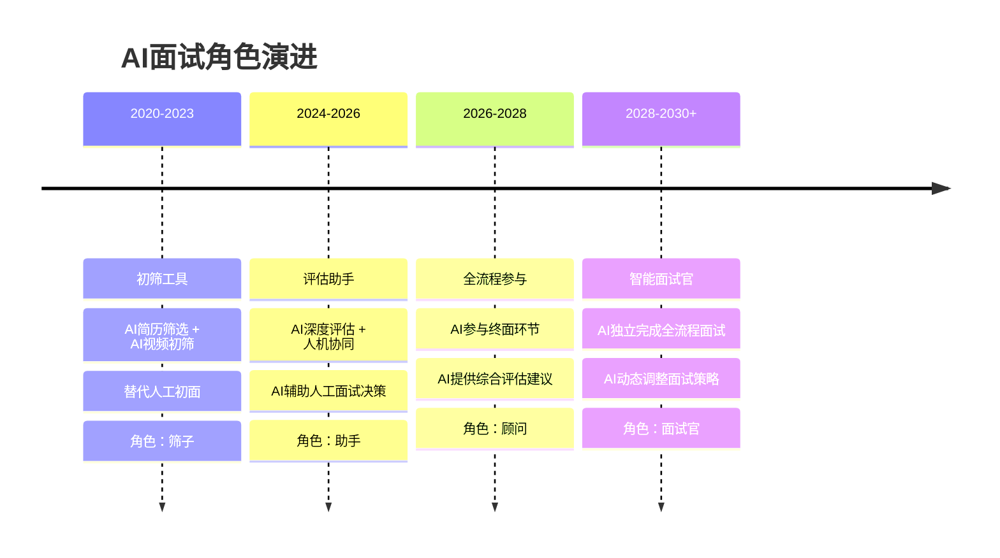
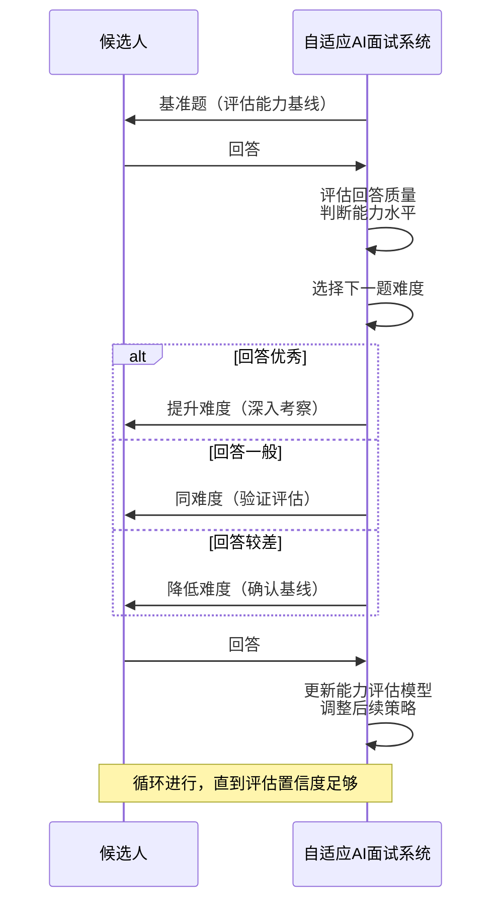
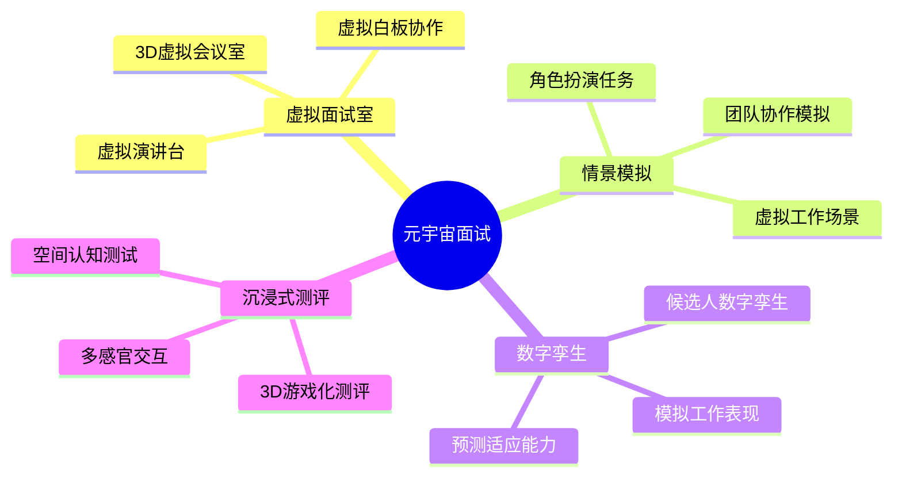
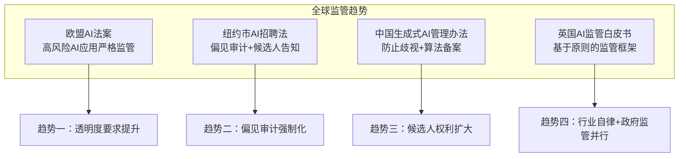
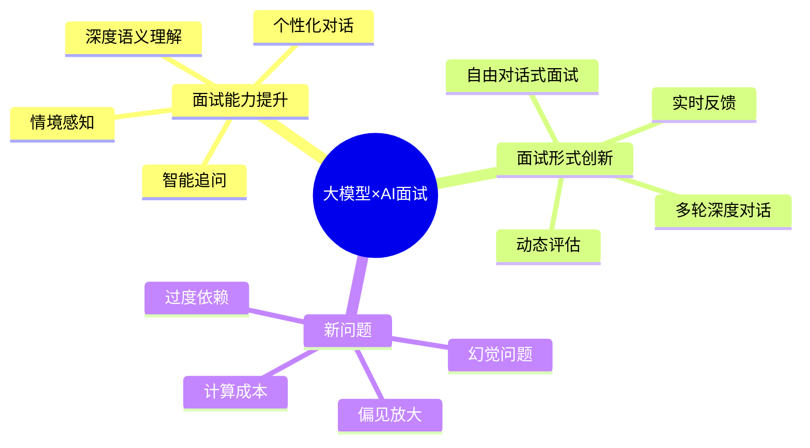
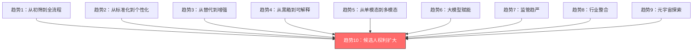

# 08 AI面试的未来：从筛选到全流程

> [!abstract] 本章概要
> 本章展望AI面试的**未来趋势**：AI面试从"初筛"到"终面"的演进路径、AI面试的个性化（适应候选人回答动态调整问题）、AI面试与元宇宙/数字孪生的融合、AI面试的伦理共识与监管趋势。本章旨在帮助读者建立对AI面试未来3-5年发展方向的前瞻性认知。

---

## 一、AI面试的演进路径：从筛子到面试官

### 1.1 AI面试的角色演进



### 1.2 各个阶段的特征

| 阶段 | 当前状态 | AI的角色 | 人的角色 | 关键技术 |
|------|----------|---------|---------|---------|
| 筛子 | 已实现 | 快速初筛，淘汰明显不匹配者 | 决策者 | NLP、ASR |
| 助手 | 进行中 | 提供深度评估数据 | 最终决策者 | 多模态AI、大模型 |
| 顾问 | 早期探索 | 提供综合评估和决策建议 | 复核者 | 强化学习、因果推理 |
| 面试官 | 概念阶段 | 独立完成全流程面试 | 监督者 | AGI、情感计算 |

> [!note] 关键洞察
> AI面试从"筛子"到"面试官"的演进，本质上是AI从"辅助工具"到"自主决策者"的角色转变。这一转变不仅是技术挑战，更是**信任挑战**——候选人、企业、监管机构能否接受AI做出最终的面试决策？

---

## 二、AI面试的个性化：从"一刀切"到"千人千面"

### 2.1 当前AI面试的"一刀切"问题

```mermaid
flowchart LR
    subgraph 当前模式：标准化
        A1[固定题库] --> A2[固定流程]
        A2 --> A3[固定评分标准]
        A3 --> A4[所有人面对同样的面试]
    end
    
    subgraph 未来模式：个性化
        B1[动态题库] --> B2[自适应流程]
        B2 --> B3[个性化评分标准]
        B3 --> B4[每个人面对量身定制的面试]
    end
```

### 2.2 个性化AI面试的四大方向

| 方向 | 描述 | 技术实现 | 价值 |
|------|------|----------|------|
| **自适应出题** | 根据候选人前面回答的表现，动态调整后续题目的难度和方向 | 强化学习 + 知识追踪 | 更精准地评估候选人能力边界 |
| **个性化追问** | 根据候选人的回答内容，进行深度追问 | 大模型 + 语义理解 | 深入挖掘候选人的真实能力 |
| **风格适配** | 根据候选人的沟通风格，调整面试节奏和语气 | 情感计算 + 对话策略 | 提升候选人体验 |
| **岗位定制** | 根据岗位特点和候选人背景，生成定制化面试方案 | 大模型 + 知识图谱 | 提高评估的针对性和准确性 |

### 2.3 自适应AI面试的工作原理



> [!tip] 自适应面试的优势
> 1. **更精准**：通过难度调整，精准定位候选人能力上下限
> 2. **更高效**：不需要大量题目，通过自适应策略用最少的题目获得最准确的评估
> 3. **体验更好**：候选人面对的题目难度适中，不会因太难或太简单而沮丧
> 4. **减少练习效应**：每次面试题目不同，减少"刷题"的优势

---

## 三、AI面试与元宇宙：沉浸式面试体验

### 3.1 元宇宙面试的概念

> [!note] 什么是元宇宙面试
> 元宇宙面试是指利用VR/AR/MR技术，在虚拟环境中创建沉浸式的面试场景。候选人通过虚拟化身（Avatar）与AI面试官或人类面试官在虚拟空间中互动，AI在后台分析候选人的行为数据。

### 3.2 元宇宙面试的可能形态



### 3.3 元宇宙面试的机遇与挑战

**机遇**：

| 机遇 | 说明 |
|------|------|
| 真实感增强 | 比2D视频面试更接近真实面试的沉浸感 |
| 情景模拟 | 可以在虚拟环境中模拟真实工作场景 |
| 行为数据丰富 | 3D空间中的行为数据比2D视频更丰富 |
| 打破地域限制 | 全球候选人可以"面对面"交流 |
| 雇主品牌增强 | 创新的面试形式提升雇主品牌形象 |

**挑战**：

| 挑战 | 说明 |
|------|------|
| 技术门槛 | VR设备成本高，普及率低 |
| 晕动症 | 部分候选人可能出现VR眩晕 |
| 数字鸿沟 | VR经验不同可能影响面试表现 |
| 隐私问题 | 3D空间中的行为数据更加敏感 |
| 公平性 | Avatar选择可能引入新的偏见 |
| 过度收集 | 元宇宙面试可能收集远超必要的候选人数据 |

> [!warning] 理性看待元宇宙面试
> 元宇宙面试是一个令人兴奋的概念，但在未来3-5年内，它更可能是一个**小众的补充选项**，而非主流面试形式。VR设备的普及率、技术成熟度、成本等因素决定了它短期内难以大规模应用。企业应将更多精力放在**提升现有AI面试的质量和公平性**上。

### 3.4 数字孪生在面试中的应用

> [!note] 数字孪生面试
> 数字孪生（Digital Twin）在面试领域的应用是指：基于候选人的面试数据、测评数据和行为数据，构建一个**虚拟的候选人模型**，用于模拟其在特定岗位上的表现。

**数字孪生的潜在应用**：

1. **岗位适配模拟**：将候选人的数字孪生放入虚拟工作场景，预测其表现
2. **团队匹配模拟**：将多个候选人的数字孪生组合，模拟团队协作效果
3. **发展路径预测**：基于数字孪生，预测候选人在企业内的成长路径
4. **个性化入职方案**：根据数字孪生的特点，制定个性化的入职和培训计划

> [!warning] 数字孪生的伦理风险
> 数字孪生面试面临严重的伦理挑战：
> 1. **数据边界**：构建数字孪生需要大量个人数据，边界在哪里？
> 2. **预测的准确性**：数字孪生对工作表现的预测有多准确？错误的预测可能剥夺候选人的机会
> 3. **"被定义"的风险**：数字孪生可能将候选人"锁定"在某个框架中，限制其发展可能性

---

## 四、AI面试的伦理共识与监管

### 4.1 监管趋势全景



### 4.2 未来AI面试的伦理共识

> [!important] 预计将形成的伦理共识

| 共识 | 内容 | 对AI面试的影响 |
|------|------|---------------|
| 知情同意 | 候选人必须被告知AI面试的使用，并同意 | 面试前必须明确告知，提供opt-out选项 |
| 可解释性 | AI评分必须能够解释 | 评分报告需要附带解释，不能只是数字 |
| 人工复核 | AI决定必须有人的参与 | 纯AI淘汰必须有人的复核 |
| 偏见审计 | AI面试系统必须定期接受独立审计 | 供应商需要提供审计报告 |
| 数据最小化 | 只收集面试所必需的数据 | 限制面部表情分析等争议功能 |
| 申诉权利 | 候选人有权对AI面试结果提出申诉 | 企业需要建立申诉处理机制 |

### 4.3 行业自律与标准

**正在形成的行业标准**：

| 标准/倡议 | 发起方 | 内容 |
|-----------|--------|------|
| AI招聘伦理准则 | 行业协会 | AI招聘的伦理原则和最佳实践 |
| AI面试产品认证 | 第三方认证机构 | 对AI面试产品进行公平性和有效性认证 |
| 候选人权利宣言 | 消费者权益组织 | AI面试中候选人应享有的权利 |
| 供应商行为准则 | 行业联盟 | AI面试供应商应遵守的行为准则 |

---

## 五、大模型对AI面试未来的影响

### 5.1 大模型带来的变革



### 5.2 大模型赋能的AI面试新场景

| 场景 | 描述 | 当前状态 |
|------|------|---------|
| 深度追问 | AI能根据回答内容进行3-5轮深度追问 | 实验阶段 |
| 自由对话 | 不再局限于固定问题，进行自由对话 | 早期探索 |
| 实时反馈 | 面试结束时立即生成详细的评估报告 | 部分实现 |
| 多语言面试 | 实时翻译，支持跨语言面试 | 接近成熟 |
| 面试教练 | AI为候选人提供面试后的改进建议 | 部分实现 |

> [!warning] 大模型的"幻觉"风险
> 大模型（LLM）的"幻觉"问题——即AI编造不存在的信息——在面试场景中尤其危险。如果AI面试官基于"幻觉"对候选人做出错误判断，后果可能非常严重。因此，**大模型在AI面试中的应用需要额外的安全机制和人工监督**。

---

## 六、AI面试未来3-5年的关键趋势总结

### 6.1 十大趋势



| 趋势 | 描述 | 时间线 |
|------|------|--------|
| 1. 从初筛到全流程 | AI面试从初筛环节扩展到全流程 | 2026-2028 |
| 2. 从标准化到个性化 | 自适应面试成为主流 | 2026-2029 |
| 3. 从替代到增强 | AI从"替代人"转变为"增强人" | 2025-2027 |
| 4. 从黑箱到可解释 | 可解释AI成为标配 | 2025-2028 |
| 5. 从单模态到多模态 | 多模态融合更深入 | 2025-2027 |
| 6. 大模型赋能 | 大模型深度融入AI面试 | 2025-2027 |
| 7. 监管趋严 | 全球AI面试监管政策密集出台 | 2025-2028 |
| 8. 行业整合 | AI面试市场兼并整合 | 2026-2028 |
| 9. 元宇宙探索 | 元宇宙面试从小众到成长 | 2027-2030 |
| 10. 候选人权利扩大 | 候选人知情权、申诉权得到保障 | 2025-2028 |

### 6.2 对企业和候选人的启示

**对企业的启示**：

1. **提前布局合规**：在监管政策出台前，主动建立AI面试的合规体系
2. **投资AI+人融合**：不要幻想AI完全替代人，投资于人机协同能力
3. **关注候选人体验**：在效率提升的同时，保持对候选人体验的关注
4. **持续学习更新**：AI面试技术迭代快，需要持续关注和学习

**对候选人的启示**：

1. **AI面试素养**：AI面试将成为求职的基本技能，尽早建立AI面试素养
2. **保持真实**：随着AI面试的个性化发展，"表演"的空间越来越小
3. **持续学习**：AI面试形式不断变化，持续学习应对策略
4. **了解权利**：了解自己在AI面试中的权利，包括知情权、申诉权等

---

## 七、与已有知识库的关联

- [[02-AI趋势与素养/AI伦理与治理/06_全球AI监管政策对比]] -- 全球AI监管政策全景
- [[02-AI趋势与素养/AI伦理与治理/07_企业AI伦理框架：从原则到落地]] -- 企业AI伦理落地框架
- [[02-AI趋势与素养/AI应用发展阶段演进/00_MOC_AI应用发展阶段演进中枢]] -- AI应用成熟度演进框架
- [[02-AI趋势与素养/人机协作阶段演进/00_MOC_人机协作阶段演进中枢]] -- 人机协作模式演进
- [[02-AI趋势与素养/AI时代能力要求/05_AI素养：新时代的基础能力]] -- AI素养作为新基础能力
- [[03-HR人事/AI面试全解析/01_AI面试全景：从概念到现状]] -- 回到AI面试的现状，看到未来差距

---

## 八、本章小结

> [!summary] 核心要点
> 1. AI面试正在从"筛子"向"面试官"演进，但这一过程需要很长时间
> 2. 个性化/自适应AI面试是下一个重要方向，大模型将加速这一趋势
> 3. 元宇宙面试概念令人兴奋，但短期内难以大规模应用
> 4. 监管趋严是大势所趋，企业应提前布局合规
> 5. 可解释AI和候选人权利保障将成为行业标配
> 6. AI面试的未来不是"AI替代人"，而是"AI增强人"
> 7. 对候选人来说，AI面试素养将成为求职的基本技能

**返回中枢** → [[03-HR人事/AI面试全解析/00_MOC_AI面试全解析中枢]]

**全系列回顾**：
1. [[03-HR人事/AI面试全解析/01_AI面试全景：从概念到现状]] -- 了解AI面试的基本概念和市场现状
2. [[03-HR人事/AI面试全解析/02_AI面试的技术栈：NLP、语音、视觉的融合]] -- 理解AI面试的技术原理
3. [[03-HR人事/AI面试全解析/03_AI面试的评分模型：AI如何评价候选人]] -- 深入AI面试的评分机制
4. [[03-HR人事/AI面试全解析/04_AI面试的类型对比：视频、电话、游戏化]] -- 对比不同类型AI面试
5. [[03-HR人事/AI面试全解析/05_AI面试的公平性争议]] -- 审视AI面试的公平性问题
6. [[03-HR人事/AI面试全解析/06_候选人视角：如何应对AI面试]] -- 掌握应对AI面试的实操策略
7. [[03-HR人事/AI面试全解析/07_企业视角：AI面试的选型与实施]] -- 了解企业如何选择和实施AI面试
8. 08_AI面试的未来：从筛选到全流程 -- 展望AI面试的未来（本文）