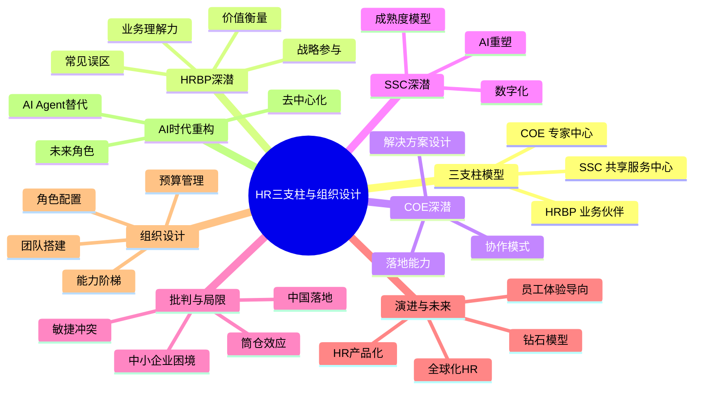
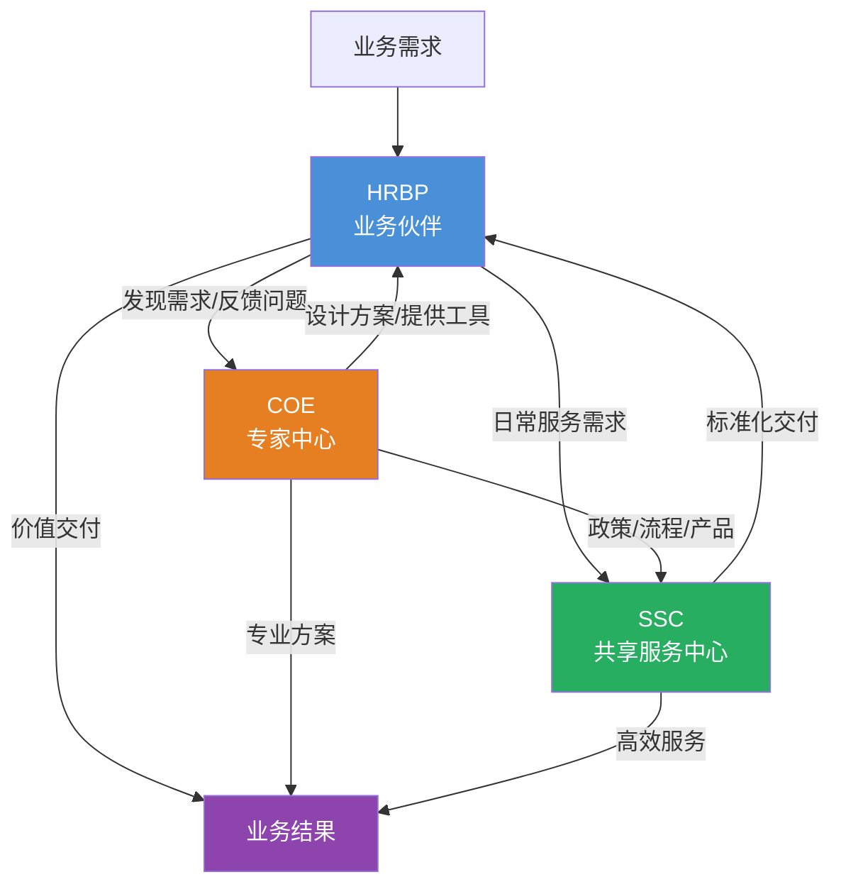
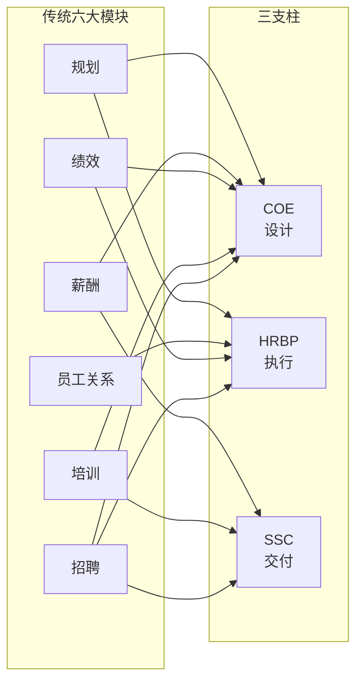
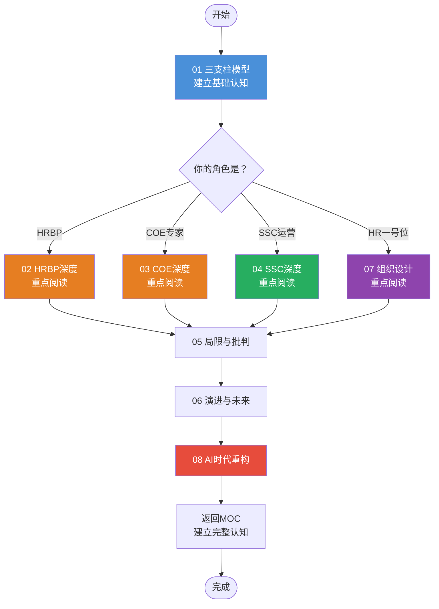

# HR三支柱与组织设计 知识中枢

> [!abstract] 核心定位
> 本知识库聚焦 **HR部门自身的组织设计**：HR三支柱模型（COE/HRBP/SSC）的起源、运作、局限与未来演进。区别于 [[02-AI趋势与素养/AI Native组织变革/00_MOC_AI Native组织变革中枢]]（讲AI时代组织如何变革）和 [[03-HR人事/培训与人才发展/培训与人才发展_知识库建设方案]]（讲培训体系设计），本知识库的独特视角是：**HR部门如何设计自己**。

---

## 一、知识库地图

---

## 二、文档索引

| 编号 | 文档名称 | 核心问题 | 阅读建议 |
|------|----------|----------|----------|
| 01 | [[03-HR人事/HR三支柱与组织设计/01_HR三支柱模型：COE、HRBP、SSC]] | 三支柱是什么？从哪里来？ | 入门必读，建立基础认知 |
| 02 | [[03-HR人事/HR三支柱与组织设计/02_HRBP深度：如何真正懂业务|02_HRBP深度：如何真正"懂业务"]] | HRBP如何成为真正的业务伙伴？ | 实践导向，HRBP岗位必读 |
| 03 | [[03-HR人事/HR三支柱与组织设计/03_COE深度：从专家到解决方案设计师]] | COE如何设计可落地的方案？ | 专家型HR角色必读 |
| 04 | [[03-HR人事/HR三支柱与组织设计/04_SSC深度：从服务交付到体验设计]] | SSC如何从成本中心到价值中心？ | 运营型HR角色必读 |
| 05 | [[03-HR人事/HR三支柱与组织设计/05_三支柱的局限与批判]] | 三支柱有什么问题？什么场景不适用？ | 批判性思维，避免盲目崇拜 |
| 06 | [[03-HR人事/HR三支柱与组织设计/06_三支柱的演进：从Ulrich模型到未来]] | 三支柱的下一步是什么？ | 前瞻性思考，战略规划参考 |
| 07 | [[03-HR人事/HR三支柱与组织设计/07_HR组织设计：如何搭建一个HR团队]] | 不同规模企业如何设计HR团队？ | 实操手册，HR一号位必读 |
| 08 | [[03-HR人事/HR三支柱与组织设计/08_AI时代的HR组织重构]] | AI如何改变HR部门自身？ | 未来视角，数字化转型参考 |

---

## 三、核心概念速览

### 3.1 三支柱的三角关系

> [!tip] 一句话理解三支柱
> **HRBP** 在前线发现问题、理解需求；**COE** 在后方设计方案、制定政策；**SSC** 在中间执行交付、保证效率。三者互为支撑，缺一不可。

### 3.2 与传统六大模块的关系

> [!important] 关键区别
> 传统六大模块是**按职能纵向切分**，三支柱是**按角色横向切分**。前者关注"HR做什么"，后者关注"HR为谁创造什么价值"。

---

## 四、学习路径

### 路径一：快速入门（2-3小时）
1. 阅读 [[03-HR人事/HR三支柱与组织设计/01_HR三支柱模型：COE、HRBP、SSC]] 建立基础认知
2. 阅读 [[03-HR人事/HR三支柱与组织设计/07_HR组织设计：如何搭建一个HR团队]] 获得实操视角
3. 浏览 [[03-HR人事/HR三支柱与组织设计/05_三支柱的局限与批判]] 建立批判意识

### 路径二：深度实践（1-2周）
1. 完整阅读 01-04（三支柱+各支柱深度）
2. 对照自身组织，完成 [[03-HR人事/HR三支柱与组织设计/07_HR组织设计：如何搭建一个HR团队]] 中的自检清单
3. 阅读 [[03-HR人事/HR三支柱与组织设计/05_三支柱的局限与批判]] 和 [[03-HR人事/HR三支柱与组织设计/06_三支柱的演进：从Ulrich模型到未来]]
4. 思考 [[03-HR人事/HR三支柱与组织设计/08_AI时代的HR组织重构]] 对自身组织的启示

### 路径三：战略规划（2-4周）
1. 完整阅读全部8篇文档
2. 横向对比 [[02-AI趋势与素养/AI Native组织变革/00_MOC_AI Native组织变革中枢]] 的组织变革方法论
3. 结合 [[03-HR人事/培训与人才发展/培训与人才发展_知识库建设方案]] 的人才培养体系
4. 关联 [[03-HR人事/绩效管理/00_MOC_绩效管理中枢]] 和 [[03-HR人事/招聘与面试体系/00_MOC_招聘与面试体系中枢]] 的配套机制
5. 输出本组织的HR组织设计蓝图

---

## 五、关键概念词汇表

| 术语 | 英文 | 定义 | 详见 |
|------|------|------|------|
| COE | Center of Excellence | 专家中心，负责HR政策、方案、工具的设计 | [[03-HR人事/HR三支柱与组织设计/01_HR三支柱模型：COE、HRBP、SSC]] |
| HRBP | HR Business Partner | 业务伙伴，深入业务部门提供HR解决方案 | [[03-HR人事/HR三支柱与组织设计/02_HRBP深度：如何真正懂业务]] |
| SSC | Shared Service Center | 共享服务中心，标准化、规模化交付HR服务 | [[03-HR人事/HR三支柱与组织设计/04_SSC深度：从服务交付到体验设计]] |
| Ulrich Model | Ulrich Model | Dave Ulrich提出的HR四角色/三支柱模型 | [[03-HR人事/HR三支柱与组织设计/01_HR三支柱模型：COE、HRBP、SSC]] |
| 钻石模型 | Diamond Model | 三支柱的演进形态，强调四角色交互 | [[03-HR人事/HR三支柱与组织设计/06_三支柱的演进：从Ulrich模型到未来]] |
| 筒仓效应 | Silo Effect | 三支柱各自为政、缺乏协作的问题 | [[03-HR人事/HR三支柱与组织设计/05_三支柱的局限与批判]] |
| SLA | Service Level Agreement | 服务等级协议，SSC的核心管理工具 | [[03-HR人事/HR三支柱与组织设计/04_SSC深度：从服务交付到体验设计]] |
| AI Agent | AI Agent | 人工智能代理，可替代部分HR职能 | [[03-HR人事/HR三支柱与组织设计/08_AI时代的HR组织重构]] |
| 员工体验 | Employee Experience | 以员工感受为中心的设计理念 | [[03-HR人事/HR三支柱与组织设计/06_三支柱的演进：从Ulrich模型到未来]] |

---

## 六、跨库关联

### 核心关联
- [[02-AI趋势与素养/AI Native组织变革/00_MOC_AI Native组织变革中枢]]：AI时代组织层面的变革范式，本库聚焦HR部门自身的变革
- [[03-HR人事/培训与人才发展/培训与人才发展_知识库建设方案]]：人才培养体系，与COE的方案设计能力高度相关
- [[03-HR人事/绩效管理/00_MOC_绩效管理中枢]]：绩效体系设计，是HRBP参与业务决策的核心抓手之一
- [[03-HR人事/招聘与面试体系/00_MOC_招聘与面试体系中枢]]：人才获取体系，与SSC的招聘运营、COE的招聘策略相关

### 战略关联
- 组织设计方法论（待建设）：组织架构设计的通用方法论
- 变革管理（待建设）：HR组织转型的变革管理框架
- HR数字化（待建设）：HR数字化转型的技术路线图

---

## 七、核心观点提炼

### 7.1 三支柱的本质

> [!quote] 核心洞察
> 三支柱不是一种"组织架构"，而是一种"价值交付模式"。它回答的核心问题是：**HR如何有组织地创造业务价值**？

三支柱将HR的工作分为三个价值层次：
- **COE**：创造专业价值（设计好的方案）
- **HRBP**：创造业务价值（把方案变成业务结果）
- **SSC**：创造效率价值（用最低成本交付标准服务）

### 7.2 HRBP的"真懂业务"

> [!warning] 常见误解
> "坐在业务部门"不等于"懂业务"。真正的HRBP需要具备业务语言能力、业务诊断能力、业务解决方案设计能力。

详见 [[03-HR人事/HR三支柱与组织设计/02_HRBP深度：如何真正懂业务]]。

### 7.3 三支柱的适用边界

> [!danger] 不要盲目套用
> 三支柱不是万能药。中小企业、敏捷组织、中国本土企业都有其独特的适用性问题。

详见 [[03-HR人事/HR三支柱与组织设计/05_三支柱的局限与批判]]。

### 7.4 AI时代的范式转移

> [!tip] 前瞻判断
> AI不是"替代HR"，而是"重构HR的工作方式"。未来的HR组织将呈现"AI Agent + 人类专家"的混合形态。

详见 [[03-HR人事/HR三支柱与组织设计/08_AI时代的HR组织重构]]。

---

## 八、常见问题速查

### Q1：我们公司只有50人，需要三支柱吗？
**不需要**。50人的公司不需要也不应该搭建三支柱。详见 [[03-HR人事/HR三支柱与组织设计/07_HR组织设计：如何搭建一个HR团队]] 中关于初创企业的HR团队设计，以及 [[03-HR人事/HR三支柱与组织设计/05_三支柱的局限与批判]] 中关于中小企业困境的讨论。

### Q2：HRBP和传统的HR经理有什么区别？
传统HR经理是"HR职能在业务部门的代表"，HRBP是"业务问题的HR解决方案提供者"。详见 [[03-HR人事/HR三支柱与组织设计/02_HRBP深度：如何真正懂业务]]。

### Q3：COE和外部咨询顾问有什么区别？
COE是"内部专家"，需要具备方案落地和持续运营的能力，而不仅仅是提供建议。详见 [[03-HR人事/HR三支柱与组织设计/03_COE深度：从专家到解决方案设计师]]。

### Q4：SSC就是"把HR事务集中处理"吗？
这是SSC的初级阶段。高级阶段的SSC是"卓越服务中心"，关注体验设计、流程优化和智能化。详见 [[03-HR人事/HR三支柱与组织设计/04_SSC深度：从服务交付到体验设计]]。

### Q5：AI会替代HRBP吗？
AI会替代HRBP的**信息收集和数据分析**工作，但不会替代**关系建立、信任构建和战略判断**。详见 [[03-HR人事/HR三支柱与组织设计/08_AI时代的HR组织重构]]。

### Q6：三支柱在中国落地最大的问题是什么？
三支柱在中国落地的核心问题是：**HRBP的定位不清**（沦为业务助理）、**COE的能力不足**（方案脱离实际）、**SSC的投入不够**（沦为"打杂中心"）。详见 [[03-HR人事/HR三支柱与组织设计/05_三支柱的局限与批判]]。

---

## 九、阅读进度追踪

- [ ] [[03-HR人事/HR三支柱与组织设计/01_HR三支柱模型：COE、HRBP、SSC]] — 建立基础认知
- [ ] [[03-HR人事/HR三支柱与组织设计/02_HRBP深度：如何真正懂业务]] — 理解HRBP角色
- [ ] [[03-HR人事/HR三支柱与组织设计/03_COE深度：从专家到解决方案设计师]] — 理解COE角色
- [ ] [[03-HR人事/HR三支柱与组织设计/04_SSC深度：从服务交付到体验设计]] — 理解SSC角色
- [ ] [[03-HR人事/HR三支柱与组织设计/05_三支柱的局限与批判]] — 建立批判意识
- [ ] [[03-HR人事/HR三支柱与组织设计/06_三支柱的演进：从Ulrich模型到未来]] — 了解演进方向
- [ ] [[03-HR人事/HR三支柱与组织设计/07_HR组织设计：如何搭建一个HR团队]] — 获得实操能力
- [ ] [[03-HR人事/HR三支柱与组织设计/08_AI时代的HR组织重构]] — 把握未来趋势

---

## 十、推荐阅读顺序

---

## 十一、本知识库的设计原则

1. **战略+HR+AI视角**：每一篇文档都尝试从战略高度、HR专业深度和AI技术趋势三个维度交叉分析。

2. **差异定位**：不与 [[02-AI趋势与素养/AI Native组织变革/00_MOC_AI Native组织变革中枢]] 和 [[03-HR人事/培训与人才发展/培训与人才发展_知识库建设方案]] 重复，聚焦HR部门自身的组织设计。

3. **批判性思维**：不盲目鼓吹三支柱，专门设置 [[03-HR人事/HR三支柱与组织设计/05_三支柱的局限与批判]] 进行批判性讨论。

4. **实操导向**：每篇文档都包含具体的工具、模型、自检清单，避免纯理论空谈。

5. **双向链接**：所有文档通过 `[[ ]]` 双向链接形成知识网络，支持Obsidian的图谱浏览。

---

## 十二、版本与更新

| 日期 | 版本 | 更新内容 |
|------|------|----------|
| 2026-07-27 | v1.0 | 初始版本，完成8篇内容文档 + 1篇MOC中枢 |

---

> [!quote] 戴夫·尤里奇（Dave Ulrich）
> "HR的价值不在于它做了什么，而在于它创造了什么。"

---

*返回：[[03-HR人事/HR三支柱与组织设计/00_MOC_HR三支柱与组织设计中枢]]*