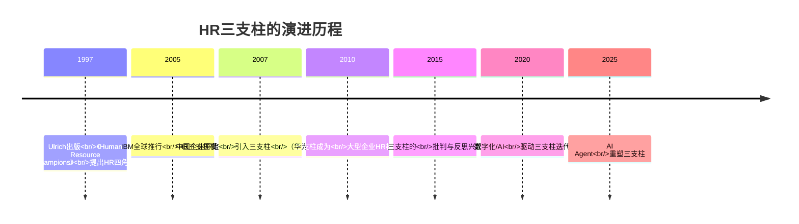
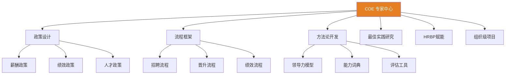
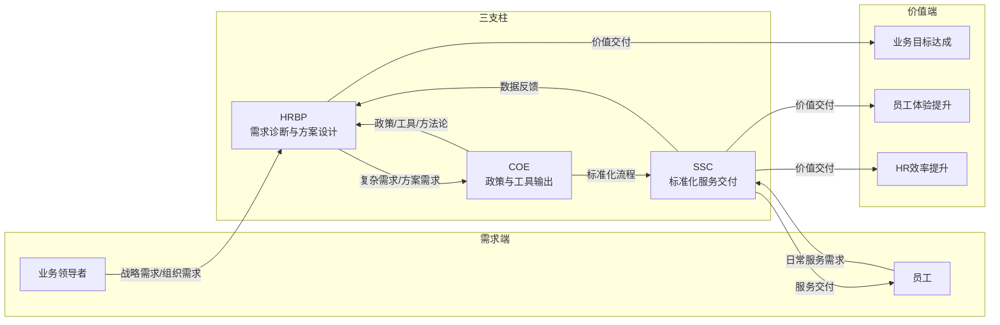
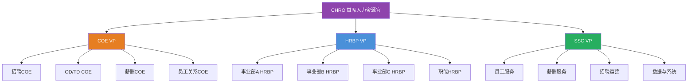
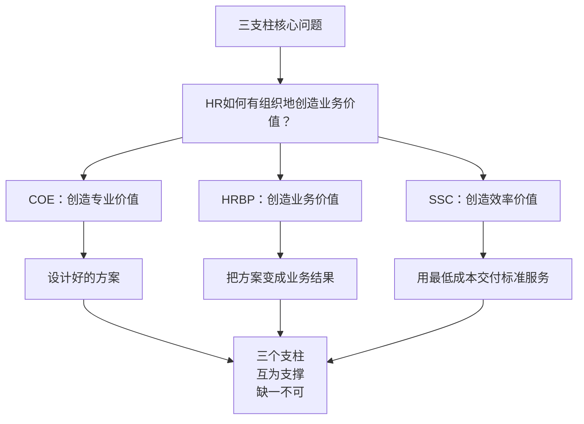

# HR三支柱模型：COE、HRBP、SSC

> [!abstract] 一句话总结
> HR三支柱模型是Dave Ulrich在1997年提出的HR组织运作模式，将HR职能重新划分为三个角色：COE（专家中心）、HRBP（业务伙伴）和SSC（共享服务中心），目的是让HR从"行政事务型"转向"业务价值型"。

---

## 一、三支柱的起源：Dave Ulrich的HR转型

### 1.1 历史背景

在1990年代之前，HR部门的主流模式是"六大模块"（招聘、培训、绩效、薪酬、员工关系、人力资源规划）。这种模式的问题是：

- **事务性工作占比过高**：HR 80%的时间花在行政事务上
- **与业务脱节**：HR不了解业务在做什么、需要什么
- **响应速度慢**：所有HR决策都需要层层上报
- **价值难以衡量**：HR的工作成果与业务结果之间缺乏直接关联

1997年，密歇根大学教授戴夫·尤里奇（Dave Ulrich）在《Human Resource Champions》一书中提出了HR四角色模型，随后演化为今天广为人知的**HR三支柱模型**。

### 1.2 Ulrich的核心思想

> [!quote] Dave Ulrich的核心命题
> "HR的价值不在于它做了什么（activities），而在于它创造了什么（outcomes）。"

Ulrich认为，HR不应该以"职能活动"来定义自己（如"我负责招聘"），而应该以"创造的价值"来定义自己（如"我帮助业务获得合适的人才以实现战略目标"）。

他将HR的角色重新定义为四个维度：

| 角色 | 焦点 | 关键产出 | 在三支柱中的对应 |
|------|------|----------|------------------|
| 战略伙伴（Strategic Partner） | 战略执行 | 战略与HR的对齐 | COE + HRBP |
| 变革推动者（Change Agent） | 组织变革 | 变革能力建设 | HRBP |
| 员工支持者（Employee Champion） | 员工承诺 | 员工敬业度 | HRBP + SSC |
| 行政专家（Administrative Expert） | 流程效率 | 高效的基础设施 | SSC |

---

## 二、三支柱的核心定位

### 2.1 COE（Center of Excellence）—— 专家中心

**核心定位**：HR领域的"研发中心"和"政策制定者"。

COE的职责包括：
- 设计HR战略、政策和流程框架
- 开发HR工具和方法论（如绩效评估体系、薪酬架构、领导力模型）
- 研究外部最佳实践并将其内部化
- 为HRBP提供专业支持和赋能
- 管理和优化组织层面的HR项目（如管培生计划、领导力发展项目）

> [!tip] COE的典型配置
> 一个COE专家通常覆盖1-2个专业领域（如薪酬COE、OD COE），服务全公司范围内的HRBP和业务部门。

### 2.2 HRBP（HR Business Partner）—— 业务伙伴

**核心定位**：HR战略在业务一线的"落地执行者"和"业务诊断者"。

HRBP的职责包括：
- 深入理解业务战略、业务模式和业务痛点
- 将业务需求翻译为HR解决方案
- 推动COE设计的政策和方案在业务部门的落地
- 作为业务领导者的"HR顾问"，提供人才和组织方面的建议
- 识别业务部门的组织健康问题并推动解决

> [!important] 关键区分
> HRBP不是"坐在业务部门的HR"，而是"用HR专业解决业务问题的人"。两者的核心区别在于：前者是物理位置的迁移，后者是思维方式的转变。

### 2.3 SSC（Shared Service Center）—— 共享服务中心

**核心定位**：HR基础服务的"标准化交付平台"和"效率引擎"。

SSC的职责包括：
- 标准化、规模化地交付HR基础服务（入离职、薪酬发放、社保公积金、证明开具等）
- 管理员工咨询和自助服务平台
- 持续优化HR流程，提升服务效率和员工体验
- 积累和沉淀HR数据，为COE和HRBP提供决策支持
- 推动HR数字化转型（RPA、AI Agent等）

---

## 三、三支柱的运作逻辑

### 3.1 核心运作流程

### 3.2 三支柱的分工逻辑

| 决策维度 | COE | HRBP | SSC |
|----------|-----|------|-----|
| 战略vs战术 | 战略为主 | 战略+战术 | 战术为主 |
| 设计vs执行 | 设计为主 | 执行为主 | 执行为主 |
| 标准化vs定制化 | 标准化 | 定制化 | 标准化 |
| 前瞻vs响应 | 前瞻 | 响应 | 响应 |
| 项目vs运营 | 项目 | 项目+运营 | 运营 |

### 3.3 一颗"HR服务的树"比喻

> [!tip] 形象比喻
> - **COE** 是树根，负责吸收养分（外部最佳实践），提供体系化的养分（方案/政策/工具）
> - **HRBP** 是树干和树枝，负责将养分输送到各个业务部门（叶片），并根据不同叶片的需求调整输送方式
> - **SSC** 是树叶的光合作用工厂，负责高效、标准化地完成大量的基础服务交付

---

## 四、三支柱与传统六大模块的对应关系

### 4.1 对应关系矩阵

| 传统六大模块 | COE（设计） | HRBP（执行/落地） | SSC（交付） |
|--------------|-------------|-------------------|-------------|
| **招聘** | 招聘策略、雇主品牌、评估工具设计 | 业务部门招聘需求诊断、面试参与 | 简历筛选、面试安排、offer发放 |
| **培训与发展** | 培训体系设计、领导力模型、课程开发 | 培训需求诊断、培训效果跟踪 | 培训组织、学习平台运营 |
| **绩效管理** | 绩效体系设计、评估方法论 | 绩效面谈辅导、绩效校准主持 | 绩效系统运营、数据管理 |
| **薪酬福利** | 薪酬架构、激励方案、福利策略 | 薪酬决策建议、激励方案定制 | 薪酬核算、社保公积金、福利发放 |
| **员工关系** | 员工关系政策、劳动关系策略 | 员工沟通、冲突调解、文化建设 | 入离职手续、证明开具 |
| **人力资源规划** | 人力规划方法论、组织设计 | 业务部门人力规划、编制管理 | 人力数据报表、系统维护 |

### 4.2 关键变化

> [!important] 从六大模块到三支柱的核心转变
> 1. **从"职能导向"到"价值导向"**：不再以HR的职能活动来组织团队，而是以创造的价值来组织团队
> 2. **从"纵向分割"到"横向分层"**：不再按招聘/培训/绩效纵向切分，而是按设计/执行/交付横向分层
> 3. **从"等需求上门"到"主动出击"**：HRBP主动深入业务，COE主动研究前瞻方案
> 4. **从"经验驱动"到"数据驱动"**：SSC积累大量数据，为COE和HRBP的决策提供支撑

---

## 五、三支柱的典型组织架构

### 5.1 大型企业三支柱架构

### 5.2 人员配比参考

| 企业规模 | HRBP:员工比 | COE:总HR比 | SSC:总HR比 |
|----------|-------------|------------|------------|
| 1000人以下 | 1:150-200 | 10-15% | 30-40% |
| 1000-5000人 | 1:200-300 | 15-20% | 40-50% |
| 5000-10000人 | 1:300-400 | 15-20% | 45-55% |
| 10000人以上 | 1:400-500 | 15-25% | 50-60% |

> [!warning] 注意
> 以上配比为行业参考值，实际配置需根据企业业务复杂度、地域分布、HR成熟度等因素调整。

---

## 六、三支柱的落地条件

### 6.1 组织条件

- **企业规模**：通常建议500人以上再考虑引入三支柱
- **业务复杂度**：多业务线、多地域的组织更需要三支柱
- **HR成熟度**：HR团队需要具备一定的专业能力和战略思维
- **领导支持**：CEO/业务领导者需要理解和支持三支柱模式

### 6.2 技术条件

- **HR信息系统**：需要有统一的HRIS作为数据基础
- **自助服务平台**：员工和管理者可以通过自助平台完成基础操作
- **数据分析能力**：能够基于数据进行决策而非经验判断

### 6.3 能力条件

- **COE**：需要具备深厚专业知识和方案设计能力
- **HRBP**：需要具备业务理解力、咨询能力和影响力
- **SSC**：需要具备流程管理、服务意识和数字化能力

---

## 七、三支柱的常见误解

> [!danger] 误解一：三支柱是一种"组织架构"
> 三支柱不是一种组织架构图，而是一种**价值交付模式**。你可以有三支柱的运作逻辑，但不一定要把组织画成三个部门。

> [!danger] 误解二：设了HRBP的岗位就是三支柱
> 很多企业只是把HR的title从"HR经理"改成"HRBP"，但工作内容、思维方式、能力要求没有任何变化。这不是三支柱，这是"换汤不换药"。

> [!danger] 误解三：三支柱适合所有企业
> 三支柱有明确的适用边界。初创企业、中小企业、业务单一的企业可能不需要也不适合三支柱。详见 [[03-HR人事/HR三支柱与组织设计/05_三支柱的局限与批判]]。

> [!danger] 误解四：三支柱是"终极解"
> 三支柱是1997年的产物，组织形态和HR技术已经发生了巨大变化。详见 [[03-HR人事/HR三支柱与组织设计/06_三支柱的演进：从Ulrich模型到未来]]。

---

## 八、总结与关键要点

> [!summary] 核心要点
> 1. 三支柱由Dave Ulrich于1997年提出，核心思想是"HR的价值在于它创造了什么，而非它做了什么"
> 2. COE是"专家中心"，负责设计；HRBP是"业务伙伴"，负责落地；SSC是"共享服务中心"，负责交付
> 3. 三支柱不是一种组织架构，而是一种价值交付模式
> 4. 引入三支柱需要满足组织、技术、能力三个方面的条件
> 5. 三支柱有其适用边界和局限，不可盲目套用

---

## 九、延伸阅读

- [[03-HR人事/HR三支柱与组织设计/02_HRBP深度：如何真正懂业务]] — 深入理解HRBP角色
- [[03-HR人事/HR三支柱与组织设计/03_COE深度：从专家到解决方案设计师]] — 深入理解COE角色
- [[03-HR人事/HR三支柱与组织设计/04_SSC深度：从服务交付到体验设计]] — 深入理解SSC角色
- [[03-HR人事/HR三支柱与组织设计/05_三支柱的局限与批判]] — 辩证看待三支柱
- [[03-HR人事/HR三支柱与组织设计/06_三支柱的演进：从Ulrich模型到未来]] — 了解三支柱的演进方向
- [[03-HR人事/HR三支柱与组织设计/07_HR组织设计：如何搭建一个HR团队]] — 实际操作指南
- [[02-AI趋势与素养/AI Native组织变革/00_MOC_AI Native组织变革中枢]] — 组织层面的变革范式

---

*返回：[[03-HR人事/HR三支柱与组织设计/00_MOC_HR三支柱与组织设计中枢]]*