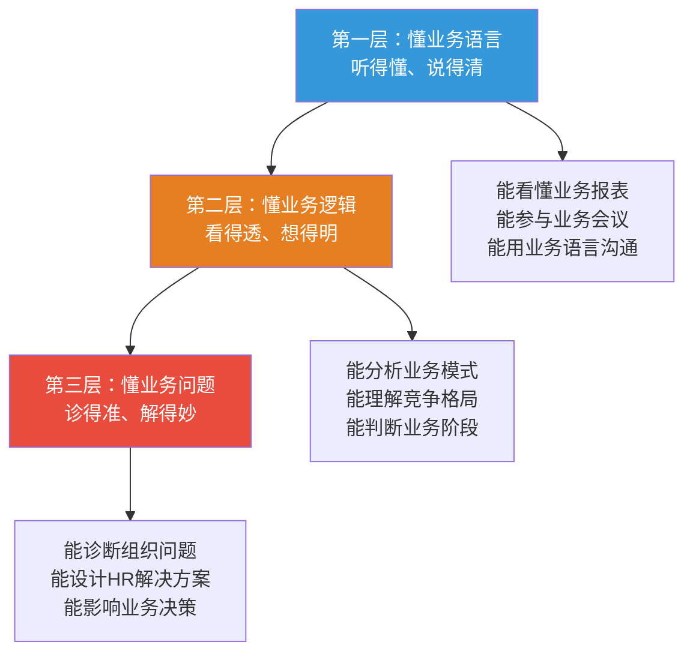
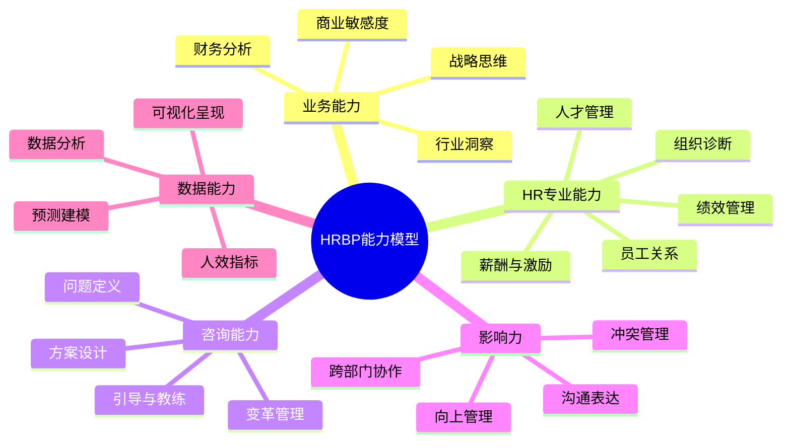
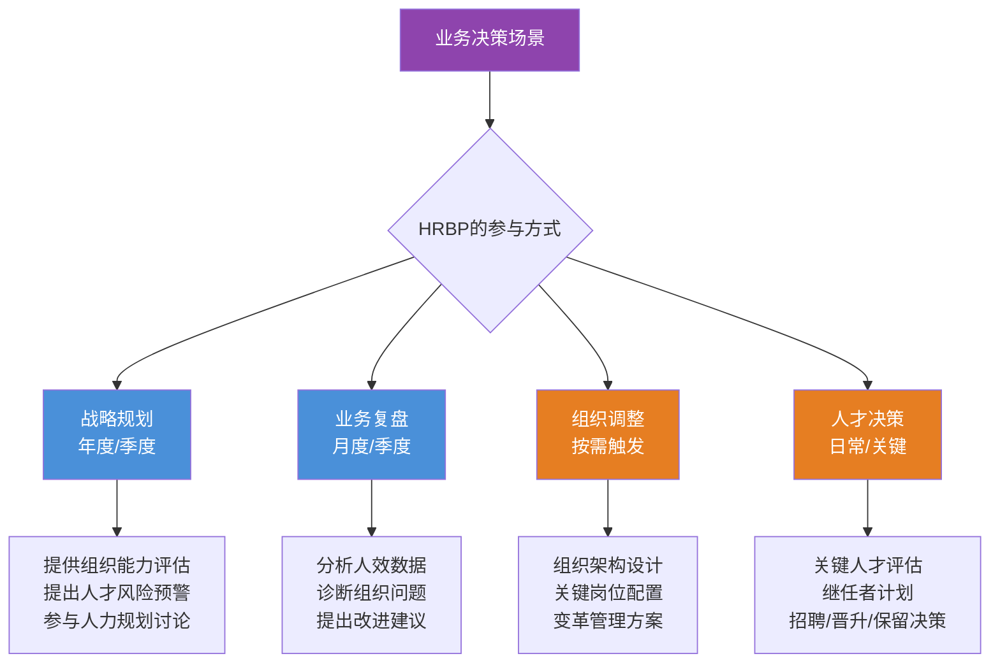
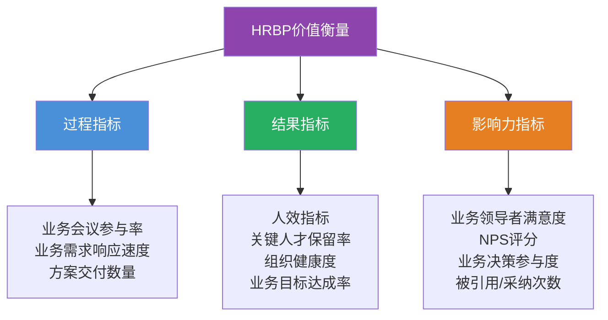
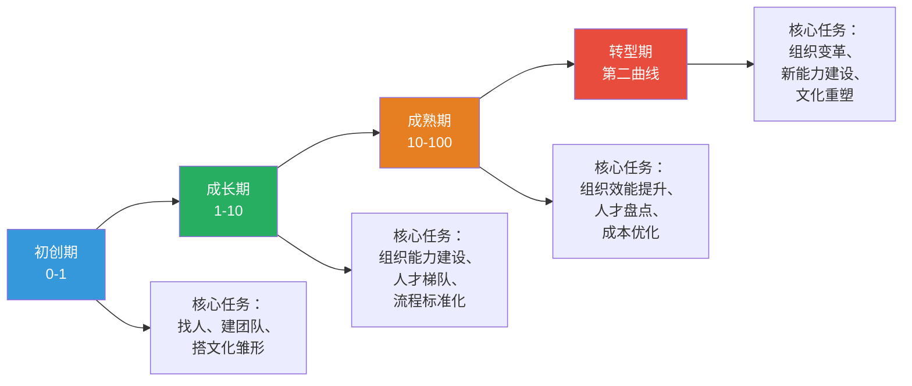

# HRBP深度：如何真正"懂业务"

> [!abstract] 一句话总结
> HRBP的核心不是"坐在业务部门"，而是"用HR专业解决业务问题"。真正懂业务的HRBP需要具备业务语言能力、业务诊断能力、业务解决方案设计能力和战略影响力。

---

## 一、"懂业务"的三个层次

### 1.1 层次模型

### 1.2 三个层次详解

**第一层：懂业务语言**

这是最基础的层次。HRBP需要能够：
- 阅读和理解业务报表（收入、成本、利润、人效等）
- 使用业务术语进行沟通（不把"GMV"说成"销售额"）
- 参与业务会议并能跟上讨论节奏

> [!example] 懂业务语言的表现
> 当业务负责人说"我们Q3的CAC涨了30%，LTV/CAC ratio降到2.5了"，HRBP的第一反应不是"这些缩写是什么意思"，而是"这意味着获客效率在下降，可能会影响团队扩张的节奏，我们需要关注销售团队的效率和留存"。

**第二层：懂业务逻辑**

HRBP需要能够：
- 理解业务的商业模式和盈利逻辑
- 分析业务的竞争环境和市场定位
- 判断业务所处的生命周期阶段
- 理解业务战略背后的逻辑

**第三层：懂业务问题**

这是最高层次。HRBP需要能够：
- 从业务结果反推组织问题
- 诊断团队能力与业务目标之间的差距
- 设计HR解决方案以解决业务问题
- 在业务决策中提供组织和人才视角

---

## 二、HRBP的核心能力模型

### 2.1 能力模型全景

### 2.2 能力等级标准

| 能力维度 | 初级HRBP（1-3年） | 中级HRBP（3-5年） | 高级HRBP（5-8年） | 资深HRBP（8年+） |
|----------|-------------------|-------------------|-------------------|------------------|
| **业务理解** | 了解业务基本情况 | 理解业务逻辑和竞争 | 预判业务趋势和风险 | 参与业务战略制定 |
| **组织诊断** | 使用诊断工具 | 独立完成组织诊断 | 设计诊断方法论 | 系统性组织变革 |
| **方案设计** | 执行既定方案 | 调整方案适配业务 | 独立设计方案 | 创新HR方法论 |
| **影响力** | 执行指令 | 影响一线管理者 | 影响中层管理者 | 影响CXO/决策层 |
| **数据能力** | 基础数据报表 | 数据分析与洞察 | 预测性分析 | 数据驱动决策体系 |

---

## 三、HRBP如何参与业务决策

### 3.1 业务决策中的HRBP角色

### 3.2 业务决策中的"HRBP发言模板"

> [!tip] 在业务决策会议中，HRBP可以这样发言
> 
> **基于数据的开场**：
> "根据过去三个季度的人效数据，我们销售团队的人均产出下降了15%，而同期头部竞对的人效提升了8%。"
> 
> **组织诊断**：
> "我初步判断，这个问题的根因不是人不够，而是我们的销售培训体系没有跟上产品迭代的速度，导致新销售上手周期从3个月延长到了6个月。"
> 
> **方案建议**：
> "我建议我们做三件事：第一，和销售VP一起重新设计新人90天融入计划；第二，引入销售能力认证体系；第三，建立销售标杆的案例分享机制。"
> 
> **投入产出分析**：
> "这个方案预计需要投入2个培训师的资源和一个月的开发时间，但我们保守估计可以将新人上手周期缩短到4个月，对应的产出提升大约是每人每年40万。"

---

## 四、HRBP的常见误区

### 4.1 误区一：沦为"业务助理"

**表现**：
- 业务部门让做什么就做什么，没有自己的专业判断
- 主要工作是帮业务部门订会议室、组织团建、发通知
- 在业务会议上从不发言，只是记录

**根因**：
- 缺乏HR专业自信
- 没有建立"业务伙伴"而非"业务下属"的定位
- 业务领导者对HRBP的定位错误

**解决路径**：
- 主动展示HR专业价值（用数据说话）
- 与业务负责人明确HRBP的角色边界
- 从一个小项目开始建立信任

> [!warning] 警示信号
> 如果你的工作日志中，"行政事务"和"跑腿"占比超过50%，你很可能已经沦为了"业务助理"。

### 4.2 误区二：变成"HR的传话筒"

**表现**：
- 业务部门提了需求，原封不动转给COE
- COE出了方案，原封不动搬给业务部门
- 不添加工、不翻译、不转化

**根因**：
- 缺乏业务需求的转化能力
- 缺乏HR方案的解读和适配能力
- 把自己定位为"信息中转站"

**解决路径**：
- 培养"需求翻译"能力：将业务需求转化为HR语言
- 培养"方案适配"能力：将HR方案转化为业务可执行的行动
- 每次传递信息时，加上自己的分析和建议

### 4.3 误区三：脱离业务"闭门造HR"

**表现**：
- 整天坐在HR工位上，不去业务部门
- 设计方案不征求业务部门意见
- 对业务的变化一无所知

**根因**：
- 舒适区依赖（和技术性HR工作比起来，和业务打交道更"累"）
- 缺乏主动深入业务的意识
- 业务部门不欢迎/不信任HRBP

**解决路径**：
- 制定"业务融入计划"：每周至少参加一次业务会议，每月至少访谈两位业务骨干
- 从"感兴趣"到"被需要"：先展示价值，再要求更多参与
- 建立"业务日历"：了解业务的节奏（什么时候忙、什么时候复盘、什么时候定目标）

### 4.4 误区四：过度"业务化"丧失HR立场

**表现**：
- 完全站在业务部门一边，忽视公司整体利益
- 在薪酬、编制等问题上无原则妥协
- 成为业务部门对抗总部的"代言人"

**根因**：
- 定位偏差：把自己当成了业务部门的人而非HR
- 缺乏"双线汇报"的平衡能力
- 过度追求业务部门的认可

**解决路径**：
- 明确HRBP的"双重身份"：既是业务部门的伙伴，也是公司HR体系的代表
- 在关键决策上保持专业判断和原则底线
- 学会"说不"的沟通技巧

---

## 五、HRBP的价值衡量

### 5.1 价值衡量框架

### 5.2 关键指标详解

| 指标类别 | 具体指标 | 衡量方式 | 数据来源 |
|----------|----------|----------|----------|
| **人效** | 人均收入/利润 | 同比/环比/对标 | 财务+HR系统 |
| **人才** | 关键人才流失率 | 主动离职/被动离职 | HR系统 |
| **人才** | 内部晋升率 | 关键岗位内部vs外部 | HR系统 |
| **人才** | 关键岗位填充周期 | 从需求到入职天数 | 招聘系统 |
| **组织** | 员工敬业度 | 年度/季度调研 | 敬业度调研 |
| **组织** | 管理幅度合理性 | 直接下属人数 | 组织架构数据 |
| **业务** | 业务目标达成率 | 业务KPI达成 | 业务系统 |
| **影响力** | 业务领导者满意度 | 季度/半年度反馈 | 调研/访谈 |

---

## 六、战略视角：不同业务阶段的HRBP工作重点

### 6.1 业务生命周期与HRBP焦点

### 6.2 各阶段工作重点详表

| 业务阶段 | HRBP核心任务 | 关键能力要求 | 典型挑战 | 成功标志 |
|----------|-------------|-------------|----------|----------|
| **初创期** | 核心团队搭建、文化雏形、快速招聘 | 招聘能力、文化感知、抗压能力 | 资源有限、品牌弱、变化快 | 核心团队稳定、关键岗位到位 |
| **成长期** | 组织能力建设、人才梯队、管理基本功 | 组织设计、培训体系、流程建设 | 速度与质量的平衡、管理稀释 | 人均效能不降、管理体系建立 |
| **成熟期** | 组织效能提升、人才盘点、成本优化 | 数据分析、绩效管理、变革管理 | 大企业病、创新乏力、活力下降 | 人效提升、关键人才保留 |
| **转型期** | 组织变革、新能力建设、文化重塑 | 变革管理、战略思维、影响力 | 新旧冲突、人才流失、不确定性 | 变革成功落地、新业务起量 |

---

## 七、HRBP的自我诊断清单

> [!checklist] HRBP自我诊断清单
> 
> **业务理解**：
> - [ ] 我能说出业务部门的核心商业模式吗？
> - [ ] 我能解释业务部门的三个关键财务指标吗？
> - [ ] 我了解业务部门的主要竞争对手和竞争格局吗？
> - [ ] 我能判断业务部门处于什么生命周期阶段吗？
> 
> **组织诊断**：
> - [ ] 我能画出业务部门的组织架构图并说明设计逻辑吗？
> - [ ] 我能识别业务部门的三个核心组织问题吗？
> - [ ] 我能说出业务部门的关键人才是谁吗？
> - [ ] 我了解业务部门的人效数据并知道变化趋势吗？
> 
> **价值创造**：
> - [ ] 过去三个月，我推动的最有价值的HR项目是什么？
> - [ ] 业务负责人主动咨询过我什么问题？
> - [ ] 我的建议被业务部门采纳过吗？
> 
> **时间分配**：
> - [ ] 我的工作中有多少时间花在"业务互动"上？（目标：>40%）
> - [ ] 我的工作中行政事务占比是多少？（目标：<20%）

---

## 八、总结

> [!summary] 核心要点
> 1. "懂业务"有三个层次：懂业务语言、懂业务逻辑、懂业务问题
> 2. HRBP的核心能力包括：业务能力、HR专业能力、咨询能力、影响力、数据能力
> 3. HRBP的四大误区：沦为业务助理、变成传话筒、闭门造HR、过度业务化
> 4. HRBP的价值衡量需要过程指标、结果指标和影响力指标三管齐下
> 5. 不同业务阶段，HRBP的工作重点和能力要求完全不同
> 6. 真正的HRBP是"用HR专业解决业务问题的人"，不是"坐在业务部门的HR"

---

## 九、延伸阅读

- [[03-HR人事/HR三支柱与组织设计/01_HR三支柱模型：COE、HRBP、SSC]] — 三支柱的整体框架
- [[03-HR人事/HR三支柱与组织设计/03_COE深度：从专家到解决方案设计师]] — HRBP最重要的协作伙伴
- [[03-HR人事/HR三支柱与组织设计/05_三支柱的局限与批判]] — 了解HRBP在实践中的挑战
- [[03-HR人事/HR三支柱与组织设计/07_HR组织设计：如何搭建一个HR团队]] — HRBP团队如何配置
- [[03-HR人事/HR三支柱与组织设计/08_AI时代的HR组织重构]] — AI如何影响HRBP角色
- [[03-HR人事/绩效管理/00_MOC_绩效管理中枢]] — HRBP的核心抓手之一
- [[03-HR人事/招聘与面试体系/00_MOC_招聘与面试体系中枢]] — HRBP的招聘参与

---

*返回：[[03-HR人事/HR三支柱与组织设计/00_MOC_HR三支柱与组织设计中枢]]*