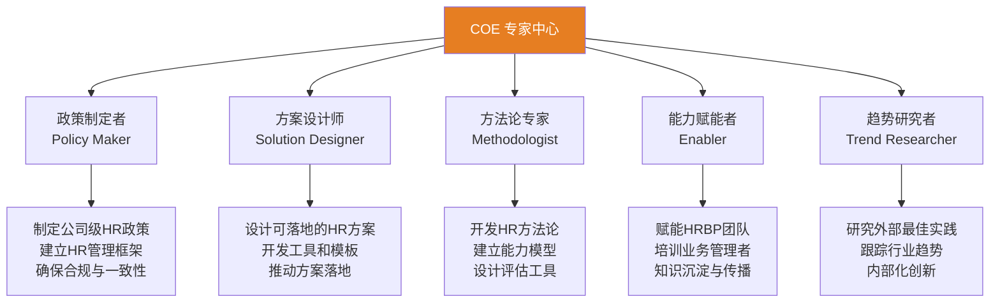
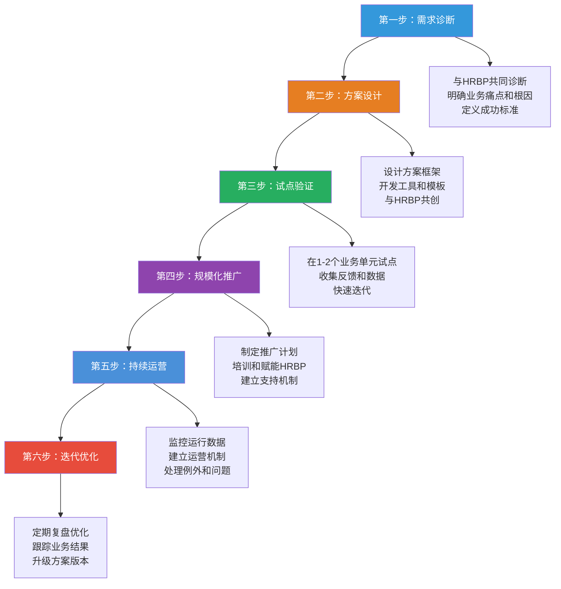
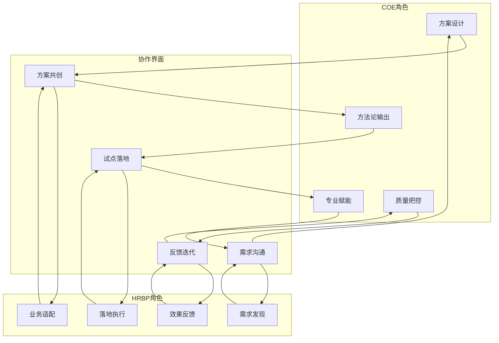
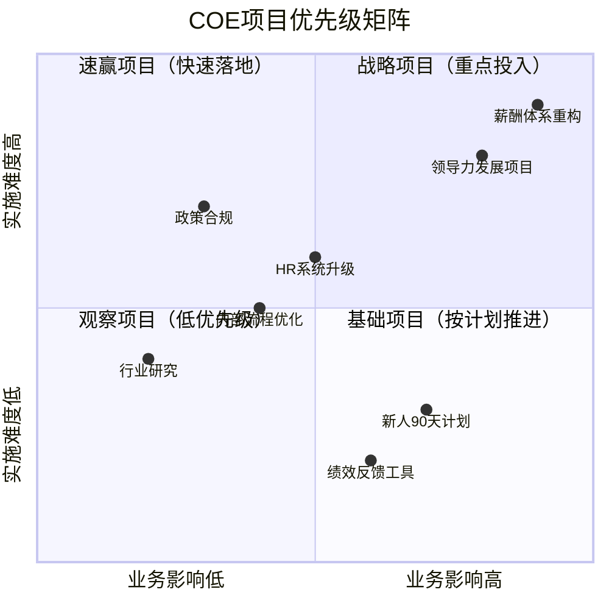
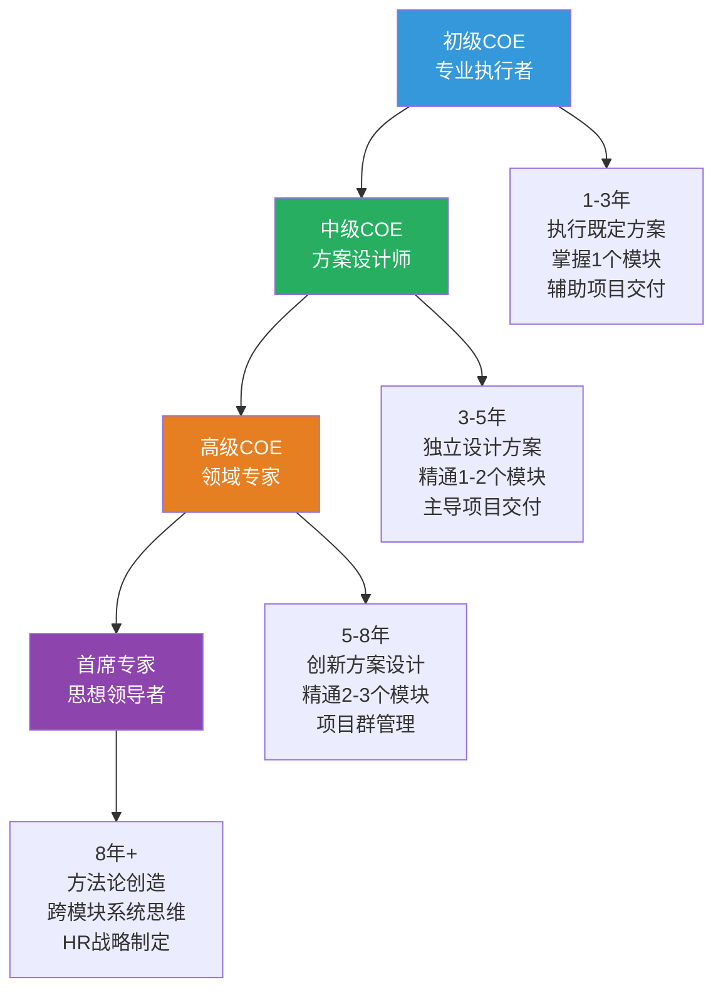

# COE深度：从专家到解决方案设计师

> [!abstract] 一句话总结
> COE不是"闭门造车的HR专家"，而是"能够设计可落地、可衡量、可迭代的HR解决方案的设计师"。COE的核心价值在于将HR专业知识转化为业务可用的解决方案。

---

## 一、COE的角色定位与能力模型

### 1.1 COE的多重角色

### 1.2 COE能力模型

| 能力维度 | 初级COE | 中级COE | 高级COE | 首席专家 |
|----------|---------|---------|---------|----------|
| **专业知识深度** | 掌握1个模块 | 精通1-2个模块 | 精通2-3个模块 | 跨模块系统思维 |
| **方案设计能力** | 执行方案模板 | 定制化方案设计 | 创新方案设计 | 方法论创造 |
| **业务理解** | 了解业务概况 | 理解业务逻辑 | 预判业务需求 | 引领业务思考 |
| **数据分析** | 描述性统计 | 诊断性分析 | 预测性建模 | 数据驱动决策体系 |
| **影响力** | 专业输出 | 咨询式沟通 | 战略对话 | 思想领导力 |
| **项目管理** | 任务执行 | 项目交付 | 项目群管理 | 变革项目管理 |

---

## 二、COE如何设计可落地的HR解决方案

### 2.1 解决方案设计六步法

### 2.2 可落地方案的五个特征

> [!tip] 好方案的五个标准
> 1. **问题导向**：方案必须解决一个明确的业务问题，而非"HR觉得重要的问题"
> 2. **简单可执行**：业务管理者能在5分钟内理解方案逻辑，能在30分钟内开始执行
> 3. **有衡量标准**：方案必须有明确的成功指标（不是"提升意识"，而是"将XX指标从A提升到B"）
> 4. **有配套工具**：方案必须附带模板、工具、话术，让使用者"拿来就能用"
> 5. **可迭代**：方案不是"一次交付"，而是"持续运营"，有明确的迭代机制

### 2.3 方案设计中的常见陷阱

| 陷阱 | 表现 | 改进方法 |
|------|------|----------|
| **过度设计** | 方案复杂到没人能执行 | 先做MVP，80%的场景用最简单的方案覆盖 |
| **脱离业务** | 方案在理论上完美，但业务看不懂 | 每个方案设计阶段必须与HRBP和业务代表共创 |
| **缺乏数据** | 方案没有数据支撑，全靠"我觉得" | 设计前先做数据分析，设计后设定衡量指标 |
| **一次交付** | 方案交付后就不管了 | 建立运营机制，持续跟踪和优化 |
| **工具缺失** | 只有理念和框架，没有可用的工具 | 每个方案必须附带模板、话术、检查清单 |

---

## 三、COE与HRBP的协作模式

### 3.1 协作模式全景

### 3.2 高效协作的四个原则

> [!important] COE-HRBP协作原则
> 
> **原则一：需求共创**
> COE不独立定义需求。每个项目的需求定义阶段，必须有HRBP参与，共同确认"这是不是一个真正需要解决的问题"。
> 
> **原则二：方案共建**
> COE不做"黑箱设计"。方案的关键阶段（框架、试点、推广），HRBP必须参与评审和共创，确保方案的业务适配性。
> 
> **原则三：责任共担**
> COE对方案的专业质量负责，HRBP对方案的落地效果负责。如果方案落地失败，双方共同复盘，而非互相指责。
> 
> **原则四：知识共享**
> COE将方法论沉淀为HRBP可用的工具，HRBP将业务洞察反馈给COE用于方案迭代。形成"方法论-实践-反馈-升级"的闭环。

### 3.3 协作中的常见摩擦

| 摩擦场景 | COE视角 | HRBP视角 | 解决建议 |
|----------|---------|----------|----------|
| 方案落地难 | "HRBP没有认真推" | "方案太复杂，业务不接受" | 共同做试点，用数据说话 |
| 需求不清晰 | "HRBP说不清楚要什么" | "COE不理解业务痛点" | 一起到业务现场做诊断 |
| 优先级冲突 | "这个项目很重要" | "业务现在没精力做这个" | 对齐业务节奏，匹配优先级 |
| 方案标准化vs定制化 | "必须统一标准" | "每个业务需求不同" | 80%标准化+20%定制化 |

---

## 四、COE的常见误区

### 4.1 误区一：闭门造车

**表现**：COE专家坐在办公室里设计"完美方案"，从不走出办公室了解业务实际。

**根因**：
- 过度依赖书本理论和外部最佳实践
- 缺乏与业务一线互动的动力和机制
- 把自己定位为"研究员"而非"解决方案设计师"

**解决路径**：
- 建立COE的"业务巡访"机制：每月至少深入一个业务单元
- 每个方案设计项目必须包含"业务调研"阶段
- 与HRBP建立定期的一对一沟通机制

> [!warning] 警示信号
> 如果你的方案中反复出现"应该"、"理想状态下"、"理论上"等词汇，而很少出现"目前业务中"、"XX部门反馈"、"实际数据显示"等表述，你很可能已经在闭门造车了。

### 4.2 误区二：追求"完美方案"

**表现**：方案设计周期过长（3个月+），追求"一步到位"的完美方案。

**根因**：
- 完美主义倾向
- 对不确定性的恐惧
- 缺乏MVP思维

**解决路径**：
- 采用MVP思维：先做60分的方案，快速试点，迭代到80分
- 设定方案设计的"时间盒"：复杂方案不超过6周
- 接受"不完美但够用"：一个好的已执行方案胜过十个完美的PPT方案

### 4.3 误区三：脱离业务自嗨

**表现**：方案用了很多"高大上"的概念和框架，但业务管理者完全看不懂、用不上。

**根因**：
- 沉迷于HR专业术语
- 缺乏"翻译"能力（将HR专业语言转化为业务语言）
- 以"专业"为名拒绝简化

**解决路径**：
- 培养"业务语言"能力：每个方案必须能用一页纸向业务管理者讲清楚
- 建立"方案可读性检查"：让非HR同事阅读方案，看是否能理解
- 使用"所以呢"测试：每个方案结论后追问"所以呢？这对业务意味着什么？"

### 4.4 误区四：重设计轻运营

**表现**：方案设计完成后就认为"大功告成"，不关注后续的运营和迭代。

**根因**：
- 把方案设计当成"项目"而非"产品"
- 缺乏运营思维和能力
- KPI导向：只考核方案交付，不考核方案效果

**解决路径**：
- 建立"方案运营机制"：每个方案设计阶段就明确运营责任人、运营周期、衡量指标
- 从"项目制"转向"产品制"：方案是持续迭代的"产品"，而非一次性交付的"项目"
- 建立方案的"健康度仪表盘"：实时监控方案的执行情况和业务效果

---

## 五、COE的管理工具

### 5.1 方案设计画布

| 维度 | 内容 |
|------|------|
| **业务问题** | 我们正在解决什么业务问题？（用业务语言描述） |
| **根因分析** | 这个问题的根因是什么？（数据+逻辑） |
| **目标用户** | 谁是这个方案的使用者？（业务管理者/员工/HRBP） |
| **方案概述** | 方案的核心机制是什么？（一页纸能说清楚） |
| **成功标准** | 怎么判断方案成功了？（量化指标+时间节点） |
| **关键假设** | 方案成立的前提假设是什么？（最大的风险点） |
| **MVP计划** | 最小可行版本是什么？什么时候试点？ |
| **推广路径** | 从试点到规模化推广的路径是什么？ |
| **运营机制** | 方案上线后谁来运营？怎么运营？ |
| **迭代计划** | 什么时候复盘？什么时候迭代？ |

### 5.2 COE项目优先级矩阵

---

## 六、COE的能力发展路径

### 6.1 发展阶梯

---

## 七、COE的自我诊断清单

> [!checklist] COE自我诊断清单
> 
> **业务理解**：
> - [ ] 我了解我的方案最终会在哪些业务场景中使用吗？
> - [ ] 我最近一个月内和业务管理者深度交流过吗？
> - [ ] 我能用业务语言而非HR术语解释我的方案吗？
> 
> **方案设计**：
> - [ ] 我的方案有明确的成功衡量标准吗？
> - [ ] 我的方案配套了可用的工具和模板吗？
> - [ ] 我的方案通过了MVP测试吗？
> 
> **协作**：
> - [ ] 我和HRBP有定期的需求沟通机制吗？
> - [ ] 我的方案设计过程中有HRBP参与吗？
> - [ ] 我了解HRBP对我方案的真实反馈吗？
> 
> **运营**：
> - [ ] 我设计的方案都有明确的运营责任人吗？
> - [ ] 我定期跟踪方案的执行效果吗？
> - [ ] 我有方案的迭代计划和版本管理吗？

---

## 八、总结

> [!summary] 核心要点
> 1. COE不是"闭门造车的专家"，而是"可落地解决方案的设计师"
> 2. 方案设计六步法：需求诊断、方案设计、试点验证、规模化推广、持续运营、迭代优化
> 3. 好方案的五个标准：问题导向、简单可执行、有衡量标准、有配套工具、可迭代
> 4. COE与HRBP的高效协作需要需求共创、方案共建、责任共担、知识共享
> 5. COE四大误区：闭门造车、追求完美方案、脱离业务自嗨、重设计轻运营
> 6. COE的能力发展路径：从专业执行者到方案设计师，再到思想领导者

---

## 九、延伸阅读

- [[03-HR人事/HR三支柱与组织设计/01_HR三支柱模型：COE、HRBP、SSC]] — 三支柱整体框架
- [[03-HR人事/HR三支柱与组织设计/02_HRBP深度：如何真正懂业务]] — COE最重要的协作伙伴
- [[03-HR人事/HR三支柱与组织设计/05_三支柱的局限与批判]] — COE在实践中面临的挑战
- [[03-HR人事/HR三支柱与组织设计/06_三支柱的演进：从Ulrich模型到未来]] — COE角色的演进方向
- [[03-HR人事/培训与人才发展/培训与人才发展_知识库建设方案]] — COE的核心方案领域之一
- [[03-HR人事/绩效管理/00_MOC_绩效管理中枢]] — COE的核心方案领域之一

---

*返回：[[03-HR人事/HR三支柱与组织设计/00_MOC_HR三支柱与组织设计中枢]]*