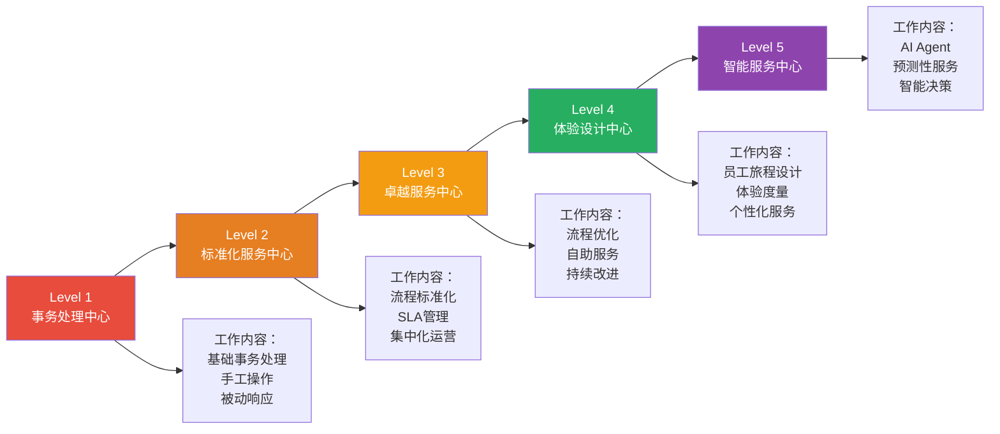
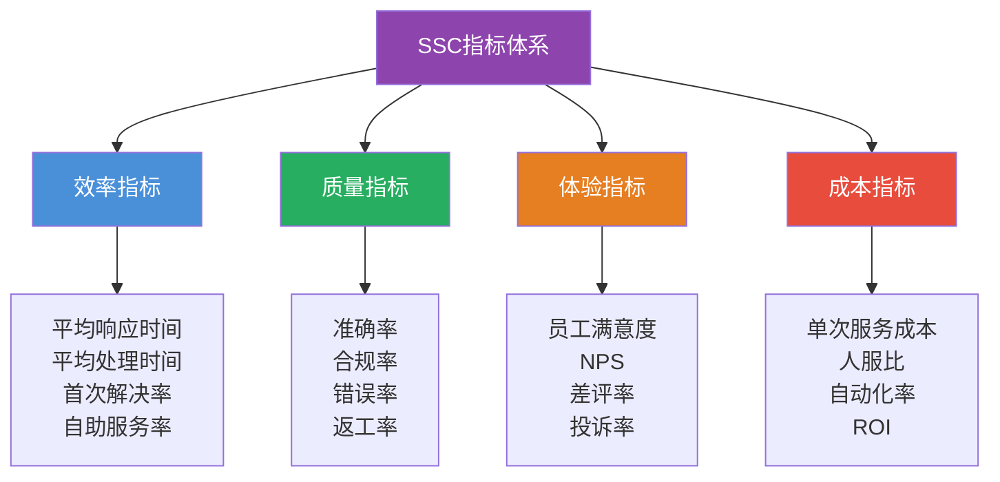
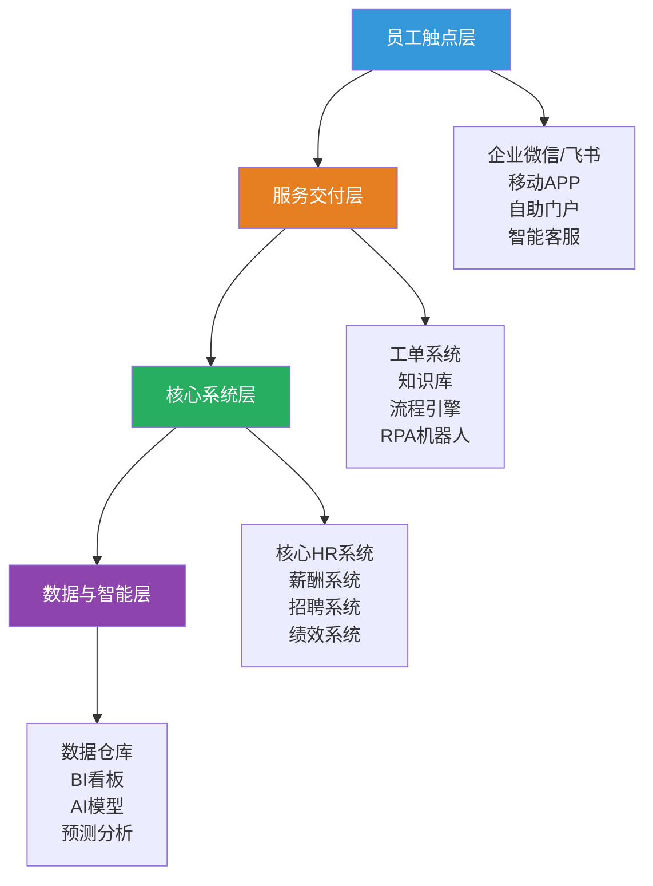
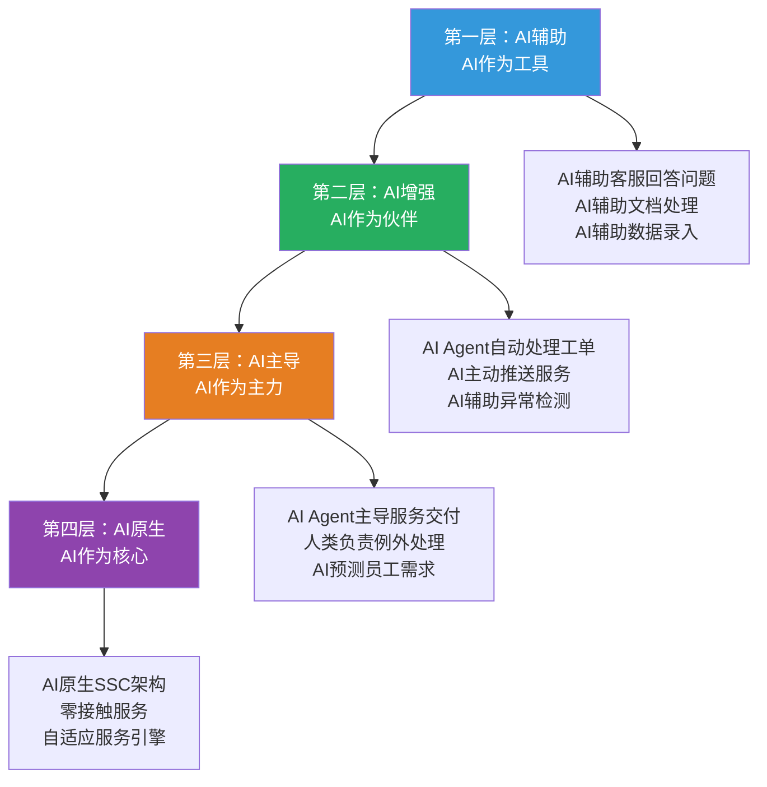
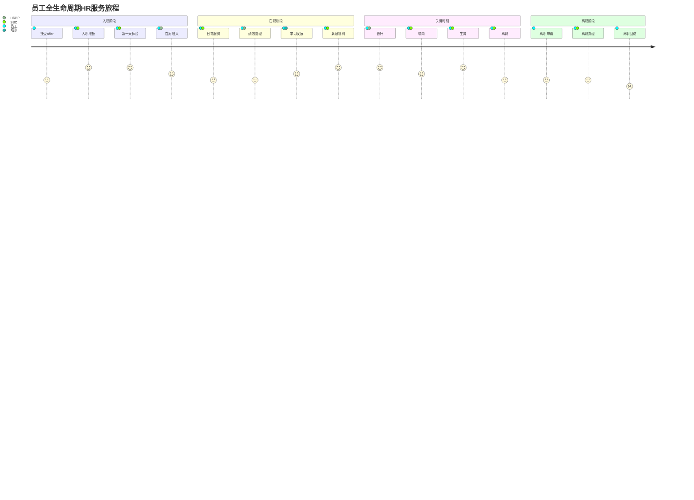

# SSC深度：从服务交付到体验设计

> [!abstract] 一句话总结
> SSC的终极目标不是"低成本地处理HR事务"，而是"让员工在HR服务中感受到组织的温度与效率"。从共享服务中心到卓越服务中心，SSC需要完成从"成本中心"到"价值中心"的蜕变。

---

## 一、SSC的成熟度模型

### 1.1 五级成熟度模型

### 1.2 各级成熟度特征详解

| 成熟度 | 名称 | 核心特征 | 技术支撑 | 典型指标 | 适用企业 |
|--------|------|----------|----------|----------|----------|
| **L1** | 事务处理中心 | 手工操作占比>60%，被动响应，无SLA | Excel/邮件/电话 | 员工满意度<60% | 初创企业 |
| **L2** | 标准化服务中心 | 流程标准化，SLA管理，集中化运营 | HRIS/工单系统 | 首次解决率>70% | 中小企业 |
| **L3** | 卓越服务中心 | 自助服务>50%，流程优化，持续改进 | 自助平台/知识库 | 自助率>60%，满意度>80% | 中型企业 |
| **L4** | 体验设计中心 | 员工旅程设计，NPS驱动，个性化服务 | 体验平台/数据分析 | NPS>30，自助率>80% | 大型企业 |
| **L5** | 智能服务中心 | AI Agent主导，预测性服务，零接触 | AI/ML/NLP/RPA | 自动化率>90%，零等待 | 数字化领先企业 |

---

## 二、SSC的核心指标：SLA、满意度、效率

### 2.1 指标体系框架

### 2.2 关键指标详解

| 指标 | 定义 | 计算方式 | 行业基准 | 优化方向 |
|------|------|----------|----------|----------|
| **首次解决率（FCR）** | 第一次接触即解决的问题比例 | 首次解决数/总工单数 | 70-85% | 提升知识库质量、培训一线人员 |
| **自助服务率** | 通过自助渠道完成的比例 | 自助完成数/总服务请求数 | 50-80% | 优化自助平台，减少人工依赖 |
| **平均响应时间** | 从请求到首次响应的时间 | 总响应时间/工单数 | 4-24小时 | 引入AI自动应答、智能路由 |
| **员工满意度** | 员工对SSC服务的满意度评分 | 调研评分（1-5分） | 4.0-4.5分 | 关注体验，而非仅关注效率 |
| **NPS（净推荐值）** | 员工推荐SSC的意愿 | 推荐者%-贬损者% | 20-40 | 超越预期，创造惊喜 |
| **单次服务成本** | 每次服务请求的平均成本 | 总成本/总服务请求数 | 因行业而异 | 自动化、标准化、规模化 |
| **人服比** | 每个SSC员工服务的员工数 | SSC员工数/总员工数 | 1:200-1:500 | 提升效率，扩大服务规模 |

### 2.3 SLA管理框架

> [!tip] SLA（Service Level Agreement）设计要点
> 
> **SLA的三要素**：
> 1. **服务范围**：明确SSC提供哪些服务，不提供哪些服务
> 2. **服务标准**：每项服务的响应时间、处理时间、质量标准
> 3. **例外处理**：什么情况下可以突破SLA，以及升级机制
> 
> **SLA设计原则**：
> - 80/20原则：抓住最核心的20%服务，制定最严格的SLA
> - 分级服务：不同级别的服务（紧急/普通/低优先级）有不同的SLA
> - 动态调整：SLA不是一成不变的，需要根据数据和反馈定期调整

---

## 三、SSC的数字化与自动化

### 3.1 数字化技术栈

### 3.2 SSC自动化场景矩阵

| 自动化层级 | 技术手段 | 典型场景 | 自动化率提升 | 实施难度 |
|------------|----------|----------|-------------|----------|
| **信息查询** | 智能客服/知识库 | 政策查询、流程指引 | 30-50% | 低 |
| **数据录入** | RPA | 入离职信息录入、数据迁移 | 50-70% | 中 |
| **流程审批** | 工作流引擎 | 请假审批、加班审批 | 60-80% | 中 |
| **智能决策** | 规则引擎/AI | 薪资核算、社保计算 | 80-90% | 高 |
| **预测分析** | AI/ML | 离职预测、编制预警 | 90-95% | 高 |

### 3.3 自助服务平台的"三要三不要"

> [!important] 自助服务平台设计原则
> 
> **三要**：
> 1. 要简单：员工能在3步内完成操作
> 2. 要智能：能根据员工身份自动推荐相关内容
> 3. 要一致：移动端和PC端体验一致
> 
> **三不要**：
> 1. 不要堆砌功能：不要把所有HR功能都往自助平台上堆
> 2. 不要替代人工：有些场景（如离职面谈）不适合自助
> 3. 不要忽视非数字化员工：一线工人、年长员工需要特殊渠道

---

## 四、AI如何重塑SSC

### 4.1 AI重塑SSC的四个层次

### 4.2 RPA + AI Agent 的SSC实践

> [!example] 典型场景：新员工入职
> 
> **传统SSC流程**（人工为主，耗时3-5天）：
> 1. HRBP发送入职信息给SSC
> 2. SSC手动录入HR系统
> 3. SSC手动创建IT账号
> 4. SSC手动安排入职培训
> 5. SSC手动发送欢迎邮件
> 
> **RPA+AI Agent流程**（自动化，耗时<1小时）：
> 1. HRBP在系统中确认offer
> 2. AI Agent自动触发入职流程
> 3. RPA机器人自动创建IT账号、分配权限
> 4. AI Agent自动安排入职培训、推送学习内容
> 5. AI Agent自动发送个性化欢迎邮件
> 6. 入职当天，AI Agent自动推送"入职宝典"和"首周任务清单"

### 4.3 AI时代SSC的能力重构

| 传统SSC能力 | AI时代SSC能力 | 变化说明 |
|-------------|--------------|----------|
| 工单处理 | 智能工单路由+自动处理 | 80%工单由AI Agent自动处理 |
| 知识库管理 | 智能知识图谱 | AI自动提取、分类、更新知识 |
| 数据录入 | 智能数据采集 | OCR/NLP自动采集和录入 |
| 客服应答 | 7x24智能客服 | AI Agent理解自然语言并解决问题 |
| 流程管理 | 智能流程优化 | AI分析流程瓶颈并自动优化 |
| 被动服务 | 主动预测服务 | AI预测员工需求，主动推送服务 |

---

## 五、员工体验设计：SSC的高级形态

### 5.1 员工旅程地图

### 5.2 体验设计的MOT（关键时刻）

> [!tip] MOT（Moment of Truth）设计
> 
> 在员工全生命周期中，有一些"关键时刻"对员工体验的影响远大于其他时刻：
> 
> 1. **入职第一天**：这是员工对组织的"第一印象"，SSC需要确保一切准备就绪
> 2. **薪资发放日**：员工对SSC最直接的感受，任何错误都会造成信任危机
> 3. **生育/病假期间**：员工最需要组织支持的时刻，SSC的服务质量直接影响归属感
> 4. **离职办理**：离职员工的体验会影响雇主品牌和口碑
> 
> 设计原则：**在这些关键时刻，不是"满足需求"，而是"超越期待"**。

---

## 六、SSC的团队配置与能力要求

### 6.1 SSC团队角色

| 角色 | 职责 | 关键能力 | 占SSC团队比例 |
|------|------|----------|--------------|
| **一线客服** | 处理员工日常咨询和服务请求 | 服务意识、沟通能力、HR基础知识 | 40-50% |
| **二线专家** | 处理复杂问题，升级处理 | HR专业知识、问题解决能力 | 15-20% |
| **流程优化师** | 持续优化流程，提升效率 | 流程管理、数据分析、精益思维 | 10-15% |
| **技术专家** | 系统运维、自动化开发 | 技术能力、RPA开发、数据管理 | 10-15% |
| **体验设计师** | 员工体验设计、NPS管理 | 用户研究、服务设计、数据分析 | 5-10% |
| **SSC负责人** | 整体运营管理、战略规划 | 运营管理、团队管理、战略思维 | 2-3% |

---

## 七、SSC的自我诊断清单

> [!checklist] SSC自我诊断清单
> 
> **效率**：
> - [ ] 我们的SSC自助服务率是多少？（目标：>60%）
> - [ ] 我们的首次解决率（FCR）是多少？（目标：>80%）
> - [ ] 我们的平均响应时间是多少？（目标：<4小时）
> 
> **质量**：
> - [ ] 我们的服务准确率是多少？（目标：>99%）
> - [ ] 我们的错误率是多少？（目标：<1%）
> 
> **体验**：
> - [ ] 我们的员工满意度评分是多少？（目标：>4.0/5.0）
> - [ ] 我们的NPS是多少？（目标：>30）
> - [ ] 我们有关键时刻的体验设计吗？
> 
> **智能化**：
> - [ ] 我们使用了哪些自动化技术？（RPA/AI Agent/智能客服）
> - [ ] 我们的自动化率是多少？（目标：>50%）
> - [ ] 我们有AI实施的路线图吗？

---

## 八、总结

> [!summary] 核心要点
> 1. SSC有五级成熟度：从事务处理中心到智能服务中心，每一级有明确的能力要求
> 2. SSC的核心指标体系包括效率、质量、体验、成本四个维度
> 3. 数字化和自动化是SSC升级的核心驱动力，RPA+AI Agent正在重塑SSC
> 4. AI重塑SSC的四个层次：辅助、增强、主导、原生
> 5. 员工体验设计是SSC的高级形态，需要关注关键时刻（MOT）
> 6. SSC的终极目标不是"低成本"，而是"好体验"

---

## 九、延伸阅读

- [[03-HR人事/HR三支柱与组织设计/01_HR三支柱模型：COE、HRBP、SSC]] — 三支柱整体框架
- [[03-HR人事/HR三支柱与组织设计/05_三支柱的局限与批判]] — SSC在实践中的挑战
- [[03-HR人事/HR三支柱与组织设计/06_三支柱的演进：从Ulrich模型到未来]] — SSC的演进方向
- [[03-HR人事/HR三支柱与组织设计/08_AI时代的HR组织重构]] — AI如何重塑SSC
- [[03-HR人事/HR三支柱与组织设计/07_HR组织设计：如何搭建一个HR团队]] — SSC团队如何配置

---

*返回：[[03-HR人事/HR三支柱与组织设计/00_MOC_HR三支柱与组织设计中枢]]*