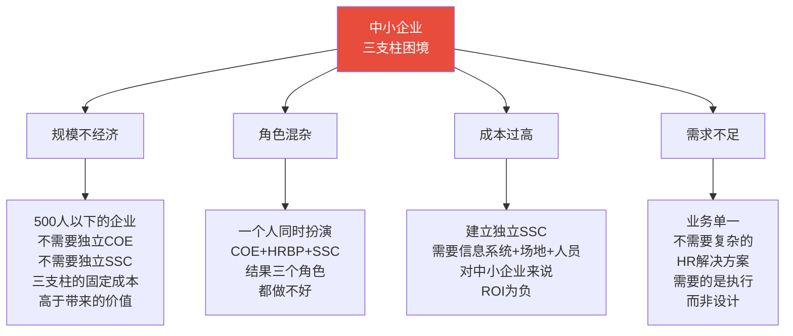
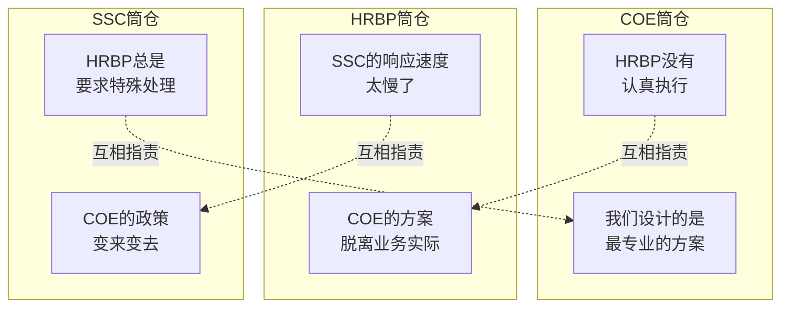
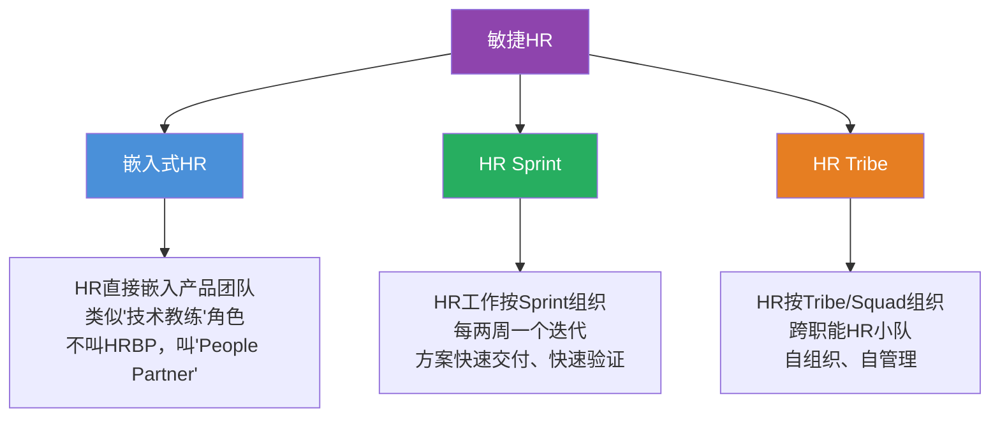
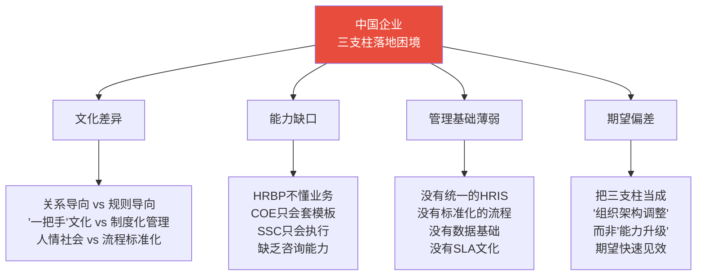

# 三支柱的局限与批判

> [!abstract] 一句话总结
> 三支柱不是万能药。它诞生于1997年的美国大型企业语境，在中小企业、敏捷组织、中国本土企业等场景中存在显著的适用性问题。理解三支柱的局限，比盲目崇拜三支柱更重要。

---

## 一、中小企业的三支柱困境

### 1.1 规模不经济

### 1.2 中小企业三支柱适用性判断

| 维度 | 适用三支柱的阈值 | 中小企业的典型情况 | 判断 |
|------|-----------------|-------------------|------|
| 员工规模 | >500人 | 50-500人 | 通常不适用 |
| 业务线数量 | >3条 | 1-2条 | 通常不适用 |
| 地域分布 | 多城市/国家 | 单一城市 | 通常不适用 |
| HR团队规模 | >15人 | 2-8人 | 通常不适用 |
| HR事务量 | >5000次/月 | <1000次/月 | 通常不适用 |
| 业务复杂度 | 高 | 中低 | 可能不适用 |

> [!warning] 中小企业引入三支柱的常见后果
> 1. **成本激增**：三支柱的固定成本（系统+人员+管理）在中小企业中分摊不动
> 2. **沟通成本上升**：原本一个人能搞定的事，现在需要三个角色来回沟通
> 3. **角色混淆**：HRBP和COE的边界模糊，互相推诿
> 4. **"伪三支柱"**：挂着三支柱的名，干着六大模块的活

---

## 二、三支柱的"筒仓效应"

### 2.1 筒仓效应的表现

> [!danger] 筒仓效应的本质
> 三支柱在设计上是为了打破HR的职能筒仓，但在实践中，三个支柱本身又形成了新的筒仓。每个支柱都有自己的KPI、自己的优先级、自己的语言体系，导致协作成本不降反升。

### 2.2 筒仓效应的具体表现

| 表现 | 具体场景 | 对业务的影响 |
|------|----------|-------------|
| **信息断裂** | HRBP发现了业务需求，但COE不了解，仍然按自己的计划做方案 | 方案与需求脱节 |
| **责任推诿** | 方案落地失败，COE说是HRBP执行不力，HRBP说是COE方案不行 | 问题无人负责 |
| **标准冲突** | HRBP承诺了业务部门一个特殊政策，但SSC说"不符合标准流程" | 业务部门体验差 |
| **重复建设** | COE做了一个方案，HRBP不知道，自己也做了一个类似方案 | 资源浪费 |
| **数据孤岛** | COE、HRBP、SSC各自有数据，但无法打通形成整体视角 | 决策缺乏数据支撑 |

### 2.3 破解筒仓效应的策略

> [!tip] 破解筒仓效应的四个杠杆
> 
> **1. 建立"三支柱联席会议"机制**
> 每周/每两周一次，COE、HRBP、SSC负责人坐在一起，对齐需求、进展和问题。
> 
> **2. 统一KPI体系**
> 三个支柱不应该是各自独立的KPI，而应该有共同的"业务成功"指标。例如：三者共同承担"关键人才保留率"指标。
> 
> **3. 建立"需求-方案-交付"全链路看板**
> 让每个需求从HRBP发现、到COE设计、到SSC交付的全过程可视化，避免信息断裂。
> 
> **4. 轮岗机制**
> 让COE定期去HRBP岗位轮岗，让HRBP去SSC了解交付流程，建立跨角色的同理心。

---

## 三、三支柱在敏捷组织中的不适应

### 3.1 敏捷组织 vs 三支柱的冲突

| 敏捷组织的特征 | 三支柱的设计假设 | 冲突点 |
|---------------|-----------------|--------|
| **小团队、自组织** | 大组织、层级化 | 三支柱需要较大的组织规模才能运转 |
| **快速迭代、拥抱变化** | 标准化、流程化 | COE方案设计周期长，跟不上敏捷节奏 |
| **角色模糊、T型人才** | 角色清晰、专业化 | 三支柱要求角色边界清晰，与敏捷的"角色模糊"冲突 |
| **去中心化决策** | 中心化政策制定 | COE作为"政策中心"与敏捷的"去中心化"矛盾 |
| **产品导向** | 职能导向 | 三支柱本质上是职能导向的组织设计 |

### 3.2 敏捷组织中的HR新范式

> [!tip] 敏捷HR的核心变化
> 在敏捷组织中，HR不再按照COE/HRBP/SSC划分，而是按照"价值流"或"产品线"组织。HR的角色从"政策制定者"和"服务交付者"转变为"组织教练"和"文化催化剂"。

---

## 四、中国企业的三支柱落地问题

### 4.1 中国企业的特殊性

### 4.2 中国企业三支柱落地的典型问题

| 问题 | 表现 | 根因 | 建议 |
|------|------|------|------|
| **"换汤不换药"** | HR经理改叫HRBP，但工作内容不变 | 把三支柱当成"改名"而非"变革" | 先定义角色和职责，再改称谓 |
| **"空降COE"** | 从咨询公司挖来的COE，方案高大上但无法落地 | COE缺乏内部落地能力 | 内部培养+外部招聘结合 |
| **"HRBP形同虚设"** | HRBP沦为"业务助理"或"HR的传话筒" | 详见 [[03-HR人事/HR三支柱与组织设计/02_HRBP深度：如何真正懂业务]] | 能力建设+定位澄清 |
| **"SSC变杂货铺"** | SSC成为"什么都往里扔"的垃圾桶 | SSC缺乏服务边界和SLA管理 | 定义服务目录，建立SLA |
| **"三支柱变三不管"** | 三个支柱之间互相推诿，形成责任真空 | 缺乏协作机制和共同KPI | 建立三支柱联席会议和共同KPI |

### 4.3 中国企业三支柱落地的正确姿势

> [!important] 中国企业三支柱落地的"渐进式"策略
> 
> **第一阶段：意识唤醒（3-6个月）**
> - 不急于调整组织架构
> - 组织HR团队学习三支柱理念
> - 邀请业务领导者参与三支柱的讨论
> 
> **第二阶段：试点先行（6-12个月）**
> - 选择1-2个业务单元试点HRBP
> - 建立SSC雏形（从最标准化的服务开始）
> - 不设独立COE，由资深的HRBP兼任
> 
> **第三阶段：正式建立（12-24个月）**
> - 基于试点经验，正式建立三支柱架构
> - 完善三支柱的协作机制和KPI体系
> - 持续迭代和优化

---

## 五、三支柱的"阴暗面"：被忽视的问题

### 5.1 员工体验的牺牲

> [!danger] 三支柱的"效率悖论"
> 三支柱追求的是"效率"（标准化、规模化），但员工的HR体验可能是"冷冰冰的"、"没有人情味的"。
> 
> 一个员工遇到了一个复杂的HR问题，他需要：
> 1. 先联系SSC（SSC说"这个问题不在我的服务范围内"）
> 2. 再联系HRBP（HRBP说"我需要咨询COE"）
> 3. 等COE回复（可能需要1-2周）
> 
> 从员工视角看，这个体验比"找一个人就解决"的传统模式差了太多。

### 5.2 HR人才的"碎片化"

三支柱要求HR人才高度专业化（COE专精一个模块、HRBP专精一个业务、SSC专精流程），但这也导致HR人才的"碎片化"——每个人只看到一个局部，缺乏全局视野。一个做了5年招聘COE的人，可能完全不了解薪酬和绩效，这与"HR需要系统性思维"的理念背道而驰。

### 5.3 创新的抑制

标准化的SSC和流程化的COE，天然倾向于"维持现状"而非"创新突破"。当HRBP提出一个创新想法时，往往会遇到"不符合COE标准"或"SSC系统不支持"的阻力。三支柱在某些情况下反而成为了HR创新的"刹车"。

### 5.4 业务与HR的"新隔阂"

三支柱的初衷是让HR更贴近业务，但在实践中，HRBP可能成为业务与HR之间唯一的"触点"。业务部门遇到问题找HRBP，HRBP再去找COE或SSC，业务部门与COE和SSC之间反而产生了一层新的隔阂。

### 5.5 成本与效率的"边际递减"

三支柱的初期收益显著（标准化带来的效率提升、专业化带来的质量提升），但随着时间推移，边际收益递减：
- SSC的标准化到了一定程度后，再提升效率的边际成本越来越高
- COE的方案设计到了一定复杂度后，增加方案精度的边际价值越来越低
- HRBP的"深耕业务"到了一定深度后，业务部门对HRBP的边际需求也在下降

### 5.6 人才市场的"供需错配"

三支柱需要的HR人才（真正懂业务的HRBP、能设计方案的COE、能管理流程的SSC）在人才市场上供给严重不足。很多企业挂着三支柱的架构，但找不到合适的人来填充这些角色，结果就是"三支柱的架构，六大模块的能力"。

---

## 六、什么情况下不应该用三支柱？

> [!checklist] 三支柱"不适用"清单
> 
> - [ ] 公司员工少于500人
> - [ ] 公司只有1-2条业务线
> - [ ] 公司业务高度集中在一个城市
> - [ ] HR团队少于10人
> - [ ] 公司处于初创期或生存期
> - [ ] 公司采用敏捷或扁平化组织架构
> - [ ] 公司没有基本的HR信息系统
> - [ ] 公司HR团队的专业能力不足
> - [ ] 公司管理层不理解三支柱
> 
> 如果以上条件满足超过3项，建议慎重考虑是否引入三支柱。

### 6.1 不同规模企业的HR模式建议

| 企业规模 | 建议HR模式 | 说明 |
|----------|-----------|------|
| 初创企业（<50人） | 全栈HR + 创始人兼任 | 不需要三支柱 |
| 中小企业（50-500人） | 职能型HR | 按招聘/薪酬/绩效分模块，不需要三支柱 |
| 中型企业（500-2000人） | 三支柱雏形 | 逐步建立HRBP和SSC，COE可以由资深HR兼任 |
| 大型企业（2000人+） | 完整三支柱或钻石模型 | 根据业务复杂度和组织形态选择具体模式 |

### 6.2 三支柱的"降级使用"

> [!tip] 如果必须用三支柱但条件不成熟，可以"降级使用"
> 
> - **轻量级COE**：不设独立COE部门，由资深HRBP兼任COE职能
> - **轻量级SSC**：不建独立SSC，将标准化事务外包给第三方服务商
> - **轻量级HRBP**：不要求HRBP全职对接业务，可以先从"业务对接人"开始
> 
> 核心原则：**不要为了三支柱而三支柱。组织设计服务于业务需求，而非反过来。**

---

## 七、批判不是为了否定，而是为了更好的应用

> [!quote] 批判的态度
> 对三支柱的批判不是为了否定三支柱的价值，而是为了：
> 1. **明确适用边界**：知道在什么场景下三支柱是有效的，什么场景下是不适用的
> 2. **避免盲目崇拜**：不把三支柱当成"唯一正确"的HR组织模式
> 3. **推动持续演进**：在三支柱的基础上，探索更适合未来的HR组织模式

---

## 八、总结

> [!summary] 核心要点
> 1. 三支柱在中小企业中存在"规模不经济"问题，500人以下的企业通常不适合
> 2. 三支柱的"筒仓效应"可能导致COE、HRBP、SSC互相指责、信息断裂
> 3. 敏捷组织和三支柱在多个维度上存在根本性冲突
> 4. 中国企业三支柱落地的核心问题是文化差异、能力缺口和管理基础薄弱
> 5. 三支柱可能牺牲员工体验、导致HR人才碎片化、抑制创新
> 6. 批判三支柱的目的是明确适用边界，而非否定其价值

---

## 九、延伸阅读

- [[03-HR人事/HR三支柱与组织设计/01_HR三支柱模型：COE、HRBP、SSC]] — 三支柱的完整介绍
- [[03-HR人事/HR三支柱与组织设计/06_三支柱的演进：从Ulrich模型到未来]] — 三支柱的演进方向
- [[03-HR人事/HR三支柱与组织设计/07_HR组织设计：如何搭建一个HR团队]] — 不同规模企业的HR组织设计
- [[03-HR人事/HR三支柱与组织设计/08_AI时代的HR组织重构]] — AI时代HR组织的新可能
- [[02-AI趋势与素养/AI Native组织变革/00_MOC_AI Native组织变革中枢]] — 组织层面的变革新范式

---

*返回：[[03-HR人事/HR三支柱与组织设计/00_MOC_HR三支柱与组织设计中枢]]*