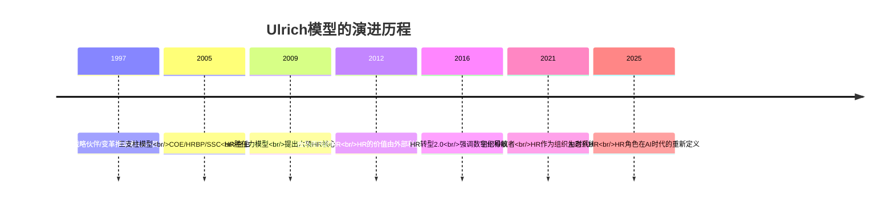
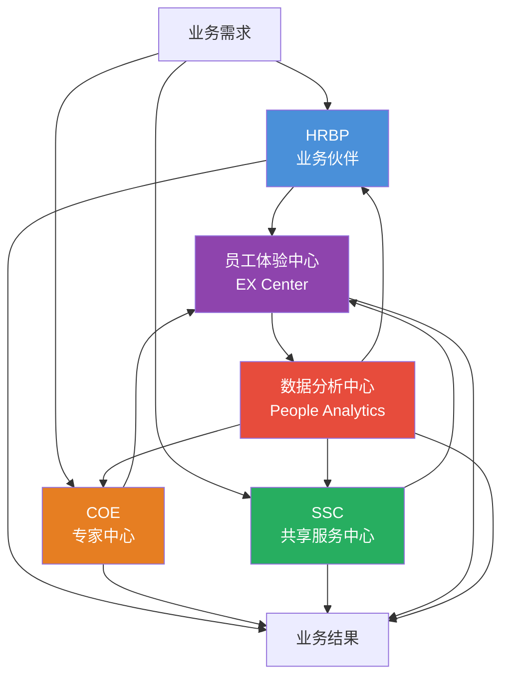
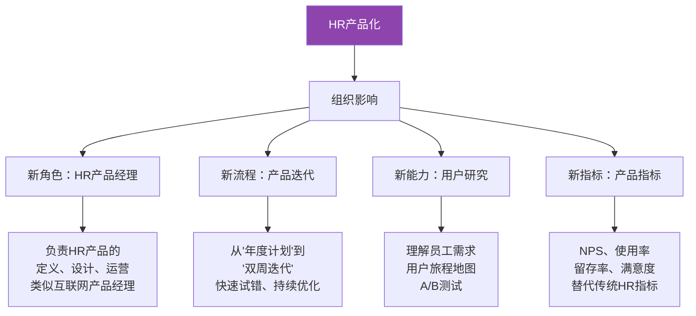
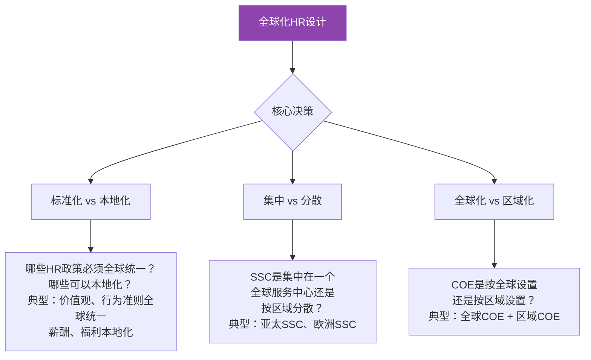
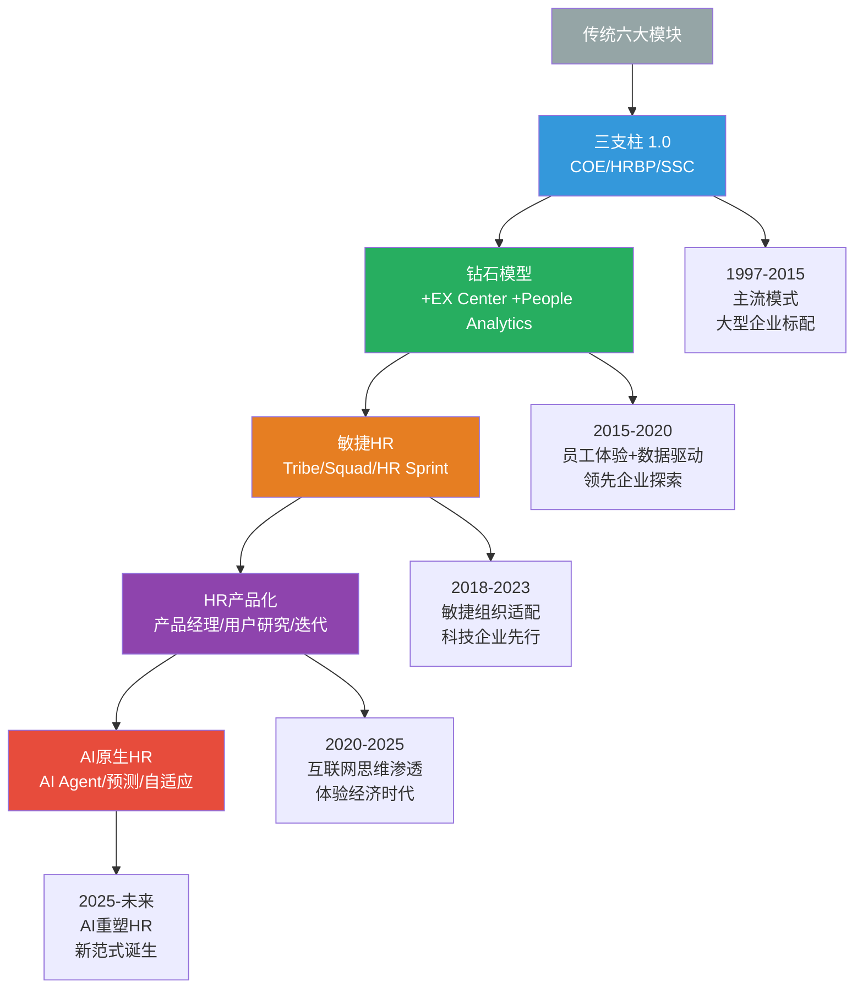

# 三支柱的演进：从Ulrich模型到未来

> [!abstract] 一句话总结
> 三支柱不是终点，而是起点。从"钻石模型"到"员工体验导向"，从"HR产品化"到"全球化HR组织设计"，三支柱正在经历深刻的演进。理解这些演进方向，才能避免"用1997年的模型解决2026年的问题"。

---

## 一、Ulrich模型本身的演进

### 1.1 Ulrich思想的持续迭代

Dave Ulrich的模型并非一成不变。从1997年至今，他的思想经历了多次重大迭代：



### 1.2 从"四角色"到"六角色"

Ulrich在最新的研究中将HR角色从四个扩展为六个：

| 角色 | 核心问题 | 关键产出 | 与传统三支柱的关系 |
|------|----------|----------|-------------------|
| **战略定位者** | 我们在哪里竞争？ | 业务战略的HR转化 | COE + HRBP |
| **可信的活动家** | 我们如何建立信任？ | 关系与影响力 | HRBP |
| **组织能力建设者** | 我们如何组织？ | 组织能力诊断与建设 | COE + HRBP |
| **变革推动者** | 我们如何变革？ | 变革管理 | HRBP |
| **HR创新与整合者** | 我们如何创新HR实践？ | HR实践创新 | COE |
| **技术/数据支持者** | 我们如何用技术？ | HR数字化 | COE + SSC |

---

## 二、从三支柱到"钻石模型"

### 2.1 钻石模型的结构



> [!tip] 钻石模型 vs 三支柱
> 钻石模型在三支柱基础上增加了两个新角色：
> - **员工体验中心（EX Center）**：以员工全生命周期体验为视角，打破三支柱的边界
> - **数据分析中心（People Analytics）**：以数据为驱动，连接和赋能三个支柱

### 2.2 钻石模型的新增角色

| 新角色 | 职责 | 与传统三支柱的关系 | 为什么需要 |
|--------|------|-------------------|-----------|
| **员工体验中心** | 设计端到端的员工旅程，管理关键时刻（MOT），提升员工NPS | 整合COE的方案设计、HRBP的落地执行、SSC的服务交付，以员工视角统一体验 | 传统三支柱以"HR效率"为核心，而非"员工体验" |
| **数据分析中心** | 建立人效仪表盘，提供预测性分析，数据驱动决策 | 为COE提供方案设计的数据支撑，为HRBP提供业务诊断的数据工具，为SSC提供运营优化的数据洞察 | 传统三支柱的数据能力分散在各支柱中，缺乏统一的数据视角 |

### 2.3 钻石模型的运作逻辑

在钻石模型中：
- **员工体验**是设计的"起点"（而非HR职能）
- **数据分析**是决策的"基础"（而非经验判断）
- **COE/HRBP/SSC**是交付的"执行者"（而非独立的藩篱）

---

## 三、从职能导向到"员工体验导向"

### 3.1 范式转变

```mermaid
graph LR
    subgraph 传统范式：职能导向
        A1[招聘] --> A2[入职] --> A3[培训] --> A4[绩效] --> A5[薪酬] --> A6[离职]
    end
    
    subgraph 新范式：体验导向
        B1[吸引] --> B2[融入] --> B3[成长] --> B4[贡献] --> B5[回报] --> B6[告别]
    end
    
    A1 -.->|视角转变| B1
    A2 -.->|视角转变| B2
    A3 -.->|视角转变| B3
    A4 -.->|视角转变| B4
    A5 -.->|视角转变| B5
    A6 -.->|视角转变| B6
```

> [!important] 核心转变
> 从"HR做了什么"（职能视角）到"员工经历了什么"（体验视角）。HR组织不再按照招聘/培训/绩效等职能来设计，而是按照员工的"关键时刻"（入职第一天、第一次绩效面谈、晋升、生育、离职等）来设计。

### 3.2 体验导向的HR组织设计

| 传统HR组织 | 体验导向HR组织 |
|-----------|---------------|
| 按职能划分（招聘部、培训部、薪酬部） | 按体验旅程划分（吸引与入职、成长与发展、绩效与回报、离职与校友） |
| 每个职能部门独立运作 | 跨职能的"体验团队"负责一个完整的员工旅程 |
| 以HR效率为衡量标准 | 以员工NPS和体验评分为衡量标准 |
| 被动响应员工需求 | 主动设计员工体验 |
| 标准化服务 | 个性化+标准化结合 |

---

## 四、从内部服务到"HR产品化"

### 4.1 HR产品化的含义

> [!tip] HR产品化 = 把HR服务当成"产品"来设计和管理
> 
> 就像互联网公司做产品一样，HR也需要：
> - **有产品经理**：负责定义HR产品的价值和功能
> - **有用户研究**：深入了解员工和管理者的真实需求
> - **有产品迭代**：基于数据和反馈持续优化
> - **有产品度量**：用NPS、使用率、留存率等指标衡量产品成功

### 4.2 HR产品化的典型实践

| 传统HR服务 | HR产品化 | 变化 |
|-----------|---------|------|
| "绩效管理制度" | "绩效管理产品" | 从"制度"到"产品"，强调用户体验 |
| 年度敬业度调研 | 持续倾听产品（Pulse Survey） | 从"年度事件"到"持续产品" |
| 培训课程目录 | 学习体验平台（LXP） | 从"目录"到"平台"，强调个性化推荐 |
| 入职流程SOP | 入职体验产品 | 从"流程"到"体验"，关注新员工感受 |
| 薪酬体系 | 整体回报产品（Total Rewards） | 从"薪酬"到"回报"，整合货币和非货币激励 |

### 4.3 HR产品化对组织的影响



---

## 五、全球化HR组织设计

### 5.1 全球化HR的四种模式

| 模式 | 特点 | 适用场景 | 优点 | 缺点 |
|------|------|----------|------|------|
| **总部集权型** | 总部制定所有HR政策，全球统一执行 | 全球业务高度一致 | 标准化程度高、成本低 | 缺乏本地化、文化冲突 |
| **本地自治型** | 每个国家/地区独立制定HR政策 | 各国业务差异大 | 本地化程度高、灵活 | 标准不统一、协同困难 |
| **矩阵型** | 总部COE + 区域HRBP + 本地SSC | 全球矩阵组织 | 平衡标准化与本地化 | 管理复杂、汇报线混乱 |
| **网络型** | 全球HR专家网络，按需组合 | 项目制、敏捷组织 | 灵活、专业 | 协调成本高 |

### 5.2 全球化HR组织设计的关键决策



### 5.3 全球化HR的典型挑战

> [!warning] 全球化HR的三大挑战
> 1. **文化差异**：不同国家对"绩效"、"薪酬公平"、"领导力"的理解完全不同
> 2. **法律合规**：各国劳动法差异巨大，统一HR政策面临法律风险
> 3. **时区与语言**：全球SSC的7x24服务需要跨时区协作，语言障碍增加沟通成本

### 5.4 全球化HR的未来趋势：从"全球一致"到"全球互联"

> [!tip] 新趋势：不再追求全球统一，而是追求全球互联
> 
> 未来的全球化HR不是"所有国家用同一套HR体系"，而是：
> - **全球互联的人才市场**：人才可以在全球范围内流动，HR需要建立全球人才池
> - **全球互联的学习网络**：知识和最佳实践在全球范围内快速传播
> - **全球互联的文化共识**：在多元文化中建立共同的价值观和行为准则
> - **本地化的执行**：在统一框架下，给本地团队充分的操作空间

---

## 六、HR生态化：从"HR部门"到"HR生态"

### 6.1 HR生态化的含义

> [!tip] HR生态化
> 未来的HR不再是一个"部门"，而是一个"生态系统"。在这个生态系统中：
> - **内部HR**：传统的HR团队（COE/HRBP/SSC）
> - **外部伙伴**：外包服务商、咨询公司、技术供应商、猎头公司
> - **AI Agent**：自动化HR服务、智能分析、预测引擎
> - **管理者**：管理者日益成为"第一线HR"
> - **员工**：员工通过自助平台和AI Agent自主完成越来越多的HR事务

### 6.2 HR生态的治理模式

| 传统HR治理 | 生态化HR治理 |
|-----------|-------------|
| HR部门对所有HR事务负责 | HR部门负责生态治理和规则制定 |
| 所有HR服务由内部提供 | 内部+外部+AI混合交付 |
| 层级化的审批流程 | 网络化的协作模式 |
| 年度计划驱动 | 持续迭代、数据驱动 |
| 以HR部门为中心 | 以员工和管理者为中心 |

---

## 七、三支柱的演进路线图

### 6.1 演进全景



---

## 八、总结

> [!summary] 核心要点
> 1. Ulrich模型本身在持续演进，从四角色到六角色，从内部导向到"由外而内"
> 2. 钻石模型在三支柱基础上增加了"员工体验中心"和"数据分析中心"
> 3. 从职能导向到员工体验导向是HR组织设计的核心范式转移
> 4. HR产品化要求HR像做产品一样做服务，引入产品经理、用户研究、迭代思维
> 5. 全球化HR组织设计需要在标准化与本地化之间找到平衡
> 6. 三支柱的演进路径：传统六大模块 -> 三支柱 -> 钻石模型 -> 敏捷HR -> HR产品化 -> AI原生HR

---

## 九、延伸阅读

- [[03-HR人事/HR三支柱与组织设计/01_HR三支柱模型：COE、HRBP、SSC]] — 三支柱的基础
- [[03-HR人事/HR三支柱与组织设计/05_三支柱的局限与批判]] — 为什么需要演进
- [[03-HR人事/HR三支柱与组织设计/08_AI时代的HR组织重构]] — AI原生HR的详细讨论
- [[03-HR人事/HR三支柱与组织设计/07_HR组织设计：如何搭建一个HR团队]] — 实操指南
- [[02-AI趋势与素养/AI Native组织变革/00_MOC_AI Native组织变革中枢]] — 组织层面的变革新范式

---

*返回：[[03-HR人事/HR三支柱与组织设计/00_MOC_HR三支柱与组织设计中枢]]*