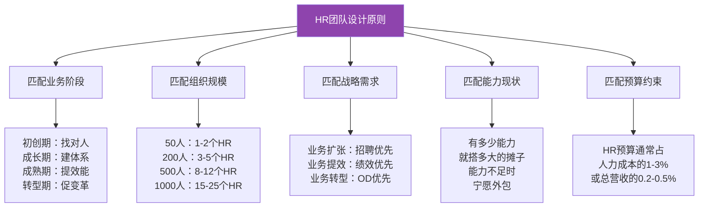
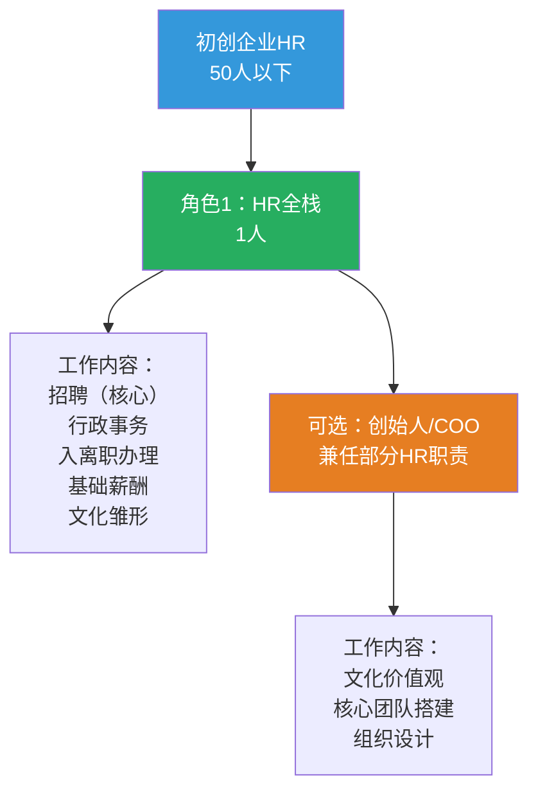
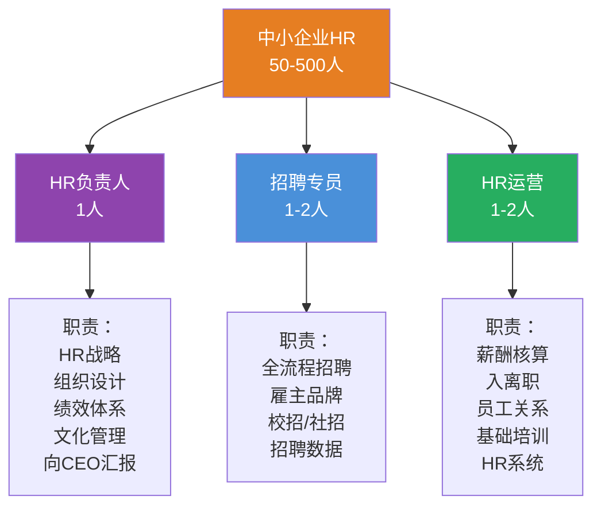
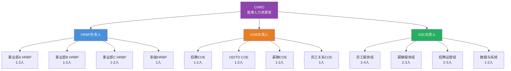
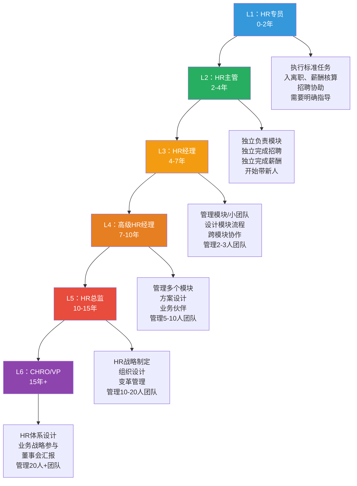
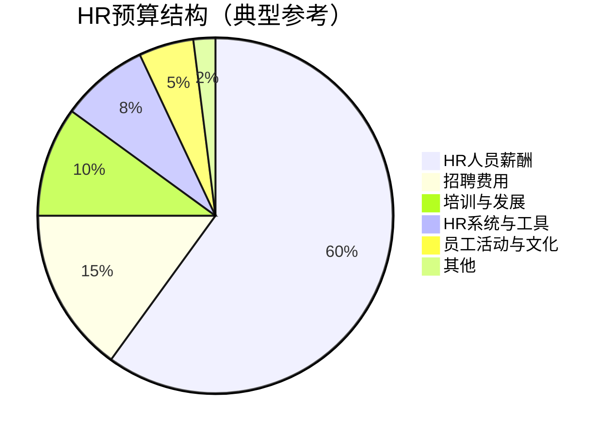

# HR组织设计：如何搭建一个HR团队

> [!abstract] 一句话总结
> 不同规模、不同阶段的企业需要完全不同的HR团队设计。从初创企业的"1个HR全栈"到大型企业的"三支柱+钻石模型"，HR团队的设计需要匹配企业的发展阶段和战略需求。

---

## 一、HR团队设计的核心原则

### 1.1 设计原则

### 1.2 人服比（HR-to-Employee Ratio）参考

| 企业规模 | 建议人服比 | HR团队人数 | 说明 |
|----------|-----------|-----------|------|
| <50人 | 1:30-50 | 1-2人 | 以行政+招聘为主 |
| 50-200人 | 1:50-80 | 2-4人 | 开始有专人分工 |
| 200-500人 | 1:80-100 | 3-5人 | 建立基本职能分工 |
| 500-1000人 | 1:100-150 | 5-8人 | 可以开始引入三支柱雏形 |
| 1000-5000人 | 1:150-200 | 8-25人 | 正式建立三支柱 |
| 5000-10000人 | 1:200-250 | 25-50人 | 完善的三支柱+钻石模型 |
| 10000人以上 | 1:250-400 | 50人以上 | 多区域、多业务线的复杂HR组织 |

> [!warning] 注意
> 人服比受行业、地域、业务复杂度、HR成熟度、技术化程度等多种因素影响，上表仅为参考值。

---

## 二、初创企业（<50人）的HR团队设计

### 2.1 团队配置

### 2.2 初创企业HR的核心任务

| 优先级 | 任务 | 说明 | 产出 |
|--------|------|------|------|
| **P0** | 招聘 | 核心团队搭建是初创企业的生命线 | 关键岗位到位、招聘流程建立 |
| **P0** | 文化雏形 | 早期文化决定企业基因 | 价值观1.0、文化仪式 |
| **P1** | 基础行政 | 入离职、合同、社保公积金 | 基本合规 |
| **P1** | 薪酬发放 | 确保工资按时准确发放 | 薪酬流程建立 |
| **P2** | 绩效 | 简单的目标管理和反馈机制 | OKR雏形或简单绩效 |
| **P3** | 培训 | 新人入职引导为主 | 入职引导SOP |

> [!tip] 初创企业HR的生存法则
> 1. **不要追求体系化**：建体系是200人以后的事，现在最重要的是找人
> 2. **不要套用三支柱**：你就是三支柱合一
> 3. **不要做"专业的HR"**：做"能帮公司活下去的HR"，哪怕你的工作方式不够"专业"
> 4. **不要把文化做成"墙上贴的标语"**：早期文化是创始人行为和日常决策的沉淀

---

## 三、中小企业（50-500人）的HR团队设计

### 3.1 团队配置

### 3.2 关键转折点

| 人数节点 | 变化 | 标志 |
|----------|------|------|
| **50人** | 从"创始人管人"到"HR管人" | 创始人无法记住所有人的名字 |
| **100人** | 招聘从"随机"到"体系化" | 开始建立招聘流程和标准 |
| **150人** | 开始有"管理者的管理者" | 开始需要领导力发展 |
| **200人** | 绩效从"拍脑袋"到"有体系" | 开始建立绩效管理制度 |
| **300人** | 开始有"组织设计"意识 | 开始思考汇报线、管理幅度 |
| **500人** | 可能引入三支柱雏形 | 考虑设立HRBP或SSC |

### 3.3 中小企业HR的常见陷阱

> [!danger] 中小企业HR的三大陷阱
> 
> **陷阱一：过早体系化**
> 200人就开始建花哨的胜任力模型、做复杂的薪酬架构。实际上，这个阶段"简单有效"比"体系完整"更重要。
> 
> **陷阱二：招聘权重过高**
> 招聘占了HR 80%的时间，忽视了绩效、文化、组织健康。招聘是"堵窟窿"，绩效和文化是"治本"。
> 
> **陷阱三：忽视管理者能力建设**
> 100-300人的阶段，最大的管理瓶颈是"第一次当管理者的人不知道怎么管"。HR最大的价值不是自己做事，而是赋能管理者。

---

## 四、大型企业（500-5000人）的HR团队设计

### 4.1 三支柱架构

### 4.2 大型企业HR团队的角色配置

| 角色 | 人数（以1000人企业为例） | 核心能力要求 | 汇报关系 |
|------|------------------------|-------------|----------|
| CHRO | 1人 | 战略思维、业务理解、变革领导力 | 向CEO汇报 |
| HRBP负责人 | 1人 | 业务理解、团队管理、咨询能力 | 向CHRO汇报 |
| 事业部HRBP | 3-5人 | 业务理解、组织诊断、影响力 | 虚线上报业务负责人 |
| COE负责人 | 1人 | 专业深度、方案设计、项目管理 | 向CHRO汇报 |
| COE专家 | 3-5人 | 专业深度、数据分析、方法论 | 向COE负责人汇报 |
| SSC负责人 | 1人 | 运营管理、流程优化、服务意识 | 向CHRO汇报 |
| SSC团队 | 6-12人 | 服务意识、流程执行、HR基础知识 | 向SSC负责人汇报 |

---

## 五、HR团队的能力阶梯

### 5.1 能力阶梯模型

### 5.2 各层级能力标准

| 层级 | 专业能力 | 业务能力 | 管理能力 | 影响力 | 典型产出 |
|------|----------|----------|----------|--------|----------|
| **L1 专员** | 掌握基础操作 | 了解业务概况 | 自我管理 | 执行 | 准确完成任务 |
| **L2 主管** | 独立完成模块 | 理解业务逻辑 | 带教新人 | 影响同级 | 模块交付 |
| **L3 经理** | 模块体系设计 | 业务需求诊断 | 管理小团队 | 影响上级 | 模块体系 |
| **L4 高级经理** | 跨模块方案设计 | 业务伙伴 | 管理中团队 | 影响业务 | HR方案 |
| **L5 总监** | HR战略 | 战略对话 | 管理大团队 | 影响CXO | HR战略 |
| **L6 CHRO** | HR体系 | 业务战略共创 | 管理HR组织 | 影响董事会 | 组织能力 |

---

## 六、HR团队的预算管理

### 6.1 预算结构

### 6.2 预算管理要点

| 预算项目 | 占HR预算比例 | 管理要点 | 优化方向 |
|----------|-------------|----------|----------|
| **HR人员薪酬** | 55-65% | 人服比控制、能力阶梯匹配 | 提升人效，用技术减少人力依赖 |
| **招聘费用** | 10-20% | 渠道ROI、内推奖励、猎头费用 | 提升雇主品牌，降低渠道成本 |
| **培训与发展** | 8-15% | 培训投入产出、领导力发展 | 内部讲师、在线学习、行动学习 |
| **HR系统与工具** | 5-10% | 系统选型、实施费用、运维 | 选择SaaS、避免过度定制 |
| **员工活动与文化** | 3-8% | 文化投入产出、员工体验 | 高频低成本活动替代低频高成本活动 |

---

## 七、HR团队搭建的自检清单

### 7.1 初创企业自检（<50人）

> [!checklist] 初创企业HR自检清单
> - [ ] 公司有专人负责HR吗？（至少0.5个人力）
> - [ ] 招聘流程是否顺畅？（从需求到offer发放，平均周期是多少？）
> - [ ] 基础人事合规是否到位？（合同、社保、公积金）
> - [ ] 工资发放是否准时准确？（错误率<1%）
> - [ ] 创始团队有讨论过文化价值观吗？

### 7.2 中小企业自检（50-500人）

> [!checklist] 中小企业HR自检清单
> - [ ] HR团队是否覆盖了招聘、薪酬、员工关系三大基础？
> - [ ] 是否建立了基本的招聘流程和标准？
> - [ ] 是否建立了基本的绩效管理机制？
> - [ ] 管理者是否接受过基本的管理培训？
> - [ ] 是否有员工离职分析和留任策略？
> - [ ] 是否有基本的HR数据（人效、离职率、招聘周期）？

### 7.3 大型企业自检（500人+）

> [!checklist] 大型企业HR自检清单
> - [ ] 三支柱的职责边界是否清晰？
> - [ ] COE、HRBP、SSC之间是否有有效的协作机制？
> - [ ] 是否有统一的HRIS系统？
> - [ ] 是否有完善的人效分析体系？
> - [ ] 是否有领导力发展体系？
> - [ ] 是否有组织诊断和变革管理能力？
> - [ ] 是否有HR的数字化路线图？

---

## 八、总结

> [!summary] 核心要点
> 1. HR团队设计需要匹配企业的发展阶段、组织规模、战略需求和预算约束
> 2. 初创企业（<50人）：1个HR全栈，核心任务是招聘和文化雏形
> 3. 中小企业（50-500人）：3-5人，开始建立基本职能分工，不要过早体系化
> 4. 大型企业（500人+）：可以引入三支柱，但需要循序渐进
> 5. HR能力阶梯：从专员到CHRO，每个层级有明确的能力标准和产出要求
> 6. HR预算管理的核心是平衡"人效"和"投入"，技术是提升人效的关键杠杆

---

## 九、延伸阅读

- [[03-HR人事/HR三支柱与组织设计/01_HR三支柱模型：COE、HRBP、SSC]] — 大型企业HR组织设计的基础
- [[03-HR人事/HR三支柱与组织设计/05_三支柱的局限与批判]] — 了解三支柱的适用边界
- [[03-HR人事/HR三支柱与组织设计/06_三支柱的演进：从Ulrich模型到未来]] — 了解HR组织的演进方向
- [[03-HR人事/HR三支柱与组织设计/08_AI时代的HR组织重构]] — AI如何影响HR团队设计
- [[03-HR人事/招聘与面试体系/00_MOC_招聘与面试体系中枢]] — 招聘能力建设
- [[03-HR人事/绩效管理/00_MOC_绩效管理中枢]] — 绩效体系设计
- [[02-AI趋势与素养/AI Native组织变革/00_MOC_AI Native组织变革中枢]] — 组织变革的新范式

---

*返回：[[03-HR人事/HR三支柱与组织设计/00_MOC_HR三支柱与组织设计中枢]]*