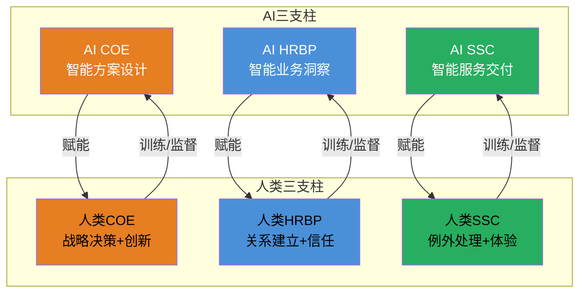
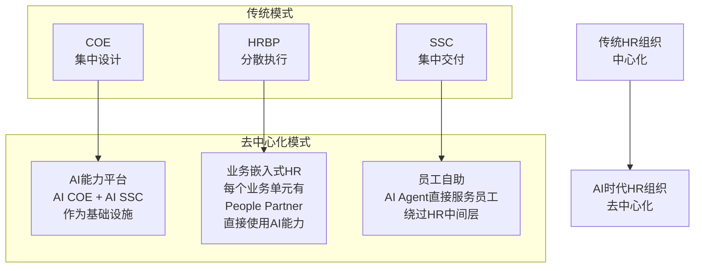
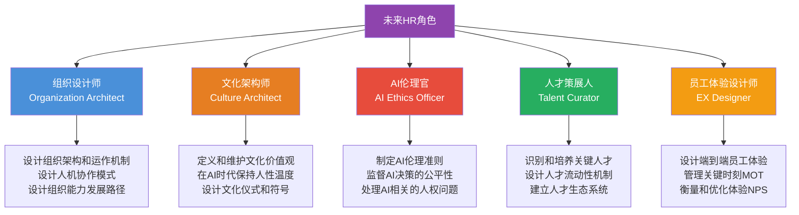
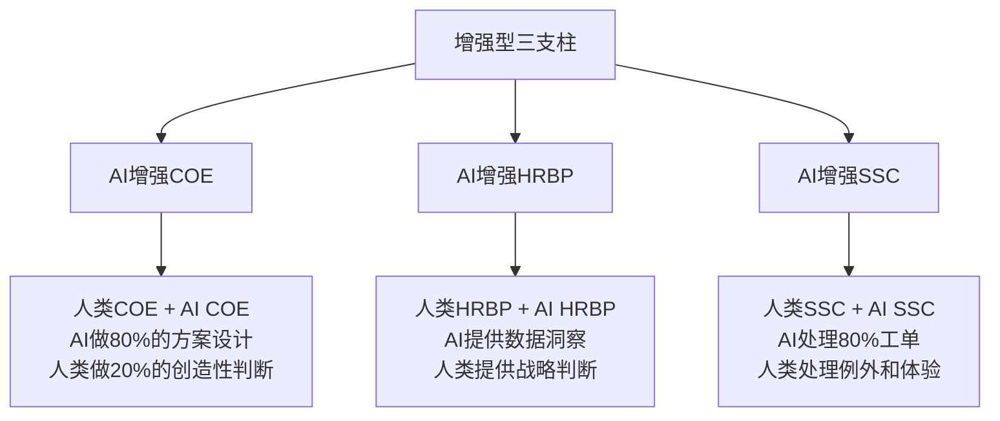
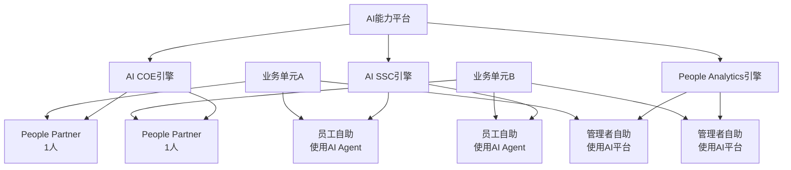
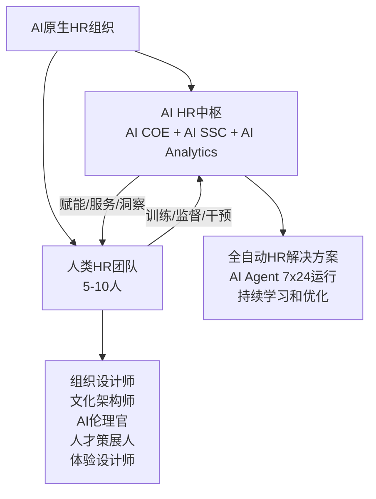
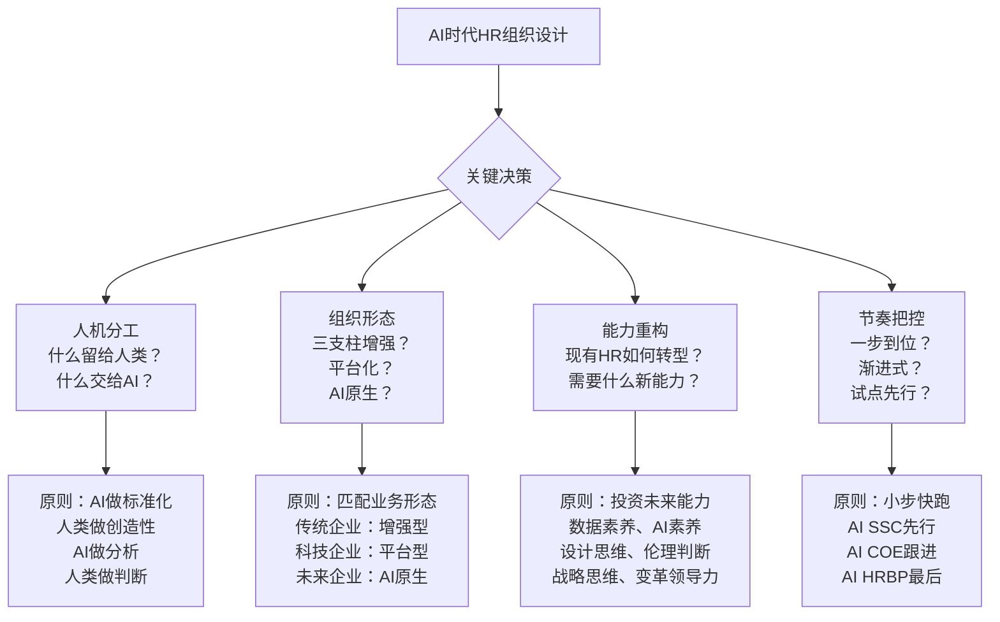

# AI时代的HR组织重构

> [!abstract] 一句话总结
> AI不是"替代HR"，而是"重构HR的工作方式"。AI Agent将重塑HR三支柱的每一个角色，未来HR组织将呈现"AI Agent + 人类专家"的混合形态。HR的未来角色将转向组织设计师、文化架构师和AI伦理官。

> [!warning] 定位声明
> 本文聚焦 **HR部门自身的组织设计**，即AI如何改变HR部门的结构和运作方式。关于AI如何改变整个组织的变革，请参阅 [[02-AI趋势与素养/AI Native组织变革/00_MOC_AI Native组织变革中枢]]。关于AI如何改变HR个体的角色，请参阅 [[02-AI趋势与素养/AI Native组织变革/00_MOC_AI Native组织变革中枢]] 中的"HR角色重塑"部分。本文不做重复讨论。

---

## 一、AI Agent如何重塑三支柱

### 1.1 AI在三支柱中的渗透全景

### 1.2 AI COE：从方案设计到智能生成

| 传统COE工作 | AI COE增强 | 人类COE的新角色 |
|------------|-----------|----------------|
| 研究外部最佳实践 | AI自动扫描全球HR研究和案例，生成趋势报告 | 判断哪些趋势适用于本企业，制定落地策略 |
| 设计薪酬架构 | AI基于市场数据和内部数据，自动生成薪酬架构方案 | 审核AI方案，处理复杂场景（如高管薪酬），做最终决策 |
| 设计绩效体系 | AI分析不同绩效方案的效果数据，推荐最优方案 | 设计绩效文化与价值观的结合，处理灰色地带 |
| 开发领导力模型 | AI分析高绩效管理者的行为数据，识别关键能力 | 定义领导力哲学，设计发展路径 |
| 编写HR政策 | AI生成政策初稿，自动检查合规性 | 审核政策，处理例外场景，确保政策的人性化 |

> [!tip] AI COE的核心价值
> AI COE让人类COE从"信息收集者"和"方案撰写者"升级为"战略判断者"和"方案审核者"。AI做"80%的标准化设计"，人类做"20%的创造性判断"。

### 1.3 AI HRBP：从经验判断到数据智能

| 传统HRBP工作 | AI HRBP增强 | 人类HRBP的新角色 |
|-------------|-----------|----------------|
| 组织诊断 | AI自动分析组织健康数据（敬业度、离职率、人效、协作网络），生成诊断报告 | 验证AI诊断，深入理解"为什么"，设计解决方案 |
| 人才盘点 | AI自动生成人才九宫格，基于绩效、潜力、离职风险等多维度数据 | 主持人才校准会，做最终的人才判断 |
| 离职风险预警 | AI实时监测离职风险信号，主动预警 | 与高风险员工深度沟通，设计保留方案 |
| 人效分析 | AI自动生成人效仪表盘，对标行业数据 | 解读数据背后的组织问题，推动业务决策 |
| 需求诊断 | AI分析员工反馈、业务数据，识别潜在HR需求 | 与业务管理者深度对话，验证和深化需求理解 |

> [!important] AI HRBP的核心价值
> AI HRBP让人类HRBP从"数据分析师"升级为"战略顾问"。AI提供"是什么"（数据洞察），人类提供"为什么"（深度解读）和"怎么办"（解决方案）。

### 1.4 AI SSC：从人工服务到智能服务

关于AI SSC的详细讨论，请参阅 [[03-HR人事/HR三支柱与组织设计/04_SSC深度：从服务交付到体验设计]] 中"AI如何重塑SSC"章节。这里补充AI SSC对HR组织设计的影响：

| 传统SSC | AI SSC | 组织影响 |
|---------|--------|----------|
| 10-20人的SSC团队 | 3-5人 + AI Agent | SSC团队规模大幅缩减 |
| 人工处理80%工单 | AI自动处理80%工单 | 人类SSC聚焦例外处理和体验优化 |
| 被动响应 | AI主动预测并推送服务 | SSC从"成本中心"变为"体验中心" |
| 7x8人工服务 | 7x24 AI Agent服务 | 服务覆盖时间大幅延长 |
| 按SLA考核 | 按体验指标考核 | SSC的价值衡量标准升级 |

---

## 二、AI时代HR组织的"去中心化"趋势

### 2.1 去中心化HR的形态

### 2.2 去中心化的三个驱动力

> [!tip] 去中心化的驱动力
> 
> **1. AI能力下沉**
> 当AI COE和AI SSC的能力被封装为"AI能力平台"，每个业务单元的管理者和员工都可以直接使用这些能力，不再需要HRBP作为"中间人"。
> 
> **2. 管理者自助**
> 管理者可以通过AI Agent直接完成：团队诊断、薪酬建议、绩效反馈草案、人才风险预警等，不再依赖HRBP的"翻译"。
> 
> **3. 员工自助**
> 员工可以通过AI Agent直接完成：政策查询、福利选择、学习推荐、职业规划建议等，SSC的"中介"角色被削弱。

### 2.3 去中心化对HR组织的影响

| 传统HR角色 | 去中心化后的变化 | 新角色 |
|-----------|----------------|--------|
| COE（集中设计） | AI能力平台取代部分COE | 平台运营者、AI训练师 |
| HRBP（中间人） | 管理者直接使用AI能力 | 复杂问题顾问、变革推动者 |
| SSC（集中交付） | AI Agent直接服务员工 | 例外处理专家、体验设计师 |
| HR管理者 | 管理幅度扩大 | 从"管人"到"管AI+人" |

---

## 三、HR的未来角色：组织设计师、文化架构师、AI伦理官

### 3.1 未来HR角色全景

### 3.2 组织设计师（Organization Architect）

> [!quote] 核心命题
> 当AI可以完成大部分HR操作性和分析性工作后，HR最独特的价值是：**设计一个让人类和AI能够高效协作的组织系统**。

组织设计师的核心工作：
- 设计组织架构：不是传统的"画组织架构图"，而是设计组织的"运作系统"（决策机制、信息流、协作模式）
- 设计人机协作模式：什么工作由AI完成，什么工作由人类完成，如何协作
- 设计组织能力发展路径：组织需要什么能力，如何获取和培养这些能力
- 设计组织变革路径：当业务战略变化时，组织如何快速调整

### 3.3 文化架构师（Culture Architect）

> [!quote] 核心命题
> 在AI时代，技术可以替代HR的"硬技能"（数据分析、流程管理），但无法替代"软价值"（文化塑造、价值观引导、意义创造）。

文化架构师的核心工作：
- 定义文化价值观：不是"写墙上贴的标语"，而是"定义组织的行为准则和决策原则"
- 在AI时代保持人性温度：当越来越多的交互被AI取代，HR需要确保组织中仍然有"人的温度"
- 设计文化仪式和符号：入职仪式、晋升仪式、表彰仪式、离职告别
- 管理文化冲突：在并购、转型、全球化等场景中管理文化冲突

### 3.4 AI伦理官（AI Ethics Officer）

> [!quote] 核心命题
> 当AI开始在HR领域做出影响人们职业生涯的决策（招聘筛选、晋升推荐、薪酬调整），谁来确保这些决策是公平、透明、可解释的？

AI伦理官的核心工作：
- 制定HR领域的AI伦理准则：招聘AI不能有偏见、绩效AI不能有黑箱、薪酬AI必须可解释
- 监督AI决策的公平性：定期审计AI模型的决策结果，检查是否存在系统性偏见
- 处理AI相关的人权问题：员工被AI监控的边界在哪里？AI决策的申诉机制是什么？
- 建立AI透明度和可解释性：确保员工理解AI如何影响他们的工作生活

---

## 四、AI时代HR组织的三种可能形态

### 4.1 形态一：增强型三支柱

**适用场景**：传统大型企业，渐进式转型。

**核心变化**：三支柱架构不变，但每个支柱都被AI深度增强。人力需求减少30-50%。

### 4.2 形态二：AI能力平台 + 业务嵌入式HR

**适用场景**：科技公司、敏捷组织。

**核心变化**：取消传统COE和SSC的组织形式，转为"AI能力平台"。HR以"People Partner"形式嵌入业务单元。人力需求减少50-70%。

### 4.3 形态三：AI原生HR组织

**适用场景**：AI原生企业、未来组织。

**核心变化**：HR组织彻底重构。AI成为HR的"操作系统"，人类HR聚焦于"只有人类才能做"的工作：文化、伦理、战略、创新。人力需求减少80%以上。

---

## 五、AI时代HR组织设计的关键决策

### 5.1 决策框架

---

## 六、总结

> [!summary] 核心要点
> 1. AI Agent将重塑HR三支柱的每一个角色：AI COE做方案设计，AI HRBP做数据洞察，AI SSC做服务交付
> 2. AI时代HR组织呈现"去中心化"趋势：AI能力下沉到管理者和员工，HR的"中间人"角色被削弱
> 3. HR的未来角色：组织设计师、文化架构师、AI伦理官、人才策展人、员工体验设计师
> 4. AI时代HR组织有三种可能形态：增强型三支柱、AI能力平台+嵌入式HR、AI原生HR组织
> 5. AI不是"替代HR"，而是"重构HR的工作方式"，让HR从"事务处理者"升级为"组织价值的创造者"

---

## 七、延伸阅读

- [[03-HR人事/HR三支柱与组织设计/01_HR三支柱模型：COE、HRBP、SSC]] — 理解AI重塑的起点
- [[03-HR人事/HR三支柱与组织设计/04_SSC深度：从服务交付到体验设计]] — AI对SSC的深度影响
- [[03-HR人事/HR三支柱与组织设计/06_三支柱的演进：从Ulrich模型到未来]] — 三支柱的演进全景
- [[03-HR人事/HR三支柱与组织设计/07_HR组织设计：如何搭建一个HR团队]] — 实操指南
- [[02-AI趋势与素养/AI Native组织变革/00_MOC_AI Native组织变革中枢]] — 组织层面的AI变革范式
- [[03-HR人事/培训与人才发展/培训与人才发展_知识库建设方案]] — AI时代HR能力建设

---

*返回：[[03-HR人事/HR三支柱与组织设计/00_MOC_HR三支柱与组织设计中枢]]*