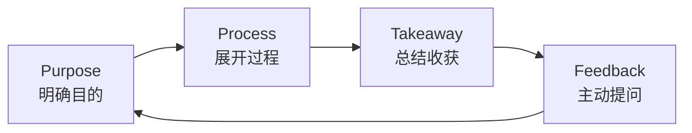
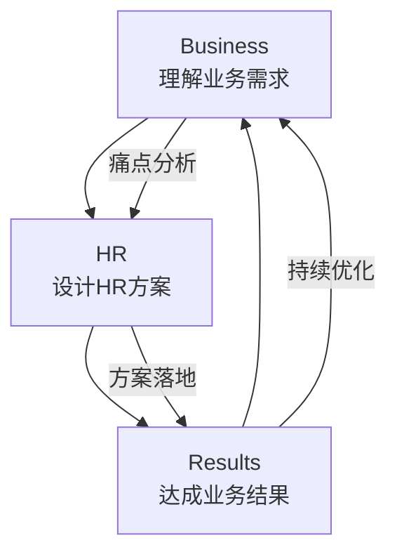
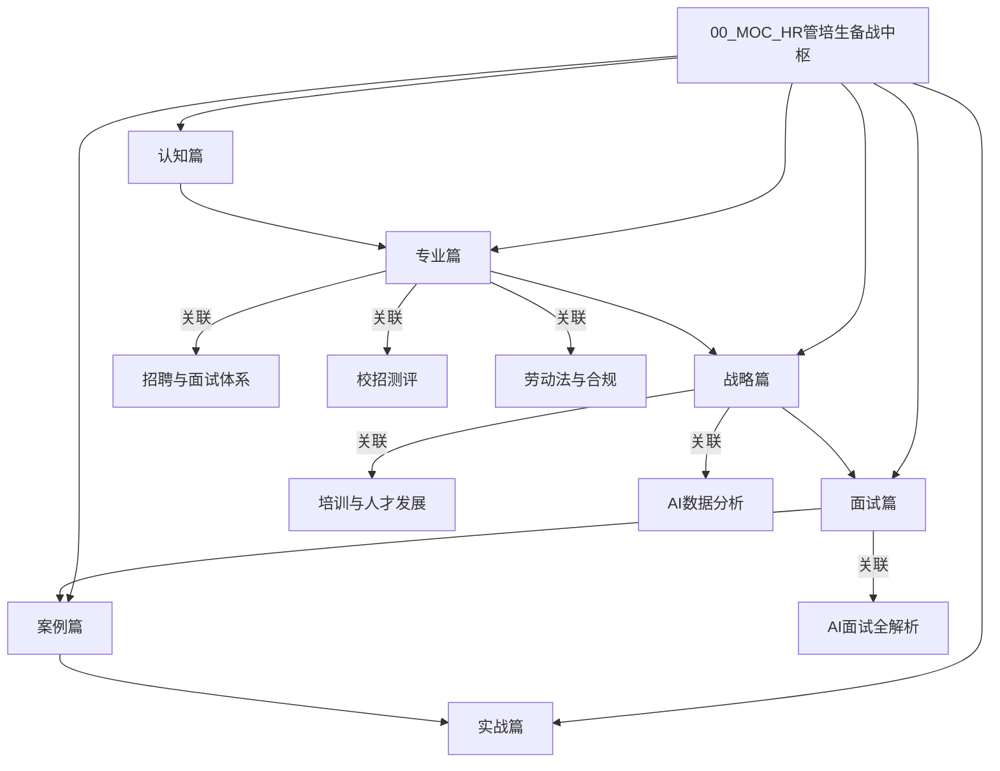

> [!abstract] 核心观点
> 本知识库是HR管培生备战面试的系统性资料库，覆盖**认知篇（3篇）、专业篇（9篇）、战略篇（6篇）、面试篇（6篇）、案例篇（7篇）、实战篇（5篇）** 六大模块，共计36篇文档。以"认知打底→专业筑基→战略拔高→面试实战→案例印证→实战落地"为学习路径，帮助候选人系统化备战HR管培生面试。

---

## 一、六大模块速览

### 模块总览

| 模块 | 数量 | 定位 | 适用阶段 | 核心目标 |
|------|------|------|----------|----------|
| **认知篇** | 3篇 | 认识自我与行业 | 准备期 | 建立对HR管培生项目和HR行业的宏观认知 |
| **专业篇** | 9篇 | 专业知识体系 | 基础期 | 掌握HR六大模块与三支柱等核心专业知识 |
| **战略篇** | 6篇 | 战略思维提升 | 进阶期 | 培养战略视角和业务思维，拉开与其他候选人的差距 |
| **面试篇** | 6篇 | 面试技巧突破 | 冲刺期 | 覆盖全类型面试环节的应对策略 |
| **案例篇** | 7篇 | 实战案例积累 | 强化期 | 通过真实商业案例展现分析能力 |
| **实战篇** | 5篇 | 模拟演练复盘 | 冲刺期 | 全真模拟与复盘优化 |

### 认知篇（3篇）

| 序号 | 文档名称 | 核心内容 | 推荐阅读时间 |
|------|----------|----------|-------------|
| 01 | [[03-HR人事/HR管培生备战/01-认知篇/01_HR管培生是什么|HR管培生是什么]] | 项目本质、成长路径、面试高频问题 | 20min |
| 02 | [[03-HR人事/HR管培生备战/01-认知篇/02_从人事到战略伙伴|从人事到战略伙伴]] | HR进化史、尤里奇模型、2026趋势 | 25min |
| 03 | [[03-HR人事/HR管培生备战/01-认知篇/03_HR管培生核心竞争力模型|HR管培生核心竞争力模型]] | 三圈模型、T型人才、面试高频问题 | 20min |

### 专业篇（9篇）

| 序号 | 文档名称 | 核心内容 | 推荐阅读时间 |
|------|----------|----------|-------------|
| 01 | [[03-HR人事/HR管培生备战/02-专业篇/01_人力资源管理六大模块精要|人力资源管理六大模块精要]] | 六大模块全景图与逻辑闭环 | 30min |
| 02 | [[03-HR人事/HR管培生备战/02-专业篇/02_HR三支柱模型|HR三支柱模型]] | COE/HRBP/SSC角色定位与演进 | 25min |
| 03 | 招聘与面试体系 | 招聘全流程、结构化面试、评价中心 | 30min |
| 04 | 校招测评体系 | 测评工具、AC评估中心、无领导小组 | 25min |
| 05 | 培训与人才发展 | 培训体系设计、IDP、学习路径图 | 30min |
| 06 | 绩效管理体系 | OKR/KPI/BSC、绩效面谈、强制分布 | 30min |
| 07 | 薪酬与福利管理 | 薪酬结构、宽带薪酬、股权激励 | 25min |
| 08 | 员工关系与劳动法 | 劳动合同、离职管理、劳动争议 | 25min |
| 09 | AI+HR数智化 | HR数字化、AI面试、HRIS系统 | 20min |

### 战略篇（6篇）

| 序号 | 文档名称 | 核心内容 | 推荐阅读时间 |
|------|----------|----------|-------------|
| 01 | 战略HR管理 | 战略地图、人力资源规划、人才供应链 | 30min |
| 02 | 组织发展与变革 | OD理论、组织诊断、变革管理八步法 | 30min |
| 03 | 人才管理与梯队建设 | 人才盘点、九宫格、继任计划 | 25min |
| 04 | 企业文化与雇主品牌 | 企业文化模型、雇主价值主张、EVP | 25min |
| 05 | 人效管理与数据分析 | 人效指标、HR数据分析、ROI评估 | 25min |
| 06 | 国际HR与跨文化管理 | 全球化HR、外派管理、跨文化沟通 | 20min |

### 面试篇（6篇）

| 序号 | 文档名称 | 核心内容 | 推荐阅读时间 |
|------|----------|----------|-------------|
| 01 | 面试全流程解析 | 简历→群面→单面→终面→offer谈判 | 20min |
| 02 | 行为面试（BEI） | STAR法则、高频行为问题、案例库 | 25min |
| 03 | 无领导小组讨论 | 角色定位、评分维度、实战策略 | 25min |
| 04 | 案例分析面试 | 商业案例类型、分析框架、实战演练 | 30min |
| 05 | 专业面试（HR方向） | 专业问题库、情景模拟、答题框架 | 30min |
| 06 | 终面与高管面试 | 战略思维、价值观匹配、提问技巧 | 20min |

### 案例篇（7篇）

| 序号 | 文档名称 | 核心内容 | 推荐阅读时间 |
|------|----------|----------|-------------|
| 01 | 华为HR实践 | 轮岗机制、狼性文化、任职资格体系 | 25min |
| 02 | 阿里HR实践 | 政委体系、价值观考核、闻味官 | 25min |
| 03 | 腾讯HR实践 | 产品经理思维做HR、内部活水、职级体系 | 25min |
| 04 | 字节跳动HR实践 | 去中心化组织、OKR实践、人才密度 | 25min |
| 05 | 宝洁/联合利华HR实践 | 管培生项目标杆、领导力培养、轮岗机制 | 25min |
| 06 | 咨询公司HR实践 | 麦肯锡人才观、专业服务公司HR特点 | 20min |
| 07 | 制造业/互联网行业HR对比 | 行业差异、HR策略差异、典型挑战 | 20min |

### 实战篇（5篇）

| 序号 | 文档名称 | 核心内容 | 推荐阅读时间 |
|------|----------|----------|-------------|
| 01 | 自我介绍与简历优化 | 30s/60s/90s版本、简历STAR改写 | 25min |
| 02 | 模拟面试题库 | 200+高频题目、分类索引、难度分级 | 30min |
| 03 | 群面模拟与复盘 | 全真模拟流程、常见失误、复盘模板 | 25min |
| 04 | 终面准备与offer谈判 | 终面问题清单、薪资谈判策略、谈薪话术 | 20min |
| 05 | 备战计划与Schedule | 倒计时计划、每日任务清单、进度追踪 | 15min |
| 06 | [[03-HR人事/HR管培生备战/06-实战篇/06_案例_晋升评审全流程运营|案例：晋升评审全流程运营]] | 400+候选人实战、35场统筹、AI提效、面试叙事 | 30min |

---

## 二、使用指南

### 按面试阶段推荐

| 面试阶段 | 推荐阅读文档 | 优先级 | 建议用时 |
|----------|-------------|--------|---------|
| **简历筛选** | 实战篇01（自我介绍与简历优化） | ★★★★★ | 2天 |
| **笔试/测评** | 专业篇04（校招测评体系） | ★★★★ | 1天 |
| **群面/无领导** | 面试篇03（无领导小组讨论）+ 实战篇03（群面模拟） | ★★★★★ | 3天 |
| **专业一面** | 认知篇全3篇 + 专业篇01-03 | ★★★★★ | 5天 |
| **专业二面** | 专业篇04-09 + 战略篇01-02 | ★★★★ | 4天 |
| **案例面** | 面试篇04（案例分析）+ 案例篇全7篇 | ★★★★★ | 4天 |
| **HR面** | 面试篇02（行为面试）+ 面试篇05（专业面试） | ★★★★ | 2天 |
| **终面/高管面** | 战略篇全6篇 + 面试篇06（终面） | ★★★★★ | 3天 |
| **Offer谈判** | 实战篇04（终面准备与offer谈判） | ★★★ | 1天 |

### 按薄弱环节推荐

| 薄弱环节 | 推荐文档 | 学习路径 |
|----------|---------|----------|
| 专业基础薄弱 | 认知篇 + 专业篇01-03 | 认知打底→模块学习→三支柱理解 |
| 战略思维不足 | 战略篇全6篇 + 案例篇标杆企业 | 理论框架→企业案例→思维内化 |
| 面试技巧欠缺 | 面试篇全6篇 + 实战篇02-03 | 方法学习→题库练习→模拟复盘 |
| 案例分析不会 | 面试篇04 + 案例篇全7篇 | 框架学习→案例拆解→独立练习 |
| 无领导小组吃力 | 面试篇03 + 实战篇03 | 角色认知→策略学习→模拟实战 |

---

## 三、核心思维框架

### PPT思维框架（Purpose - Process - Takeaway）

面试中任何问题的回答都可遵循此框架：



| 环节 | 核心问题 | 话术示例 |
|------|---------|---------|
| **P** - Purpose | 面试官问这个问题想考察什么？ | "我认为这个问题想考察的是……" |
| **P** - Process | 我的经历/观点是什么？如何展开？ | "我通过以下三个方面来展开……" |
| **T** - Takeaway | 从中我学到了什么？有什么成果？ | "最终我收获了……带来……的成果" |
| **F** - Feedback | 是否有需要进一步了解的？ | "不知道我是否说清楚了？" |

### BHR思维框架（Business - HR - Results）

展示HR与业务结合的思维：



### STAR法则（Situation - Task - Action - Result）

行为面试的黄金框架：

| 要素 | 核心要点 | 常见错误 | 高分示例 |
|------|---------|---------|---------|
| **S** - Situation | 背景清晰、具体时间/场景 | 过于笼统，"在实习期间" | "在XX公司暑期实习的第3周，团队面临……" |
| **T** - Task | 明确目标、量化指标 | 与S混淆 | "我的核心任务是……目标是将……提升10%" |
| **A** - Action | 个人行动、思维过程 | 说"我们"而非"我" | "我首先分析了……然后设计了……最终推动了……" |
| **R** - Result | 量化成果、可验证 | 模糊描述 | "最终使招聘周期缩短了15%，成本降低了20%" |

---

## 四、知识库关联

### 关联知识库

| 知识库名称 | 关联内容 | 入口 |
|-----------|---------|------|
| **招聘与面试体系** | 面试篇、专业篇03 | [[03-HR人事/招聘与面试体系/00_MOC_招聘与面试体系中枢]] |
| **校招测评** | 专业篇04、面试篇03 | [[03-HR人事/校招测评/校招测评知识库_建设方案_v2]] |
| **AI数据分析** | 专业篇09、战略篇05 | [[06-数据分析/AI数据分析/AI数据分析知识库_建设方案]] |
| **培训与人才发展** | 专业篇05、战略篇03 | [[03-HR人事/培训与人才发展/培训与人才发展_知识库建设方案]] |
| **劳动法与合规** | 专业篇08 | [[03-HR人事/劳动法与合规/00_MOC_劳动法与合规中枢]] |
| **AI面试全解析** | 面试篇05、专业篇09 | [[03-HR人事/AI面试全解析/00_MOC_AI面试全解析中枢]] |

### 交叉引用示例



---

## 五、学习路径建议

### 路径A：系统学习（推荐，4-6周）

```
第1周：认知篇 x 3 + 专业篇 x 3（六大模块+三支柱+招聘体系）
第2周：专业篇 x 4（培训+绩效+薪酬+员工关系）+ 专业篇 x 2（校招+AI+HR）
第3周：战略篇 x 6
第4周：面试篇 x 3 + 案例篇 x 3
第5周：案例篇 x 4 + 面试篇 x 3
第6周：实战篇 x 5 + 全真模拟
```

### 路径B：应急突击（1-2周）

```
第1-3天：认知篇 x 3 + 专业篇01（六大模块）+ 专业篇02（三支柱）
第4-6天：面试篇02（行为面试）+ 面试篇03（群面）+ 面试篇04（案例分析）
第7-10天：案例篇top3（华为+阿里+字节）
第11-14天：实战篇全5篇 + 全真模拟
```

---

> [!tip] 学习建议
> 1. 每个文档先读`> [!abstract]`核心观点，快速建立框架
> 2. 面试题部分建议先自己尝试回答，再看参考回答
> 3. Mermaid流程图建议在Obsidian中打开查看渲染效果
> 4. 建议按"学习→练习→复盘"循环进行，每篇文档学习后完成一次模拟回答
> 5. 推荐使用Anki或Obsidian的Spaced Repetition插件进行复习