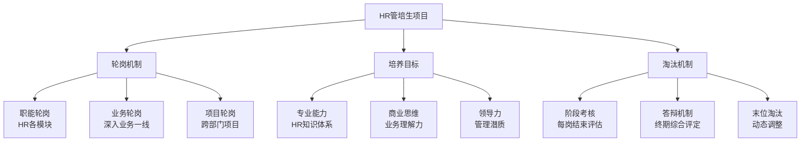
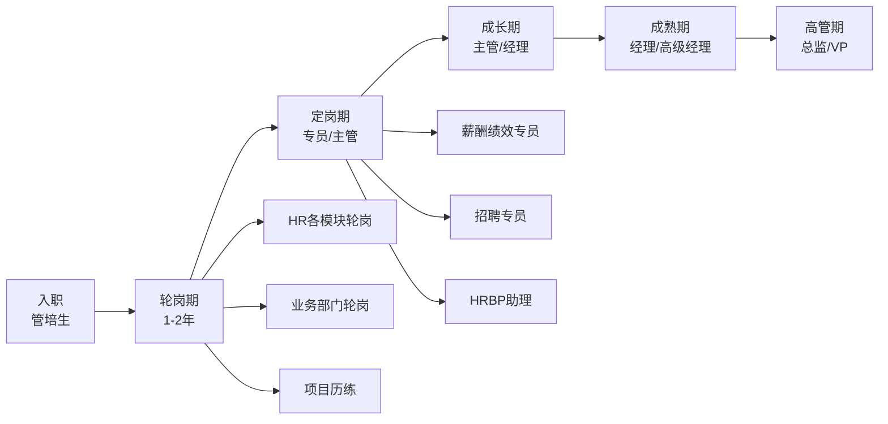

> [!abstract] 核心观点
> HR管培生项目是一种**高潜人才快速培养计划**，通过系统化的轮岗、培训和导师制，在1-3年内将应届生培养为具备全面HR视野和业务思维的复合型管理人才。其核心不在于"轮了多少岗"，而在于**通过轮岗建立起对HR全价值链的系统认知**，并最终形成"懂业务、懂人性、懂组织"的竞争力三角。

---

## 一、管培生项目的本质

### 1.1 三大核心机制

| 机制 | 核心要素 | 典型时长 | 关键产出 |
|------|---------|---------|---------|
| **轮岗机制** | 职能轮岗 + 业务轮岗 + 项目轮岗 | 每个岗位2-6个月 | 轮岗报告、项目成果、能力评估 |
| **培养目标** | 专业能力 + 商业思维 + 领导力 | 总周期1-3年 | 定岗定级、晋升通道 |
| **淘汰机制** | 阶段考核 + 答辩 + 末位淘汰 | 每阶段末 | 继续/淘汰/延期 |

### 1.2 轮岗的三种模式

| 模式 | 代表企业 | 特点 | 优劣 |
|------|---------|------|------|
| **广度优先** | 宝洁、联合利华 | 全模块轮岗，覆盖面广 | 视野全面，但深度不足 |
| **深度优先** | 华为、腾讯 | 聚焦2-3个核心模块深耕 | 专业扎实，但视野受限 |
| **定制化** | 字节跳动、美团 | 根据个人特质和业务需求定制 | 灵活度高，但体系化弱 |

---

## 二、典型成长路径

### 2.1 成长路径全景图

### 2.2 各阶段详细说明

| 阶段 | 时间 | 职级 | 核心任务 | 关键能力 |
|------|------|------|----------|---------|
| **轮岗期** | 0-18个月 | 管培生 | 完成3-5个岗位轮岗，每个岗位输出项目成果 | 快速学习、适应能力、沟通协作 |
| **定岗期** | 18-30个月 | 专员/主管 | 选定方向，独立负责模块工作 | 专业深度、执行力、问题解决 |
| **成长期** | 30-48个月 | 主管/经理 | 带团队，管理小团队 | 团队管理、跨部门协调、项目推动 |
| **成熟期** | 48-72个月 | 经理/高级经理 | 负责模块体系搭建，参与HR策略 | 战略思维、体系搭建、影响力 |
| **高管期** | 72个月+ | 总监/VP | 主导HR战略，参与业务决策 | 战略思维、领导力、商业洞察 |

### 2.3 能力成长曲线

| 阶段 | 专业能力 | 商业能力 | 领导力 | 说明 |
|------|---------|---------|--------|------|
| 轮岗期 | ★★ | ★ | ★ | 以学习输入为主 |
| 定岗期 | ★★★ | ★★ | ★ | 独立执行，开始理解业务 |
| 成长期 | ★★★★ | ★★★ | ★★★ | 带团队，与业务深度合作 |
| 成熟期 | ★★★★ | ★★★★ | ★★★★ | 体系搭建，策略参与 |
| 高管期 | ★★★★★ | ★★★★★ | ★★★★★ | 战略决策，组织变革 |

---

## 三、HR管培生与其他岗位管培生的区别

### 3.1 横向对比

| 对比维度 | HR管培生 | 市场管培生 | 财务管培生 | 技术管培生 |
|----------|---------|-----------|-----------|-----------|
| **核心能力** | 沟通、同理心、组织 | 创意、数据、渠道 | 分析、合规、风控 | 技术、逻辑、创新 |
| **轮岗范围** | 招聘/培训/薪酬/绩效等 | 品牌/渠道/PR/市场 | 核算/预算/税务/审计 | 研发/产品/测试/运维 |
| **培养目标** | 首席人力官/HRBP Leader | CMO/市场总监 | CFO/财务总监 | CTO/技术总监 |
| **面试重点** | 综合素质+HR专业认知 | 商业敏感度+创意 | 逻辑分析+专业扎实 | 技术能力+学习能力 |
| **竞争强度** | 较高（非技术岗热门） | 高（热门方向） | 中等 | 中等（技术岗位多） |
| **典型薪资** | 15-25K/月 | 15-25K/月 | 15-20K/月 | 20-35K/月 |

### 3.2 HR管培生的独特挑战

| 挑战 | 具体表现 | 应对策略 |
|------|---------|---------|
| **价值证明难** | HR产出难以量化，业务部门不认可 | 学会用业务语言表达HR价值，建立数据化思维 |
| **轮岗碎片化** | 每个岗位时间短，难以深入 | 建立知识体系框架，每个岗位设定明确的学习目标 |
| **身份认同模糊** | 既是管培生又是HR新人，双重身份 | 明确自己的定位：既是学习者也是贡献者 |
| **跨部门沟通压力** | 与业务部门、其他HR模块协调 | 培养服务意识，建立专业信任 |
| **淘汰焦虑** | 阶段性考核压力 | 把考核视为反馈机会，持续改进 |

---

## 四、面试高频问题

### 问题1："你为什么选择HR管培生？"

| 项目 | 内容 |
|------|------|
| **考察点** | 动机匹配度、对管培生项目的理解、职业规划清晰度 |
| **答题框架** | **PPT框架**：Purpose（动机）→ Process（准备过程）→ Takeaway（自我认知） |

**参考回答：**

> 我选择HR管培生主要基于三个层面的考虑：
>
> **第一，价值观契合。** 我一直认为"人的发展是组织成功的基石"，HR恰好是连接个人成长与组织目标的桥梁。在实习中我观察到，优秀的HR能够通过人才管理直接推动业务增长，这让我对这个岗位充满热情。
>
> **第二，成长路径吸引。** 管培生项目提供的系统化轮岗和导师制，能帮助我在短时间内建立起对HR全价值链的认知。相比直接定岗，管培生的轮岗机制让我有机会在1-2年内接触招聘、培训、绩效等不同模块，找到最适合自己的方向。
>
> **第三，能力匹配。** 我的沟通能力、数据分析能力和同理心让我具备做好HR的基础。在XX实习期间，我主导了XX项目，取得了XX成果，这让我确信自己适合这个方向。
>
> 综上，我认为HR管培生是我职业发展的最佳起点。

| 得分点 | 加分表现 | 扣分表现 |
|--------|---------|---------|
| 动机真实可信 | 结合个人经历，有具体故事 | 空洞说"喜欢HR"，无实质内容 |
| 对项目有认知 | 提到轮岗、导师制等具体机制 | 只说"想进大公司" |
| 职业规划清晰 | 分阶段描述成长路径 | 表现出迷茫或不确定 |
| 展示匹配度 | 用经历证明能力匹配 | 只说自己想学什么 |

### 问题2："你理解HR管培生和普通HR岗位的区别吗？"

| 项目 | 内容 |
|------|------|
| **考察点** | 对项目本质的理解、思维深度、格局大小 |
| **答题框架** | **对比框架**：定位差异 → 培养方式差异 → 职业发展差异 |

**参考回答：**

> 我认为核心区别体现在三个层面：
>
> **第一，定位不同。** 普通HR岗位是"职能执行者"，负责特定模块的日常运作；而HR管培生是"未来管理者预备役"，目标是培养具备全局视野的HR Leader。管培生从一开始就被要求带着"管理视角"去看问题。
>
> **第二，培养方式不同。** 普通HR入职后直接定岗，深度积累单一模块经验；管培生则通过轮岗获得广度认知，再在轮岗后选择方向深耕。一个是"先深后广"，一个是"先广后深"。
>
> **第三，发展速度不同。** 管培生通常有加速晋升通道，如果在轮岗期间表现优秀，定岗后可能直接定为主管级别，而普通HR通常需要3-5年才能晋升到主管。但这也意味着管培生面临更高的期望和更大的压力。
>
> 简单来说，普通HR岗位和HR管培生不是"好与不好"的区别，而是"职业路径选择"的区别——一个追求专业纵深的确定性，一个追求全面发展的加速通道。

| 得分点 | 加分表现 | 扣分表现 |
|--------|---------|---------|
| 对比维度清晰 | 从定位、培养、发展三个维度对比 | 只说了"管培生轮岗"这一个点 |
| 有辩证思考 | 承认两种路径各有利弊 | 一味贬低普通岗位 |
| 展现思维深度 | 提到"管理者视角"、"预备役"等概念 | 停留在表面描述 |
| 有个人见解 | 加入自己的理解和选择理由 | 机械背诵定义 |

### 问题3："你如何看待管培生的淘汰机制？"

| 项目 | 内容 |
|------|------|
| **考察点** | 抗压能力、对竞争的态度、自我认知 |
| **答题框架** | **认知-态度-行动**框架 |

**参考回答：**

> 我理解的淘汰机制，本质上是一种"动态匹配"机制，而不是简单的"优胜劣汰"。
>
> **第一，从公司角度看，** 淘汰机制保证了管培生项目的质量。一个项目如果"只进不出"，会稀释项目资源，也影响其他管培生的培养质量。而且，淘汰机制本身也是一种筛选——能承受压力、持续成长的人，才是企业真正需要的人才。
>
> **第二，从个人角度看，** 淘汰机制是外部压力转化为内部动力的催化剂。我在实习期间就经历过类似的考核机制，我的应对方式是：把每个阶段的考核目标拆解为可执行的行动计划，每周复盘进度，主动寻求反馈。这样做的好处是，我不再是被动地被考核，而是主动地管理自己的成长。
>
> **第三，我理解淘汰可能不是终点。** 即使某个阶段的表现没有达到预期，这段经历本身也是有价值的——它帮助我更清晰地认识自己的优势和不足。
>
> 总的来说，我认为淘汰机制是管培生项目的一部分，与其焦虑不如积极面对，把它当作成长加速器。

| 得分点 | 加分表现 | 扣分表现 |
|--------|---------|---------|
| 态度积极 | 正面看待淘汰机制 | 表现出过度焦虑或排斥 |
| 有具体应对策略 | 提到目标拆解、复盘等具体方法 | 只说"我会努力" |
| 有辩证思考 | 承认淘汰机制的双面性 | 过于理想化或过于悲观 |
| 展现抗压能力 | 有过类似经历并成功应对 | 没有相关经历支撑 |

### 问题4："你期望从管培生项目中学到什么？"

| 项目 | 内容 |
|------|------|
| **考察点** | 学习目标清晰度、主动性、成长心态 |
| **答题框架** | **三个维度**：专业能力 → 商业思维 → 领导力 |

**参考回答：**

> 我希望通过管培生项目在三个维度实现成长：
>
> **第一，专业深度。** 通过轮岗，我希望建立起HR全模块的实战经验，同时在1-2个模块（目前我比较倾向招聘和培训方向）形成专业深度，成为"T型人才"。
>
> **第二，商业思维。** 这是我非常看重的一点。我希望通过业务轮岗和项目历练，学会用商业语言与业务部门对话，理解企业经营的底层逻辑，真正成为一个"懂业务"的HR。
>
> **第三，领导力。** 管培生项目的导师制和项目制给了我学习和实践领导力的机会。我希望在项目中不断提升自己的影响力、沟通能力和团队协作能力，为未来带团队打好基础。
>
> 同时，我也很清楚，学习不是单向的索取——我希望能用自己的专业知识和创新思维，在轮岗的每个岗位上都做出实际贡献。

| 得分点 | 加分表现 | 扣分表现 |
|--------|---------|---------|
| 目标具体可衡量 | 分维度有层次地说明 | 笼统说"想学东西" |
| 有双向思维 | 也提到自己能为公司做什么 | 只说"我想获得什么" |
| 展现主动性 | 提到具体的学习方法 | 被动等待安排 |
| 与项目匹配 | 期望与企业培养目标一致 | 期望与项目目标有偏差 |

---

> [!tip] 面试准备建议
> 1. 回答"为什么选择HR管培生"时，一定要结合个人经历，不要背诵标准答案
> 2. 回答"HR管培生与普通HR的区别"时，展现你的思考深度，不要只说"轮岗"
> 3. 关于淘汰机制，态度要积极，但要真实，不要过于"表演"
> 4. 建议提前了解目标企业的管培生项目具体设计，面试中展现你的研究深度
> 5. 关联阅读：[[03-HR人事/HR管培生备战/01-认知篇/03_HR管培生核心竞争力模型]] 了解能力要求，[[03-HR人事/HR管培生备战/00_MOC_HR管培生备战中枢]] 回到知识库中枢