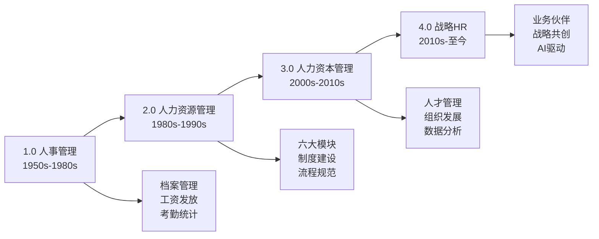
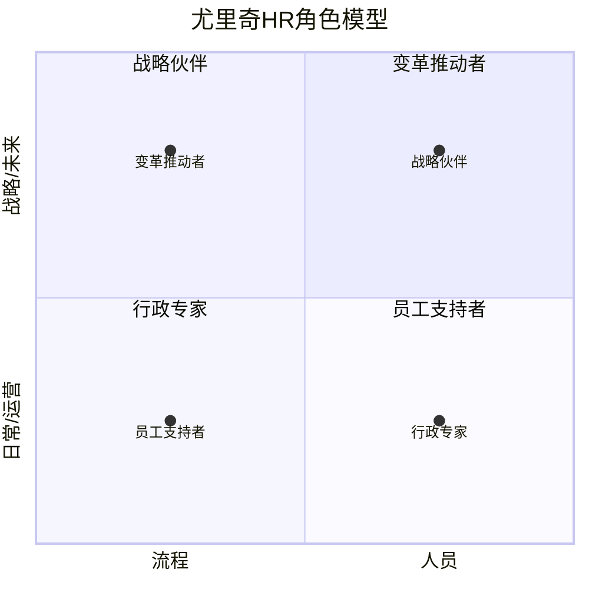
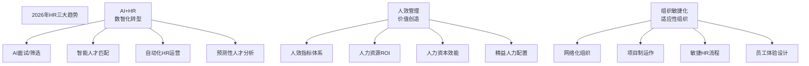

> [!abstract] 核心观点
> HR的职能定位经历了从"行政事务处理者"到"战略合作伙伴"的深刻转型。理解这一进化历程，不仅是面试中展现专业素养的关键，更是建立HR战略思维的**认知基础**。2026年的HR，正站在AI+HR、人效管理、组织敏捷化三大趋势的交汇点上，**懂业务、懂数据、懂人性**成为新一代HR的核心竞争力。

---

## 一、HR进化史四阶段

### 1.1 四阶段全景图

| 阶段 | 时间跨度 | 核心定位 | 关键词 | 典型角色 |
|------|---------|---------|--------|---------|
| **1.0 人事管理** | 1950s-1980s | 行政事务处理者 | 档案、工资、考勤 | "人事科员" |
| **2.0 人力资源管理** | 1980s-1990s | 专业职能管理者 | 六大模块、制度建设 | "HR专员" |
| **3.0 人力资本管理** | 2000s-2010s | 人才价值创造者 | 人才管理、OD、数据 | "HR专家" |
| **4.0 战略HR** | 2010s-至今 | 战略合作伙伴 | 业务伙伴、AI、敏捷 | "HRBP/战略HR" |

### 1.2 各阶段深度解析

#### 1.0 人事管理时代（1950s-1980s）

| 维度 | 特征 |
|------|------|
| **驱动因素** | 工业化生产需要标准化劳动力管理 |
| **核心职能** | 员工档案管理、工资核算、考勤统计、劳动关系维护 |
| **组织地位** | 行政后勤部门，被动执行，地位边缘 |
| **从业人员** | 行政人员转型，专业技能要求低 |
| **核心工具** | 纸质档案、打字机、计算器 |
| **局限** | 事务导向，缺乏战略价值，被视为"成本中心" |

#### 2.0 人力资源管理时代（1980s-1990s）

| 维度 | 特征 |
|------|------|
| **驱动因素** | 企业竞争加剧，人才成为竞争要素 |
| **核心职能** | 六大模块体系化建设（规划/招聘/培训/绩效/薪酬/员工关系） |
| **组织地位** | 独立职能部门，有一定话语权 |
| **从业人员** | 开始专业化，HR专业教育兴起 |
| **核心工具** | HR信息系统、KPI考核、任职资格体系 |
| **里程碑** | 1984年，哈佛商学院提出"人力资源管理"框架 |

#### 3.0 人力资本管理时代（2000s-2010s）

| 维度 | 特征 |
|------|------|
| **驱动因素** | 知识经济崛起，人才成为核心资本 |
| **核心职能** | 人才管理、组织发展、领导力开发、HR数据分析 |
| **组织地位** | 战略职能部门，参与业务决策 |
| **从业人员** | 高学历、专业化，开始出现HRBP角色 |
| **核心工具** | 人才盘点、九宫格、E-HR系统、OKR |
| **里程碑** | 2001年，戴维·尤里奇提出HR角色模型 |

#### 4.0 战略HR时代（2010s-至今）

| 维度 | 特征 |
|------|------|
| **驱动因素** | VUCA/BANI时代，组织敏捷性成为核心竞争力 |
| **核心职能** | 战略共创、组织变革、人效管理、AI+HR |
| **组织地位** | 战略核心部门，HR成为CEO的"左膀右臂" |
| **从业人员** | 复合型人才，懂业务+懂HR+懂数据+懂技术 |
| **核心工具** | AI面试、HRIS系统、People Analytics、OKR/CFR |
| **趋势** | 2026年，AI+HR全面落地，人效管理成为核心命题 |

---

## 二、戴维·尤里奇的HR角色模型

### 2.1 经典四角色模型

| 角色 | 定位 | 核心产出 | 典型工作 | 占比（理想） |
|------|------|---------|---------|------------|
| **战略伙伴** | 战略执行 | 战略落地 | 人力资源规划、组织诊断 | 30% |
| **行政专家** | 基础流程 | 效率提升 | 流程优化、HR共享服务 | 20% |
| **员工支持者** | 员工关系 | 员工敬业度 | 员工关怀、文化落地 | 20% |
| **变革推动者** | 组织变革 | 变革能力 | 组织变革、文化建设 | 30% |

### 2.2 角色演进：从四角色到六角色

2015年，尤里奇将模型扩展为六角色：

| 角色 | 核心问题 | 关键产出 | 面试中的应用 |
|------|---------|---------|-------------|
| **战略定位者** | 我们如何赢得市场？ | 人才战略与业务战略对齐 | 回答"HR如何支持业务"时引用 |
| **人力资本开发者** | 我们如何培养未来人才？ | 人才梯队、继任计划 | 回答"如何做人才发展"时引用 |
| **薪酬与福利设计者** | 我们如何激励员工？ | 总奖酬策略、激励体系 | 结合薪酬模块回答 |
| **合规与道德守护者** | 我们如何确保公平？ | 合规体系、员工关系 | 展现对劳动法的重视 |
| **组织变革引导者** | 我们如何推动变革？ | 变革管理、文化建设 | 回答"HR在变革中的角色"时引用 |
| **技术与数据整合者** | 我们如何利用数据和AI？ | HR数据分析、AI工具应用 | 展现"懂技术"的差异化优势 |

### 2.3 面试中运用尤里奇模型的技巧

| 场景 | 运用方式 | 示例话术 |
|------|---------|---------|
| "你理解的HR是什么" | 用四角色定义HR | "我认为HR扮演四个角色……其中战略伙伴角色越来越重要" |
| "HR如何创造价值" | 引用角色产出 | "HR通过战略伙伴角色确保人才支撑业务，通过行政专家角色提升效率……" |
| "你怎么看HR的未来" | 引用六角色中的技术角色 | "尤里奇在2015年增加了'技术与数据整合者'角色，说明HR的技术化是必然趋势" |
| "你的职业规划" | 对标角色能力 | "我希望在3-5年内具备战略伙伴和变革推动者的能力" |

---

## 三、2026年HR最新趋势

### 3.1 三大趋势总览

### 3.2 趋势一：AI+HR数智化转型

| 应用场景 | 技术方案 | 典型工具 | 对HR的影响 |
|---------|---------|---------|-----------|
| **智能招聘** | NLP+CV解析 | AI简历筛选、智能面试 | 招聘效率提升50%以上 |
| **人才匹配** | 知识图谱+推荐算法 | 内部人才市场、活水系统 | 人才配置更精准 |
| **员工服务** | 大语言模型+对话机器人 | HR智能助理、员工自助服务 | 基础问答工作减少80% |
| **绩效管理** | 自然语言处理+行为分析 | 360度反馈分析、绩效预测 | 绩效评估更客观 |
| **学习发展** | 自适应学习+推荐系统 | 个性化学习路径、智能导师 | 培训ROI提升30%+ |
| **人才分析** | 预测建模+可视化 | 离职预测、敬业度分析 | 从"后视镜"到"望远镜" |

**面试考点：** 面试官通常会问"你如何看待AI对HR行业的影响？"或"AI会取代HR吗？"

| 项目 | 内容 |
|------|------|
| **考察点** | 对技术趋势的敏感度、辩证思考能力、AI与HR关系的理解 |
| **答题框架** | 承认影响 → 指出局限 → 提出应对 |

**参考回答：**

> 我认为AI对HR的影响是深刻但非替代性的。
>
> **第一，AI将重塑HR的工作方式。** 在招聘、员工服务、数据分析等事务性工作中，AI可以大幅提升效率。例如，AI可以在几秒钟内完成人工需要几小时的简历筛选，让HR有更多时间做更有价值的工作。
>
> **第二，AI无法替代HR的核心价值。** 战略决策、同理心沟通、组织变革、文化塑造、复杂谈判——这些需要"人性"的工作，AI很难替代。HR的本质是"人"的工作，这是AI的盲区。
>
> **第三，对HR从业者来说，趋势不是"防替代"，而是"会使用"。** 未来的HR需要具备"人机协作"能力——用AI处理数据分析，用人类智慧处理人情世故。这也是为什么我在学习HR的同时，也在学习数据分析工具和AI工具。

### 3.3 趋势二：人效管理

| 维度 | 传统HR | 人效管理 |
|------|--------|---------|
| **关注点** | 做了多少事 | 创造了多少价值 |
| **核心指标** | 招聘完成率、培训覆盖率 | 人均产出、人力资本ROI |
| **管理方式** | 经验驱动 | 数据驱动 |
| **HR角色** | 服务提供者 | 价值创造者 |
| **典型工具** | HR报表 | People Analytics |

**常见人效指标：**

| 指标类别 | 具体指标 | 计算公式 |
|---------|---------|---------|
| **效率指标** | 人均产出 | 营收/员工总数 |
| | 人均利润 | 净利润/员工总数 |
| | 人力成本占比 | 人力成本/总成本 |
| **效果指标** | 招聘ROI | （新员工产出-招聘成本）/招聘成本 |
| | 培训ROI | （培训收益-培训成本）/培训成本 |
| **健康指标** | 关键人才流失率 | 关键人才流失数/关键人才总数 |
| | 敬业度得分 | 敬业度调研得分 |

### 3.4 趋势三：组织敏捷化

| 维度 | 传统组织 | 敏捷组织 |
|------|---------|---------|
| **结构** | 科层制、职能制 | 网络化、扁平化 |
| **决策** | 自上而下、层层审批 | 授权一线、快速决策 |
| **人才** | 稳定、长期雇佣 | 灵活、内外部流动 |
| **文化** | 控制、标准化 | 信任、自主性 |
| **HR流程** | 年度、统一 | 实时、个性化 |
| **典型案例** | 传统制造业 | 字节跳动、Netflix |

---

## 四、面试高频问题

### 问题1："你怎么看HR未来的发展趋势？"

| 项目 | 内容 |
|------|------|
| **考察点** | 行业洞察力、学习能力、战略思维 |
| **答题框架** | **BHR框架**：Business趋势 → HR响应 → 个人准备 |

**参考回答：**

> 我认为HR的未来发展可以从三个趋势来看：
>
> **第一，AI+HR：效率革命。** AI正在改变HR的工作方式。从AI简历筛选到智能面试，从员工服务机器人到预测性人才分析，HR的日常工作效率将大幅提升。但这不意味着HR被替代，而是要求HR学会"人机协作"。
>
> **第二，人效管理：价值证明。** 越来越多的企业要求HR从"成本中心"变为"价值中心"。这意味着HR需要学会用数据说话，用商业语言呈现HR的贡献。人效指标（如人均产出、人力资本ROI）将成为HR的核心KPI。
>
> **第三，组织敏捷化：能力升级。** 在VUCA时代，组织需要更灵活地适应变化。HR需要从"流程管理者"转型为"组织设计者"，推动组织向更扁平、更灵活的方向演进。
>
> **对个人而言，** 这些趋势意味着：未来的HR需要"三合一"能力——懂业务（商业思维）、懂数据（分析能力）、懂人性（同理心沟通）。这也是我在准备面试时重点培养的方向。

| 得分点 | 加分表现 | 扣分表现 |
|--------|---------|---------|
| 趋势准确 | 提到AI、人效、敏捷三大趋势 | 只说"HR越来越重要"这种空话 |
| 有个人见解 | 有自己的分析和判断 | 机械列举趋势，没有个人观点 |
| 联系自身 | 说明这些趋势对自己的影响 | 只说趋势，不联系个人 |
| 展现知识面 | 引用尤里奇、人效指标等专业概念 | 停留在常识层面 |

### 问题2："你认为HR部门是成本中心还是价值中心？"

| 项目 | 内容 |
|------|------|
| **考察点** | 对HR价值的理解深度、商业思维、辩证思考 |
| **答题框架** | **辩证框架**：现状 → 转变 → 路径 |

**参考回答：**

> 这个问题不能简单回答"是"或"不是"，我认为HR正处在从"成本中心"向"价值中心"转型的过程中。
>
> **从现状看，** 很多企业的HR部门确实还是"成本中心"——HR的预算被看作"管理费用"，HR的产出难以量化，HR的工作价值主要靠"做了多少事"而非"创造了什么价值"来衡量。
>
> **从趋势看，** 优秀企业已经证明HR可以成为"价值中心"——通过人才管理驱动业务增长，通过组织发展提升运营效率，通过文化建设增强团队凝聚力。谷歌的People Analytics团队就是一个典型的例子，他们用数据证明了优秀人才管理对业务绩效的直接影响。
>
> **从路径看，** HR要实现从成本中心到价值中心的转变，需要三个关键动作：第一，建立数据化思维，用数据说话；第二，深入业务，帮助业务解决实际问题；第三，从"被动响应"转向"主动创造"，提前预判组织和业务的需求。
>
> 我认为，未来的HR一定是"价值中心"，而这需要每一代HR人共同努力。

| 得分点 | 加分表现 | 扣分表现 |
|--------|---------|---------|
| 辩证思考 | 不简单地二元对立 | 只说"是价值中心"显得理想化 |
| 有具体案例 | 引用谷歌等公司的实践 | 空谈理论，没有案例支持 |
| 有路径建议 | 提出具体的转变方法 | 只说问题，不说解决方案 |
| 展现商业思维 | 用ROI、量化等商业语言 | 只从HR角度谈价值 |

### 问题3："你如何理解'HR是业务伙伴'这句话？"

| 项目 | 内容 |
|------|------|
| **考察点** | 对HRBP角色的理解、业务思维、沟通能力 |
| **答题框架** | **BHR框架**：Business → HR → Results |

**参考回答：**

> "HR是业务伙伴"意味着HR不能只做"后勤支持"，而要成为业务的"共创者"。我认为可以从三个层面理解：
>
> **第一，懂业务是前提。** 业务伙伴不是"坐在业务旁边"，而是"理解业务痛点"。HR需要了解业务部门的战略目标、核心挑战、团队状况，才能提供有针对性的HR解决方案。比如，如果业务部门正在冲刺新市场，HR的招聘策略就应该优先支持市场开拓岗位。
>
> **第二，解决方案是核心。** 业务伙伴不仅要"理解"业务，还要能"解决"业务问题。当业务部门遇到人才短缺、团队士气低落、组织效率低下等问题时，HR需要给出专业的、可落地的解决方案，而不是简单的"我帮你招人"或"我帮你做个培训"。
>
> **第三，共创是最高境界。** 最高级别的业务伙伴，是在业务制定战略时就能参与其中，从"人"和"组织"的角度提出建议。比如，在业务讨论新业务方向时，HR可以提前思考"我们需要什么样的人才？""现有团队能否支撑？""组织架构需要如何调整？"
>
> 总的来说，成为业务伙伴不是HR的"目标"，而是HR的"能力"——只有具备业务理解力、专业解决问题的能力和战略思维，才能真正成为业务伙伴。

| 得分点 | 加分表现 | 扣分表现 |
|--------|---------|---------|
| 理解层次清晰 | 从懂业务→解决方案→共创三个层次 | 停留在"HR要懂业务"的表面 |
| 有具体场景 | 结合业务场景举例说明 | 抽象描述，没有实际场景 |
| 展现专业能力 | 结合HR专业知识给出方案 | 只说"HR要支持业务"，没有具体方法 |
| 有高度 | 提到"战略共创"的高阶定位 | 把HRBP等同于"HR客服" |

### 问题4："你如何理解人性化管理和制度化管理的平衡？"

| 项目 | 内容 |
|------|------|
| **考察点** | 管理思维成熟度、辩证思考、价值观 |
| **答题框架** | **平衡框架**：制度是底线 → 人性是上限 → 场景化应用 |

**参考回答：**

> 我认为制度化和人性化不是对立关系，而是"底线"和"上限"的关系。
>
> **制度化是底线。** 没有制度，组织就是一团散沙。制度保障了公平性、可预测性和合规性。比如，薪酬制度保障了同工同酬，考勤制度保障了基本的工作秩序。
>
> **人性化是上限。** 在制度的基础上，人性化管理提升员工体验和敬业度。比如，弹性工作制就是在制度框架内的人性化设计，既保障了工作秩序，又尊重了员工个性。
>
> **关键在场景化应用。** 不同场景需要不同的平衡点。在合规敏感的场景（如薪酬核算、离职处理），制度化为主；在激励场景（如员工关怀、团队建设），人性化为主。优秀的管理者懂得在什么场景下"讲制度"，在什么场景下"讲人情"。
>
> 总的来说，制度化管理是"不让好人变坏"，人性化管理是"让好人更好"——两者缺一不可。

| 得分点 | 加分表现 | 扣分表现 |
|--------|---------|---------|
| 辩证思维 | 不把两者对立，而是互补 | 偏执一端，否定另一端的价值 |
| 有场景意识 | 区分不同场景的平衡点 | 给出"一刀切"的答案 |
| 有金句概括 | "底线和上限"的表述 | 平淡无奇，没有亮点 |
| 展现管理思维 | 从管理角度而非员工角度回答 | 只从个人喜好出发 |

---

> [!tip] 本篇学习建议
> 1. 本篇是"认知篇"的核心，建议在阅读[[03-HR人事/HR管培生备战/01-认知篇/01_HR管培生是什么]]之后学习
> 2. 重点掌握HR进化史四阶段和尤里奇模型，这是面试高频考点
> 3. 2026年三大趋势（AI+HR、人效管理、组织敏捷化）一定要有自己的见解
> 4. 面试中展现"行业洞察力"是拉开与其他候选人差距的关键
> 5. 关联阅读：[[03-HR人事/HR管培生备战/01-认知篇/03_HR管培生核心竞争力模型]]，了解如何培养战略HR所需的能力