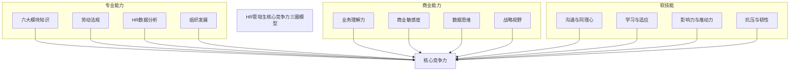
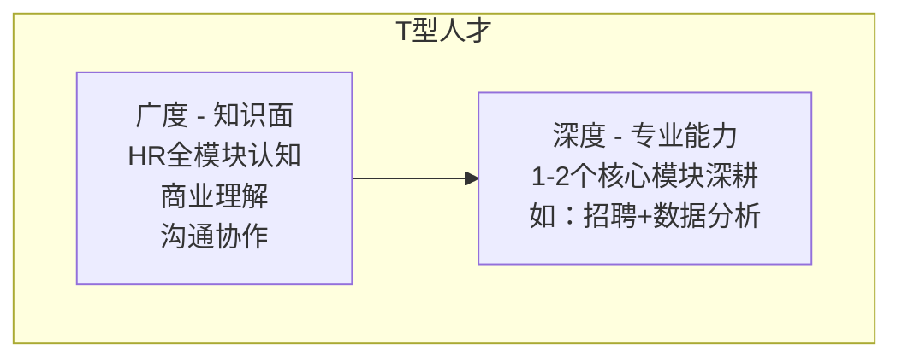
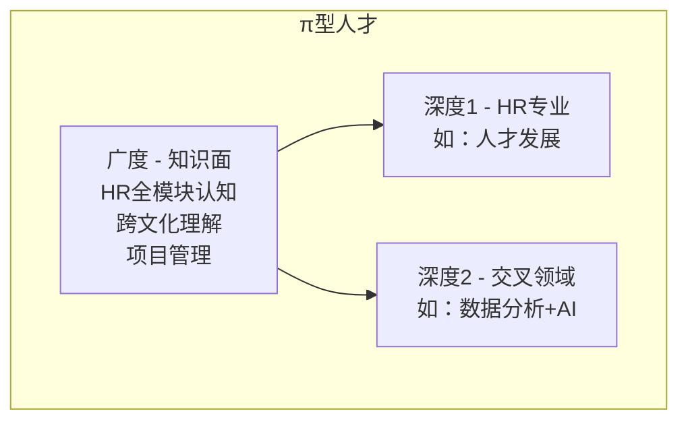

> [!abstract] 核心观点
> HR管培生的核心竞争力不是单一维度的"专业能力"，而是**专业能力、商业能力、软技能"三圈"的交集**。顶尖的HR管培生候选人，追求的不仅是"T型"人才的深度与广度，更是"π型"人才的多领域交叉优势。在面试中，**用"三圈模型"和"T型/π型人才"理论来包装自己，能让你的回答更有高度和差异化。**

---

## 一、三圈模型：专业能力 + 商业能力 + 软技能

### 1.1 三圈模型全景图

### 1.2 三圈详细拆解

#### 圈1：专业能力

| 能力维度 | 具体要求 | 面试考察方式 | 提升路径 |
|---------|---------|-------------|---------|
| **六大模块认知** | 理解规划/招聘/培训/绩效/薪酬/员工关系核心逻辑 | 专业面试、案例分析 | 系统学习+模块实习 |
| **劳动法规基础** | 劳动合同法、社保公积金、离职管理 | 情景模拟、案例分析 | 法规学习+案例积累 |
| **HR数据分析** | 基础统计、指标设计、数据可视化 | 案例分析、笔试 | 数据分析课程+实践 |
| **组织发展认知** | OD基础、组织诊断、变革管理 | 战略面试、案例分析 | 阅读+案例研究 |
| **AI+HR知识** | AI面试、HRIS、People Analytics | 热点问题、专业面 | 关注前沿动态 |

#### 圈2：商业能力

| 能力维度 | 具体要求 | 面试考察方式 | 提升路径 |
|---------|---------|-------------|---------|
| **业务理解力** | 理解商业模式、盈利逻辑、业务痛点 | 案例分析、群面 | 行业研究+业务实习 |
| **商业敏感度** | 关注行业动态、竞品分析、市场趋势 | 战略面试、群面 | 商业阅读+行业分析 |
| **数据思维** | 用数据说话、量化分析、假设驱动 | 案例分析、笔试 | 数据分析+商业分析课程 |
| **战略视野** | 从公司战略高度思考人力资源配置 | 终面、战略面试 | 战略管理学习+企业研究 |
| **财务基础** | 理解人力成本、ROI、预算管理 | 薪酬面试、案例分析 | 基础财务知识学习 |

#### 圈3：软技能

| 能力维度 | 具体要求 | 面试考察方式 | 提升路径 |
|---------|---------|-------------|---------|
| **沟通能力** | 结构化表达、倾听理解、冲突处理 | 群面、行为面试 | 刻意练习+演讲训练 |
| **同理心** | 换位思考、情绪感知、关系建立 | 行为面试、情景模拟 | 志愿服务+团队合作 |
| **学习能力** | 快速学习、知识迁移、持续迭代 | 行为面试 | 跨领域学习+项目实践 |
| **影响力** | 说服力、推动力、跨部门协作 | 群面、案例分析 | 项目管理+社团领导 |
| **抗压能力** | 韧性、情绪管理、成长心态 | 行为面试、压力面试 | 挑战性任务+反思复盘 |

### 1.3 三圈面试评估矩阵

面试官在评估每个候选人时，会从三个圈分别打分，最终综合评定：

| 评估维度 | 权重（参考） | 优秀表现 | 一般表现 | 不足表现 |
|---------|------------|---------|---------|---------|
| **专业能力** | 30% | 有实习经历，能用专业术语深度分析 | 知道基本概念，但缺乏深度 | 概念不清，回答空洞 |
| **商业能力** | 35% | 能用商业语言分析HR问题，有案例支撑 | 有商业意识，但分析不深入 | 只谈HR不谈业务 |
| **软技能** | 35% | 表达流畅，逻辑清晰，有说服力 | 表达尚可，但缺乏亮点 | 紧张、逻辑混乱、被动 |

> **注意：** 管培生面试对"商业能力"和"软技能"的权重往往高于"专业能力"，因为企业认为专业可以培养，但商业思维和软硬素质更难后天获得。

---

## 二、T型/π型人才在HR领域的应用

### 2.1 T型人才模型

| 维度 | 描述 | 在HR领域的体现 | 面试中的展现 |
|------|------|---------------|-------------|
| **横线（广度）** | 跨领域知识面 | 了解HR六大模块、三支柱、劳动法、商业基础 | "我系统学习了HR全模块知识，同时关注商业趋势……" |
| **竖线（深度）** | 1-2个领域专业深度 | 在招聘/培训/绩效等1-2个模块有实习或项目经验 | "在招聘模块，我主导了XX项目，实现了……" |

**面试话术示例：**

> 我认为自己是"T型人才"的发展路径。横向来看，我通过系统学习建立了HR全模块的认知框架；纵向来看，我在招聘模块有深度实践——在XX实习期间，我主导了校招项目，从需求分析到Offer发放全程参与，最终完成了XX人的招聘目标。

### 2.2 π型人才模型

| 维度 | 描述 | 在HR领域的体现 | 差异化优势 |
|------|------|---------------|-----------|
| **横线（广度）** | 跨领域知识面 | 同上 | 基础素养 |
| **深度1** | HR专业领域 | 1-2个HR模块深耕 | 专业竞争力 |
| **深度2** | 交叉领域 | 数据分析、AI、心理学、产品思维等 | 差异化竞争力 |

**π型人才 vs T型人才：**

| 对比维度 | T型人才 | π型人才 |
|---------|---------|---------|
| **结构** | 一横一竖 | 一横两竖 |
| **核心竞争力** | 专业深度 | 专业深度+交叉领域 |
| **适用场景** | 专业岗位 | 综合管理/创新岗位 |
| **HR领域优势** | 成为模块专家 | 成为"HR+AI"、"HR+数据"等复合型人才 |
| **面试优势** | 专业扎实 | 差异化明显，更容易脱颖而出 |

**面试话术示例：**

> 我给自己定位是"π型人才"。第一根竖线是HR专业——我在培训模块有深度实习；第二根竖线是数据分析——我辅修了统计学，能熟练使用Python和SQL进行HR数据分析。在XX项目中，我通过分析员工离职数据，建立了离职预测模型，帮助团队提前识别了XX%的高风险离职人员。

### 2.3 HR领域的差异化能力组合

| 组合类型 | 能力1 | 能力2 | 差异化价值 | 适配方向 |
|---------|-------|-------|-----------|---------|
| **HR+数据分析** | 人力资源专业 | 数据分析/统计 | 数据驱动决策 | 人效分析、HRIS |
| **HR+心理学** | 人力资源专业 | 组织心理学 | 深度理解人性 | 组织发展、员工关系 |
| **HR+产品思维** | 人力资源专业 | 产品经理思维 | 以员工为中心设计HR产品 | 员工体验、雇主品牌 |
| **HR+AI/技术** | 人力资源专业 | AI/机器学习 | 推动HR技术化 | AI面试、HR数字化 |
| **HR+财务** | 人力资源专业 | 财务分析 | 从财务视角做HR | 薪酬福利、人效管理 |
| **HR+法律** | 人力资源专业 | 法律知识 | 合规保障 | 员工关系、劳动法 |

---

## 三、面试高频问题

### 问题1："你觉得自己最大的优势是什么？"

| 项目 | 内容 |
|------|------|
| **考察点** | 自我认知清晰度、优势与岗位匹配度、表达能力 |
| **答题框架** | **STAR框架**：优势定义 → 经历证明 → 与岗位关联 |

**参考回答（以"数据分析能力"为例）：**

> 我认为自己最大的优势是**数据驱动的思维和分析能力**。
>
> **S/T：** 在XX公司实习期间，我发现团队招聘效率瓶颈——简历筛选到面试邀约的转化率只有15%。
>
> **A：** 我主动提出建立一个"招聘漏斗分析"模型，收集并分析了过去3个月的数据：渠道来源、简历匹配度、初筛通过率、面试到场率等关键指标。通过数据分析，我发现了两个核心问题：XX渠道的简历质量偏低，以及初筛环节的评估标准不够精准。我提出了优化方案：调整渠道投放策略，同时设计了一套结构化的简历评估表。
>
> **R：** 方案实施后，简历到面试的转化率从15%提升到28%，招聘周期缩短了20%。更重要的是，这个经历让我意识到：数据思维是HR从"凭经验做事"到"靠数据决策"的关键能力。
>
> **与岗位的关联：** 我相信这个优势能帮助我在HR管培生岗位上，用数据思维驱动HR决策，这也是现代HR的核心竞争力之一。

| 得分点 | 加分表现 | 扣分表现 |
|--------|---------|---------|
| 优势具体明确 | 明确一个具体的优势 | 说"我什么都好" |
| 有数据支撑 | 用量化结果证明 | 只有定性描述 |
| 与岗位关联 | 说明优势如何帮助HR工作 | 优势与HR无关 |
| 用STAR呈现 | 结构化表达 | 流水账式叙述 |

### 问题2："你有哪些能力让你适合做HR？"

| 项目 | 内容 |
|------|------|
| **考察点** | 岗位匹配度、多维度能力展示、自我认知 |
| **答题框架** | **三圈模型框架**：专业能力 + 商业能力 + 软技能 |

**参考回答：**

> 我认为自己适合做HR，主要体现在三个维度：
>
> **第一，专业能力。** 我系统学习了人力资源管理课程，在XX实习中完成了招聘和培训两个模块的实践，对六大模块有体系化的认知。同时，我自学了HR数据分析，能用数据驱动HR决策。
>
> **第二，商业能力。** 我有较强的业务敏感度。在XX实习期间，我主动参加了业务部门的周会，了解业务痛点，并据此调整了招聘策略——优先招聘有行业经验的候选人，因为业务团队需要快速上手的人。这种"业务导向"的思维，对HR来说非常重要。
>
> **第三，软技能。** 我的沟通能力和同理心比较突出。在XX项目中，我主导了离职面谈工作，通过真诚的沟通和对离职动机的深入理解，不仅完成了离职率分析报告，还提出了3条降低离职率的建议，其中2条被团队采纳。
>
> 这三个维度让我相信，我有潜力成为一名优秀的HR。

| 得分点 | 加分表现 | 扣分表现 |
|--------|---------|---------|
| 用模型包装 | 使用"三圈模型"结构化回答 | 想到哪说到哪，没有结构 |
| 每个维度有实例 | 每个能力都有具体经历支撑 | 只有能力名词，没有实例 |
| 全面但聚焦 | 覆盖三个维度但有重点 | 平均用力，没有突出亮点 |
| 展现学习能力 | 提到"自学"、"主动"等关键词 | 只说"我有能力" |

### 问题3："你认为HR管培生最需要具备的三种能力是什么？"

| 项目 | 内容 |
|------|------|
| **考察点** | 对岗位的认知深度、价值观、优先级判断 |
| **答题框架** | **优先级框架**：排序 → 为什么 → 如何培养 |

**参考回答：**

> 我认为最重要的三种能力是：学习能力、同理心和商业思维。
>
> **第一，学习能力（最核心）。** 管培生本质上是"加速培养"，意味着要在短时间内掌握大量新知识。无论是轮岗中快速上手新模块，还是面对AI+HR等新趋势，没有快速学习的能力，很难在管培生项目中脱颖而出。而且，HR本身就是一个需要持续学习的领域——政策在变、技术在变、业务在变。
>
> **第二，同理心。** HR是做"人"的工作。没有同理心，就无法真正理解员工的需求和痛点。无论是招聘中判断候选人的匹配度，还是绩效面谈中给予有建设性的反馈，或者员工关系处理中平衡各方利益，都需要强大的同理心。
>
> **第三，商业思维。** 这是HR管培生区别于普通HR的关键。HR管培生被期望成为"懂业务的HR"，而不是"只会做HR的HR"。商业思维让HR能理解业务痛点，用业务语言对话，从战略高度思考人力资源配置。
>
> 这三种能力分别对应了"学得快"、"懂人心"、"看得远"——正好是HR管培生成功的关键。

| 得分点 | 加分表现 | 扣分表现 |
|--------|---------|---------|
| 排序合理 | 有明确的优先级排序 | 随意列举三个 |
| 每点有深度 | 每个能力都展开论述 | 只有名词，没有解释 |
| 有逻辑关联 | 三种能力之间有关系 | 三种能力孤立无关 |
| 有金句概括 | "学得快、懂人心、看得远" | 平淡无奇 |

### 问题4："你如何看待自己的不足？"

| 项目 | 内容 |
|------|------|
| **考察点** | 自我认知、诚实度、改进意愿和能力 |
| **答题框架** | **改进框架**：承认不足 → 认识到原因 → 正在改进 → 已有进展 |

**参考回答：**

> 坦诚地说，我认为自己目前在**HR专业深度**上还有不足。
>
> **第一，认知。** 虽然我系统学习了HR全模块知识，但毕竟没有全职HR工作经验，在遇到复杂问题时，可能缺乏足够的实战经验来支撑判断。比如，在设计绩效考核方案时，理论知识我有，但落地中可能遇到的各种"坑"，我还没有足够的经验储备。
>
> **第二，行动。** 为了弥补这个不足，我采取了三个措施：一是正在准备HR相关的专业认证（如人力资源管理师），系统化提升专业水平；二是主动寻找HR实习机会，用实践积累经验；三是建立了自己的"案例库"，持续收集和分析HR领域的真实案例。
>
> **第三，心态。** 我认为"知道自己的不足"本身就是一种优势。它让我保持谦逊和学习的心态，不会因为管培生的身份而产生"我什么都懂"的错觉。
>
> 我相信，通过持续学习和实践，这个不足会逐步转化为我的优势。

| 得分点 | 加分表现 | 扣分表现 |
|--------|---------|---------|
| 不足真实具体 | 具体的、真实的不足 | 说"我太追求完美"等假不足 |
| 有改进方案 | 有具体的改进行动 | 只说"我会努力" |
| 展现成长心态 | 把不足视为成长机会 | 表现出沮丧或防御 |
| 不足"可接受" | 不足是可以改进的，不是致命缺陷 | 不足是核心能力缺陷 |

### 问题5："你如何理解'T型人才'？你觉得自己是T型还是π型？"

| 项目 | 内容 |
|------|------|
| **考察点** | 理论理解、自我定位、差异化思维 |
| **答题框架** | **定义-定位-差异化**框架 |

**参考回答：**

> **第一，对T型人才的理解。** T型人才指的是"一横一竖"——横线代表跨领域的知识广度，竖线代表在某一领域的专业深度。在HR领域，T型人才就是既有HR全模块认知（广度），又在某个模块（如招聘或培训）有深度积累（深度）。
>
> **第二，我的定位。** 我目前正在朝着"π型人才"的方向努力。除了HR专业深度（我主要在招聘模块有实践），我还在培养第二个深度——数据分析。我辅修了统计学，在实习中用过Python做招聘漏斗分析，也自学了Tableau进行数据可视化。
>
> **第三，为什么选择π型。** 我认为未来的HR，"HR+数据分析"是一个非常有竞争力的组合。单纯的HR专业能力可能会被AI替代，但"HR+数据"的复合能力能让HR在决策中发挥更大价值。而且，π型人才在管培生面试中更容易脱颖而出，因为它展示了你的差异化优势。

| 得分点 | 加分表现 | 扣分表现 |
|--------|---------|---------|
| 理论理解准确 | 清晰解释T型和π型的区别 | 概念混淆 |
| 自我定位清晰 | 明确自己的定位和理由 | 说"我不知道" |
| 展现差异化 | 说明自己的"第二竖线"是什么 | 没有差异化定位 |
| 有发展路径 | 说明如何持续培养 | 只说现状，没有规划 |

---

## 四、能力自评与提升计划

### 4.1 三圈自评表

| 能力维度 | 具体能力 | 自评分（1-5） | 提升优先级 | 行动计划 |
|---------|---------|-------------|-----------|---------|
| **专业能力** | 六大模块认知 | | | |
| | 劳动法规基础 | | | |
| | HR数据分析 | | | |
| | AI+HR知识 | | | |
| **商业能力** | 业务理解力 | | | |
| | 数据思维 | | | |
| | 战略视野 | | | |
| **软技能** | 沟通能力 | | | |
| | 同理心 | | | |
| | 学习能力 | | | |
| | 影响力 | | | |
| | 抗压能力 | | | |

### 4.2 面试准备建议

| 准备方向 | 具体行动 | 建议时间 | 优先级 |
|---------|---------|---------|-------|
| **梳理个人经历** | 准备5-8个STAR案例，覆盖不同能力 | 第1周 | ★★★★★ |
| **建立能力框架** | 用三圈模型梳理自己的能力和不足 | 第1周 | ★★★★★ |
| **差异化定位** | 确定自己的"π型"第二竖线方向 | 第2周 | ★★★★ |
| **练习结构化表达** | 用PPT框架练习回答常见问题 | 持续进行 | ★★★★ |
| **研究目标企业** | 了解目标企业的管培生项目设计 | 面试前2周 | ★★★★ |
| **模拟面试** | 找人模拟面试，获取反馈 | 面试前1周 | ★★★★★ |

---

> [!tip] 本篇核心要点
> 1. 面试中始终用"三圈模型"组织你的回答，展现结构化的思维
> 2. 明确自己的差异化定位（π型人才），不要做"全能但平庸"的候选人
> 3. 每个能力点都要有具体经历支撑，用STAR法则呈现
> 4. 诚实面对不足，但一定要展示正在改进的行动
> 5. 关联阅读：[[03-HR人事/HR管培生备战/01-认知篇/01_HR管培生是什么]] 了解项目本身，[[03-HR人事/HR管培生备战/01-认知篇/02_从人事到战略伙伴]] 建立行业认知