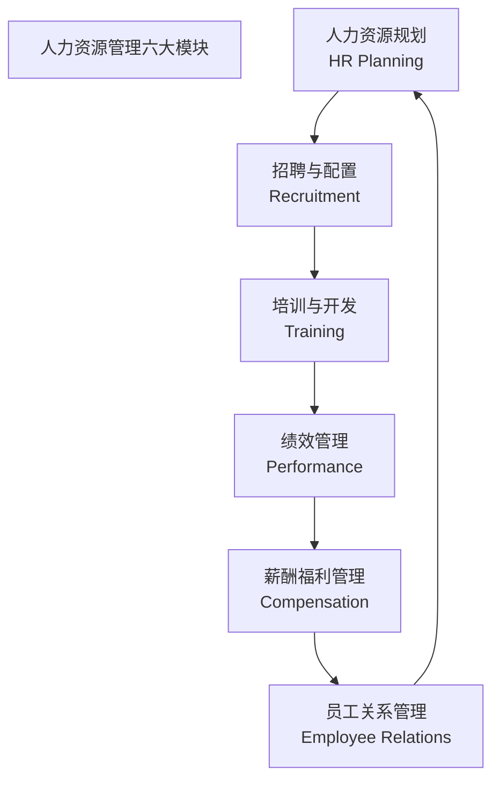
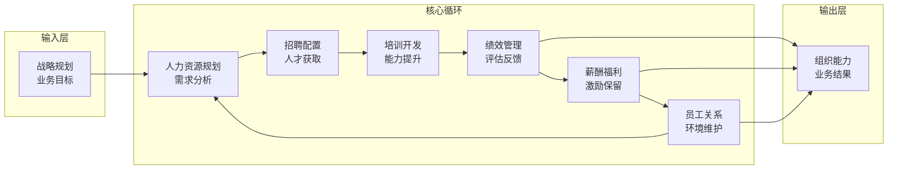
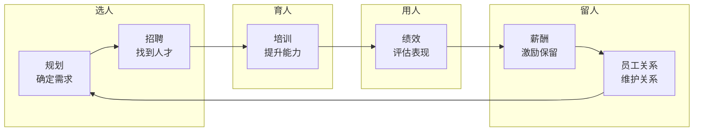

> [!abstract] 核心观点
> 人力资源管理六大模块（规划、招聘、培训、绩效、薪酬、员工关系）构成了HR专业知识的**核心骨架**。理解六大模块不是孤立地记忆每个模块的定义，而是**建立模块间的逻辑闭环思维**——"选对人（招聘）→ 用好/育好人（培训+绩效）→ 留住人（薪酬+员工关系）→ 持续优化（规划）"。在面试中，展现"模块间关联"的思考深度，远比背诵单个模块的定义更有价值。

---

## 一、六大模块全景图

### 1.1 模块总览

| 模块 | 英文 | 核心问题 | 关键产出 | 衡量的核心指标 |
|------|------|---------|---------|-------------|
| **人力资源规划** | HR Planning | 我们需要多少人？什么样的人？ | 人力资源规划书、年度编制计划 | 人力配置匹配度、人力成本预算准确率 |
| **招聘与配置** | Recruitment | 如何找到并吸引合适的人？ | 招聘计划、岗位说明书、Offer | 招聘周期、招聘成本、Offer接受率 |
| **培训与开发** | Training & Development | 如何提升员工的能力？ | 培训计划、课程体系、IDP | 培训覆盖率、培训ROI、员工满意度 |
| **绩效管理** | Performance Management | 如何评估和提升员工表现？ | 绩效方案、考核结果、反馈记录 | 绩效目标达成率、绩效分布合理性 |
| **薪酬福利管理** | Compensation | 如何公平且有竞争力地付薪？ | 薪酬结构、调薪方案、福利计划 | 薪酬竞争力、薪酬公平性、人均薪酬 |
| **员工关系管理** | ER Management | 如何维护良好的雇佣关系？ | 员工手册、劳动合同、离职分析 | 离职率、敬业度、劳动争议数 |

### 1.2 各模块核心目标

| 模块 | 核心目标 | 一句话总结 |
|------|---------|-----------|
| **规划** | 确保"人"与"事"的动态匹配 | 在正确的时间，把正确的人，放在正确的位置 |
| **招聘** | 精准识别并吸引目标人才 | 找到对的人，而不是找到很多人 |
| **培训** | 提升员工能力，支撑业务发展 | 让员工从"能做"到"做好"再到"做精" |
| **绩效** | 驱动组织目标达成与员工成长 | 不仅考核"做了什么"，更要关注"如何做得更好" |
| **薪酬** | 吸引、激励、保留关键人才 | 内部公平 + 外部竞争 + 个人贡献 |
| **员工关系** | 构建和谐、合规的雇佣关系 | 让员工"愿意来、愿意留、愿意拼" |

---

## 二、模块间输入输出关系

### 2.1 模块间的逻辑闭环

### 2.2 模块间的联动关系

| 模块关系 | 联动逻辑 | 典型场景 | 面试中的运用 |
|---------|---------|---------|-------------|
| **规划→招聘** | 规划确定编制和人才需求，招聘执行人才获取 | 年度预算制定后，招聘团队启动招聘 | "招聘不是独立活动，而是规划的落地执行" |
| **招聘→培训** | 新员工入职后需要培训体系支持 | 新员工入职培训、师徒制 | "招聘的结束是培训的开始" |
| **培训→绩效** | 培训效果需要绩效评估来验证 | 培训后行为改变评估，业绩提升跟踪 | "培训效果的最终证明是绩效提升" |
| **绩效→薪酬** | 绩效结果是薪酬调整的核心依据 | 绩效调薪、年终奖发放 | "绩效是薪酬的'分蛋糕'依据" |
| **薪酬→员工关系** | 薪酬竞争力影响员工满意度和留存 | 薪酬调研、离职分析 | "薪酬问题往往是员工关系问题的根源" |
| **员工关系→规划** | 离职率数据反馈到人才规划 | 离职分析驱动招聘计划调整 | "员工关系数据是规划调整的重要输入" |

### 2.3 模块间的"闭环思维"

**面试加分项：** 展现"模块间关联"的思考

> 六大模块不是孤立的，而是一个完整的闭环。以"招聘新员工"为例：
> 1. **规划** 告诉你需要招多少人（编制）
> 2. **招聘** 负责找到这些人
> 3. **培训** 确保他们快速上手
> 4. **绩效** 评估他们是否达到预期
> 5. **薪酬** 根据绩效给予激励
> 6. **员工关系** 维护他们的满意度和稳定性
>
> 每个环节的产出都是下一个环节的输入，任何一个环节出问题，都会影响整个链条的效率。

---

## 三、各模块深度解析

### 3.1 人力资源规划

| 维度 | 内容 |
|------|------|
| **核心任务** | 预测人力资源需求与供给，制定人才配置计划 |
| **关键方法** | 趋势预测法、比率分析法、德尔菲法、马尔可夫模型 |
| **核心产出** | 人力资源规划书、年度编制计划、人才盘点报告 |
| **常见挑战** | 业务需求变化快、规划与实际脱节 |
| **面试常考** | "人力资源规划如何与业务战略对齐？" |

**面试题： "人力资源规划如何与业务战略对齐？"**

| 项目 | 内容 |
|------|------|
| **考察点** | 战略思维、规划方法、业务理解 |
| **答题框架** | **BHR框架**：业务战略解读 → 人才需求分析 → 规划方案制定 |

**参考回答：**

> 人力资源规划与业务战略的对齐，本质上是"从业务战略推导人才战略"的过程。
>
> **第一，解读业务战略。** 理解公司未来1-3年的业务目标——是扩张、收缩还是转型？不同战略对人才的需求完全不同。例如，扩张战略需要大量招聘，转型战略需要调整人才结构。
>
> **第二，进行人才需求分析。** 基于业务目标，分析"需要多少人"（数量）和"需要什么样的人"（质量），同时评估现有团队的能力差距。
>
> **第三，制定规划方案。** 从"选、用、育、留"四个维度制定人才配置计划，明确招聘、培训、晋升、淘汰等具体措施。
>
> 最终，人力资源规划不是一份"静态文件"，而是需要根据业务变化动态调整的"活计划"。

### 3.2 招聘与配置

| 维度 | 内容 |
|------|------|
| **核心任务** | 精准识别目标人才，高效完成人才获取 |
| **关键方法** | 结构化面试、行为面试、评价中心、AI面试 |
| **核心产出** | 招聘计划、岗位说明书、面试评估表、Offer |
| **核心指标** | 招聘周期、招聘成本、Offer接受率、试用期通过率 |
| **面试常考** | "如何评估一个候选人的匹配度？" |

**面试题： "如何评估一个候选人的匹配度？"**

| 项目 | 内容 |
|------|------|
| **考察点** | 招聘方法论、评估能力、匹配思维 |
| **答题框架** | **三维匹配框架**：能力匹配 → 文化匹配 → 发展匹配 |

**参考回答：**

> 评估候选人匹配度，我会从三个维度来看：
>
> **第一，能力匹配。** 候选人是否具备岗位要求的知识、技能和经验？这是"能不能做"的问题。通过结构化面试、案例分析、技能测试等方式评估。
>
> **第二，文化匹配。** 候选人的价值观、工作风格是否与团队和企业文化契合？这是"合不合"的问题。通过行为面试了解候选人的工作偏好和团队协作方式。
>
> **第三，发展匹配。** 候选人的职业目标是否与公司的发展路径一致？这是"愿不愿久留"的问题。了解候选人的长期职业规划，判断是否与公司的发展方向一致。
>
> 三个维度都匹配，才是"最合适"的候选人——而不是"最优秀"的候选人。

### 3.3 培训与开发

| 维度 | 内容 |
|------|------|
| **核心任务** | 提升员工能力，支撑业务发展和个人成长 |
| **关键方法** | 70-20-10学习法则、IDP（个人发展计划）、学习路径图 |
| **核心产出** | 培训计划、课程体系、培训效果评估报告 |
| **核心模型** | 柯氏四级评估（反应→学习→行为→结果） |
| **面试常考** | "如何评估培训效果？" |

**面试题： "如何评估培训效果？"**

| 项目 | 内容 |
|------|------|
| **考察点** | 培训方法论、评估思维、ROI意识 |
| **答题框架** | **柯氏四级评估**：反应 → 学习 → 行为 → 结果 |

**参考回答：**

> 评估培训效果，我会使用柯氏四级评估模型：
>
> **第一层，反应层。** 培训结束后通过问卷了解学员的满意度：内容是否实用？讲师是否专业？这是最基础的评估。
>
> **第二层，学习层。** 通过考试或实操评估学员学到了什么。知识类培训用考试，技能类培训用实操考核。
>
> **第三层，行为层。** 培训后1-3个月，观察学员是否将所学应用到工作中。可以通过主管反馈、360评估等方式。
>
> **第四层，结果层。** 最终评估培训对业务结果的影响——销售培训是否提升了销售额？管理培训是否降低了离职率？这是最难但最有价值的一层。
>
> 需要强调的是，不是所有培训都需要评估到第四层，关键是根据培训类型选择适当的评估深度。

### 3.4 绩效管理

| 维度 | 内容 |
|------|------|
| **核心任务** | 通过目标设定、持续反馈和评估，驱动组织和个人绩效提升 |
| **关键方法** | OKR、KPI、BSC（平衡计分卡）、360度评估 |
| **核心产出** | 绩效方案、目标设定表、绩效评估结果、绩效面谈记录 |
| **核心原则** | SMART原则（目标设定）、持续反馈、公平公正 |
| **面试常考** | "OKR和KPI有什么区别？" |

**面试题： "OKR和KPI有什么区别？"**

| 项目 | 内容 |
|------|------|
| **考察点** | 绩效管理方法论、工具理解、场景化应用 |
| **答题框架** | **对比框架**：定义 → 目的 → 适用场景 |

**参考回答：**

> OKR和KPI最大的区别在于"目的不同"。
>
> **KPI（关键绩效指标）** 是"衡量工具"，核心是"评估"——你做得怎么样？KPI关注的是结果是否达标，通常与薪酬挂钩。适用于成熟、稳定的业务。
>
> **OKR（目标与关键结果）** 是"管理工具"，核心是"对齐和牵引"——我们要去哪里？OKR关注的是方向和进展，通常不与薪酬直接挂钩。适用于创新、变革的业务。
>
> **打个比方：** KPI是"后视镜"，告诉你已经开了多远；OKR是"导航仪"，告诉你应该往哪里开。
>
> **在实际应用中，** 两者不是非此即彼的关系。很多企业将OKR用于目标设定和方向对齐，将KPI用于结果评估和绩效考核。

### 3.5 薪酬福利管理

| 维度 | 内容 |
|------|------|
| **核心任务** | 设计有竞争力和公平性的薪酬体系，激励和保留人才 |
| **关键方法** | 岗位评估、薪酬调研、宽带薪酬、股权激励 |
| **核心产出** | 薪酬结构、调薪方案、福利计划、总奖酬报告 |
| **核心原则** | 内部公平、外部竞争、个人贡献、公司支付能力 |
| **面试常考** | "如何设计一个公平的薪酬体系？" |

**面试题： "如何设计一个公平的薪酬体系？"**

| 项目 | 内容 |
|------|------|
| **考察点** | 薪酬设计方法论、公平性理解、系统思维 |
| **答题框架** | **三维公平框架**：内部公平 → 外部公平 → 个人公平 |

**参考回答：**

> 薪酬体系的公平性体现在三个维度：
>
> **第一，内部公平。** 相同岗位、相同贡献应该获得相同薪酬。通过岗位评估（如海氏评估法）确定各岗位的相对价值，确保"同工同酬"。
>
> **第二，外部公平。** 薪酬水平应具有市场竞争力。通过薪酬调研了解市场水平，确定公司的薪酬定位（领先型/跟随型/滞后型）。
>
> **第三，个人公平。** 相同岗位的不同员工，根据绩效和贡献差异获得差异化薪酬。通过绩效调薪、奖金分配等方式体现。
>
> 一个公平的薪酬体系，需要在这三个维度之间找到平衡——既要有市场竞争力，又要内部公平，还要能激励高绩效者。

### 3.6 员工关系管理

| 维度 | 内容 |
|------|------|
| **核心任务** | 维护和谐、合规的雇佣关系，提升员工敬业度 |
| **关键方法** | 员工手册、劳动合同管理、离职面谈、员工满意度调研 |
| **核心产出** | 劳动合同、离职分析报告、员工满意度报告 |
| **核心指标** | 离职率（主动/被动）、敬业度得分、劳动争议案件数 |
| **面试常考** | "如何处理员工投诉或劳动争议？" |

**面试题： "如何处理员工投诉或劳动争议？"**

| 项目 | 内容 |
|------|------|
| **考察点** | 问题解决能力、沟通能力、合规意识、同理心 |
| **答题框架** | **四步处理框架**：倾听 → 分析 → 行动 → 跟进 |

**参考回答：**

> 处理员工投诉或劳动争议，我会遵循以下四个步骤：
>
> **第一步，倾听和共情。** 先让员工充分表达诉求，不打断、不评判。很多矛盾源于"员工觉得没人听他的"，所以倾听本身就是一种解决方案。
>
> **第二步，调查和分析。** 收集双方信息，还原事实。查阅相关政策、合同和法规，判断投诉的合理性。这个阶段要保持客观中立，不预设立场。
>
> **第三步，制定和执行方案。** 根据调查结果，在法律框架内提出解决方案。如果是制度问题，优化制度；如果是沟通问题，协调双方；如果是违规问题，按规定处理。
>
> **第四步，跟进和复盘。** 方案执行后持续跟进，确保问题真正解决。同时复盘事件原因，看是否需要完善制度或流程，防止类似问题再次发生。
>
> 核心原则是：**合法合规是底线，公平公正是原则，沟通协调是方法。**

---

## 四、模块间的逻辑闭环

### 4.1 从"选育用留"看六大模块

### 4.2 面试中的"模块闭环"回答示例

**面试题： "六大模块之间是什么关系？"**

| 项目 | 内容 |
|------|------|
| **考察点** | 系统思维、模块间关联理解、逻辑能力 |
| **答题框架** | **闭环框架**：选育用留主线 → 输入输出关系 → 整体大于部分之和 |

**参考回答：**

> 六大模块不是孤立存在的，而是一个完整的"人才管理闭环"。
>
> **第一，从"选育用留"主线看。** 规划确定"选什么"，招聘执行"选人"，培训负责"育人"，绩效评估"用人效果"，薪酬和员工关系完成"留人"——这是一个完整的链条。
>
> **第二，从输入输出关系看。** 每个模块的产出都是下一个模块的输入。规划的输出是招聘的输入，招聘的输出是培训的输入，培训的输出影响绩效，绩效结果决定薪酬，薪酬水平影响员工关系，员工关系数据反馈到规划调整。
>
> **第三，从整体价值看。** 六大模块"1+1>2"。单独做招聘容易，但"有规划的招聘"才能精准匹配业务需求；单独做培训容易，但"与绩效联动的培训"才能确保培训效果落地。
>
> **举个例子：** 一个销售团队业绩下滑，如果只做招聘（招更多销售）可能解决不了问题。正确的做法是：先分析业绩下滑的原因（规划），如果是能力问题做培训，如果是动力问题调薪酬，如果是团队问题做员工关系——这才是"六大模块联动"的思维。

| 得分点 | 加分表现 | 扣分表现 |
|--------|---------|---------|
| 有系统思维 | 展现"闭环"整体观 | 孤立地介绍每个模块 |
| 有具体例子 | 用实际场景说明模块关系 | 只讲理论，没有实例 |
| 有逻辑主线 | 用"选育用留"串联 | 牵强附会，逻辑不清 |
| 有整体价值 | 强调"1+1>2"的协同效应 | 只说"模块之间有关系" |

### 面试题： "你最擅长哪个模块？为什么？"

| 项目 | 内容 |
|------|------|
| **考察点** | 自我认知、专业偏好、经历匹配 |
| **答题框架** | **PPT框架**：模块选择 → 经历证明 → 未来规划 |

**参考回答：**

> 我目前最有心得的是**招聘模块**。
>
> **P - 为什么选择招聘。** 招聘是HR的"门户"，直接决定了人才质量。而且招聘工作让我有机会与不同的人交流，这非常符合我的性格特点。
>
> **P - 经历证明。** 在XX实习期间，我主导了校招项目，从需求分析、渠道选择、简历筛选到面试安排、Offer发放，全流程参与。我优化了简历筛选标准，使初筛通过率提升了20%；还设计了面试官培训手册，提升了面试的一致性。
>
> **T - 收获与规划。** 这段经历让我意识到，招聘不仅仅是"找人"，更是"精准匹配"——把对的人放在对的位置上。未来，我希望在保持招聘优势的同时，深入学习和实践培训模块，向"T型人才"方向发展。

| 得分点 | 加分表现 | 扣分表现 |
|--------|---------|---------|
| 有明确选择 | 明确说出一个模块 | 说"都擅长"或"都不擅长" |
| 有实际经历 | 有具体的数据和成果 | 空谈"我喜欢招聘" |
| 有未来规划 | 展示进阶方向和成长路径 | 只说现状，没有展望 |
| 谦虚务实 | 承认有不足，有学习计划 | 过度自信或贬低其他模块 |

---

## 五、面试题库速查

| 问题 | 考察点 | 答题框架 | 关键要点 |
|------|-------|---------|---------|
| 六大模块之间是什么关系？ | 系统思维 | 闭环框架 | 选育用留、输入输出、整体价值 |
| 你最擅长哪个模块？为什么？ | 自我认知 | PPT框架 | 明确选择、经历证明、未来规划 |
| 人力资源规划如何与业务对齐？ | 战略思维 | BHR框架 | 战略解读、需求分析、方案制定 |
| 如何评估候选人匹配度？ | 招聘方法论 | 三维匹配 | 能力+文化+发展 |
| 如何评估培训效果？ | 培训方法论 | 柯氏四级 | 反应→学习→行为→结果 |
| OKR和KPI有什么区别？ | 绩效方法论 | 对比框架 | 目的不同、适用场景不同 |
| 如何设计公平的薪酬体系？ | 薪酬方法论 | 三维公平 | 内部+外部+个人 |
| 如何处理员工投诉？ | 问题解决 | 四步框架 | 倾听→分析→行动→跟进 |

---

> [!tip] 本篇学习建议
> 1. 先读"逻辑闭环"部分，建立六大模块的关联思维
> 2. 每个模块重点关注"核心方法"和"面试常考"
> 3. 面试题部分先自己回答，再对比参考回答
> 4. 建议用"模块间关系"回答展现系统思维，这比背诵单个模块更能加分
> 5. 关联阅读：[[03-HR人事/HR管培生备战/02-专业篇/02_HR三支柱模型]] 了解三支柱与六大模块的对应关系