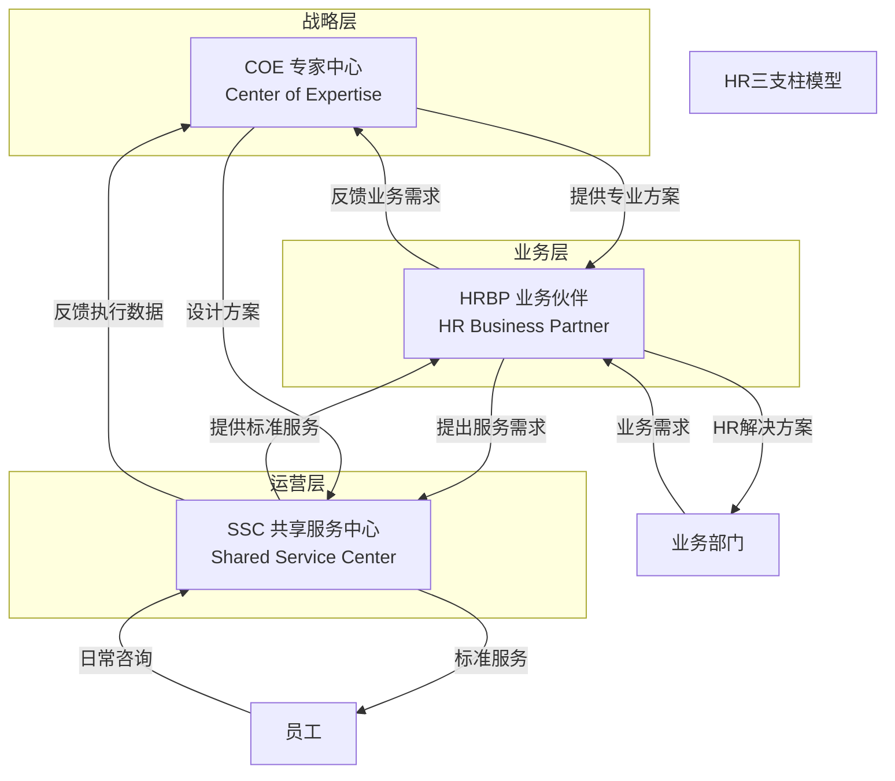
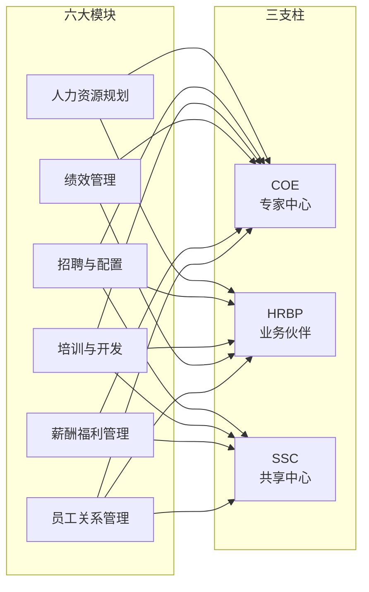
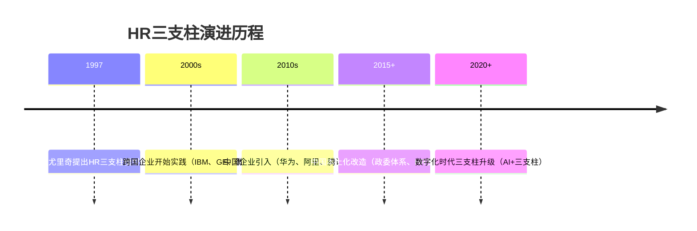

> [!abstract] 核心观点
> HR三支柱模型（COE+HRBP+SSC）是戴维·尤里奇在1997年提出的HR组织架构创新，核心思想是将HR职能**按"战略-伙伴-服务"三个层次重新分工**，以解决传统"六大模块"模式下HR远离业务、效率低下的问题。理解三支柱不仅是记住三个角色，更要理解**三支柱之间的"铁三角"协作关系**，以及在中国企业落地中的适配性挑战。

---

## 一、三支柱各角色定位

### 1.1 三支柱全景图

### 1.2 三支柱角色详解

| 支柱 | 全称 | 定位 | 核心职责 | 典型岗位 | 时间分配 |
|------|------|------|---------|---------|---------|
| **COE** | Center of Expertise | 专家中心 | 设计HR政策、流程、方案 | 薪酬专家、招聘专家、OD专家 | 战略60%+运营40% |
| **HRBP** | HR Business Partner | 业务伙伴 | 深入业务，提供定制化HR解决方案 | HRBP经理、HRBP专员 | 业务70%+HR30% |
| **SSC** | Shared Service Center | 共享服务中心 | 提供标准化、高效的HR运营服务 | 员工服务专员、HR运营专员 | 运营90%+优化10% |

### 1.3 COE：专家中心

| 维度 | 内容 |
|------|------|
| **核心定位** | HR的"大脑"——负责设计HR战略、政策和专业方案 |
| **关键能力** | 专业深度、方案设计能力、行业洞察、创新思维 |
| **核心产出** | HR政策制度、流程标准、工具模板、专业方案 |
| **典型工作** | 设计薪酬体系、制定人才发展策略、开发绩效管理工具 |
| **与六大模块关系** | 承接六大模块的"专业设计"职能 |
| **面试常考** | "COE需要什么样的能力？" |

**COE在面试中的展示：**

> 我对COE角色的理解是"专业深度"的代表。如果面试官问到你擅长什么模块，可以结合COE的思路回答——"我不仅会执行，还能设计和优化方案"。

### 1.4 HRBP：业务伙伴

| 维度 | 内容 |
|------|------|
| **核心定位** | HR的"脊梁"——深入业务一线，理解业务痛点，提供定制化HR解决方案 |
| **关键能力** | 业务理解力、沟通协调、问题解决、影响力 |
| **核心产出** | 业务部门HR策略、组织诊断报告、人才盘点方案 |
| **典型工作** | 参加业务周会、推动组织变革、协助业务leader做人才决策 |
| **与六大模块关系** | 承接六大模块的"业务落地"职能 |
| **面试常考** | "HRBP的核心价值是什么？" |

**HRBP在面试中的展示：**

> HRBP是面试中最常被问到的角色。回答时一定要强调"懂业务"——"HRBP不是坐在HR部门的HR，而是坐在业务部门的HR"。

### 1.5 SSC：共享服务中心

| 维度 | 内容 |
|------|------|
| **核心定位** | HR的"双手"——提供标准化、高效的HR运营服务 |
| **关键能力** | 流程优化、服务意识、数据分析、技术应用 |
| **核心产出** | 高效的服务交付、准确的数据处理、优化的流程 |
| **典型工作** | 薪资核算、入职办理、社保公积金、员工咨询 |
| **与六大模块关系** | 承接六大模块的"事务执行"职能 |
| **面试常考** | "SSC如何提升效率？" |

**SSC在面试中的展示：**

> SSC虽然面试中问得相对少，但理解SSC的价值很重要——"没有SSC的高效运营，HRBP和COE就没有时间做战略工作"。

---

## 二、三支柱与六大模块的对应关系

### 2.1 对应关系总表

### 2.2 各模块在三支柱中的分工

| 六大模块 | COE职责 | HRBP职责 | SSC职责 |
|---------|---------|----------|---------|
| **人力资源规划** | 设计规划方法论和工具 | 参与业务部门规划讨论 | 提供人力数据支持 |
| **招聘与配置** | 制定招聘策略、设计评估工具 | 分析业务招聘需求、参与面试 | 简历筛选、面试安排、Offer发放 |
| **培训与开发** | 设计课程体系、开发培训方案 | 识别培训需求、推动培训落地 | 培训组织、学员管理、数据统计 |
| **绩效管理** | 设计绩效体系、开发评估工具 | 推动绩效目标设定、参与绩效面谈 | 绩效数据收集、系统维护 |
| **薪酬福利管理** | 设计薪酬结构、制定调薪策略 | 提供薪酬建议、参与薪酬沟通 | 薪酬核算、社保公积金办理 |
| **员工关系管理** | 制定员工关系政策、合规指引 | 处理员工关系问题、协调沟通 | 合同管理、入离职手续办理 |

### 2.3 面试中的运用：如何回答"三支柱和六大模块的关系"

**面试题： "三支柱和六大模块有什么区别？"**

| 项目 | 内容 |
|------|------|
| **考察点** | 对HR组织架构的理解、两种模式的关系认知、思维清晰度 |
| **答题框架** | **分类对比框架**：本质不同 → 分工不同 → 互补关系 |

**参考回答：**

> 三支柱和六大模块不是"替代关系"，而是"不同维度的分类"。
>
> **第一，本质不同。** 六大模块是按"职能"划分的——做什么（规划、招聘、培训等）；三支柱是按"角色"划分的——怎么服务（专家、伙伴、共享）。一个是"职能维度"，一个是"服务维度"。
>
> **第二，分工不同。** 六大模型强调"模块化分工"，每个模块独立运作；三支柱强调"分层服务"，同一项HR工作在不同支柱中有不同侧重。以招聘为例：COE制定招聘策略，HRBP对接业务需求，SSC执行招聘流程。
>
> **第三，互补关系。** 三支柱并未否定六大模块，而是在六大模块的基础上，增加了"服务对象"的维度。HRBP仍然需要具备六大模块知识，COE需要深耕六大模块的专业深度，SSC需要高效执行六大模块的事务性工作。
>
> 总结来说，**六大模块是"HR的专业骨架"，三支柱是"HR的服务骨架"**——两者共同构成了现代HR的组织架构。

| 得分点 | 加分表现 | 扣分表现 |
|--------|---------|---------|
| 理解本质 | 从"职能维度"vs"服务维度"区分 | 说"三支柱替代了六大模块" |
| 有具体例子 | 用招聘等具体模块说明分工 | 抽象描述，没有实例 |
| 展现互补性 | 强调两者是互补关系 | 把两者对立起来 |
| 有金句概括 | "专业骨架vs服务骨架" | 表达混乱，没有亮点 |

---

## 三、三支柱的演进与局限

### 3.1 三支柱的演进历程

| 阶段 | 时间 | 特点 | 代表企业 | 核心变化 |
|------|------|------|---------|---------|
| **理论提出** | 1997 | 尤里奇提出HR角色模型 | — | 从"做什么"到"怎么服务" |
| **国际实践** | 2000s | 跨国企业大规模推行 | IBM、GE、微软 | 建立全球SSC，提升HR效率 |
| **中国引入** | 2010s | 中国企业开始学习 | 华为、阿里、腾讯 | 结合本土文化做调整 |
| **本土化改造** | 2015+ | 中国特色的三支柱实践 | 阿里巴巴（政委体系） | 增加"文化"和"思想"维度 |
| **数字化升级** | 2020+ | AI+三支柱融合 | 字节跳动、美团 | SSC自动化、COE数据驱动 |

### 3.2 三支柱的常见局限

| 局限 | 具体表现 | 产生原因 | 应对建议 |
|------|---------|---------|---------|
| **COE脱离业务** | 设计方案"纸上谈兵"，难以落地 | COE不了解业务场景 | COE定期深入业务一线 |
| **HRBP定位模糊** | 成了"业务助理"而非"HR伙伴" | HRBP缺乏专业深度 | 加强HRBP专业培训 |
| **SSC服务体验差** | 标准化服务缺乏人性化 | 过度追求效率 | 在标准化基础上增加个性化选项 |
| **三支柱协同难** | COE/HRBP/SSC之间"各管各的" | 缺乏有效沟通机制 | 建立定期联席会议制度 |
| **成本高** | 三支柱模式对HR人数要求高 | 三个支柱都需要人力 | 中小企业可简化模式 |

### 3.3 三支柱在中国企业的特殊挑战

| 挑战 | 说明 | 中国企业典型做法 |
|------|------|----------------|
| **文化差异** | 西方管理强调"分工"，中国管理强调"人情" | 增加"文化BP"角色（如阿里政委） |
| **组织阶段差异** | 很多中国企业还处于快速扩张期，不适合精细分工 | 先做"小HRBP"，再逐步完善 |
| **数字化基础弱** | SSC需要强大的IT系统支撑 | 先上HRIS系统，再建SSC |
| **人才储备不足** | 合格的COE和HRBP人才稀缺 | 内部培养为主，外部招聘为辅 |
| **管理层认知** | 部分管理者不认可HRBP的价值 | 用实际案例证明HRBP的价值 |

**面试题： "你怎么看三支柱模型在中国企业的适用性？"**

| 项目 | 内容 |
|------|------|
| **考察点** | 辩证思考、本土化理解、对中国企业HR的认知 |
| **答题框架** | **辩证框架**：价值肯定 → 挑战分析 → 适配建议 |

**参考回答：**

> 我认为三支柱模型对中国企业来说，是"方向正确，但需要因地制宜"。
>
> **第一，价值肯定。** 三支柱模型的核心思想——让HR更贴近业务、更专业、更高效——在任何市场都适用。中国企业引入三支柱，对提升HR专业化水平、推动HR从"成本中心"转向"价值中心"有积极意义。
>
> **第二，挑战分析。** 中国企业在落地三支柱时面临三个特殊挑战：一是文化差异，西方管理强调"分工明确"，而中国管理强调"人情关系"，HRBP如果只讲"专业"不讲"人情"，很难融入业务；二是组织阶段，很多中国企业还处于高速增长期，组织架构频繁变动，三支柱的稳定分工可能跟不上业务变化；三是数字化基础，SSC的效率高度依赖IT系统，而很多中国企业的HR数字化还在起步阶段。
>
> **第三，适配建议。** 我认为中国企业不一定要"照搬"三支柱，而是可以"借鉴"三支柱的核心理念。比如，阿里巴巴的"政委体系"就是三支柱的本土化创新——在HRBP的基础上增加了"文化BP"的角色。对于中小企业，可以先从"HRBP试点"开始，逐步完善。
>
> 总的来说，三支柱模型是一个很好的"目标"，但中国企业需要找到适合自己的"路径"。

| 得分点 | 加分表现 | 扣分表现 |
|--------|---------|---------|
| 辩证思维 | 既肯定价值，也指出挑战 | 只说"三支柱好"或"三支柱不适合" |
| 有本土化视角 | 提到中国企业的特殊挑战 | 只谈理论，不谈中国实际 |
| 有具体案例 | 引用阿里政委等本土化实践 | 空谈观点，没有案例支撑 |
| 有建设性建议 | 提出适配的具体建议 | 只说问题，不说解决方案 |

---

## 四、面试高频问题

### 问题1："HRBP的核心价值是什么？"

| 项目 | 内容 |
|------|------|
| **考察点** | 对HRBP角色的理解、业务思维、价值创造 |
| **答题框架** | **BHR框架**：Business → HR → Results |

**参考回答：**

> HRBP的核心价值体现在三个层面：
>
> **第一，作为"翻译官"。** HRBP理解业务语言，也理解HR语言，能在这两者之间"翻译"。当业务部门说"我们需要更多的人"，HRBP不是简单回答"好的，我帮你招"，而是追问"为什么需要？是业务增长了，还是效率下降了？"——把"要人"的需求转化为"人才配置"的方案。
>
> **第二，作为"诊断师"。** HRBP比传统HR更深入业务，能从"人"和"组织"的角度诊断业务问题。当业务部门业绩下滑，HRBP能从组织能力、人才结构、团队氛围等维度诊断问题，而不是简单归因于"能力不够"。
>
> **第三，作为"共创者"。** 最高层次的HRBP，是在业务制定战略时就能参与，从"人"的角度提出建议。比如，业务讨论新市场开拓时，HRBP可以提前思考"我们有没有合适的人？需要怎么搭建团队？组织架构如何调整？"
>
> 一句话总结：**HRBP不是"HR在业务部门的代表"，而是"在业务部门做HR的专家"。**

| 得分点 | 加分表现 | 扣分表现 |
|--------|---------|---------|
| 角色定位清晰 | 用"翻译官/诊断师/共创者"分层 | 只说了"HRBP要懂业务" |
| 有具体场景 | 结合业务场景说明价值 | 抽象描述，没有场景 |
| 展现专业深度 | 结合HR专业知识给出方案 | 只说"HRBP很重要" |
| 有金句总结 | "在业务部门做HR的专家" | 平淡无奇 |

### 问题2："三支柱和六大模块有什么区别？"

| 项目 | 内容 |
|------|------|
| **考察点** | 对HR组织架构的理解、两种模式的关系认知 |
| **答题框架** | **分类对比框架** |

**参考回答：**（见上文2.3节）

### 问题3："你怎么看三支柱模型在中国企业的适用性？"

| 项目 | 内容 |
|------|------|
| **考察点** | 辩证思考、本土化理解、对中国企业HR的认知 |
| **答题框架** | **辩证框架** |

**参考回答：**（见上文3.3节）

### 问题4："HRBP和业务部门leader的职责边界在哪里？"

| 项目 | 内容 |
|------|------|
| **考察点** | 角色认知、职责边界理解、协作思维 |
| **答题框架** | **分工协作框架**：各司其职 → 分工举例 → 协作共创 |

**参考回答：**

> HRBP和业务leader不是"谁听谁的"关系，而是"分工协作"的伙伴关系。
>
> **从分工来看：**
> - **业务leader** 是"用人者"——负责业务决策、团队管理、任务分配，对业务结果负责。
> - **HRBP** 是"专业支持者"——提供人才管理、组织发展、文化建设等方面的专业建议和支持。
>
> **具体来说：**
> - 在招聘中：业务leader提需求、做面试决策；HRBP负责渠道拓展、人才寻访、面试评估建议。
> - 在绩效中：业务leader做目标设定和绩效评估；HRBP提供绩效工具、培训赋能、评估公平性保障。
> - 在团队管理中：业务leader做日常管理；HRBP提供组织诊断、团队建设、员工关怀等专业支持。
>
> **关键原则：** 业务leader做"决策"，HRBP做"建议"；业务leader管"事"，HRBP管"人"和"组织"。但在实际工作中，两者的边界是动态的，需要根据双方的能力和信任程度灵活调整。

| 得分点 | 加分表现 | 扣分表现 |
|--------|---------|---------|
| 边界清晰 | 明确区分两者的职责 | 边界模糊，逻辑混乱 |
| 有具体场景 | 用招聘、绩效等场景举例 | 只说理论，没有场景 |
| 展现协作思维 | 强调"分工协作"而非"对立" | 把两者对立起来 |
| 有灵活性 | 承认边界是动态的 | 把边界说得太死板 |

### 问题5："如果业务部门不配合HR的工作，你怎么处理？"

| 项目 | 内容 |
|------|------|
| **考察点** | 沟通能力、问题解决、影响力、韧性 |
| **答题框架** | **问题解决框架**：分析原因 → 建立信任 → 证明价值 |

**参考回答：**

> 业务部门不配合HR工作，通常不是因为"不认可HR"，而是因为"HR没有解决业务的问题"。
>
> **第一步，分析原因。** 先了解业务部门为什么不配合——是HR的方案太理论化？是业务部门太忙没时间？还是之前有过不好的合作经历？不分析原因就直接"推动"，只会让关系更僵。
>
> **第二步，建立信任。** 从业务部门最关心的问题入手，先解决一个"小问题"，证明HR的价值。比如，业务部门说"HR的招聘太慢"，那就先优化招聘流程，把招聘周期缩短，让业务部门看到改变。
>
> **第三步，证明价值。** 用数据和事实说话，展示HR工作对业务的实际帮助。比如，做完培训后跟踪业务数据的提升，用数据证明培训的价值。
>
> **第四步，建立长效机制。** 定期与业务部门沟通，了解他们的需求，提前预判问题。不要等到业务部门"不配合"了才去做工作，而是让业务部门习惯"有HR的参与"。
>
> 核心原则：**不要试图"推动"业务，而要"帮助"业务。** 当HR真正能帮业务解决问题时，业务部门自然会主动配合。

| 得分点 | 加分表现 | 扣分表现 |
|--------|---------|---------|
| 从业务角度思考 | 先分析原因，从业务痛点入手 | 说"我找他们领导"等强推做法 |
| 有具体方法 | 有建立信任、证明价值的具体步骤 | 只说"我会沟通" |
| 展现韧性 | 持续改进，不急不躁 | 表现出放弃或抱怨 |
| 有长效机制 | 建立定期沟通机制 | 只解决眼前问题 |

### 问题6："你更倾向于做COE、HRBP还是SSC？为什么？"

| 项目 | 内容 |
|------|------|
| **考察点** | 自我认知、职业规划、角色理解 |
| **答题框架** | **PPT框架**：角色选择 → 原因分析 → 能力匹配 |

**参考回答：**

> 目前我更倾向于做**HRBP**。
>
> **P - 为什么选择HRBP。** 我认为HRBP是HR与业务结合最紧密的角色，既能运用HR专业知识，又能深入理解业务，是最能体现"HR创造价值"的角色。而且，HRBP的工作充满挑战和变化，每天面对不同的业务问题，非常锻炼人。
>
> **P - 能力匹配。** 我的沟通能力、同理心和问题解决能力比较适合做HRBP。在实习期间，我经常与业务部门打交道，能够快速理解他们的需求，并给出有针对性的HR建议。同时，我也在系统学习六大模块知识，为HRBP工作打好专业基础。
>
> **T - 未来规划。** 我的职业规划是"先做HRBP，再做COE"。我计划先用3-5年时间做HRBP，深入理解业务，积累实战经验；之后再转向COE，将实战经验转化为专业方案设计能力。这样的路径能让我既有"业务视角"又有"专业深度"。
>
> 当然，这只是我目前的倾向。作为管培生，我愿意通过轮岗，全面了解三个支柱后，再做最终的选择。

| 得分点 | 加分表现 | 扣分表现 |
|--------|---------|---------|
| 有明确偏好 | 明确说出一个方向 | 说"都行，看安排" |
| 有理有据 | 有具体的理由支撑 | 只说"我觉得HRBP有意思" |
| 有发展路径 | 展示长期规划 | 只说现状，没有展望 |
| 保持开放 | 表示愿意通过轮岗再做决定 | 过于固执，拒绝尝试其他角色 |

---

## 五、三支柱面试题库速查

| 问题 | 考察点 | 答题框架 | 关键要点 |
|------|-------|---------|---------|
| 三支柱和六大模块有什么区别？ | 架构理解 | 分类对比框架 | 职能vs服务、分工不同、互补关系 |
| HRBP的核心价值是什么？ | 角色认知 | BHR框架 | 翻译官、诊断师、共创者 |
| 三支柱在中国企业的适用性？ | 辩证思考 | 辩证框架 | 价值肯定、挑战分析、适配建议 |
| HRBP和业务leader职责边界？ | 角色认知 | 分工协作框架 | 各司其职、分工举例、协作共创 |
| 业务不配合HR怎么办？ | 问题解决 | 问题解决框架 | 分析原因、建立信任、证明价值 |
| 你倾向COE/HRBP/SSC？ | 自我认知 | PPT框架 | 角色选择、原因分析、能力匹配 |
| COE需要什么能力？ | 专业认知 | 能力框架 | 专业深度、方案设计、行业洞察 |
| SSC如何提升效率？ | 运营思维 | 优化框架 | 流程优化、技术应用、服务意识 |

---

> [!tip] 本篇学习建议
> 1. 三支柱是面试高频考点，建议重点掌握"三支柱与六大模块的关系"和"HRBP价值"
> 2. 回答三支柱问题时，一定要展现"辩证思维"——不要只说好或不好
> 3. 如果能结合中国企业实践（如阿里政委体系），会大大加分
> 4. "三支柱在中国企业的适用性"是面试中拉开差距的关键问题
> 5. 关联阅读：[[03-HR人事/HR管培生备战/02-专业篇/01_人力资源管理六大模块精要]] 理解六大模块，[[03-HR人事/HR管培生备战/00_MOC_HR管培生备战中枢]] 回到知识库中枢