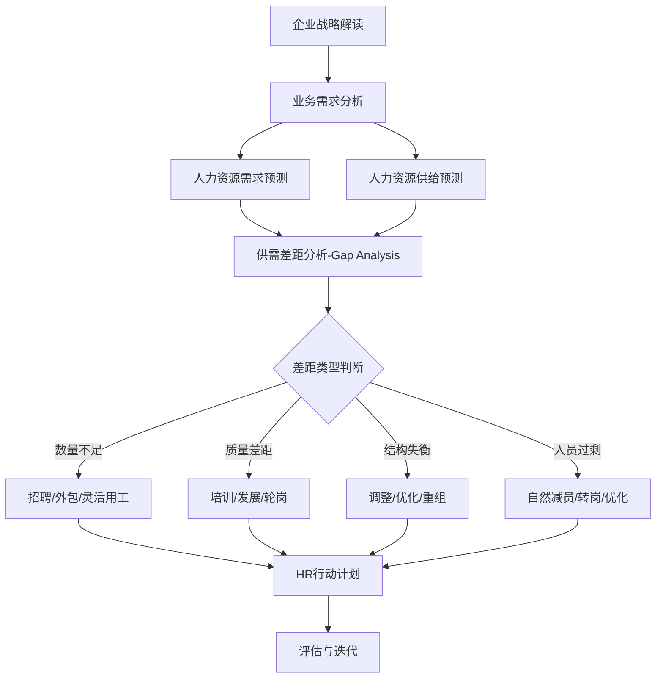
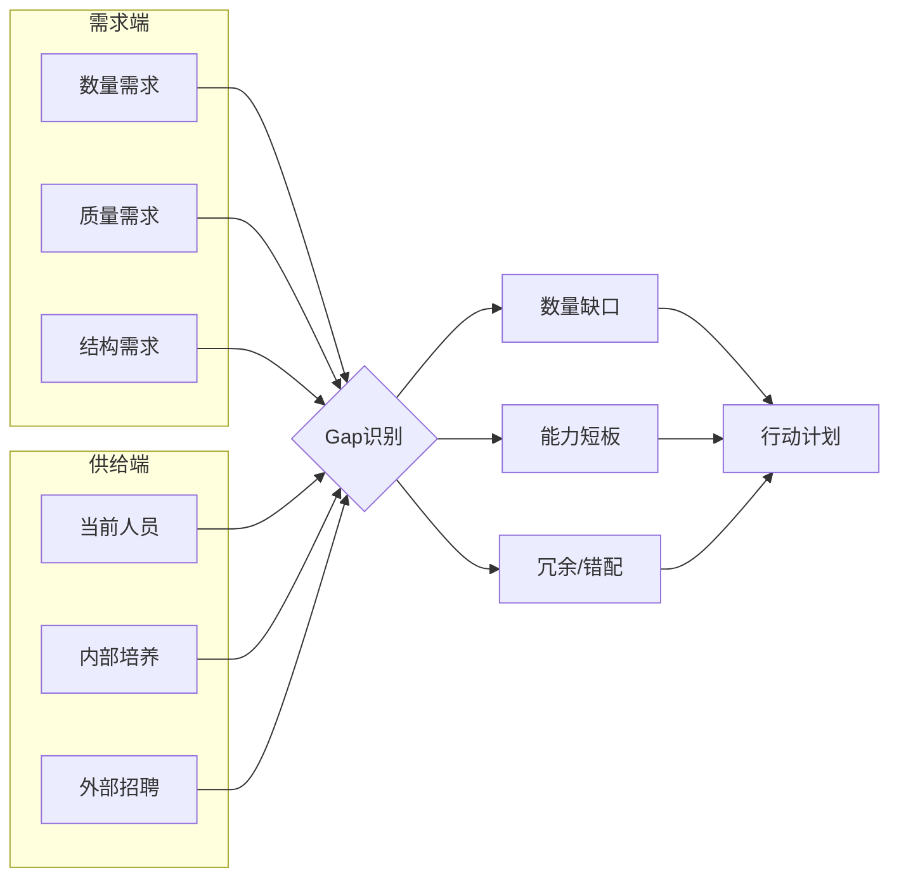
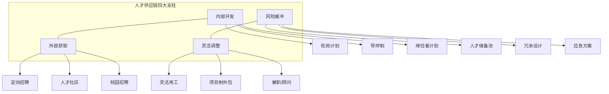

# 人力资源规划与人才供应链

> [!abstract] 核心观点
> 人力资源规划（HRP）是连接企业战略与人才管理的桥梁，核心在于**"供需匹配"**——基于业务战略预判人才需求，从数量、质量、结构三个维度进行差距分析，并通过人才供应链机制实现持续供给。HR管培生需要掌握从战略解读到行动计划的全流程方法论，理解人才供应链不是简单的招聘替代，而是"造血"与"输血"并重的系统思维。

---

## 一、人力资源规划方法论

### 1.1 人力资源规划总体框架



### 1.2 需求预测方法

| 预测方法 | 适用场景 | 核心逻辑 | 精确度 | 复杂度 |
|---------|--------|---------|-------|-------|
| **趋势分析法** | 稳定业务环境 | 基于历史数据线性外推 | 中 | 低 |
| **比率分析法** | 业务驱动明确 | 业务量/人均效能=人员需求 | 中高 | 低 |
| **回归分析法** | 多变量影响场景 | 建立多因素预测模型 | 高 | 高 |
| **德尔菲法** | 新业务/不确定环境 | 专家多轮匿名共识 | 中 | 中 |
| **情景规划法** | 战略转型期 | 乐观/悲观/基准多情景 | 中高 | 高 |
| **工作负荷法** | 操作岗位为主 | 工作量/单人产能 | 高 | 中 |

> **面试加分点**：当被问及预测方法时，建议补充"实际工作中通常组合使用2-3种方法交叉验证，而非单一方法"，体现系统思维。

### 1.3 供给预测方法

**内部供给预测：**
- **人员盘点法**：基于现有人才盘点数据
- **马尔可夫分析法**：基于历史人员流动概率矩阵
- **继任者计划**：关键岗位的储备率评估
- **内部人才库**：技能/经验/潜力数据库

**外部供给预测：**
- 劳动力市场分析（学历结构、薪酬水平、人才流动趋势）
- 行业人才竞争格局
- 人口结构变化趋势
- 教育体系输出分析

### 1.4 Gap Analysis 差距分析模型



**Gap分析三个维度：**

| 维度 | 分析内容 | 典型问题 | 应对策略 |
|------|---------|---------|---------|
| **数量** | 人数/编制供需差 | 缺多少人？多多少人？ | 招聘/淘汰/灵活用工 |
| **质量** | 能力/经验供需差 | 现有人员能力是否达标？ | 培训/引进/轮岗 |
| **结构** | 层级/职能/区域供需差 | 人员分布是否合理？ | 调整/重组/优化 |

---

## 二、人才供应链概念与模型

### 2.1 什么是人才供应链？

> **人才供应链**（Talent Supply Chain）是将供应链管理理念引入人才管理领域，强调以"端到端"的视角，像管理产品供应一样管理人才供给，确保在正确的时间、正确的地点，将正确的人才配置到正确的岗位。

### 2.2 人才供应链 vs 传统招聘

| 维度 | 传统招聘 | 人才供应链 |
|------|---------|-----------|
| **导向** | 被动响应（出缺才招） | 主动预测（提前储备） |
| **视角** | 单点补位 | 全链条管理 |
| **时间轴** | 短期（1-3个月） | 中长期（1-3年） |
| **核心指标** | 招聘周期、招聘成本 | 人才到位率、储备充足率 |
| **风险思维** | 无明确风险预案 | 有风险缓冲机制 |
| **供应商关系** | 交易型 | 战略伙伴型 |

### 2.3 人才供应链四大支柱模型（Capelli Model）



### 2.4 人才供应链成熟度模型

| 成熟度等级 | 特征 | 典型表现 |
|-----------|------|---------|
| **L1-被动响应** | 缺人即招，无计划 | 招聘周期长，被动救火 |
| **L2-计划驱动** | 年度规划，按需招聘 | 有预算有编制，但缺乏灵活性 |
| **L3-前瞻预测** | 基于业务预测主动储备 | 人才池建设，提前3-6个月布局 |
| **L4-动态优化** | 数据驱动实时调整 | 人才供应链可视化，动态调配 |
| **L5-生态共生** | 内外部人才生态圈 | 人才联盟、自由职业者网络、AI匹配 |

---

## 三、面试高频问题精讲

### 问题1：公司要开新业务线，HR怎么规划人力？

**考察点：** 战略理解能力、HR规划方法论的系统性、从0到1的业务思维

**答题框架：STAR-R（Situation-Task-Action-Result-Reflection）**

```
框架要点：
1. 理解业务——新业务线的战略目标、商业模式、关键能力
2. 需求测算——基于业务目标测算各阶段人员需求
3. 供给分析——内部可调配 vs 外部招聘
4. 制定计划——分阶段的人力配置方案
5. 风险评估——关键岗位空缺、市场供给风险
```

**参考回答：**

> 我会分四个步骤推进：
>
> **第一步，深度理解业务。** 和业务负责人沟通，明确新业务线的战略定位、目标客户、商业模式、收入目标和关键里程碑。比如是独立运营还是依附现有业务？需要哪些核心能力？
>
> **第二步，测算人力需求。** 采用"自下而上+对标"相结合的方法。自下而上：根据业务目标拆解岗位需求（例如"年营收5000万需要多少销售？多少产研？"）；对标：参考行业头部公司的人均效能数据。同时按启动期、爬坡期、成熟期做分阶段规划。
>
> **第三步，供给方案设计。** 核心岗位优先内部调配（熟悉公司文化、上手快），通用岗位外部招聘。对于紧缺人才，提前启动"预招聘"机制，建立人才池。
>
> **第四步，制定行动计划与应急预案。** 明确关键岗位的到位时间线，对最难招聘的岗位设计B计划（如顾问、外包、灵活用工）。

**得分点：**
| 得分点 | 说明 |
|-------|------|
| 体现业务思维 | 从业务目标倒推人力需求，而非纯HR视角 |
| 分阶段规划 | 启动期、爬坡期、成熟期不同方案 |
| 内外部结合 | 内部调配+外部招聘的组合策略 |
| 风险预案 | 提及关键岗位的B计划 |

---

### 问题2：怎么预测未来的人才需求？

**考察点：** 预测方法论的掌握程度、实际应用能力

**答题框架：3W1H（What-Why-When-How）**

**参考回答：**

> 人才需求预测可以从**定性与定量**两个维度、**短期与长期**两个时间跨度来展开：
>
> **定量方法方面：**
> - **趋势分析法**：适用于成熟业务，基于近3年人员增长趋势做线性外推
> - **比率分析法**：最常用，例如"营收/人数"的人均效能比，根据业务增长目标倒推
> - **工作负荷法**：适用于可量化的工作量，如客服中心根据话务量预测
>
> **定性方法方面：**
> - **德尔菲法**：多轮专家匿名共识，适合新业务预测
> - **情景规划法**：乐观/基准/悲观三种情景分别测算
>
> **实际工作中**，我倾向于组合使用2-3种方法。例如，用比率法做基准测算，再用德尔菲法做修正，同时参考行业标杆数据做校准。预测不是一次性的，而是需要根据业务数据动态调整，季度复盘、半年修正。

**得分点：**
| 得分点 | 说明 |
|-------|------|
| 方法分类清晰 | 定性/定量、短期/长期多维度 |
| 方法论+实操 | 不只讲理论，还要讲实际怎么组合使用 |
| 动态调整意识 | 强调预测的迭代和修正 |

---

### 问题3：什么是人才供应链？和招聘有什么区别？

**考察点：** 对人才供应链概念的理解深度、与传统招聘的区别认知

**答题框架：类比法（供应链比喻）+ 对比法**

**参考回答：**

> 人才供应链是把供应链管理的思想引入人才管理领域。就像沃尔玛管理商品供应链一样——不是等货架空了才去进货，而是基于销售数据提前预测、提前备货，确保任何时候都有货可卖。
>
> 传统招聘和人才供应链的核心区别在于：
>
> **第一，时间维度不同。** 招聘是被动响应——"人走了，赶紧招"；人才供应链是主动预测——"半年后业务扩张需要多少人，现在就储备"。
>
> **第二，管理范围不同。** 招聘只管"招进来"这一个环节；人才供应链覆盖"选、用、育、留"全链条，包括内部培养、轮岗、继任者计划等。
>
> **第三，风险意识不同。** 人才供应链有"库存缓冲"的概念，对关键岗位设计"板凳深度"（bench strength），而传统招聘缺少这种风险缓冲机制。
>
> 打个比方：招聘是"消防队"，着火了去灭火；人才供应链是"城市规划师"，提前规划消防通道、布局消防站、做防火演练。

**得分点：**
| 得分点 | 说明 |
|-------|------|
| 类比生动 | 用供应链/消防队的比喻，通俗易懂 |
| 多维度对比 | 时间/范围/风险三个维度对比清晰 |
| 概念理解准确 | 点出"主动预测""全链条""风险缓冲"关键词 |

---

### 问题4：你怎么做人力资源规划的？

**考察点：** 完整方法论的系统性、实操经验

**答题框架：流程法（5步模型）**

**参考回答：**

> 我通常把人力资源规划分为五个步骤：
>
> **第一步：战略理解（输入）。** 参加业务战略会，理解公司的年度/三年战略目标，明确业务增长点、新业务布局、组织调整方向。
>
> **第二步：需求测算（预测）。** 根据业务目标，采用"比率法+工作负荷法"组合预测。例如，某业务线目标增长30%，根据人均效能比测算人员需求，再结合业务负责人的判断做修正。
>
> **第三步：供给盘点（现状）。** 盘点现有人才的数量、质量、结构，包括内部流动率、离职率、晋升率等数据。
>
> **第四步：差距分析（Gap）。** 对比供需，识别数量缺口、能力短板、结构错配，并评估缺口的关键程度和紧迫性。
>
> **第五步：行动计划（落地）。** 制定"内部培养+外部招聘"的组合方案，明确时间表、责任人、预算，并设定跟踪指标（如招聘完成率、关键岗位到位率、内部晋升率）。
>
> 最后，我会建立**月度复盘机制**，根据业务实际变化动态调整规划，确保HR规划不是"做完就锁在抽屉里"。

**得分点：**
| 得分点 | 说明 |
|-------|------|
| 逻辑清晰 | 五步法步步递进，逻辑完整 |
| 实操性强 | 有具体的方法、工具、产出物 |
| 动态调整 | 强调复盘和迭代，避免"纸上谈兵" |

---

## 四、关联知识点

- [[03-HR人事/HR管培生备战/02-专业篇/02_HR三支柱模型]] - 理解HR规划的战略定位
- [[03-HR人事/HR管培生备战/02-专业篇/04_招聘与配置]] - 人才供应链的外部获取策略
- [[03-HR人事/HR管培生备战/02-专业篇/09_组织发展与人才盘点]] - 内部供给盘点的核心方法
- [[03-HR人事/HR管培生备战/00_MOC_HR管培生备战中枢]] - 返回知识库中枢

---

> **本文档属于HR管培生备战知识库 - 02-专业篇**
> 创建日期：2026-08-03 | 更新频率：建议每季度更新