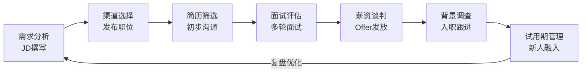
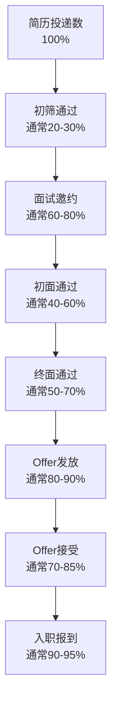
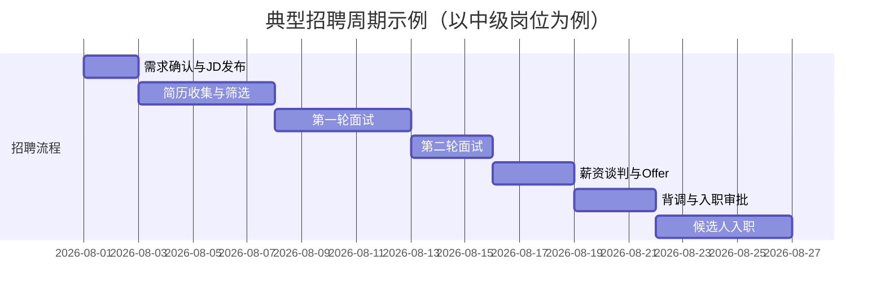
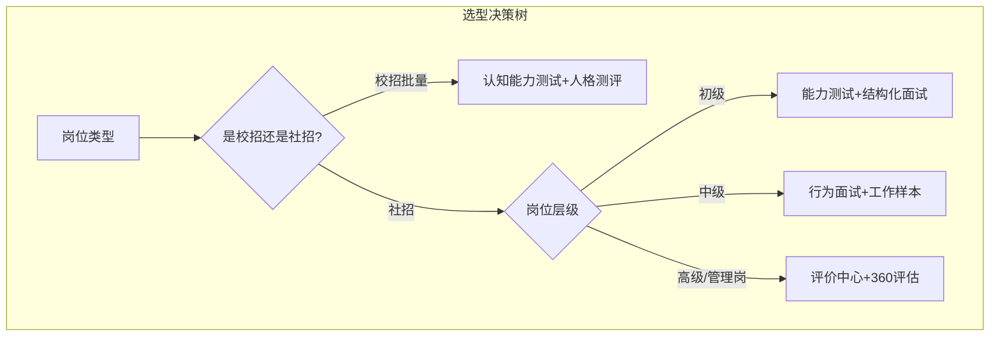

> [!abstract] 核心观点
> 招聘与配置是HR的"入口"职能，直接决定人才供应链的质量与效率。优秀的招聘管理不仅是完成HC（Headcount），更是从**业务需求理解**出发，通过**精准渠道策略**、**科学筛选评估**和**出色的候选人体验**，实现人才与岗位、人才与组织的双重匹配。管培生需掌握从JD撰写到入职跟进的完整闭环，并具备用数据驱动招聘决策的能力。

---

## 一、招聘全流程全景图



### 1.1 各环节核心要点

| 阶段 | 关键动作 | 输出物 | 常见问题 |
|------|----------|--------|----------|
| **需求分析** | 与业务确认岗位职责、任职资格、汇报关系、薪资范围 | 更新版JD、HC审批表 | 业务方需求模糊，JD照抄竞品 |
| **渠道选择** | 根据岗位层级/类型选择匹配渠道组合 | 渠道发布清单 | 渠道单一，高端岗用错渠道 |
| **简历筛选** | 关键词匹配+软性素质初筛，建立人才库 | 初筛通过名单 | 标准不一，漏掉潜力候选人 |
| **面试评估** | 结构化面试+行为面试法（STAR） | 面试评估表、评分记录 | 面试官未培训，主观偏差大 |
| **薪资谈判** | 基于市场数据+内部公平性确定薪资包 | Offer Letter | 薪资期望不匹配，Offer被拒 |
| **背景调查** | 核实工作经历、教育背景、离职原因 | 背调报告 | 背调不充分，录用后发现问题 |
| **入职跟进** | 入职引导、导师匹配、30-60-90天计划 | 入职计划表 | 新人"放养"，试用期离职 |

### 1.2 JD撰写黄金法则

```markdown
**JD撰写公式：**
[岗位名称] + [核心职责（3-5条）] + [任职资格（硬性+软性）] + [加分项] + [我们提供]

**好JD的特征：**
- 职责描述使用动词开头（"负责"、"主导"、"推动"）
- 任职资格区分"必选"与"加分"
- 包含真实的团队文化/项目亮点，而非空泛描述
- 薪资范围透明化（如有条件）
```

---

## 二、招聘漏斗分析

### 2.1 招聘漏斗模型



### 2.2 关键转化率指标与诊断

| 指标 | 计算公式 | 健康基准 | 异常信号 | 改进方向 |
|------|----------|----------|----------|----------|
| **简历筛选通过率** | 初筛通过数/投递总数 | 20-30% | 过高>50%：标准过松<br/>过低<10%：JD或渠道有问题 | 优化JD关键词，校准筛选标准 |
| **面试到场率** | 实际面试数/邀约数 | 70-85% | <60%：候选人体验差或匹配度低 | 加强沟通，缩短面试周期 |
| **面试通过率** | 通过数/面试数 | 40-60% | >80%：标准过松<br/><20%：JD或筛选有问题 | 校准面试标准，培训面试官 |
| **Offer接受率** | 接受数/发放数 | 75-85% | <60%：薪资/品牌/竞争问题 | 调研市场薪资，优化候选人体验 |
| **入职率** | 入职数/接受数 | 90-95% | <80%：有竞争对手截胡或背调问题 | 缩短Offer到入职间隔，做入职跟进 |

### 2.3 招聘周期（Time-to-Fill）管理



---

## 三、人才测评工具类型与选型

### 3.1 测评工具全景

| 类型 | 代表工具 | 测量维度 | 适用场景 | 信效度 |
|------|----------|----------|----------|--------|
| **认知能力测试** | SHL、Watson-Glaser | 逻辑推理、数理分析、语言理解 | 校招/管培生批量筛选 | 高 |
| **人格/性格测评** | MBTI、大五人格、DISC、Hogan | 性格特质、行为倾向 | 社招面试参考、团队搭配 | 中高 |
| **能力倾向测验** | 公务员行测、GMAT | 特定领域能力（数理/语言/逻辑） | 通用岗位筛选 | 中高 |
| **情景判断测试（SJT）** | 自研或定制 | 工作场景应对能力 | 管理岗/管培生 | 中 |
| **评价中心（AC）** | 无领导小组、案例分析、角色扮演 | 综合管理能力 | 高潜人才选拔、内部晋升 | 高 |
| **工作样本测试** | 编程测试、作品评审、试讲 | 实际操作能力 | 技术岗、创意岗 | 高 |
| **结构化面试** | STAR行为面试 | 过去行为预测未来表现 | 全岗位 | 中高 |

### 3.2 测评工具选型矩阵



### 3.3 测评工具选型原则

1. **目的导向**：先明确测评目的（筛选/诊断/发展），再选工具
2. **信效度优先**：优先选择有实证研究支持的工具（如大五人格效度高于MBTI用于预测绩效）
3. **成本效益**：校招批量场景用认知测试做初筛（性价比高），高管用AC（精准但成本高）
4. **公平合规**：避免对特定群体有不利影响的工具，确保测评过程合规
5. **体验优先**：测评时间不宜过长（建议15-45分钟），避免候选人流失

---

## 四、面试高频问题

### 问题1：招聘渠道怎么选？

> **考察点**：对招聘渠道的认知深度、渠道策略思维、成本意识

**答题框架**：分类法 + 匹配逻辑 + 举例说明

**参考回答**：
```
招聘渠道选择我会从"岗位类型 × 层级 × 紧急程度 × 预算"四个维度来决策。

首先，招聘渠道可以分成三大类：
1. 综合招聘平台（BOSS直聘、猎聘、智联）——适合中基层批量招聘，覆盖面广，但高端人才密度低
2. 垂直/社交渠道（LinkedIn、脉脉、行业论坛）——适合中高端/专业人才，精准度高
3. 内部推荐 —— 适合所有岗位，入职率高、留存好，但需要良好的内推文化和激励机制

我的选择逻辑是：
- 初级岗位（比如客服、销售）：BOSS直聘+校园招聘+内推，追求性价比
- 中级专业岗（如HR、财务）：BOSS直聘+LinkedIn+内推，平衡质量和速度
- 高级管理岗：猎头+定向挖猎+行业人脉，追求精准
- 稀缺技术岗：GitHub/技术社区+内推+猎头，精准触达

举个例子，之前我在XX公司招聘AI工程师，传统平台效果很差，后来我们转向GitHub开源社区和技术博客定向挖猎，配合内推奖励翻倍，候选人质量明显提升。
```

**得分点**：
- 有清晰的分类体系（不只是一一列举）
- 体现"按需匹配"的思维，而非"什么渠道都用"
- 有实际案例佐证，展示实操经验

---

### 问题2：如何评估招聘效果？

> **考察点**：数据分析能力、招聘闭环思维、关键指标认知

**答题框架**：数据指标（效率+质量+成本）+ 多维度评估 + 持续改进

**参考回答**：
```
我会从三个维度建立招聘效果评估体系：

**维度一：效率指标**
- 招聘周期（Time-to-Fill）：从需求确认到入职的天数
- 岗位完成率：已入职HC/总HC
- 面试到场率

**维度二：质量指标**
- 试用期通过率 —— 这个最核心，反映招聘的"精准度"
- 绩效表现（入职3-6个月绩效评估）
- 留存率（6个月/1年留存率）

**维度三：成本指标**
- 单次招聘成本（总花费/入职人数）
- 渠道ROI（各渠道入职人数/渠道投入）
- 猎头使用率

评估方法上，我会做月度招聘仪表盘，追踪这些指标的环比和同比趋势，发现异常及时根因分析。季度做招聘复盘，输出《招聘效果分析报告》给业务方和HR负责人，并基于数据提出优化建议。
```

**得分点**：
- 区分效率、质量、成本三个维度，体现系统思维
- 提到"试用期通过率"作为核心质量指标，体现结果导向
- 强调"数据驱动优化"的闭环思维

---

### 问题3：面试通过率高但Offer接受率低怎么办？

> **考察点**：问题诊断能力、市场敏感度、候选人体验管理

**答题框架**：问题定位（根因分析）→ 分环节改进 → 追踪验证

**参考回答**：
```
面试通过率高说明筛选标准可能没问题，但Offer接受率低说明问题出在"面试到Offer"这个环节。我会从以下几个方向分析：

**第一步：根因诊断**
- 薪资竞争力分析：对比市场分位值，看我们的薪资包是否处于市场中位数以下
- 候选人体验回顾：面试流程是否太长？面试官是否专业？反馈是否及时？
- 雇主品牌感知：候选人是否在社交媒体上看到负面评价？
- 竞对分析：同期是否有竞品在大量招聘同类岗位？

**第二步：分环节改进**
- 薪资方面：如果确认薪资缺乏竞争力，建议调整薪资结构（如增加签字费、期权等），或向上级申请特批通道
- 流程方面：缩短面试到Offer的周期（目标<5个工作日），面试后24小时内给反馈
- 体验方面：面试官培训，统一面试体验标准；增加"候选人体验官"角色
- 品牌方面：在面试中充分展示公司优势和成长空间，用真实案例打动候选人

**第三步：追踪验证**
- 调整后密切追踪Offer接受率变化
- 做离职/拒Offer访谈，了解真实原因

这个问题的关键不是"降价促销"，而是找到候选人真正在意的价值点，然后精准传递。
```

**得分点**：
- 提出"先诊断再治疗"的思路，而非直接给方案
- 薪资、流程、体验、品牌多维度覆盖
- 提到"候选人体验官"等创新做法，体现前沿意识

---

### 问题4：业务部门要人很急但质量不达标，你怎么处理？

> **考察点**：冲突管理能力、专业底线意识、沟通策略

**答题框架**：理解需求 → 分析风险 → 提供替代方案 → 达成共识

**参考回答**：
```
这是一个HR工作中常见的"质量vs速度"困境。我的处理思路是：

**第一步：理解业务方的"急"**
先深入了解：为什么急？是项目启动缺人，还是有人突然离职导致工作积压？如果是积压问题，是否有临时解决方案（如内部调配、外包、加班）？

**第二步：评估降级录用的风险**
- 短期风险：入职后不胜任，业务方更被动
- 中期风险：试用期离职，浪费招聘成本和时间
- 长期风险：影响团队氛围和用人标准

**第三步：给出替代方案（而非简单拒绝）**
方案A（推荐）：继续按标准招聘，同时提供短期过渡方案（如外包、内部借调）
方案B（折中）：放宽1-2项非核心要求，但核心能力必须达标
方案C（备选）：先到岗一个能力70%但态度好的候选人，边做边招

**第四步：达成共识**
我会和业务方说："我理解你的紧迫性，但如果降低标准招到不合适的人，三个月后我们可能还要重新招，反而更慢。我建议我们先把核心要求列出来，看看哪些是'必须'，哪些是'最好有'，然后我加速推进，同时提供临时方案帮你缓解压力。"
```

**得分点**：
- 体现"理解业务"的共情能力
- 有结构化的风险分析
- 提出替代方案，展现"解决问题"而非"推卸责任"的态度
- 最后的沟通话术体现高情商

---

### 问题5：两个部门争抢同一个候选人，HR怎么协调？

> **考察点**：利益平衡能力、流程规范性、沟通协调能力

**答题框架**：确认事实 → 评估优先级 → 组织协调 → 公正决策

**参考回答**：
```
这种情况在内部调岗或跨部门项目中比较常见。我的处理流程：

**第一步：确认事实**
- 候选人是否已经明确接受了A部门的Offer？
- 两个部门对这个候选人的需求紧迫程度如何？
- 候选人本人更倾向于哪个方向？

**第二步：评估优先级**
- 如果候选人已签Offer：原则上尊重契约，除非有极其特殊的情况
- 如果候选人还在流程中：看哪个岗位与候选人的职业发展方向更匹配
- 考虑公司战略优先级：哪个部门的业务需求更紧急/更重要

**第三步：组织三方沟通**
- 邀请两个部门负责人和候选人一起沟通
- 明确规则：以公司利益最大化为导向，而非部门利益
- 寻找双赢方案：比如共享人才（项目制）、或者分阶段支持

**第四步：给出建议并决策**
- 如果无法达成一致，提交上级决策
- 无论结果如何，对落选部门做好沟通和安抚
- 记录案例，后续优化内部人才流动机制

关键原则：**公平透明、公司利益优先、尊重候选人意愿**。
```

**得分点**：
- 有清晰的流程框架
- 提到"契约精神"和"公司利益优先"的原则
- 有三方沟通的意识，体现协调能力
- 最后提到"优化机制"，展现系统思考

---

## 五、招聘相关工具与模板

### 5.1 招聘需求分析表

```markdown
| 维度 | 内容 | 确认状态 |
|------|------|----------|
| 岗位名称 | [填写] | ☐ |
| 汇报关系 | [填写] | ☐ |
| 核心职责（3-5条） | [填写] | ☐ |
| 必须条件 | [学历/经验/技能] | ☐ |
| 加分条件 | [证书/语言/行业背景] | ☐ |
| 薪资范围 | [填写] | ☐ |
| 期望到岗时间 | [填写] | ☐ |
| 招聘渠道偏好 | [填写] | ☐ |
```

### 5.2 STAR面试提问模板

```markdown
**S - Situation（情境）**
"请描述一个你曾经面临的具体工作场景..."

**T - Task（任务）**
"在那个场景中，你的具体任务是什么？"

**A - Action（行动）**
"你采取了哪些具体行动？你是如何思考的？"

**R - Result（结果）**
"最终结果如何？你从中学到了什么？"
```

---

> [!tip] 管培生备考提示
> - 招聘是面试中的高频考点，尤其是"渠道选择"和"效果评估"类问题
> - 回答时多用数据说话，展现"数据驱动"的HR思维
> - 结合实际案例会让回答更具说服力，建议准备1-2个自己的实习/项目经历
> - 关注最新趋势：AI招聘、人才画像、雇主品牌建设等

---

## 相关链接
- [[03-HR人事/HR管培生备战/00_MOC_HR管培生备战中枢]]
- [[03-HR人事/HR管培生备战/02-专业篇/06_绩效管理]]
- [[03-HR人事/HR管培生备战/03-战略篇/01_如何理解业务]]
- [[03-HR人事/HR管培生备战/03-战略篇/02_HR数据分析与人效管理]]