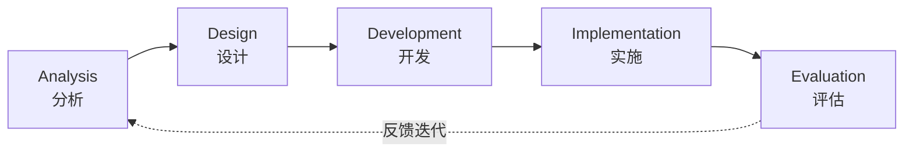
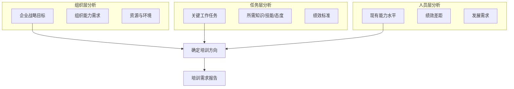
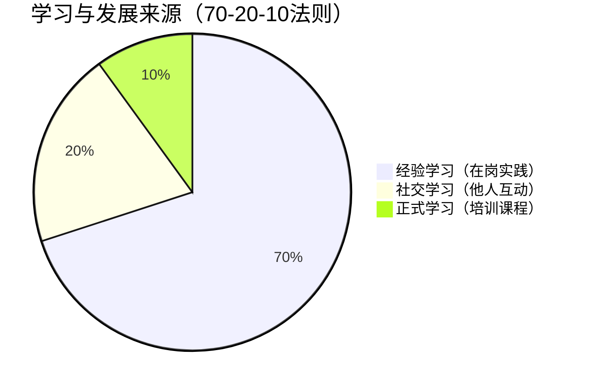
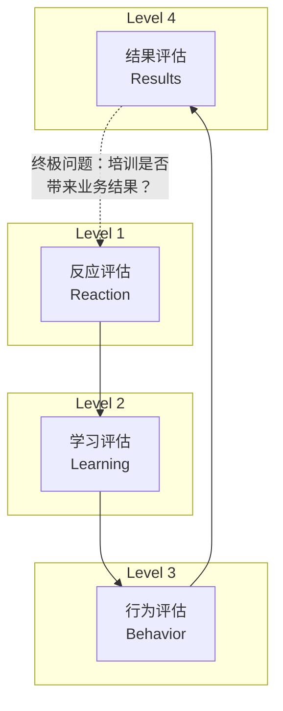

# 培训与开发

> [!abstract] 核心观点
> 培训与开发（L&D）是HR体系中直接创造价值的核心职能之一，目标是**缩短员工能力与岗位要求的差距，并为组织未来储备关键能力**。ADDIE模型是培训体系设计的通用框架，70-20-10法则揭示了学习的真实来源比例，柯氏四级评估则是量化培训效果的标准工具。优秀HR管培生需要建立"培训不是福利而是投资"的思维，学会用业务语言讲培训价值。

---

## 一、培训体系设计——ADDIE模型

### 1.1 ADDIE模型总览



### 1.2 ADDIE五阶段详解

| 阶段 | 核心任务 | 关键产出 | 常见工具/方法 |
|------|---------|---------|-------------|
| **A-分析** | 需求分析、任务分析、学员分析、环境分析 | 培训需求报告、差距分析 | 问卷调查、访谈、绩效数据分析、OJD |
| **D-设计** | 设定学习目标、确定课程结构、设计评估方式 | 课程大纲、学习目标矩阵 | Bloom分类法、学习目标SMART化 |
| **D-开发** | 编写教材、制作课件、开发评估工具 | 培训材料包、讲师手册、学员手册 | 内容创作、视频制作、案例开发 |
| **I-实施** | 讲师培训、学员管理、后勤保障 | 培训实施记录、签到表 | 面授/线上/混合式、培训运营 |
| **E-评估** | 反应评估、学习评估、行为评估、结果评估 | 评估报告、ROI分析 | 柯氏四级评估、满意度问卷、考试 |

### 1.3 培训需求分析三层模型（McGehee & Thayer）



> **面试加分点**：在分析培训需求时，不要只做"问卷调研"——要结合绩效数据、360评估、业务规划三个维度交叉验证，体现"数据驱动"思维。

---

## 二、70-20-10法则详解

### 2.1 法则定义



| 学习来源 | 占比 | 具体形式 | 典型案例 |
|---------|------|---------|---------|
| **经验学习（70%）** | 70% | 在岗实践、项目历练、轮岗、挑战性任务 | 新管培生轮岗项目、升职前的"影子CEO"计划 |
| **社交学习（20%）** | 20% | 导师辅导、同伴学习、社群交流、反馈 | 师徒制、行动学习小组、复盘会 |
| **正式学习（10%）** | 10% | 课堂培训、在线课程、读书、认证 | 新员工入职培训、领导力项目 |

### 2.2 实际应用策略

**如何将70-20-10落地到培训体系：**

| 策略 | 70% 经验学习 | 20% 社交学习 | 10% 正式学习 |
|------|-------------|-------------|-------------|
| **新员工** | 轮岗计划、在岗实操 | 导师制、伙伴计划 | 入职培训课程 |
| **高潜人才** | 战略性项目、action learning | 高管教练、peer coaching | 领导力工作坊 |
| **管理者** | 跨部门轮岗、海外派遣 | 管理论坛、私董会 | 管理技能培训 |
| **专业人才** | 攻坚项目、技术攻关 | 技术社区、code review | 专业认证课程 |

> **面试加分点**：70-20-10不是"正式学习只占10%就不重要了"——正式学习是70%和20%的基础和催化剂，三者是乘数关系而非加法关系。

---

## 三、柯氏四级评估模型

### 3.1 模型层级



### 3.2 四级评估详解

| 层级 | 评估内容 | 评估时机 | 常用方法 | 难度 |
|------|---------|---------|---------|------|
| **L1 反应** | 学员满意度、课程体验 | 培训结束时 | 满意度问卷、NPS评分 | 低 |
| **L2 学习** | 知识/技能掌握程度 | 培训前后对比 | 考试、实操考核、模拟演练 | 中 |
| **L3 行为** | 工作行为是否改变 | 培训后3-6个月 | 360评估、主管观察、绩效面谈 | 高 |
| **L4 结果** | 业务指标是否改善 | 培训后6-12个月 | KPI对比、ROI计算、目标达成率 | 最高 |

### 3.3 培训ROI计算公式

```
ROI = (培训收益 - 培训成本) / 培训成本 × 100%
```

**收益量化示例：**
- 销售培训：培训后销售额提升 - 培训前销售额 = 培训收益
- 客服培训：客户满意度提升带来的留存率提升价值
- 管理培训：员工离职率降低节省的招聘成本

> **面试注意**：ROI计算在L3和L4之间存在一个"归因困境"——业务指标变化可能是多种因素导致的，不能简单归功于培训。面试中提及这个局限性能体现专业深度。

---

## 四、面试高频问题精讲

### 问题1：培训ROI怎么衡量？

**考察点：** 对培训效果评估的理解深度、数据思维、ROI计算方法的掌握

**答题框架：四层级递进法（柯氏四级）**

**参考回答：**

> 衡量培训ROI是个系统工程，我通常采用**柯氏四级评估模型**，从浅到深逐层递进：
>
> **L1-反应层**：培训结束后立即收集学员满意度，这是最基础的衡量，但只能反映"学员是否喜欢"，不能反映学习效果。
>
> **L2-学习层**：通过前后测对比，评估学员知识和技能的增长。例如，销售技巧培训前做模拟演练评分，培训后再次评分，对比提升幅度。
>
> **L3-行为层**：这是关键的一层——培训后3-6个月，通过主管观察、360评估、绩效面谈等方式，判断学员是否将所学应用到工作中。行为的改变才是培训价值的真正体现。
>
> **L4-结果层**：最终衡量培训对业务指标的影响。比如销售培训完成后，统计销售额、客单价、转化率的变化。这里需要做**ROI计算**：
>
> > ROI = (培训带来的业务收益 - 培训总成本) / 培训总成本 × 100%
>
> 其中培训成本包括：课程开发/采购费、讲师费、学员时间成本、差旅费、机会成本。
>
> **需要特别说明的是**，L4的归因确实存在挑战——业务指标变化可能是市场环境、产品升级等多因素导致的。所以我会在评估时使用对照组设计（参加培训的 vs 未参加的），或者采用多变量分析，尽可能剥离其他因素的干扰。

**得分点：**
| 得分点 | 说明 |
|-------|------|
| 四层级递进清晰 | 体系化表达，展示方法论系统掌握 |
| 实操细节丰富 | 有具体的时间节点、工具、方法 |
| 归因分析有深度 | 主动提及ROI归因困境，体现思辨能力 |
| 数据思维 | 有对照组设计等数据验证意识 |

---

### 问题2：怎么让业务部门愿意参加培训？

**考察点：** 培训推动能力、跨部门沟通、业务思维

**答题框架：痛点-价值-体验-影响（PVEI）**

**参考回答：**

> 业务部门不愿意参加培训，通常是因为"培训与业务脱节"或"培训占用业务时间"。要解决这个问题，我会从四个维度入手：
>
> **第一，找到业务痛点，反向设计培训。** 不去问"你们需要什么培训"，而是问"你们现在最大的业务挑战是什么"——然后设计培训来解决这个挑战。例如，销售团队业绩不达标，培训主题就是"破冰技巧与成交话术"，而不是"销售基础理论"。
>
> **第二，用业务语言讲培训价值。** 不说"培训能提升员工能力"，而说"这个培训预计能帮团队提升15%的转化率，相当于多签300万的单子"。把培训目标翻译成业务KPI。
>
> **第三，降低参与门槛，提升体验。** 培训时间尽量安排在业务淡季，采用"微学习"模式（30分钟一场），减少对业务的干扰。同时内容要"即学即用"——学完就能马上用到工作中。
>
> **第四，用数据证明培训效果。** 培训结束后，定期回访业务部门，展示培训带来的业务改善数据，让业务部门看到"参加培训确实帮到了我"。有了成功案例，后续推广就容易了。

**得分点：**
| 得分点 | 说明 |
|-------|------|
| 业务思维 | 从业务痛点出发，而非从培训出发 |
| 语言转化 | 把培训语言翻译成业务语言 |
| 降低门槛 | 有具体的操作策略（时间、时长、内容） |
| 闭环思维 | 用数据证明效果，形成正向循环 |

---

### 问题3：培训体系怎么从0到1搭建？

**考察点：** 体系搭建能力、项目规划思维、全局观

**答题框架：四步建设法（搭框架→建内容→抓运营→做评估）**

**参考回答：**

> 从0到1搭建培训体系，我会分四步推进：
>
> **第一步：搭建培训基础设施。**
> - 建立培训制度（培训管理办法、学分制、培训与晋升挂钩机制）
> - 配置培训资源（线上学习平台 LMS、培训场地、预算）
> - 确定培训组织架构（是否有专职培训团队？还是HRBP兼职？）
>
> **第二步：构建课程体系。**
> - 按"新员工→专业人才→管理者→领导力"四个层级规划
> - 优先建设"保命"课程（新员工入职培训、合规培训、安全培训）
> - 再逐步建设"增值"课程（专业技能、管理能力、领导力发展）
>
> **第三步：建立培训运营机制。**
> - 年度培训计划制定流程（需求调研→计划审批→预算分配）
> - 培训实施SOP（开班前→开班中→开班后全流程规范）
> - 内训师队伍建设（选拔、培养、激励、认证）
>
> **第四步：搭建评估体系。**
> - 用柯氏四级评估，先从L1/L2做起
> - 逐步建立L3行为评估机制（与绩效管理结合）
> - 成熟后尝试L4结果评估和ROI分析
>
> 关键原则：**不要追求一步到位——先跑起来，再优化。** 第一年重点在"有课程上"，第二年重点在"上好课"，第三年重点在"数据证明培训价值"。

**得分点：**
| 得分点 | 说明 |
|-------|------|
| 体系化思维 | 制度、资源、内容、运营、评估全链路 |
| 分阶段务实 | 从0到1不是一步到位，而是分年迭代 |
| 优先级排序 | 从"保命"到"增值"，逻辑清晰 |
| 可落地 | 有具体的SOP、内训师机制等实操细节 |

---

### 问题4：70-20-10法则在实际中怎么用？

**考察点：** 对学习发展理念的理解深度、实际应用经验

**答题框架：理论-实践-关键点（What-How-Key）**

**参考回答：**

> 70-20-10法则揭示了学习的真实来源，在实际应用中，我将其作为**培训体系设计的指导原则**：
>
> **关于70%经验学习的设计：**
> 70%是核心，不能只靠"自然发生"。我会主动设计结构化的工作历练：
> - 新员工轮岗计划（每个岗位2-3个月）
> - 高潜人才参与跨部门项目（如战略项目、创新实验室）
> - 管理后备的"影子计划"（跟随现任管理者学习）
>
> **关于20%社交学习的设计：**
> - 建立导师制（新员工配备mentor）
> - 定期组织"复盘会"和"分享会"
> - 搭建内部专家网络（让员工可以"找人聊"）
> - 行动学习小组（解决真实业务问题）
>
> **关于10%正式学习的设计：**
> 正式学习虽然占比小，但它是70%和20%的催化剂：
> - 正式学习提供框架和语言（如"学了GROW模型，才能更好地做教练式辅导"）
> - 正式学习触发行为改变（如"学了非暴力沟通，才知道平时的沟通方式有问题"）
>
> **关键要点：** 70-20-10不是严格的数字比例，而是一种思维方式。核心是"不要把培训等同于上课"——要同时关注工作历练和人脉学习。在实际操作中，我会针对不同人群调整比例（如新员工正式学习占比可以更高）。

**得分点：**
| 得分点 | 说明 |
|-------|------|
| 理解准确 | 70-20-10不是数字教条，是设计思维 |
| 实操具体 | 每个部分都有具体的设计策略 |
| 关系理解 | 点出正式学习是催化剂，10%≠不重要 |
| 差异化 | 根据不同人群调整比例，灵活应用 |

---

## 五、关联知识点

- [[03-HR人事/HR管培生备战/02-专业篇/03_人力资源规划与人才供应链]] - 培训与人才供应的关系
- [[03-HR人事/HR管培生备战/02-专业篇/09_组织发展与人才盘点]] - 培训需求来自人才盘点的差距分析
- [[03-HR人事/HR管培生备战/00_MOC_HR管培生备战中枢]] - 返回知识库中枢

---

> **本文档属于HR管培生备战知识库 - 02-专业篇**
> 创建日期：2026-08-03 | 更新频率：建议每季度更新