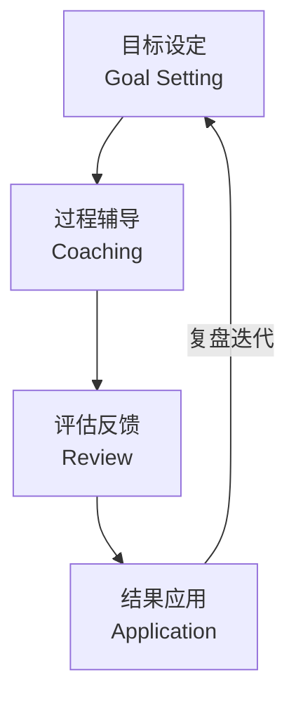
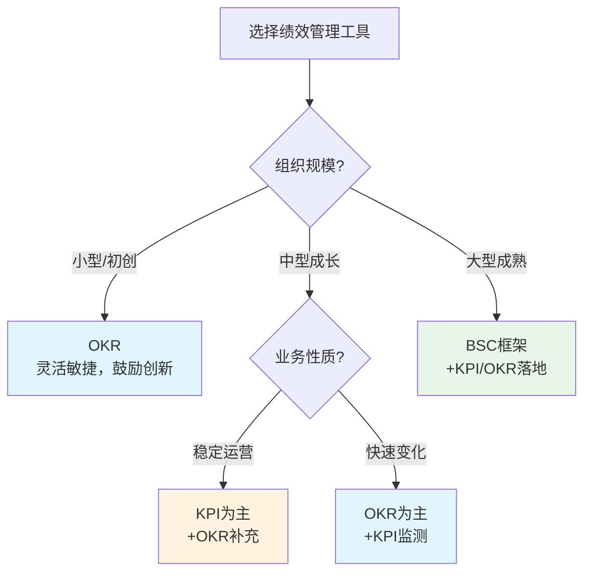
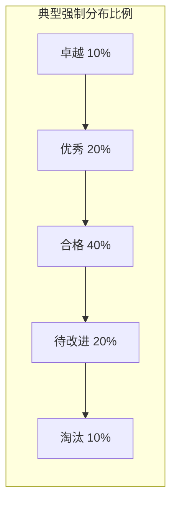

> [!abstract] 核心观点
> 绩效管理的本质不是"打分"，而是**通过目标对齐、持续反馈和有效激励，驱动组织与个人共同成长**。管培生需要理解绩效管理闭环的完整逻辑，掌握KPI、OKR、BSC等工具的核心区别与适用场景，并能够辩证看待强制分布等争议性做法。面试中，面试官关注的是你对绩效管理"形式化"困境的清醒认知和可落地的改进思路。

---

## 一、绩效管理闭环



### 1.1 各环节关键要素

| 阶段 | 核心动作 | 周期 | 关键产出 | 常见误区 |
|------|----------|------|----------|----------|
| **目标设定** | 公司目标拆解→部门目标→个人目标；SMART原则 | 年初/季初 | 绩效目标书、OKR对齐图 | 目标自上而下"摊派"，缺乏沟通 |
| **过程辅导** | 管理者定期1on1、及时反馈、资源支持 | 持续进行（建议双周） | 辅导记录、改进计划 | 平时不管，年底"算总账" |
| **评估反馈** | 自评+上级评+（可选）360评估；绩效面谈 | 半年/年度 | 评估表、绩效面谈记录 | 面谈变"通知"，缺乏双向沟通 |
| **结果应用** | 薪酬调整、奖金分配、晋升/淘汰、发展计划 | 评估后 | 调薪方案、晋升名单、IDP | 仅与薪酬挂钩，忽略发展目的 |

### 1.2 绩效管理成熟度模型

| 成熟度等级 | 特征 | 典型做法 | 企业示例 |
|------------|------|----------|----------|
| **Level 1 - 基础考核** | 以结果为导向，简单打分 | 年度KPI考核，与奖金挂钩 | 传统制造业 |
| **Level 2 - 过程管理** | 关注目标分解与进度追踪 | 季度回顾+KPI看板 | 成长型民企 |
| **Level 3 - 持续反馈** | 强调日常辅导与反馈文化 | 双周1on1+实时反馈工具 | 互联网公司 |
| **Level 4 - 敏捷绩效** | 目标动态调整，快速迭代 | OKR+CFR（对话、反馈、认可） | Google、字节跳动 |
| **Level 5 - 自驱型** | 赋能个体，去中心化 | 无固定考核，Peer Review | 部分创新型企业 |

---

## 二、KPI vs OKR vs BSC 全面对比

### 2.1 核心概念对比

| 维度 | KPI（关键绩效指标） | OKR（目标与关键成果） | BSC（平衡计分卡） |
|------|---------------------|----------------------|-------------------|
| **定义** | 衡量绩效的关键量化指标 | 目标+可量化的关键成果 | 从四个维度平衡评价组织绩效 |
| **本质** | 评估工具 | 目标管理工具 | 战略管理工具 |
| **关注点** | 结果（What） | 目标+结果（Why+What） | 系统性平衡（财务+客户+流程+成长） |
| **设定方式** | 自上而下为主 | 自上而下+自下而上结合 | 战略分解，自上而下 |
| **挑战性** | 通常可达成（100%） | 有挑战性（70%完成即不错） | 视战略目标而定 |
| **考核关联** | 通常直接与薪酬挂钩 | 建议不与薪酬直接挂钩 | 可与平衡计分卡挂钩 |
| **更新频率** | 固定周期（季度/年度） | 灵活调整（通常季度） | 通常年度 |

### 2.2 优劣势与适用场景

| 工具 | 优势 | 劣势 | 适用场景 | 不适用场景 |
|------|------|------|----------|------------|
| **KPI** | 指标明确、易于衡量、与激励挂钩直接 | 容易导致短视行为、指标固化、缺乏创新激励 | 成熟业务、重复性岗位、结果可量化的工作 | 创新型岗位、探索性业务、需要长期投入的工作 |
| **OKR** | 目标对齐透明、鼓励挑战、适应变化快 | 对管理者要求高、员工容易"佛系"（不挂钩薪酬）、落地难度大 | 科技公司、创新业务、知识型员工、快速变化的环境 | 强调稳定性和标准化的岗位 |
| **BSC** | 全面平衡、兼顾长期短期、连接战略 | 实施复杂、维护成本高、指标过多 | 大型企业、成熟组织、战略转型期 | 小型企业、初创公司、需要快速迭代的组织 |

### 2.3 选型决策框架



---

## 三、强制分布法的利弊分析

### 3.1 什么是强制分布法

强制分布法（Forced Distribution / Vitality Curve）是指将员工的绩效评估结果按照预设比例强制分配到不同等级（如S/A/B/C/D或卓越/优秀/合格/待改进），最著名的实践者是GE的"活力曲线"。



### 3.2 利弊分析

| 维度 | 优势 | 劣势 |
|------|------|------|
| **公平性** | 避免"老好人"打分，区分绩效差异 | 人才密集团队中优秀者被迫低评 |
| **激励性** | 激发竞争意识，推动持续改进 | 可能导致恶性竞争，破坏团队协作 |
| **操作性** | 便于管理，薪酬分配有据可依 | 管理者可能"轮流坐庄"规避冲突 |
| **法律风险** | 有据可循，降低随意解雇风险 | 可能被认定为"歧视"或"不公平解雇" |
| **文化影响** | 建立高绩效文化 | 可能抑制创新，鼓励短期行为 |

### 3.3 实施建议

```markdown
**如果公司决定使用强制分布，建议遵循以下原则：**

1. **团队规模足够大**：至少15人以上，否则统计意义不足
2. **结合校准会（Calibration）**：跨部门对齐评分标准，减少主观偏差
3. **区分"绩效"和"潜力"**：低绩效≠低潜力，避免误伤高潜人才
4. **配套"发展计划"**：对末尾员工不是直接淘汰，而是给予改进期和支持
5. **定期评估效果**：每年评估强制分布是否能真实反映绩效，适时调整
```

---

## 四、面试高频问题

### 问题1：员工绩效不达标怎么处理？

> **考察点**：绩效改进流程、沟通能力、合规意识、管理思维

**答题框架**：原因诊断 → 分级处理 → 改进计划 → 跟进闭环

**参考回答**：
```
我会按照"诊断-沟通-改进-决策"四步流程处理：

**第一步：诊断根因**
绩效不达标的原因通常有四类：
- 能力问题：员工技能不足，需要培训或指导
- 动力问题：员工意愿不高，需要激励或调整
- 资源问题：缺乏必要的工具、信息或支持
- 外部因素：市场环境变化、团队重组等不可控因素

**第二步：绩效面谈（沟通）**
- 用数据说话，指出具体差距（而非主观评价）
- 给员工表达的机会，了解TA的视角
- 共同分析原因，而非单方面"宣判"

**第三步：制定PIP（绩效改进计划）**
- 明确改进目标（SMART原则）
- 设定改进周期（通常30-60天）
- 明确支持资源（培训、导师、工具）
- 约定检查节点（每周/双周回顾）

**第四步：跟进与决策**
- 如果改进成功：肯定进步，恢复正常绩效管理
- 如果改进未达标：按公司制度处理（调岗、降级或协商离职）
- 全程做好书面记录，确保合规

关键原则：**绩效管理的目的不是惩罚，而是帮助员工成功**。
```

**得分点**：
- 区分"能力/动力/资源/外部"四类原因，体现诊断思维
- 提到PIP的具体操作，展现实操能力
- 强调"书面记录"和"合规"意识
- 最后一句体现正确的绩效管理理念

---

### 问题2：如何让绩效管理不被形式化？

> **考察点**：对绩效管理痛点的深度认知、系统改进思路、落地能力

**答题框架**：痛点分析 → 改进方向（从机制、文化、能力三个维度）

**参考回答**：
```
"形式化"是绩效管理最大的敌人。要解决这个问题，需要从机制、文化、能力三个维度切入：

**机制层面：做减法而非加法**
- 简化流程：减少不必要的表单和评审环节，让绩效管理"轻量化"
- 聚焦关键：不求全责备，每个周期只关注3-5个核心目标
- 数字化工具：引入绩效管理系统，让数据自动流转，减少人工操作

**文化层面：从"考核"到"发展"**
- 重新定义绩效管理的目的是"帮助员工成长"，而非"给员工打分"
- 管理者培训：让管理者学会做绩效辅导，而非只做绩效评估
- 表彰"反馈文化"：鼓励日常的及时反馈，而非仅靠年度评估

**能力层面：赋能管理者和员工**
- 管理者：培训目标设定、反馈技巧、面谈技巧
- 员工：培训自我评估、目标设定、主动寻求反馈的能力
- HRBP：做绩效管理的"教练"而非"警察"

**我的核心理念**：好的绩效管理让员工感觉"被关注"而非"被监控"。
```

**得分点**：
- 从机制、文化、能力三个维度展开，体现系统思维
- 有具体的改进措施（如"轻量化"、"数字化工具"）
- 区分"管理者-员工-HRBP"三类角色，展现角色认知
- 最后的金句印象深刻

---

### 问题3：KPI和OKR有什么区别？怎么选？

> **考察点**：对两大工具的本质理解、选型能力、辩证思维

**答题框架**：本质区别 → 适用场景对比 → 选型建议

**参考回答**：
```
KPI和OKR的核心区别可以从三个维度理解：

**维度一：目的不同**
- KPI是"评估工具"，回答"我们做得怎么样"（衡量）
- OKR是"目标管理工具"，回答"我们要去哪里"（方向）

**维度二：设定逻辑不同**
- KPI通常是自上而下分解，目标是"可达成"的，完成率100%是正常
- OKR是上下结合，目标是"有挑战性"的，完成率70%就不错

**维度三：与激励的关系**
- KPI通常与薪酬奖金直接挂钩，是"胡萝卜加大棒"
- OKR建议不与薪酬直接挂钩，保持"冒险"的勇气

**选型建议：**
- 没有"最好"的工具，只有"最合适"的
- 成熟业务用KPI（稳定可衡量），创新业务用OKR（灵活探索）
- 很多优秀企业是"混合使用"：用OKR设方向，用KPI做监测
- 关键看组织文化和管理成熟度

举个混合使用的例子：销售团队可以用KPI考核销售额、回款率等硬指标，同时用OKR设定"开拓新市场"或"提升客户满意度"等战略性目标。
```

**得分点**：
- 清晰区分三个核心维度，展示深度理解
- 强调"没有最好，只有最合适"的辩证思维
- 提到"混合使用"的实操方案
- 有具体例子，展示落地能力

---

### 问题4：你怎么看待强制分布？

> **考察点**：对争议性做法的辩证思考、批判性思维、实操经验

**答题框架**：承认合理性 → 指出局限性 → 提出改进条件

**参考回答**：
```
强制分布是一个有争议但广泛使用的工具，我的看法是"有条件地使用"。

**合理的方面：**
- 避免"打平均分"，区分绩效差异
- 为薪酬分配和人才盘点提供依据
- 建立危机感，推动组织活力

**存在的问题：**
- 在优秀团队中，好员工被迫进入低等级，打击士气
- 可能导致"轮流坐庄"、恶性竞争等行为
- 不适合小型团队（统计上不具备意义）
- 可能抑制团队协作和知识分享

**我的建议：**
- 团队规模够大（>15人）才使用
- 配套校准会（Calibration），确保公平
- 末尾不是"淘汰"，而是"改进"（给机会）
- 定期评估效果，灵活调整比例
- 探索替代方案：如"相对绩效"结合"绝对绩效"的综合评估

总而言之，强制分布是一个"工具"，不是"目的"。用得好可以激发活力，用不好会破坏文化。关键看怎么用，而不是用不用。
```

**得分点**：
- 辩证看待，不偏激（不一味支持或反对）
- 有具体的"有条件使用"标准
- 提到"校准会"等专业做法
- 最后升华到"工具vs目的"的哲学高度

---

## 五、绩效管理实用工具与模板

### 5.1 SMART目标设定模板

```markdown
**S** - Specific（具体的）：目标要明确，不能模糊
  → 错误示例："提高客户满意度"
  → 正确示例："将NPS（净推荐值）从75提升到85"

**M** - Measurable（可衡量的）：目标要有量化标准
  → 错误示例："提升工作效率"
  → 正确示例："将审批流程耗时从3天缩短到1天"

**A** - Achievable（可实现的）：目标要有挑战但可达
  → 错误示例："一个月内拿下100个新客户"（团队只有2人）
  → 正确示例："一个月内拓展20个新客户"（基于历史数据+资源评估）

**R** - Relevant（相关的）：目标与公司战略对齐
  → 每个目标都要回答：这个目标如何支持部门/公司目标？

**T** - Time-bound（有时限的）：目标要有明确截止时间
  → 错误示例："提升销售额"
  → 正确示例："Q3季度销售额同比增长15%"
```

### 5.2 绩效面谈提纲

```markdown
**面谈前准备：**
- 收集绩效数据（自评+客观数据+他人反馈）
- 准备具体事例（STAR原则）
- 面谈环境：私密、安静、不被打扰

**面谈结构（推荐30-45分钟）：**
1. 开场（2分钟）：说明目的，营造安全氛围
2. 员工自评（5分钟）：让员工先回顾自己的表现
3. 上级反馈（10分钟）：成绩+待改进点，用具体事例说话
4. 双向沟通（10分钟）：倾听员工的困难和想法
5. 未来计划（10分钟）：制定下半年的目标和改进计划
6. 总结（3分钟）：确认共识，明确下一步
```

---

> [!tip] 管培生备考提示
> - 绩效管理面试题喜欢考察"本质理解"而非"概念背诵"
> - 回答时尽量体现辩证思维——没有完美的工具，只有最合适的
> - "形式化"是绩效管理的高频痛点，准备好你的改进方案
> - 关注行业趋势：去绩效化（Deloitte、Adobe、微软等取消绩效评估）vs 敏捷绩效

---

## 相关链接
- [[03-HR人事/HR管培生备战/00_MOC_HR管培生备战中枢]]
- [[03-HR人事/HR管培生备战/02-专业篇/04_招聘与配置]]
- [[03-HR人事/HR管培生备战/03-战略篇/01_如何理解业务]]
- [[03-HR人事/HR管培生备战/03-战略篇/02_HR数据分析与人效管理]]