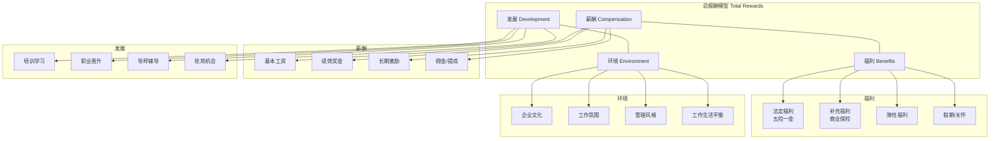
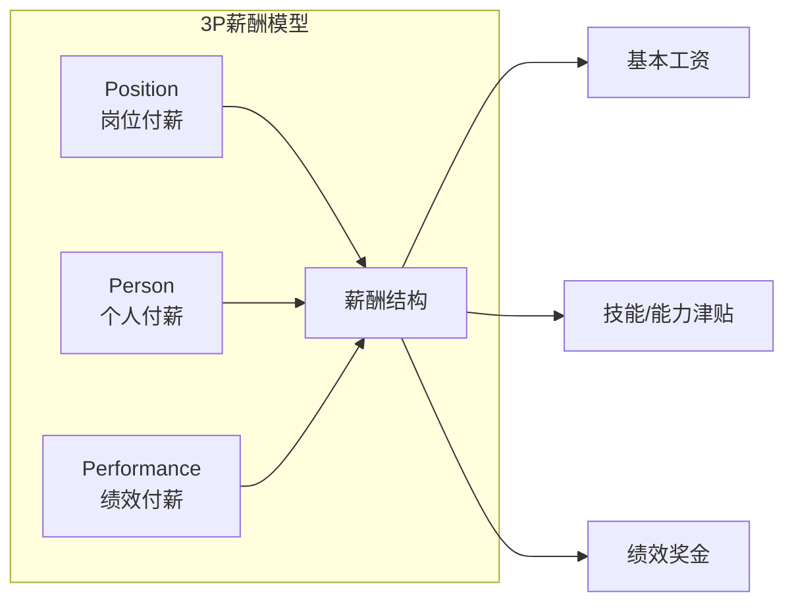
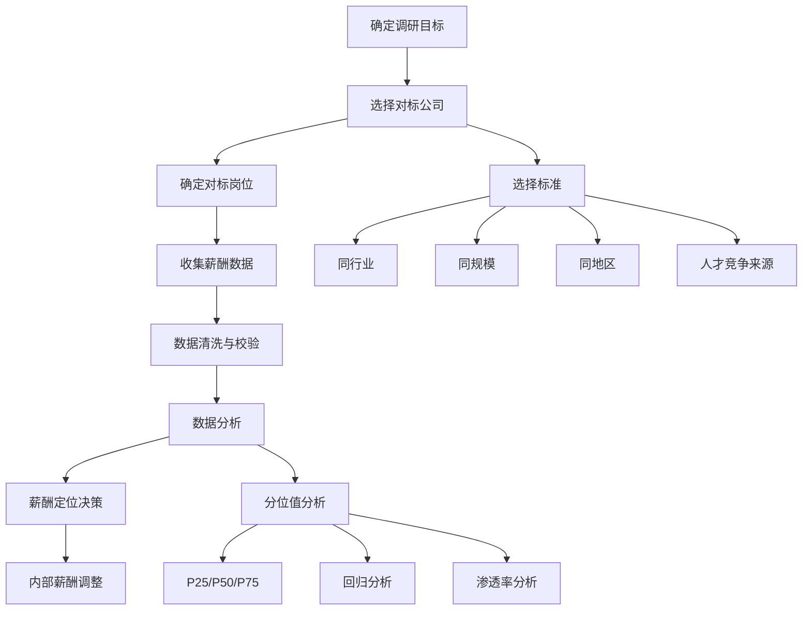

# 薪酬福利管理

> [!abstract] 核心观点
> 薪酬福利管理（C&B）的核心不是"发多少钱"，而是**"如何用有限的资源实现最大的激励效果"**。总报酬模型将激励从"现金薪酬"扩展到"薪酬+福利+发展+环境"四维体系，3P薪酬设计则提供了基于岗位、人和绩效的差异化分配逻辑。HR管培生需要建立"薪酬是战略杠杆"的思维，理解薪酬设计既要对外有竞争力（吸引人才），又要对内公平（激励员工）。

---

## 一、总报酬模型

### 1.1 总报酬模型（Total Rewards）框架

### 1.2 四维度激励效果对比

| 维度 | 激励特点 | 成本属性 | 长期效果 | 适用场景 |
|------|---------|---------|---------|---------|
| **薪酬** | 直接、短期激励强 | 高固定成本 | 边际效应递减 | 吸引、保留人才 |
| **福利** | 保障性、普惠性强 | 中高成本 | 提升满意度 | 降低离职率 |
| **发展** | 长期激励、成长感强 | 中低成本 | 提升敬业度 | 高潜人才 |
| **环境** | 软性激励、文化驱动 | 低成本 | 提升归属感 | 全员适用 |

> **面试加分点**：当被问到"现金薪酬受限时怎么办"，核心思路就是"总报酬模型"——现金不够，就用发展机会、弹性福利、工作环境来补。

---

## 二、3P薪酬设计模型

### 2.1 3P模型框架

### 2.2 3P详解

| 维度 | 含义 | 决定因素 | 薪酬体现 | 评估工具 |
|------|------|---------|---------|---------|
| **Position 岗位** | 基于岗位价值付薪 | 岗位职责、影响力、复杂度 | 基本工资区间 | 岗位评估（Hay Group、IPE） |
| **Person 个人** | 基于个人能力付薪 | 学历、经验、技能、资质 | 技能津贴、能力工资 | 能力模型、资质认证 |
| **Performance 绩效** | 基于绩效结果付薪 | 目标达成率、贡献度 | 绩效奖金、年度调薪 | KPI、OKR、360评估 |

### 2.3 岗位评估方法对比

| 方法 | 原理 | 优势 | 劣势 | 适用企业 |
|------|------|------|------|---------|
| **排序法** | 按岗位价值排序 | 简单快捷 | 主观性强 | 小型企业 |
| **分类法** | 按岗位等级归类 | 操作简便 | 精确度低 | 中型企业 |
| **因素比较法** | 按关键因素打分 | 客观准确 | 复杂度高 | 大型企业 |
| **计点法（如Hay Group）** | 多维度量化评分 | 最科学、最精确 | 实施成本高 | 头部企业 |

---

## 三、薪酬调研与对标方法

### 3.1 薪酬调研流程

### 3.2 薪酬分位值策略

| 薪酬策略 | 定位分位 | 适用场景 | 优劣势 |
|---------|---------|---------|-------|
| **领先策略** | P75以上 | 头部企业、高竞争行业 | 吸引顶尖人才，但成本高 |
| **跟随策略** | P50-P60 | 大多数企业 | 市场竞争力适中，成本可控 |
| **滞后策略** | P25-P40 | 初创期、低利润行业 | 控制成本，但招聘难度大 |
| **混合策略** | 分岗位差异化 | 关键岗位领先、通用岗位跟随 | 最灵活，资源集中在关键岗位 |

### 3.3 薪酬对标的常用数据来源

| 数据来源 | 类型 | 覆盖范围 | 成本 | 可靠性 |
|---------|------|---------|------|-------|
| **美世/翰威特薪酬调研** | 专业咨询机构 | 全行业 | 高 | 高 |
| **招聘平台数据** | BOSS直聘/猎聘/脉脉 | 互联网/科技 | 中 | 中 |
| **行业薪酬报告** | 行业协会/政府 | 按行业 | 低 | 中 |
| **上市公司年报** | 高管薪酬披露 | 上市企业 | 低 | 高 |
| **面试offer数据** | 内部积累 | 本公司 | 免费 | 中 |

---

## 四、面试高频问题精讲

### 问题1：现金薪酬受限的情况下如何激励员工？

**考察点：** 总报酬模型的理解深度、非现金激励的创造力、成本意识

**答题框架：总报酬模型（Total Rewards）**

**参考回答：**

> 现金薪酬受限是很多企业面临的现实挑战。我的核心思路是：**用总报酬模型替代单一现金思维**，从四个维度构建激励体系：
>
> **第一，放大福利的感知价值。** 现金不够，福利来凑。例如：
> - 弹性福利平台（让员工自选福利项目，如体检、健身卡、补充保险）
> - 特色假期（生日假、志愿假、考试假）
> - 但要注意：福利要"低成本高感知"，比如给员工父母寄中秋礼盒，成本不高但员工感知很强
>
> **第二，强化发展机会的激励。** 对年轻人来说，成长比现金更重要：
> - 明确职业发展路径（"你在这个岗位干得好，明年可以轮岗/晋升"）
> - 提供培训/学习资源（内部课程、外部认证、行业大会）
> - 通过导师制、高潜项目提供成长机会
>
> **第三，优化工作环境体验。** 低成本但高回报：
> - 灵活办公（远程办公、弹性工作时间）
> - 营造认可文化（即时表彰、优秀员工公示）
> - 降低无效内耗（减少不必要的会议、流程简化）
>
> **第四，设计具有象征意义的非现金激励。** 例如：
> - "CEO特别奖"——获奖者与CEO共进午餐
> - "荣誉勋章"——精神层面的认可
> - "姓名命名权"——以员工名字命名某个项目或会议室
>
> 核心原则：**把有限的现金用在刀刃上（关键岗位、高绩效者），用非现金激励覆盖全员，实现"有限资源的激励最大化"。**

**得分点：**
| 得分点 | 说明 |
|-------|------|
| 总报酬模型思维 | 从四维度展开，体系化表达 |
| 创造力 | 有具体的非现金激励案例 |
| 成本意识 | 强调"低成本高感知" |
| 资源分配智慧 | 现金聚焦关键岗位，非现金覆盖全员 |

---

### 问题2：怎么设计一个应届生的薪酬方案？

**考察点：** 薪酬设计逻辑、不同人群的差异化策略、市场对标意识

**答题框架：定策略-定水平-定结构-定机制**

**参考回答：**

> 应届生薪酬方案的设计，核心是平衡**"市场竞争力"**和**"内部公平性"**，同时考虑应届生群体的特殊性。我会分四步设计：
>
> **第一步：定薪酬策略。**
> 应届生薪酬通常采用"跟随策略"（P50-P60），因为应届生可替代性相对较高，没必要用领先策略。但如果是技术型岗位（如AI算法、芯片设计），竞争激烈，可以采用P75以上。
>
> **第二步：定薪酬水平。**
> - 参考市场数据：使用美世/行业薪酬报告，按学历层次（本科/硕士/博士）、学校层次（清北/C9/985/211）和岗位类型（技术/产品/运营/职能）分别定价
> - 考虑地域差异：一线城市 vs 新一线城市 vs 二线城市，建议差距在10%-20%
>
> **第三步：定薪酬结构。**
> 应届生薪酬结构建议：
> - **基本工资**：占比70%-80%（应届生安全感需求高）
> - **绩效奖金**：占比10%-15%（与试用期考核挂钩）
> - **签约奖金**：5%-10%（针对优秀应届生，一次性发放）
> - **福利**：租房补贴、餐补、培训基金（应届生痛点关怀）
>
> **第四步：定增长机制。**
> - 明确调薪周期（通常转正后调薪一次，入职满一年年度调薪）
> - 制定应届生专属的薪酬增长曲线（如"首年增长20%，第二年15%，第三年10%"）
> - 将薪酬增长与能力成长挂钩（通过能力认证或绩效评估）
>
> 最后，**特别强调内部公平性**——同届应届生之间薪酬差距不宜过大，否则容易引发不满。

**得分点：**
| 得分点 | 说明 |
|-------|------|
| 市场对标意识 | 参照市场数据，差异化定薪 |
| 结构设计合理 | 基本工资占比高，保障应届生安全感 |
| 针对性设计 | 租房补贴、签约奖金等应届生痛点关怀 |
| 增长机制明确 | 让应届生看到薪酬增长路径 |

---

### 问题3：薪酬调研怎么做？

**考察点：** 薪酬调研方法论、数据分析能力、实操经验

**答题框架：六步调研法（目标-对象-数据-分析-决策-调整）**

**参考回答：**

> 薪酬调研的目标是回答"我们的薪酬在市场上处于什么水平"以及"应该如何调整"。我按照以下六步推进：
>
> **第一步：明确调研目标。** 是年度调薪参考？还是新岗位定价？还是解决某个岗位招聘难问题？目标不同，对标公司和方法也不同。
>
> **第二步：选择对标公司。** 通常选择"3同"——同行业、同规模、同地区，同时考虑人才竞争来源（例如互联网公司的人才竞争不仅来自同行，还来自金融和科技行业）。
>
> **第三步：确定对标岗位。** 选择30-50个关键岗位做对标，每个岗位匹配3-5家公司的数据。岗位匹配时采用"职责匹配"而非"名称匹配"（同一Title在不同公司职责可能完全不同）。
>
> **第四步：收集数据。** 来源：专业薪酬调研报告（美世/翰威特）、招聘平台数据、行业交流、面试积累。数据要覆盖：基本工资、奖金、补贴、股票/期权等。
>
> **第五步：数据分析。** 核心分析维度：
> - **分位值分析**：计算P25/P50/P75，对比公司当前水平
> - **渗透率分析**：公司薪酬在带宽中的位置
> - **回归分析**：建立薪酬与职级的回归曲线
> - **CR比较**：Compa-Ratio = 实际薪酬/中位值
>
> **第六步：输出薪酬建议。** 基于分析结果，给出调薪建议、预算预测、分岗位的薪酬调整方案。
>
> 注意事项：**数据要清洗**——剔除异常值、修正地域差异、考虑时间滞后（市场数据通常滞后6-12个月）。

**得分点：**
| 得分点 | 说明 |
|-------|------|
| 流程完整 | 六步法逻辑清晰，步步递进 |
| 专业术语 | 分位值、渗透率、CR等专业词汇使用准确 |
| 数据意识 | 强调数据清洗、岗位匹配等实操细节 |
| 落地导向 | 最终输出调薪建议，不只看数据 |

---

### 问题4：宽带薪酬和传统薪酬有什么区别？

**考察点：** 薪酬结构设计理念的理解、宽带薪酬的适用场景判断

**答题框架：对比法（多维度对比）+ 适用场景分析**

**参考回答：**

> 宽带薪酬（Broadbanding）和传统薪酬（窄带薪酬）的核心区别在于**"等级观念"和"管理灵活性"**：
>
> **第一，等级数量不同。** 传统薪酬有10-20个等级，层级分明；宽带薪酬将等级压缩到5-7个宽幅等级，每个等级覆盖的薪酬范围更大。
>
> **第二，薪酬带宽不同。** 传统薪酬带宽通常为30%-50%（即最高/最低相差30%-50%）；宽带薪酬带宽可达100%-200%，甚至更高。
>
> **第三，调薪机制不同。** 传统薪酬主要靠"晋升"调薪（不升职不加薪）；宽带薪酬允许"在岗调薪"（同一岗位，表现好可以从等级底部到顶部）。
>
> **第四，管理灵活性不同。** 传统薪酬等级森严，跨级调动困难；宽带薪酬鼓励横向流动，更适合扁平化组织。
>
> **第五，适用场景不同：**
> - 传统薪酬适合：层级分明、晋升通道清晰的传统企业（如制造业、政府部门）
> - 宽带薪酬适合：扁平化、快速变化的组织（如互联网、科技公司、创业公司）
>
> **宽带薪酬的优势：** 鼓励员工提升专业能力（不一定要升管理岗也能加薪）、支持组织扁平化、更具灵活性。
>
> **宽带薪酬的挑战：** 对管理者的薪酬决策能力要求更高（缺乏严格的等级约束），容易导致薪酬成本失控，需要更强的薪酬治理机制。
>
> **我的观点：** 宽带薪酬和传统薪酬没有绝对的好坏，关键看企业阶段和文化。成长型、扁平化组织适合宽带薪酬；成熟型、层级化组织适合传统薪酬。也可以采用"混合模式"——高层用宽带，基层用传统。

**得分点：**
| 得分点 | 说明 |
|-------|------|
| 对比维度丰富 | 从等级/带宽/调薪/灵活性/适用场景多维度对比 |
| 辩证分析 | 指出宽带薪酬的优劣势，不盲目推崇 |
| 适用场景判断 | 结合企业阶段和文化分析，体现战略思维 |
| 混合模式建议 | 提出"混合模式"体现灵活性和深度 |

---

## 五、关联知识点

- [[03-HR人事/HR管培生备战/02-专业篇/03_人力资源规划与人才供应链]] - 薪酬竞争力与人才吸引的关系
- [[03-HR人事/HR管培生备战/02-专业篇/08_员工关系与劳动法合规]] - 薪酬合规与劳动法要求
- [[03-HR人事/HR管培生备战/00_MOC_HR管培生备战中枢]] - 返回知识库中枢

---

> **本文档属于HR管培生备战知识库 - 02-专业篇**
> 创建日期：2026-08-03 | 更新频率：建议每季度更新