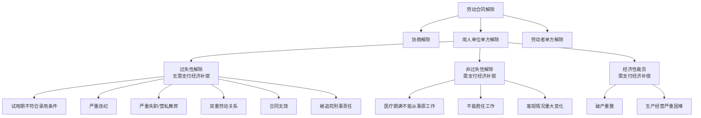
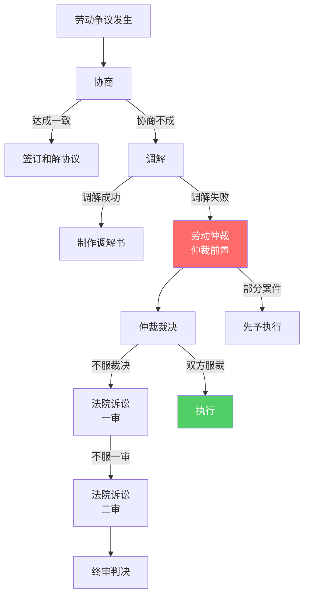
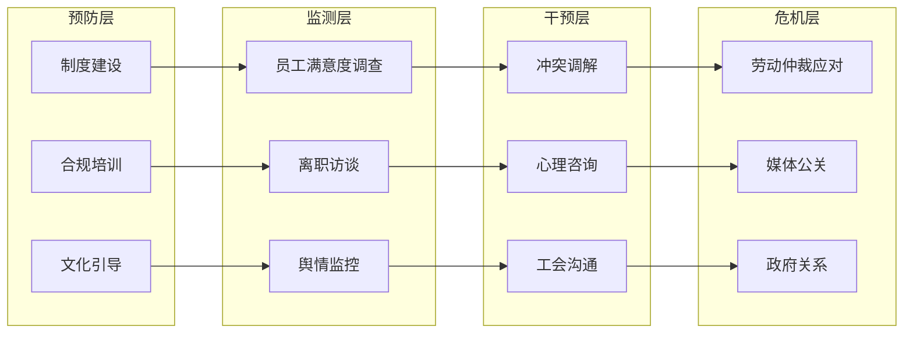

# 员工关系与劳动法合规

> [!abstract] 核心观点
> 员工关系管理是HR的"底线防线"——既要维护员工合法权益，也要保护企业利益不受损害。**学好劳动法是HR管培生的基本功**，合规不是"限制业务"，而是"在风险可控的前提下支持业务"。劳动争议处理、裁员合规、三期女职工管理、竞业限制设计，是面试中最常出现的四大实操场景。优秀的HR需要在"法理"和"人情"之间找到平衡点。

---

## 一、劳动合同法核心要点

### 1.1 劳动合同签订要点

| 事项 | 法律规定 | 注意事项 | 违规风险 |
|------|---------|---------|---------|
| **签订时限** | 用工之日起1个月内 | 超1个月未签付双倍工资 | 双倍工资赔偿 |
| **合同期限** | 固定/无固定/以完成一定任务为期限 | 连续签2次固定合同后，第三次应签无固定 | 视为无固定合同 |
| **试用期** | 合同期3个月-1年：试用≤1个月；1年-3年：≤2个月；3年以上：≤6个月 | 同一用人单位与同一劳动者只能约定一次试用期 | 违法约定试用期，按转正工资赔偿 |
| **必备条款** | 单位信息、员工信息、合同期限、工作内容、工作地点、工时、报酬、社保、劳动保护 | 缺必备条款可能被认定为合同无效 | 合同无效风险 |

### 1.2 劳动合同解除类型

### 1.3 经济补偿金计算

| 解除情形 | 经济补偿标准 | 计算基数 | 备注 |
|---------|-------------|---------|------|
| **协商解除** | N | 离职前12个月平均工资 | 企业提出解除 |
| **不能胜任工作** | N | 离职前12个月平均工资 | 需经培训或调岗后仍不胜任 |
| **医疗期满解除** | N | 离职前12个月平均工资 | 需劳动能力鉴定 |
| **经济性裁员** | N | 离职前12个月平均工资 | 需提前30天通知工会 |
| **违法解除** | 2N | 离职前12个月平均工资 | 员工可选择继续履行或赔偿 |
| **无过失性解除** | N+1 | 离职前12个月平均工资 | +1为代通知金 |

> N = 在本单位工作年限（每满1年支付1个月工资，6个月以上不满1年按1年算，不满6个月按半个月算）

### 1.4 竞业限制核心要点

| 要素 | 法律规定 | 实操建议 |
|------|---------|---------|
| **适用对象** | 高级管理人员、高级技术人员、其他负有保密义务的人员 | 不要全员签署，否则可能被认定无效 |
| **限制期限** | 最长不超过2年 | 建议根据岗位保密等级分档（1年/1.5年/2年） |
| **经济补偿** | 每月不低于劳动合同终止前12个月平均工资的30% | 建议约定明确金额和支付方式 |
| **违约责任** | 违约金由双方约定，法院可调整 | 金额不宜过高，否则可能被调减 |
| **地域范围** | 双方约定 | 建议合理限定，不宜过宽 |

---

## 二、劳动争议处理流程

### 2.1 劳动争议处理流程

### 2.2 劳动争议各阶段对比

| 阶段 | 时限 | 成本 | 特点 | 建议 |
|------|------|------|------|------|
| **协商** | 无固定时限 | 低 | 最灵活，双方自主 | 优先协商，控制事态 |
| **调解** | 15日内 | 低 | 第三方介入，无强制力 | 仲裁前必经程序 |
| **劳动仲裁** | 受理后45日内结案 | 中 | 仲裁前置，一裁终局部分案件 | HR需重点应对的阶段 |
| **法院一审** | 立案后6个月内 | 高 | 正式司法程序 | 时效长，成本高 |
| **法院二审** | 立案后3个月内 | 高 | 终审判决 | 救济途径 |

### 2.3 HR应诉准备清单

| 准备事项 | 具体内容 | 重要性 |
|---------|---------|-------|
| **证据收集** | 劳动合同、考勤记录、工资单、绩效评估、违纪记录、沟通记录 | 关键 |
| **制度审查** | 员工手册、规章制度是否经过民主程序、是否公示告知 | 关键 |
| **法律依据** | 适用的法律条款、司法解释、地方规定 | 重要 |
| **和解方案** | 公司可接受的和解范围、底线 | 重要 |
| **内部沟通** | 与法务、业务部门、管理层的沟通协调 | 中等 |

---

## 三、员工关系管理最佳实践

### 3.1 员工关系管理体系

### 3.2 员工关系管理的关键原则

| 原则 | 说明 | 实操建议 |
|------|------|---------|
| **预防为主** | 制度建设走在问题前面 | 定期更新员工手册、开展劳动法培训 |
| **程序正义** | 过程比结果更重要 | 解除流程要经工会、书面通知、送达确认 |
| **证据留存** | 没有记录等于没有发生 | 违纪行为要有书面记录和签字确认 |
| **一致性** | 同等情况同等处理 | 避免选择性执法，防止歧视指控 |
| **人文关怀** | 法理和人情的平衡 | 在法律框架内给予员工尊严和体面 |

---

## 四、面试高频问题精讲

### 问题1：公司裁员怎么设计合规方案？

**考察点：** 劳动法知识掌握程度、裁员实操经验、合规与风险的平衡能力

**答题框架：四步合规法（条件-程序-补偿-风险）**

**参考回答：**

> 裁员是HR工作中最敏感、风险最高的场景之一。我会从四个维度确保方案合规：
>
> **第一，确认裁员条件。** 根据《劳动合同法》第41条，经济性裁员需满足以下条件之一：①依照破产法重整；②生产经营发生严重困难；③转产、重大技术革新或经营方式调整，经变更合同后仍需裁减人员；④其他因客观经济情况发生重大变化导致合同无法履行。要准备相关证明材料（如审计报告、财务报表）。
>
> **第二，履行法定程序。** 这是最容易出问题的地方：
> - 提前30天向工会或全体职工说明情况
> - 听取工会或职工意见
> - 将裁员方案向劳动行政部门报告
> - 优先留用：签订较长期限合同、无固定期限合同、家庭无其他就业人员有需要扶养的老人或未成年人
> - 6个月内重新招用人员的，应通知被裁减人员，同等条件下优先录用
>
> **第三，确定补偿方案。** 法定标准为N（工作年限），但实践中很多企业会提供N+1或N+2以换取员工配合、减少争议风险。补偿方案要明确：计算基数、支付时间、社保处理方式。
>
> **第四，风险评估与预案。**
> - 识别"高危人群"（三期女职工、医疗期员工、工伤员工——这些不能裁）
> - 评估集体争议风险
> - 准备沟通话术和应对媒体的话术
> - 安排心理辅导和再就业支持（过渡期关怀）
>
> 最后，**裁员不是一刀切，要人性化操作**——尊重员工、给予体面、提供过渡帮助，这不仅能降低法律风险，也能保护雇主品牌。

**得分点：**
| 得分点 | 说明 |
|-------|------|
| 法律引用准确 | 明确引用劳动合同法第41条，显示专业度 |
| 程序意识强 | 重点强调法定程序，程序合法是核心 |
| 风险预判 | 主动识别高危人群和集体争议风险 |
| 人性化操作 | 在合规基础上强调人文关怀 |

---

### 问题2：员工试用期不合格怎么处理？

**考察点：** 试用期管理的法律要求、举证责任意识、合规操作流程

**答题框架：三阶段法（入职前→试用中→解除时）**

**参考回答：**

> 试用期解除的核心在于**"证明不符合录用条件"**，举证责任在用人单位。我将操作分为三个阶段：
>
> **第一阶段：入职前——明确录用条件。**
> 这是最关键的一步。录用条件必须具体、可衡量、可举证：
> - 不能只说"工作能力符合要求"这种空话
> - 应该写清楚：具体的KPI指标、需完成的培训考核、需获得的资质证书、关键行为规范等
> - 录用条件需在入职时书面告知员工，由员工签字确认
>
> **第二阶段：试用中——持续跟踪与记录。**
> - 设置试用期考核节点（如入职1个月、2个月分别做阶段性评估）
> - 对不符合标准的行为或结果，及时书面反馈，给员工改进机会
> - 保留所有考核记录、沟通记录、培训记录
>
> **第三阶段：解除时——规范操作。**
> - 解除前书面通知员工，说明不符合录用条件的具体事实和依据
> - 解除决定需在试用期内做出并送达（超出试用期就不能以"不符合录用条件"为由解除了）
> - 出具解除劳动合同通知书，办理离职手续
> - 不建议支付经济补偿（因为这是过失性解除），但有时为了快速解决，也可以协商给一点补偿
>
> **特别注意：** 不能以"试用期不合格"为由直接解除——必须有证据证明"不符合录用条件"。而且，**不能延长试用期**（法律不认可延长试用期的约定）。

**得分点：**
| 得分点 | 说明 |
|-------|------|
| 举证意识 | 强调举证责任在用人单位，要留存证据 |
| 前置思维 | 入职前就设置可量化的录用条件 |
| 操作规范 | 三阶段法覆盖全流程，细节到位 |
| 法律准确 | 试用期不能延长、解除需在期内等关键点准确 |

---

### 问题3：竞业限制协议怎么设计？

**考察点：** 竞业限制的法律要求、平衡员工择业权和企业利益的思路

**答题框架：要素法（对象-范围-期限-补偿-违约）**

**参考回答：**

> 竞业限制协议的设计，核心是**"合理"**——既保护企业商业秘密，又不过度限制员工的择业自由。我按照五个要素来设计：
>
> **第一，限定适用对象。** 竞业限制只适用于三类人：高管（总经理、副总经理、财务负责人等）、高级技术人员（技术总监、架构师等）、其他负有保密义务的人员。**不要全员签署**——否则协议可能被认定为无效，而且公司要支付不必要的补偿金。
>
> **第二，合理限定范围和期限。**
> - 范围：限定在"与本公司有竞争关系的企业"。范围不宜过宽，否则可能被认定无效
> - 地域：限定在"中国境内"或"某城市"，不要写"全球" 
> - 期限：最长不超过2年。建议根据岗位保密等级分档——核心岗位2年，一般岗位1年
>
> **第三，明确经济补偿标准。** 法律规定不低于离职前12个月平均工资的30%。但实践中，建议定在30%-50%之间，既符合法律规定，又有足够的约束力。补偿金支付方式：按月支付（法定），不建议一次性支付（如果员工违约，可以停止支付）。
>
> **第四，约定合理的违约责任。** 违约金金额不宜过高，一般以补偿金总额的2-3倍为参考。过高的违约金法院可能调减。
>
> **第五，设计动态调整机制。** 公司可以保留"解除竞业限制"的权利（如果员工离职后发现其不掌握核心机密，可以解除竞业限制，不再支付补偿金）。但需注意：公司单方解除竞业限制的，需额外支付3个月补偿金。

**得分点：**
| 得分点 | 说明 |
|-------|------|
| 要素完整 | 五大要素全面覆盖，逻辑清晰 |
| 合理性判断 | 强调"合理"而非"过度保护"，平衡双方利益 |
| 实操细节 | 补偿分档、按月支付、动态调整等具体策略 |
| 法律准确 | 引用30%底线、2年上限、解除需付3个月等关键条款 |

---

### 问题4：员工提出劳动仲裁，HR怎么应对？

**考察点：** 劳动仲裁应对能力、证据意识、危机处理能力

**答题框架：五步应对法（收通知→查事实→备证据→定策略→应仲裁）**

**参考回答：**

> 遇到劳动仲裁不要慌，按照五步法有序应对：
>
> **第一步：接收仲裁申请。**
> 收到仲裁委员会的通知书后，确认仲裁请求、事实理由、证据清单。注意仲裁时效——劳动仲裁时效为1年（从知道或应当知道权利被侵害之日起计算）。
>
> **第二步：内部核查事实。**
> 第一时间排查仲裁请求涉及的事实：
> - 解除是否合法？程序是否到位？
> - 加班费是否足额支付？
> - 规章制度是否经过民主程序？是否公示？
> - 社保和公积金是否合规缴纳？
> 同时**控制知情范围**，避免内部传播。
>
> **第三步：全面收集证据。** 劳动仲裁中，用人单位承担主要举证责任。需要准备的证据包括：
> - 劳动合同、规章制度、员工手册
> - 考勤记录、工资单、加班审批记录
> - 绩效评估、违纪记录、沟通记录
> - 解除通知书、送达记录
> - 工会意见（如涉及解除）
>
> **第四步：制定应对策略。**
> - 评估胜诉概率和风险
> - 判断是否和解——如果公司确实存在违法操作，建议在仲裁前和解，成本更低
> - 和解方案：计算法定赔偿金额，在这个基础上给出一个合理的和解方案
> - 如果公司操作合规，准备完整的证据链，积极应诉
>
> **第五步：参加仲裁庭审。**
> - 由法务或外部律师代理（如果公司没有法务，建议聘请律师）
> - HR需作为事实知情人协助准备材料
> - 庭审中保持专业、冷静，避免情绪化表达
>
> **事后复盘：** 无论仲裁结果如何，都要复盘——是制度问题？流程问题？还是管理问题？从中吸取教训，避免类似问题再次发生。

**得分点：**
| 得分点 | 说明 |
|-------|------|
| 流程清晰 | 五步法逻辑严密，从收到到复盘 |
| 证据意识 | 详细列出需准备的证据清单 |
| 和解策略 | 理性评估胜诉概率，不盲目硬刚 |
| 学习导向 | 无论结果如何都要复盘，体现成长思维 |

---

### 问题5：三期女职工怎么管理？

**考察点：** 特殊保护群体的法律知识、合规管理与人文关怀的平衡

**答题框架：三阶段法（孕期-产期-哺乳期）+ 两条底线（不能解雇+不能降薪）**

**参考回答：**

> 三期女职工（孕期、产期、哺乳期）是劳动法特殊保护群体，管理核心是**"两条底线+三个阶段的关怀"**。
>
> **两条底线（绝对不能做）：**
> ① 不能以"三期"为由解除劳动合同——这是违法解除，要支付2N赔偿
> ② 不能降低基本工资——产假期间工资按生育津贴或原工资标准发放
>
> **孕期管理：**
> - 减轻工作强度：根据医疗证明，调整工作内容或减少工作量
> - 保障产检时间：产检时间计入劳动时间，不能算请假
> - 禁止安排夜班和高强度工作
> - 如果员工因身体原因需要请假，按病假处理
>
> **产期管理：**
> - 产假天数：基础产假98天（国家）+ 地方奖励假（各地不同，如北京30天、上海30天、广东80天）
> - 产假工资：由生育保险基金支付生育津贴；如果生育津贴低于员工原工资，公司需补足差额
> - 难产/多胞胎：增加15天/每多一胎增加15天
>
> **哺乳期管理：**
> - 哺乳时间：每天1小时（可合并使用，如每天晚到1小时或早走1小时）
> - 禁止安排夜班和加班
> - 建议提供哺乳室或哺乳便利条件
> - 哺乳期结束后，如果员工仍无法胜任工作，需按照正常流程处理（不能以"三期"为由歧视）
>
> **特殊情况的处理：**
> - 三期员工严重违纪：可以解除（但必须有充分证据，且程序到位）
> - 三期员工主动协商解除：可以协商，但需确保员工自愿，且签署书面协议
> - 劳动合同到期：自动顺延至三期结束

**得分点：**
| 得分点 | 说明 |
|-------|------|
| 保护意识强 | 明确两条底线，显示对特殊保护群体的理解 |
| 分阶段管理 | 孕期/产期/哺乳期各有管理重点 |
| 产假天数准确 | 基础98天+地方奖励假，体现对各地政策的了解 |
| 特殊情况覆盖 | 严重违纪、协商解除、合同到期等场景全覆盖 |

---

## 五、关联知识点

- [[03-HR人事/HR管培生备战/02-专业篇/07_薪酬福利管理]] - 薪酬合规与劳动法要求
- [[03-HR人事/HR管培生备战/02-专业篇/03_人力资源规划与人才供应链]] - 裁员/优化涉及的人力规划
- [[03-HR人事/HR管培生备战/00_MOC_HR管培生备战中枢]] - 返回知识库中枢

---

> **本文档属于HR管培生备战知识库 - 02-专业篇**
> 创建日期：2026-08-03 | 更新频率：建议每季度更新（关注劳动法政策变化）