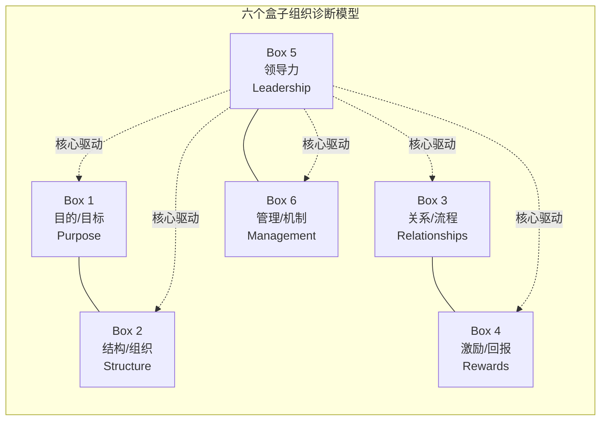
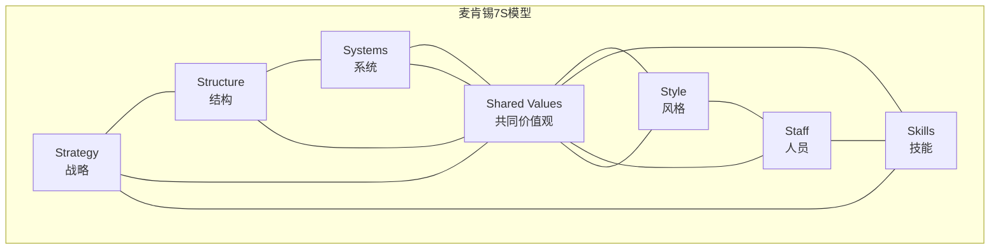
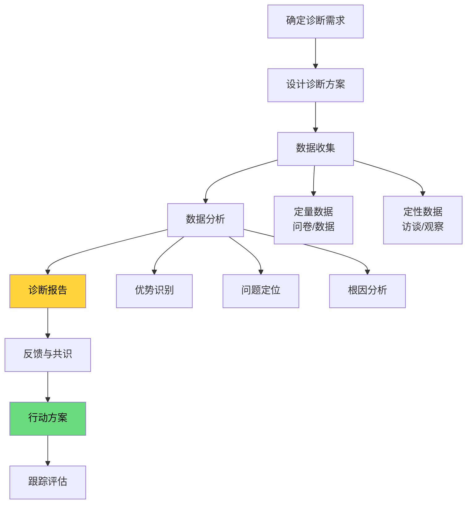
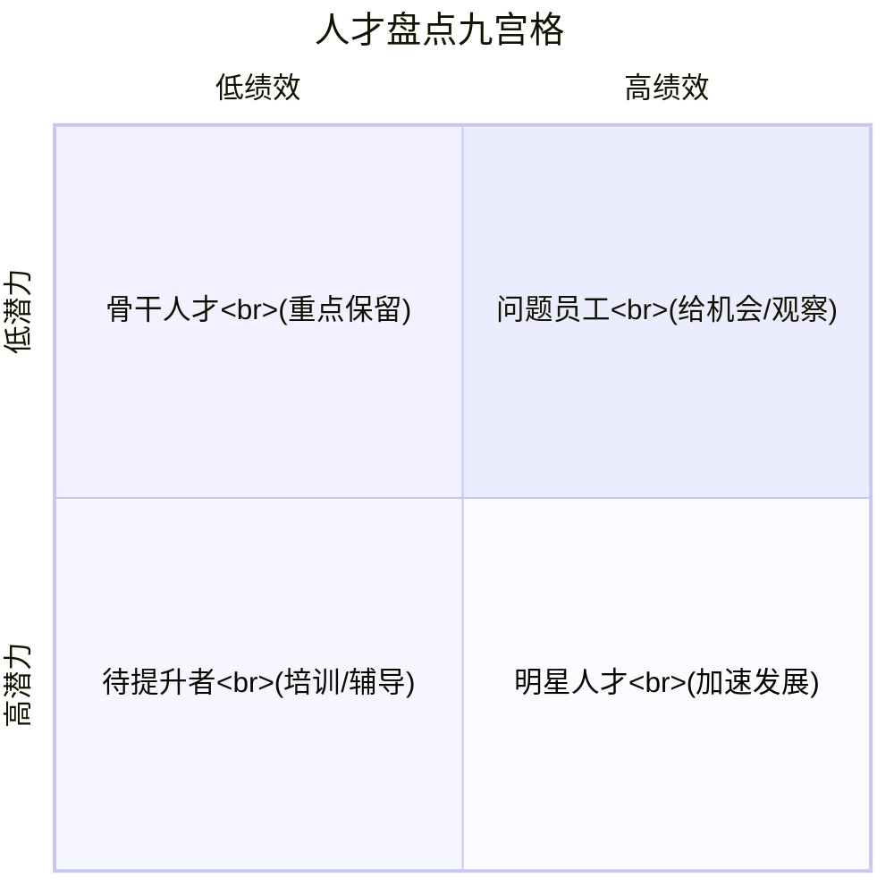
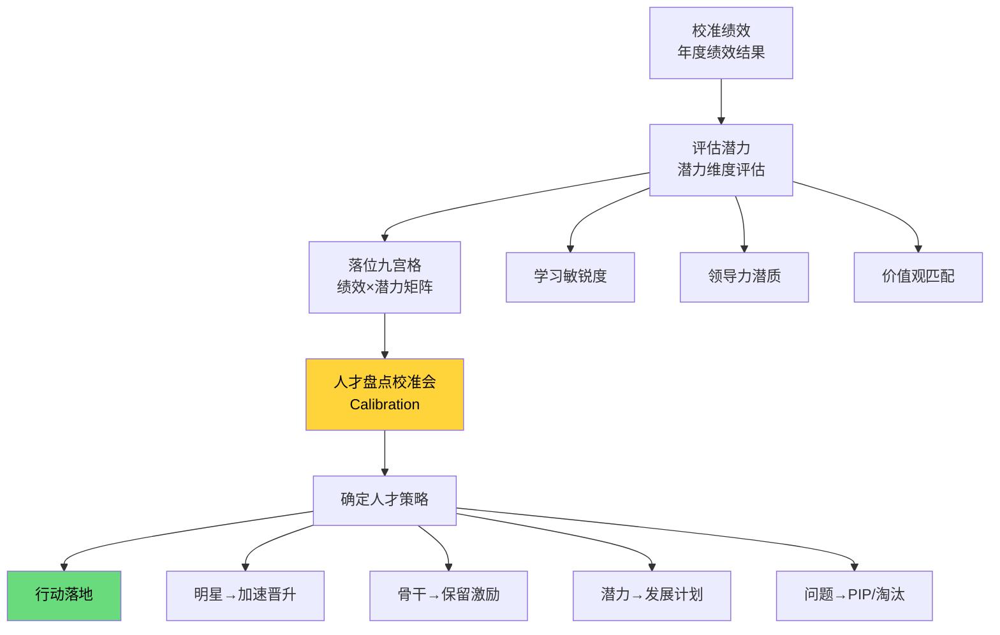
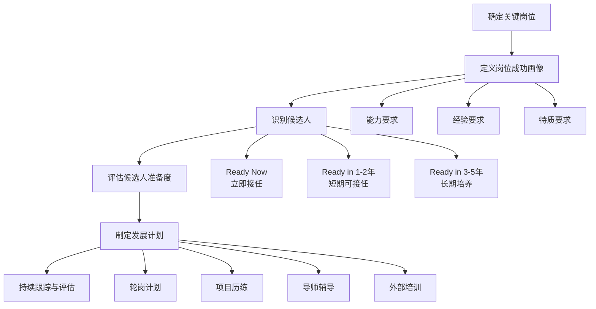

# 组织发展与人才盘点

> [!abstract] 核心观点
> 组织发展（OD）关注的是**"组织健康"**——通过诊断组织能力、优化组织结构、建设组织文化，确保组织有能力实现战略目标。人才盘点则是OD的核心工具，通过"绩效×潜力"的九宫格矩阵，摸清人才家底、识别高潜人才、规划继任梯队。HR管培生需要理解OD是"治本"（解决组织系统性问题），而HRBP是"治标"（解决日常业务中的人力问题），二者相互配合而非相互替代。

---

## 一、组织诊断工具

### 1.1 六个盒子模型（Six-Box Model）

| 盒子 | 诊断维度 | 核心问题 | 诊断方法 |
|------|---------|---------|---------|
| **Box 1 目的/目标** | 方向是否清晰 | 组织的使命和目标是什么？大家是否一致认同？ | 战略解读会、管理层访谈 |
| **Box 2 结构/组织** | 架构是否匹配 | 组织结构是否支撑战略目标？分工是否合理？ | 组织架构图分析、职责梳理 |
| **Box 3 关系/流程** | 协作是否顺畅 | 部门间协作效率如何？冲突如何处理？ | 流程分析、跨部门访谈 |
| **Box 4 激励/回报** | 激励是否有效 | 激励机制是否与目标一致？员工是否感受到公平？ | 薪酬调研、满意度调查 |
| **Box 5 领导力** | 核心驱动 | 领导团队是否形成合力？核心领导力是否到位？ | 360评估、管理层访谈 |
| **Box 6 管理/机制** | 运营是否高效 | 管理制度是否完善？执行是否到位？ | 制度审查、流程梳理 |

### 1.2 麦肯锡7S模型

| 要素 | 分类 | 说明 | 诊断关注点 |
|------|------|------|-----------|
| **Strategy 战略** | 硬要素 | 企业的竞争战略和定位 | 战略是否清晰？是否被落地执行？ |
| **Structure 结构** | 硬要素 | 组织架构、汇报关系 | 架构是否匹配战略？决策效率如何？ |
| **Systems 系统** | 硬要素 | 制度、流程、运营系统 | 系统是否支撑业务？是否过于僵化？ |
| **Shared Values 共同价值观** | 软要素 | 企业文化、核心价值观 | 价值观是否被认同？行为是否一致？ |
| **Style 风格** | 软要素 | 管理风格、领导方式 | 管理风格是否匹配组织发展阶段？ |
| **Staff 人员** | 软要素 | 人员结构、人才梯队 | 是否有合适的人才？关键岗位是否有人？ |
| **Skills 技能** | 软要素 | 核心能力、组织能力 | 组织能力是否支撑战略？有什么能力短板？ |

> **面试加分点**：六个盒子强调"诊断"（发现问题），7S强调"匹配"（各要素之间的一致性）。面试中可以说"我会先用六个盒子做全面诊断，再用7S分析各要素的匹配度"——体现方法论的组合运用能力。

### 1.3 组织诊断流程

---

## 二、人才盘点九宫格

### 2.1 九宫格模型（绩效 × 潜力）

### 2.2 九宫格格子详解

| 格子 | 位置 | 人才类型 | 典型特征 | 管理策略 | 关键动作 |
|------|------|---------|---------|---------|---------|
| **1号格** | 高绩效 × 高潜力 | **明星人才** | 业绩突出，成长快 | 加速发展，重点保留 | 晋升、轮岗、高管关注 |
| **2号格** | 高绩效 × 中潜力 | **骨干人才** | 业绩稳定，潜力有限 | 稳定保留，给予认可 | 加薪、授予、资深岗位 |
| **3号格** | 中绩效 × 高潜力 | **潜力人才** | 潜力大，但业绩未充分展现 | 给机会，加速成长 | 挑战性项目、导师辅导 |
| **4号格** | 高绩效 × 低潜力 | **专家人才** | 在现岗位表现优秀，但无成长空间 | 稳定保留，发挥价值 | 专家路径、带新人 |
| **5号格** | 中绩效 × 中潜力 | **中坚力量** | 表现中等，发展空间中等 | 持续赋能，稳步提升 | 培训、绩效辅导 |
| **6号格** | 低绩效 × 高潜力 | **待激活** | 潜力大但业绩差（可能人岗错配） | 诊断原因，调整岗位 | 岗位调整、改善计划 |
| **7号格** | 中绩效 × 低潜力 | **熟练员工** | 能完成工作，但无突破 | 稳定使用，不投入过多资源 | 维持现状，关注 |
| **8号格** | 低绩效 × 中潜力 | **待提升者** | 业绩不佳，潜力一般 | 绩效改进计划，给机会 | PIP、培训、辅导 |
| **9号格** | 低绩效 × 低潜力 | **问题员工** | 业绩差，无潜力 | 限期改进或淘汰出局 | 降级、转岗、淘汰 |

### 2.3 人才盘点九宫格应用流程

### 2.4 潜力评估维度

| 潜力维度 | 定义 | 评估方式 | 高潜表现 |
|---------|------|---------|---------|
| **学习敏锐度** | 从经验中学习并应用到新场景的能力 | 行为面试、测评 | 能快速适应新岗位，举一反三 |
| **思维复杂度** | 处理复杂问题和抽象概念的能力 | 案例分析、认知测评 | 能跳出框架思考，看到系统性问题 |
| **领导力潜质** | 影响和带领他人的潜质 | 360评估、情景模拟 | 有领导意愿，能感染和带动团队 |
| **成就动机** | 追求卓越的内在驱动力 | 行为面试、成就记录 | 主动设高目标，持续突破 |
| **价值观匹配** | 个人价值观与企业文化的契合度 | 面谈、行为观察 | 认同公司文化，行为一致 |

---

## 三、继任者计划设计

### 3.1 继任者计划框架

### 3.2 继任者计划关键指标

| 指标 | 定义 | 目标值 | 监控频率 |
|------|------|-------|---------|
| **关键岗位覆盖率** | 有继任者的关键岗位占比 | ≥80% | 年度 |
| **继任者准备度** | Ready Now的候选人占比 | ≥20% | 年度 |
| **内部晋升率** | 关键岗位内部晋升比例 | ≥60% | 半年度 |
| **继任者流失率** | 继任者主动离职率 | ≤10% | 季度 |
| **岗位空缺填补时间** | 关键岗位空缺到填补的天数 | ≤60天 | 按需 |

---

## 四、面试高频问题精讲

### 问题1：怎么做人才盘点？九宫格怎么用？

**考察点：** 人才盘点方法论的系统掌握、九宫格的实际应用能力

**答题框架：流程法（五步盘点法）**

**参考回答：**

> 人才盘点不是"填个格子就完了"，而是一个系统性的**"盘人→盘组织→促行动"**的过程。我按照五步法推进：
>
> **第一步：准备阶段。** 确定盘点范围（是全公司还是某个部门？）、盘点周期（年度/半年度）、评估维度（绩效+潜力+价值观）。
>
> **第二步：绩效评估。** 基于年度绩效结果，确认绩效等级。这里要注意：绩效数据要客观，不能靠印象打分。
>
> **第三步：潜力评估。** 从学习敏锐度、思维复杂度、领导力潜质、成就动机、价值观匹配五个维度评估潜力。潜力评估是难点，需要结合行为面试、360评估、测评工具等多源数据。
>
> **第四步：九宫格落位与校准。** 将员工按绩效（高/中/低）×潜力（高/中/低）放入九宫格。然后召开**人才盘点校准会**（Calibration Meeting），由HRBP、业务负责人、HRD共同参与，对格子位置进行讨论和校准，确保公平一致。
>
> **第五步：制定人才策略。** 不同格子不同策略：
> - **明星人才（1号格）**：加速晋升，给予挑战性机会
> - **骨干人才（2号格）**：加薪保留，给予认可
> - **潜力人才（3号格）**：制定发展计划，加速成长
> - **问题员工（9号格）**：PIP或淘汰
>
> 九宫格的价值不仅是"分类"，更是"驱动行动"——让每个格子的人都有明确的下一步。

**得分点：**
| 得分点 | 说明 |
|-------|------|
| 流程完整 | 五步法覆盖从准备到行动的全流程 |
| 校准会意识 | 提及校准会（Calibration），体现专业度 |
| 潜力评估有深度 | 多维度评估潜力，而非简单主观判断 |
| 行动导向 | 九宫格不是终点，人才策略才是价值 |

---

### 问题2：什么是OD？OD和HRBP有什么区别？

**考察点：** 对OD角色的理解、OD与HRBP的定位差异

**答题框架：定义-职责-核心区别-协同关系**

**参考回答：**

> **OD（组织发展）** 是HR体系中专注于**组织健康**的职能，关注的是组织的系统性、长期性、结构性问题。OD的核心目标是提升组织的"免疫力"和"适应力"，让组织能够持续健康地发展。
>
> **OD和HRBP的核心区别：**
>
> | 维度 | OD | HRBP |
> |------|----|------|
> | **关注对象** | 组织整体（系统/结构/文化） | 具体业务团队（人员/事务） |
> | **时间视角** | 长期（1-3年） | 短期+中期（季度-年度） |
> | **核心问题** | 组织能力是否支撑战略？ | 业务团队的人才需求是否满足？ |
> | **典型工作** | 组织诊断、文化变革、人才盘点 | 招聘、绩效、员工关系 |
> | **解决问题深度** | 治本（系统性问题） | 治标（日常事务性问题） |
> | **干预方式** | 顶层设计、系统变革 | 日常支持、个案解决 |
>
> **用一个比喻：** HRBP是"全科医生"——日常问诊、开药、处理常见病；OD是"公共卫生专家"——研究系统性的健康问题，设计预防机制，改善医疗体系。
>
> **二者的协同关系：** OD负责设计组织的"操作系统"（架构、流程、文化），HRBP负责在业务团队中"安装和运行"这套系统。OD提供方法论和工具，HRBP负责落地执行。OD和HRBP不是替代关系，而是上下游的协作关系。

**得分点：**
| 得分点 | 说明 |
|-------|------|
| 定义清晰 | 简洁准确地点出OD的核心 |
| 对比维度丰富 | 多维度对比，展示对两者差异的深刻理解 |
| 比喻生动 | "全科医生 vs 公共卫生专家"的比喻通俗易懂 |
| 协同关系 | 强调OD和HRBP是协作而非替代 |

---

### 问题3：组织诊断怎么做？

**考察点：** 组织诊断方法论掌握、工具使用能力、诊断思维

**答题框架：工具+流程（六个盒子/7S模型 + 四步诊断法）**

**参考回答：**

> 组织诊断的核心是**"用框架找问题，用数据做判断"**。我会选择**六个盒子模型**作为诊断框架，按照四步推进：
>
> **第一步：确定诊断需求。** 和业务负责人沟通，理解"为什么做诊断"——是因为业务增长乏力？组织效率下降？还是文化冲突？诊断需求决定了诊断的深度和范围。
>
> **第二步：选择诊断工具并收集数据。** 我常用六个盒子模型，从六个维度设计诊断问题，收集数据的方式包括：
> - **定量**：员工满意度问卷、敬业度调查、组织效能数据
> - **定性**：管理层访谈、员工焦点小组、流程观察
>
> **第三步：分析诊断结果。** 将数据归入六个盒子，识别"优势"和"问题"。关键是要找到**根因**——不能只看表面症状。例如，部门协作不畅可能不是"关系"问题（Box 3），而是"结构"问题（Box 2，组织架构设计不合理）。
>
> **第四步：输出诊断报告并推动行动。** 报告要包含：诊断结论、问题清单、根因分析、行动建议。诊断只是起点，关键是推动组织改善——和业务负责人达成共识，制定行动计划，设定跟踪机制。
>
> **补充：** 如果时间允许，我还会用**麦肯锡7S模型**做补充分析，重点关注"硬要素"和"软要素"之间的匹配度。

**得分点：**
| 得分点 | 说明 |
|-------|------|
| 工具选择明确 | 明确使用六个盒子，有理有据 |
| 流程完整 | 四步法从需求到行动，闭环管理 |
| 根因分析意识 | 强调找根因而非表面症状 |
| 工具组合使用 | 6个盒子+7S模型的组合使用，体现方法论深度 |

---

### 问题4：继任者计划怎么设计？

**考察点：** 继任者计划方法论、人才梯队建设能力、实操经验

**答题框架：六步法（定岗→画像→找人→评估→发展→跟踪）**

**参考回答：**

> 继任者计划的核心是确保**关键岗位"随时有人可接"**。我按照六步法设计：
>
> **第一步：确定关键岗位。** 不是所有岗位都需要继任者。关键岗位的判断标准：①对业务成功影响大；②市场上难以招聘；③培养周期长。通常一个公司5%-10%的岗位是关键岗位。
>
> **第二步：定义岗位成功画像。** 明确关键岗位的"成功标准"——需要什么样的能力、经验、特质。这个画像是后续筛选候选人的依据。
>
> **第三步：识别候选人。** 通过人才盘点九宫格，从1号格（明星）、2号格（骨干）、3号格（潜力）中筛选候选人。每个岗位至少要有1-2名候选人。
>
> **第四步：评估候选人准备度。** 将候选人分为三个梯队：
> - **Ready Now（立即接任）**：已具备所需能力，可直接晋升
> - **Ready in 1-2年**：有潜力，但需要1-2年的发展
> - **Ready in 3-5年**：高潜人才，需要长期培养
>
> **第五步：制定个人发展计划（IDP）。** 针对每位候选人的差距，设计个性化的发展计划，包括：
> - 轮岗计划（到关键岗位轮岗学习）
> - 项目历练（参与战略性项目）
> - 导师辅导（由现任者或高管担任导师）
> - 外部培训（领导力项目、MBA等）
>
> **第六步：持续跟踪与评估。** 每季度复盘候选人进展，年度更新继任者名单。关键岗位的继任者名单不是一成不变的——人在成长，市场在变化，要动态调整。
>
> **关键成功因素：** 继任者计划需要CEO和业务负责人的深度参与，HR不能"自嗨"——没有业务领导的支持，继任者计划就是一张废纸。

**得分点：**
| 得分点 | 说明 |
|-------|------|
| 六步法逻辑清晰 | 从定岗到跟踪，每一步都有明确产出 |
| 候选人梯队 | "Ready Now/1-2年/3-5年"三层梯队，体现专业度 |
| 发展计划个性化 | IDP设计有具体内容，不空泛 |
| 业务领导参与 | 强调CEO和业务负责人的支持是关键 |

---

### 问题5：怎么识别高潜人才？

**考察点：** 高潜人才识别方法、潜力评估维度的理解、工具使用

**答题框架：三维度法（绩效-潜力-价值观）+ 评估工具组合**

**参考回答：**

> 识别高潜人才，我的核心思路是**"绩优≠高潜"**——高绩效看的是过去，高潜力看的是未来。我通过三个维度来识别：
>
> **维度一：绩效。** 持续的高绩效是基础。至少连续2-3年绩效排名前20%，说明有稳定的优秀表现。
>
> **维度二：潜力。** 这是识别的关键。我主要从四个维度评估潜力：
> 1. **学习敏锐度**：能否快速学习新领域，从经验中提炼可迁移的规律
> 2. **思维复杂度**：能否处理模糊、复杂的问题，看到系统性和长期性
> 3. **领导力潜质**：是否有影响和带领他人的意愿和能力
> 4. **成就动机**：是否主动设高目标，持续突破自我
>
> **维度三：价值观匹配。** 高潜人才的能力再强，如果价值观不匹配，也很难在公司长期发展。评估方式：行为观察、价值观测评、360反馈。
>
> **评估工具组合：**
> - **人才盘点九宫格**：绩效×潜力矩阵，快速定位
> - **行为面试（BEI）**：挖掘过去行为，预测未来表现
> - **测评工具**：Hogan、OPQ、MBTI等（作为参考，非决定性）
> - **360评估**：收集多方视角，避免单点偏见
> - **校准会**：通过集体讨论，多维交叉验证
>
> **一句话总结：** 高潜人才 = 持续高绩效 + 强学习敏锐度 + 高成就动机 + 价值观匹配。

**得分点：**
| 得分点 | 说明 |
|-------|------|
| 绩优≠高潜 | 区分绩效和潜力的概念，体现专业深度 |
| 潜力维度具体 | 四个潜力维度清晰可操作 |
| 工具组合使用 | 多源数据交叉验证，避免单一偏见 |
| 价值观匹配 | 纳入价值观维度，体现全面性 |

---

## 五、关联知识点

- [[03-HR人事/HR管培生备战/02-专业篇/03_人力资源规划与人才供应链]] - 人才盘点是人才供应链的基础
- [[03-HR人事/HR管培生备战/02-专业篇/05_培训与开发]] - 盘点后的发展计划需要培训体系支撑
- [[03-HR人事/HR管培生备战/02-专业篇/02_HR三支柱模型]] - OD与HRBP的协同关系
- [[03-HR人事/HR管培生备战/00_MOC_HR管培生备战中枢]] - 返回知识库中枢

---

> **本文档属于HR管培生备战知识库 - 02-专业篇**
> 创建日期：2026-08-03 | 更新频率：建议每季度更新