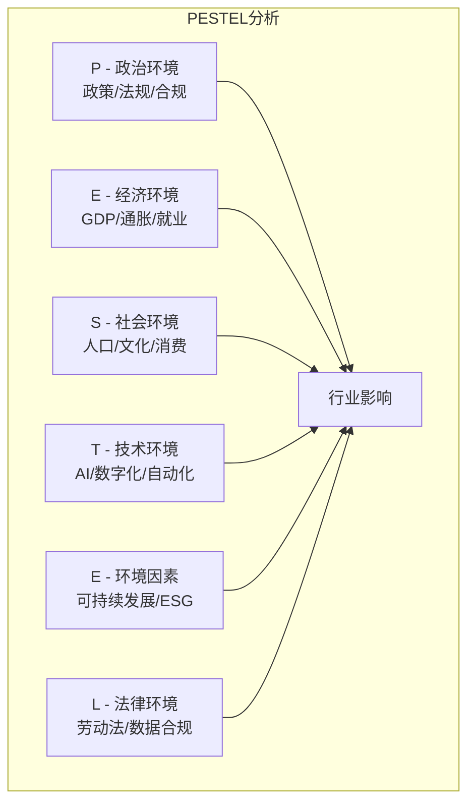
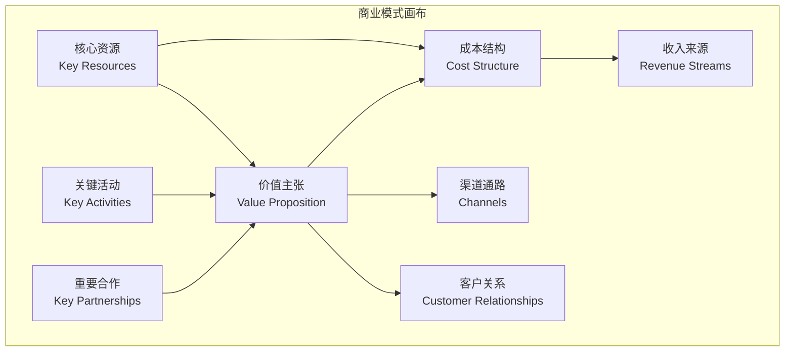
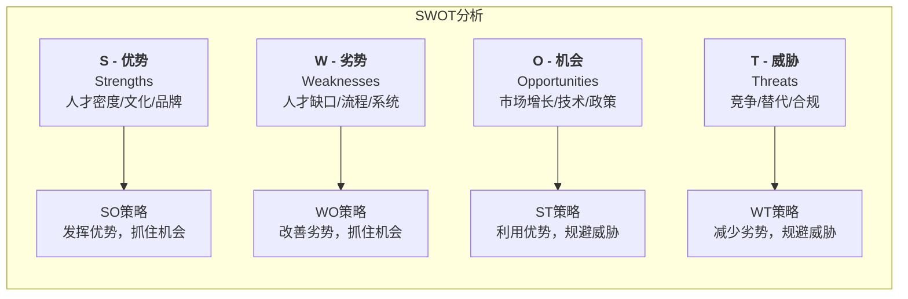
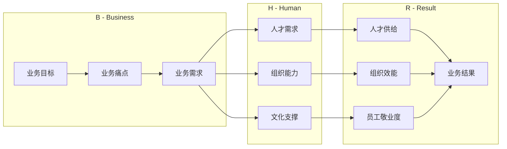

> [!abstract] 核心观点
> HRBP（人力资源业务伙伴）的核心竞争力在于**将业务语言翻译为HR语言，再将HR行动转化为业务结果**。理解业务不是"懂业务怎么做"，而是"懂业务需要HR做什么"。管培生需要掌握行业分析、商业模式画布、SWOT等分析工具，并具备从业务目标反向推导HR策略的能力。

---

## 一、业务理解方法论

### 1.1 行业分析框架（PESTEL）



**HR视角的PESTEL应用：**

| 维度 | 分析要点 | 对HR的影响 |
|------|----------|------------|
| **政治（Political）** | 行业政策变化、监管要求 | 影响人才需求结构、合规要求 |
| **经济（Economic）** | 市场增速、融资环境、竞争格局 | 影响招聘预算、薪酬策略、HC规划 |
| **社会（Social）** | 人口结构变化、人才流动趋势 | 影响雇主品牌策略、人才吸引方式 |
| **技术（Technological）** | 数字化转型、AI替代 | 影响人才技能要求、培训体系 |
| **环境（Environmental）** | ESG要求、碳中和 | 影响雇主品牌、人才价值观匹配 |
| **法律（Legal）** | 劳动法修订、数据隐私 | 影响用工模式、合规风险 |

### 1.2 商业模式画布（Business Model Canvas）



**HR视角的商业模式画布分析：**

| 画布模块 | 业务问题 | HR相关问题 |
|----------|----------|------------|
| **价值主张** | 客户为什么买我们的产品/服务？ | 我们需要什么样的核心能力来支撑价值主张？ |
| **客户细分** | 我们的核心客户是谁？ | 不同客户群需要什么样的服务人才？ |
| **关键活动** | 哪些活动决定了我们的成功？ | 关键岗位是什么？哪些人才不可替代？ |
| **核心资源** | 我们最依赖什么资源？ | 人才是核心资源吗？如何获取和保留？ |
| **收入来源** | 钱从哪里来？ | 人才投入如何影响收入？ |
| **成本结构** | 最大的成本项是什么？ | 人力成本占比多少？人效如何？ |

### 1.3 SWOT分析（HR视角）



**HR应用SWOT的示例：**

| 内部 | 优势（S） | 劣势（W） |
|------|-----------|-----------|
| | 高人才密度、强雇主品牌、完善培训体系 | 关键岗位储备不足、薪酬缺乏竞争力、HR数字化程度低 |
| **机会（O）** | **SO策略** | **WO策略** |
| 新兴市场扩张、技术升级 | 利用品牌优势吸引顶尖人才 | 建立关键岗位人才梯队 |
| | 快速培养内部人才支持扩张 | 优化薪酬结构，提升竞争力 |
| **威胁（T）** | **ST策略** | **WT策略** |
| 竞品高薪挖角、人才短缺 | 强化雇主品牌，提升留存 | 实施保密薪酬制度 |
| | 建立人才池，减少外部依赖 | 加速HR数字化转型 |

---

## 二、BHR框架：业务目标→HR策略→业务结果

### 2.1 BHR框架模型



### 2.2 BHR框架应用示例

| 业务目标 | 业务痛点 | HR策略 | 预期结果 |
|----------|----------|--------|----------|
| 年度营收增长30% | 销售团队能力不足，新人上手慢 | 销售人才画像+加速培养计划+激励机制优化 | 销售人效提升20%，新人成单周期缩短30% |
| 开辟新业务线 | 无相关业务人才储备 | 外部关键人才引进+内部转岗+文化融合方案 | 新业务团队3个月搭建完成，6个月产出 |
| 提升产品质量 | 技术人员流失率高，质量不稳定 | 技术人才保留计划+质量文化建设+技能培训 | 核心技术人员流失率<10%，产品缺陷率降50% |
| 降低成本 | 组织冗余，人效偏低 | 组织架构优化+人效盘点+人员优化方案 | 人力成本降低15%，人均产出提升20% |

### 2.3 业务翻译能力训练

```markdown
**业务语言 → HR语言 翻译示例：**

业务方说："我们要抢占市场份额，速度是关键。"
→ HR翻译：需要快速搭建销售团队，缩短招聘周期，建立快速融入机制

业务方说："最近产品质量问题频发，客户投诉很多。"
→ HR翻译：技术团队可能需要能力提升，质量保证岗位需要加强，或者团队压力过大

业务方说："竞争对手在挖我们的人。"
→ HR翻译：需要做离职风险排查，评估薪酬竞争力，加强核心人才保留

业务方说："今年预算要砍。"
→ HR翻译：需要做人力成本分析，评估哪些投入ROI最高，优化而非简单削减
```

---

## 三、面试高频问题

### 问题1：HRBP如何理解业务？

> **考察点**：业务理解的方法论、主动学习意识、HRBP角色认知

**答题框架**：方法+路径+产出

**参考回答**：
```
HRBP理解业务可以从"三个层面、五个方法"入手：

**三个层面：**
1. 行业层面：了解行业趋势、竞争格局、政策环境（PESTEL）
2. 公司层面：理解商业模式、战略目标、核心价值主张（商业模式画布）
3. 部门层面：理解业务痛点、关键流程、考核指标（SWOT+业务流程分析）

**五个方法：**
1. 参加业务会议：周会、月会、复盘会，听业务在"说什么"
2. 跟岗实践：每月花1-2天跟一线团队工作，亲身体验业务场景
3. 读业务数据：看业务报表、客户反馈、市场分析，用数据理解业务
4. 访谈关键岗位：与业务负责人、核心骨干、一线员工定期交流
5. 学习业务知识：阅读行业报告、竞品分析、产品文档

**我的理解**：HRBP理解业务不是为了"做业务"，而是为了把HR工作与业务目标对齐，让HR成为业务增长的驱动力，而非支持部门。
```

**得分点**：
- 有结构化的方法论（三个层面+五个方法）
- 具体可操作（如"跟岗实践"、"参加业务会议"）
- 最后一句点明HRBP理解业务的目的，升华到"业务驱动力"

---

### 问题2：业务部门说"帮我招人"，背后真正的需求是什么？

> **考察点**：需求挖掘能力、透过现象看本质、系统思维

**答题框架**：剥洋葱法 → 层层深入 → 三层次需求模型

**参考回答**：
```
"帮我招人"是一个典型的"表面需求"，背后可能有三个层次的需求：

**第一层：显性需求（What）**
- 缺人干活，人手不够
- 有人离职了，需要补位
- 新项目启动，需要新人

**第二层：隐性需求（Why）**
- 可能是工作量太大，需要重新评估工作分配
- 可能是现有团队能力不足，需要"换血"
- 可能是有员工表现不佳，但管理者不想做绩效管理
- 可能是业务流程本身有问题，需要优化而非加人

**第三层：根本需求（Root Cause）**
- 业务方真正需要的是"解决问题"，而非"招到人"
- 招人只是解决问题的一种手段

**我的做法：**
当业务方说"帮我招人"时，我会先问三个问题：
1. "这个岗位为什么现在需要人？是新增还是补缺？"
2. "目前团队的工作量分配是怎样的？是否有优化空间？"
3. "除了招人，还有什么方式可以解决你遇到的问题？"

通过这三个问题，我往往能发现：有些需求可以通过内部调配解决，有些需要流程优化，真正需要招人的可能只有60%。
```

**得分点**：
- 用"剥洋葱法"层层深入，展现分析能力
- 提出三个追问问题，展示实操技巧
- 给出"只有60%需要招人"的数据，增加可信度
- 体现HR的"业务伙伴"角色，而非"订单执行者"

---

### 问题3：公司要开辟新业务线，HR需要做什么？

> **考察点**：战略思维、全盘规划能力、变革管理意识

**答题框架**：时间轴（前中后）+ 模块（人才/组织/文化）

**参考回答**：
```
新业务线开辟是一个系统工程，HR需要从"人才-组织-文化"三个维度，按"前-中-后"三个阶段推进：

**前期（0-1个月）：战略对齐与规划**
- 理解新业务战略：目标市场、商业模式、核心能力要求
- 组织设计：确定架构（独立团队/矩阵式/项目制）、汇报关系
- 关键人才盘点：识别内部可调动的高潜人才
- 人才获取策略：哪些岗位内部培养，哪些外部招聘
- 制定激励方案：新业务通常有风险，需要配套激励政策

**中期（1-3个月）：团队搭建与机制建立**
- 核心团队组建：优先到位关键岗位（负责人+核心骨干）
- 招聘推进：按优先级分批招聘
- 制度建立：新业务的管理制度、绩效考核、薪酬体系
- 文化融合：新团队与原有团队的文化衔接

**后期（3-6个月）：稳定运营与迭代优化**
- 团队融入：新人融入计划、导师机制
- 绩效评估：首期绩效评估，检验团队匹配度
- 人才盘点：识别高潜人才，建立梯队
- 持续优化：根据业务反馈调整组织架构和人员配置

**关键原则**：新业务要"快"，HR要"准"——快速响应但精准匹配，避免"先招进来再说"。
```

**得分点**：
- 按时间轴分阶段，体现项目管理能力
- 人才/组织/文化三维度全覆盖，展现系统性
- 最后一句"快vs准"的对比，体现战略思维
- 具体到"前期1个月"等时间节点，展示落地能力

---

### 问题4：如果你是一个电商公司的HRBP，618大促前你需要做什么准备？

> **考察点**：场景化应变能力、业务节奏感、HR方案落地能力

**答题框架**：业务理解 → 痛点识别 → HR方案 → 执行落地

**参考回答**：
```
作为电商HRBP，618大促前的准备可以从"人-心-能"三个维度推进：

**维度一：人——确保兵力充足**
- 盘点核心岗位的在岗情况：运营、客服、仓储、技术各岗位是否满编
- 临时用工储备：预计大促期间客服和仓储会有峰值需求，提前储备兼职/外包人员
- 离职风险排查：识别关键岗位的离职风险，提前沟通留人
- 值班排班：与业务部门共同制定大促期间值班计划

**维度二：心——保持士气高涨**
- 大促动员会：配合业务部门做战前动员，明确目标
- 激励方案：制定大促专项激励（奖金、调休、荣誉激励）
- 后勤保障：大促期间的餐饮、夜宵、交通、休息安排
- 压力管理：关注员工身心健康，防止过度疲劳

**维度三：能——确保能力到位**
- 专项培训：大促前做系统操作、应急预案、客服话术培训
- 流程演练：大促压力测试，确保各环节配合顺畅
- 新员工强化：大促前入职的新人做快速上岗培训
- 经验复盘：参考历年大促的问题，做针对性改进

**我的HR方案核心逻辑**：大促期间HR不是"做行政"，而是"做保障"。我们的目标是让业务团队"只管打仗，别的事交给我们"。
```

**得分点**：
- 用"人-心-能"三个维度组织答案，结构清晰
- 体现对电商业务节奏的理解（618大促）
- 具体到"夜宵、交通、值班"等细节，展现落地能力
- 最后一句"只管打仗"体现HRBP的服务意识

---

## 四、业务理解工具箱

### 4.1 业务理解自检清单

```markdown
**HRBP业务理解自检清单：**

☐ 我能用一句话说清楚公司的商业模式吗？
☐ 我知道公司过去一年的营收、利润和增长趋势吗？
☐ 我了解公司的主要竞争对手和差异化优势吗？
☐ 我参加过至少一个业务部门的周会/月会吗？
☐ 我读过最新的行业研究报告吗？
☐ 我能说出业务部门负责人的核心KPI是什么吗？
☐ 我了解公司产品/服务的核心价值主张吗？
☐ 我做过客户访谈或听过客户反馈吗？
☐ 我知道公司未来6-12个月的战略重点是什么吗？
☐ 我能把业务目标翻译成HR的工作计划吗？

**解读**：如果以上问题有超过3个"否"，说明业务理解需要加强。
```

### 4.2 业务访谈指南

```markdown
**与业务负责人访谈的5个关键问题：**

1. **目标问题**："今年你最想实现的3个目标是什么？"
   → 了解业务优先级

2. **痛点问题**："目前最让你头疼的团队问题是什么？"
   → 发现HR介入点

3. **人才问题**："你团队里最好的人是谁？为什么TA做得好？"
   → 建立人才画像

4. **差距问题**："如果团队可以升级，你最想提升什么能力？"
   → 了解能力缺口

5. **期望问题**："你希望HR在哪些方面给你更多支持？"
   → 明确HRBP价值定位
```

---

> [!tip] 管培生备考提示
> - "业务理解"是面试中的高频核心考点，几乎必问
> - 回答时要避免"HR语言"，多使用"业务语言"（如营收、增长、效率、客户）
> - 准备一个具体的"业务理解"案例，展示你如何从业务角度思考HR问题
> - 关注热点：新零售、出海业务、AI应用对HR的挑战

---

## 相关链接
- [[03-HR人事/HR管培生备战/00_MOC_HR管培生备战中枢]]
- [[03-HR人事/HR管培生备战/03-战略篇/02_HR数据分析与人效管理]]
- [[03-HR人事/HR管培生备战/03-战略篇/06_跨部门沟通与影响力构建]]
- [[03-HR人事/HR管培生备战/02-专业篇/04_招聘与配置]]
- [[03-HR人事/HR管培生备战/02-专业篇/06_绩效管理]]