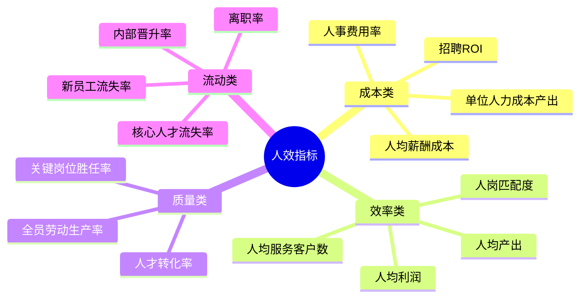
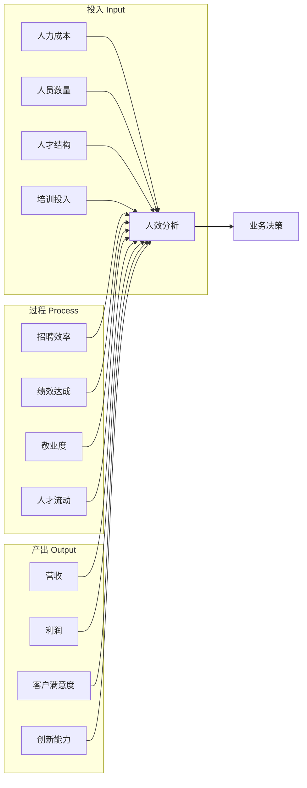
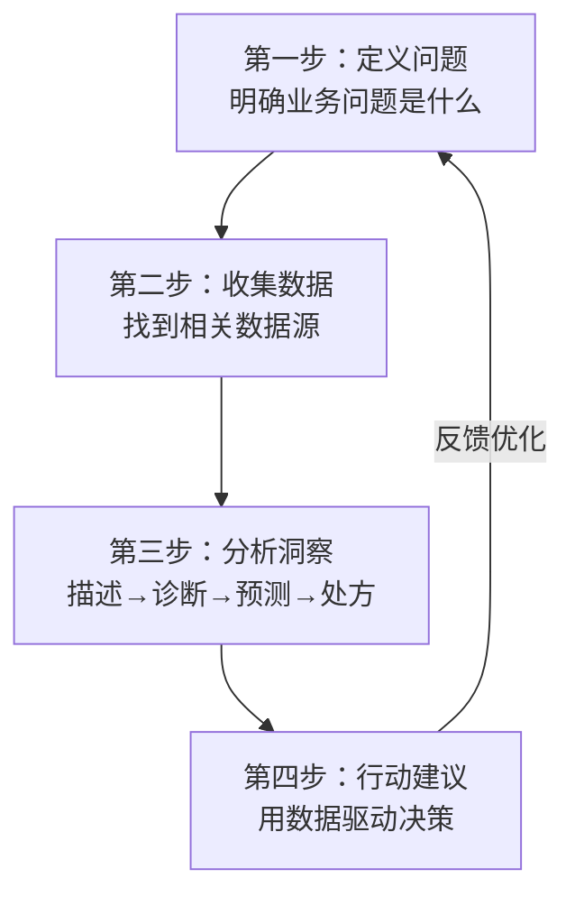

> [!abstract] 核心观点
> HR数据分析是HR从"职能支撑"走向"战略驱动"的关键能力。**人效管理不是算人头，而是通过数据洞察发现组织问题，驱动业务决策**。管培生需要掌握核心人效指标的定义与计算、数据分析的框架思维，以及如何用数据讲故事（Data Storytelling）来影响决策者。

---

## 一、人效指标全景

### 1.1 核心人效指标总览



### 1.2 关键指标定义与计算公式

| 指标 | 计算公式 | 含义 | 行业参考 |
|------|----------|------|----------|
| **人事费用率** | 人力成本总额 / 营业收入 | 每挣1元钱需要花多少人力成本 | 服务业30-50%<br/>制造业15-25%<br/>互联网25-40% |
| **人均产出** | 营业收入 / 员工总数 | 每个员工创造的收入 | 视行业差异大 |
| **人均利润** | 净利润 / 员工总数 | 每个员工创造的利润 | 高利润行业更高 |
| **全员劳动生产率** | 增加值 / 员工总数 | 衡量生产效率的核心指标 | 与行业平均对标 |
| **招聘ROI** | 新员工绩效产出 / 招聘总投入 | 招聘投入的回报率 | >3为优秀 |
| **离职率** | 离职人数 / 期初+期末平均人数 | 人员流动情况 | 主动离职率<15%为健康 |
| **人才转化率** | 晋升人数 / 总人数 | 内部人才成长速度 | 视组织发展阶段 |
| **关键岗位充实率** | 在岗人数 / 编制人数 | 关键岗位的到位情况 | >90%为健康 |

### 1.3 人效分析的"投入-过程-产出"三维框架



**投入维度**：我们投入了多少资源（成本、人数、培训）
**过程维度**：这些资源是如何转化为产出的（效率、质量）
**产出维度**：最终结果是什么（营收、利润、客户价值）

---

## 二、数据驱动决策思维

### 2.1 数据分析四步法



### 2.2 分析层级：从描述到处方

| 分析层级 | 回答的问题 | 示例 | 复杂度 |
|----------|------------|------|--------|
| **描述性分析** | 发生了什么？ | 上月离职率是12%，高于去年同期的8% | 低 |
| **诊断性分析** | 为什么会发生？ | 离职率上升主要是因为入职3-6个月的新员工离职，根因是入职培训不足 | 中 |
| **预测性分析** | 未来会发生什么？ | 如果维持当前趋势，下季度离职率将达到15%，核心岗位将出现缺口 | 高 |
| **处方性分析** | 我们应该怎么做？ | 建议加强入职引导和导师制，预计可降低离职率3-5个百分点 | 高 |

### 2.3 数据可视化与仪表盘设计

```markdown
**HR数据仪表盘核心指标（建议）：**

┌────────────────────────────────────────────┐
│  📊 HR Dashboard - 2026 Q2                 │
├────────────────┬───────────────────────────┤
│  人员规模       │  人事费用率               │
│  当前: 1,250人  │  当前: 28.5%              │
│  环比: +3.2%    │  目标: ≤30%              │
│                │  状态: ✅ 达标             │
├────────────────┼───────────────────────────┤
│  离职率         │  人均产出                 │
│  当前: 11.2%    │  当前: ￥85.6万            │
│  目标: <15%    │  环比: +5.3%              │
│  状态: ✅ 健康  │  状态: ↑ 持续提升         │
├────────────────┴───────────────────────────┤
│  ⚠️ 预警：技术团队离职率18.3%，需关注       │
└────────────────────────────────────────────┘
```

**仪表盘设计原则：**
- **信息层次**：概览→钻取→详情，让用户逐步深入
- **红黄绿灯**：设置阈值，关键指标一目了然
- **趋势展示**：不仅看当前值，更看变化趋势
- **可行动**：每个指标都应能触发一个行动

---

## 三、面试高频问题

### 问题1：公司人效低于行业水平怎么分析？

> **考察点**：系统性分析能力、对标思维、问题诊断能力

**答题框架**：明确定义 → 对标分析 → 归因分析 → 改进建议

**参考回答**：
```
人效低于行业水平是一个综合性问题，我会按照以下步骤分析：

**第一步：澄清"人效"的定义**
先确认我们说的"人效"是哪个指标——是人均产出、人均利润、还是人事费用率？不同指标反映的问题不同。

**第二步：做对标分析**
- 和谁比：行业平均、行业75分位、直接竞品
- 用什么数据：上市公司年报、行业白皮书、薪酬报告
- 分维度对比：按部门/岗位/层级做分解，找到"拖后腿"的单元

**第三步：归因分析（从三个维度）**
- 投入端：人力成本是否偏高？薪酬结构是否合理？人员是否冗余？
- 过程端：组织效率是否低下？流程是否冗余？员工敬业度如何？
- 产出端：营收/利润是否偏低？产品定价是否有问题？市场竞争格局是否变化？

**第四步：提出改进建议**
- 如果是"投入高"：优化人员结构，减少低效岗位，提升招聘质量
- 如果是"过程低"：简化流程，提升自动化，加强培训
- 如果是"产出低"：可能需要配合业务部门调整产品策略或市场策略

**关键原则**：人效低不一定是HR的问题，但HR一定要有数据和分析来佐证，然后推动业务和管理层一起改进。
```

**得分点**：
- 先"澄清定义"再"分析"，体现严谨性
- 投入-过程-产出三维度归因，展示系统性
- 不同原因对应不同解决方案，体现针对性
- 最后一句展示HR的定位——"推动者"而非"背锅者"

---

### 问题2：招聘数据怎么分析？

> **考察点**：招聘数据意识、漏斗分析能力、数据驱动优化思维

**答题框架**：建立漏斗 → 分析转化率 → 根因分析 → 优化建议

**参考回答**：
```
招聘数据分析可以从"效率-质量-成本-渠道"四个维度展开：

**维度一：效率分析**
- 招聘周期（Time-to-Fill）：各岗位的平均招聘天数
- 岗位完成率：HC完成进度
- 各环节耗时：简历筛选→初面→终面→Offer的时间分布

**维度二：质量分析**
- 招聘漏斗转化率：投递→筛选→面试→Offer→入职每一步的转化率
- 试用期通过率：入职后3-6个月的留存和绩效表现
- 招聘来源质量：不同渠道入职员工的绩效差异

**维度三：成本分析**
- 单次招聘成本（Cost-per-Hire）
- 渠道ROI：各渠道的成本/入职人数/绩效表现
- 猎头使用效率

**维度四：渠道分析**
- 各渠道的简历量、质量、转化率
- 关键岗位的最佳渠道组合

**举个例子**：
如果发现"面试通过率很高（80%），但Offer接受率很低（50%）"，说明问题可能在薪资竞争力或候选人体验上。如果"面试通过率很低（20%），但Offer接受率很高（90%）"，说明筛选标准可能有问题。
```

**得分点**：
- 效率/质量/成本/渠道四个维度，体系完整
- 有具体的指标，展示专业度
- 用"转化率异常"的例子说明如何通过数据发现问题
- 体现"数据驱动决策"的思维

---

### 问题3：你怎么用数据向CEO证明培训的价值？

> **考察点**：培训评估能力、ROI思维、高层沟通能力

**答题框架**：柯氏四级评估模型 + 业务关联 + 财务语言

**参考回答**：
```
向CEO证明培训的价值，关键在于用CEO听得懂的"财务语言"说话。我会采用柯氏四级评估模型（Kirkpatrick Model）：

**Level 1：反应层（Reaction）**
- 培训满意度评分（通常>4.0/5.0是及格线）
- 这个数据对CEO意义不大，但可以做初步佐证

**Level 2：学习层（Learning）**
- 培训前后测试成绩对比
- 技能掌握率

**Level 3：行为层（Behavior）——关键**
- 培训后员工在工作中的行为改变
- 具体指标：销售话术使用率、系统操作规范度、管理行为评分
- 可通过360评估或管理者观察来量化

**Level 4：结果层（Results）——最重要**
- 培训对业务指标的影响：
  - 销售培训 → 销售额/客单价提升多少
  - 管理培训 → 团队离职率/敬业度变化
  - 技术培训 → 开发效率/Bug率变化

**向CEO汇报的核心逻辑：**
"我们投入了XX万的培训预算，这些培训带来了XX万的业务收益（或节约了XX万的成本），ROI是XX倍。"

**举例**：我们做了一个销售培训项目，投入20万，培训后销售团队签单额提升了15%，对应增加的毛利是100万，培训ROI = 5倍。这个数据CEO一听就懂。
```

**得分点**：
- 使用经典的柯氏四级评估模型，体现专业功底
- 强调"Level 4 - 结果层"最重要，展现业务导向
- 用"ROI"和"财务语言"说话，体现CEO思维
- 有具体例子，增强说服力

---

### 问题4：如果你发现某个部门的离职率突然升高，你会怎么分析？

> **考察点**：问题诊断能力、数据分析方法、根因分析思维

**答题框架**：确认数据 → 分层分析 → 根因排查 → 行动建议

**参考回答**：
```
离职率突然升高是一个预警信号，我会按以下步骤系统分析：

**第一步：确认数据**
- 数据是否准确？统计口径是否变化？
- 离职率升高是"突然"还是"趋势性"？对比过去3-6个月的数据
- 离职率升高是主动离职还是被动离职？

**第二步：分层分析（找到"谁在离职"）**
- 按层级：基层/中层/高层
- 按岗位：哪些岗位离职率最高
- 按期龄：入职3个月/6个月/1年/3年
- 按绩效：高绩效/低绩效
- 按管理者：不同团队的离职率差异

**第三步：根因排查（找到"为什么离职"）**
- 离职访谈：做离职访谈分析，找出共性原因
- 内部调查：在职员工满意度调查，了解是否有潜在风险
- 外部对标：行业是否有普遍性离职潮？竞品是否在挖人？
- 内部事件：近期是否有组织调整、管理层变动、政策变化？

**第四步：行动建议**
- 如果是管理者问题：培训管理者，或做管理调整
- 如果是薪酬问题：做薪酬对标，优化薪酬结构
- 如果是工作强度问题：评估工作分配，考虑增加人员
- 如果是文化问题：组织文化诊断，制定改善计划

**举个例子**，之前发现技术团队离职率突然从8%升到20%，分析后发现主要是3-5年经验的骨干离职，原因是竞品在大量招聘且薪资高出20-30%。我们立即启动了核心人才保留计划，包括调薪、期权加速归属、职业发展加速，3个月内离职率回落到了12%。
```

**得分点**：
- 第一步"确认数据"体现严谨性
- 分层分析思路清晰，展示系统化的分析能力
- 离职访谈+在职调查+外部对标+内部事件，多维度排查根因
- 有具体案例，展示实操经验

---

## 四、数据驱动决策实战模板

### 4.1 HR数据分析报告框架

```markdown
# HR数据分析报告（模板）

## 一、摘要
- 核心发现（1-2句话）
- 关键数据（3-5个核心指标）
- 建议行动（1-2个优先事项）

## 二、人员概况
- 总人数、性别、年龄、司龄分布
- 人事费用率、人均产出趋势

## 三、招聘分析
- 招聘漏斗转化率
- 各渠道效率与ROI
- 招聘周期趋势

## 四、绩效分析
- 绩效分布
- 高绩效者特征画像
- 低绩效者根因分析

## 五、离职分析
- 离职率趋势（整体+分部门）
- 离职原因分析
- 离职成本测算

## 六、人效分析
- 投入-过程-产出三维度
- 与行业对标
- 改进建议

## 七、行动计划
- 基于数据的改进行动
- 时间节点和责任人
- 预期效果
```

### 4.2 数据驱动决策案例

```markdown
**案例：通过数据分析降低新员工流失率**

**背景**：某互联网公司新员工（入职6个月内）流失率高达35%，远高于行业平均的20%。

**分析过程**：
1. 描述性分析：确认新员工流失率确实高达35%，主要集中在入职3-4个月
2. 诊断性分析：
   - 离职访谈发现：主要原因是"入职后缺乏指导"和"与实际预期不符"
   - 对比数据：有导师的员工流失率15%，无导师的45%
   - 对比数据：参加过入职培训的员工流失率22%，未参加的40%
3. 预测性分析：如果维持现状，预计全年将因新员工流失损失XX万招聘成本

**行动方案**：
1. 优化入职培训：增加"与CEO面对面"环节，强化文化融入
2. 强制导师制：入职首周即分配导师，每周至少1次1on1
3. 30-60-90天计划：明确每个阶段的目标和检查点
4. 定期反馈机制：入职30天、60天、90天做满意度调研

**结果**：新员工流失率从35%降至18%，每年节省招聘成本约50万。
```

---

## 五、HR数据分析常用工具

| 工具类型 | 代表工具 | 适用场景 | 学习难度 |
|----------|----------|----------|----------|
| **电子表格** | Excel / Google Sheets | 基础数据整理、简单分析、图表制作 | 低 |
| **BI工具** | Power BI / Tableau / 观远数据 | 数据可视化、仪表盘、趋势分析 | 中 |
| **统计分析** | SPSS / R / Python | 深度分析、回归分析、预测建模 | 高 |
| **HR SaaS** | 北森 / Moka / 飞书People | 招聘数据、绩效数据、人事数据自动采集 | 低 |
| **数据查询** | SQL | 从数据库直接提取数据，做复杂分析 | 中 |

---

> [!tip] 管培生备考提示
> - 数据分析是HR面试中的"加分项"——答好就是亮点，答不好就是短板
> - 回答时尽量用"数据思维"：定义→衡量→分析→改进
> - 准备1-2个你用数据分析解决问题的案例，会非常加分
> - 关注趋势：People Analytics正在成为HR的新标配能力
> - 记住一个核心公式：**数据 + 洞察 + 行动 = 价值**

---

## 相关链接
- [[03-HR人事/HR管培生备战/00_MOC_HR管培生备战中枢]]
- [[03-HR人事/HR管培生备战/03-战略篇/01_如何理解业务]]
- [[03-HR人事/HR管培生备战/02-专业篇/04_招聘与配置]]
- [[03-HR人事/HR管培生备战/02-专业篇/06_绩效管理]]
- [[03-HR人事/HR管培生备战/03-战略篇/06_跨部门沟通与影响力构建]]