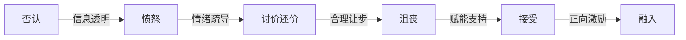

> [!abstract] 核心观点
> 组织变革管理是HR管培生必须具备的核心战略能力。掌握Kotter八步法模型、理解员工变革心理曲线、熟练运用变革沟通策略，是推动组织变革成功的关键。面试中，变革管理类题目考察的是候选人对"人"和"系统"的双重理解。

---

## 一、Kotter八步法模型（Kotter's 8-Step Change Model）

约翰·科特（John Kotter）提出的变革八步法是目前企业界应用最广泛的变革管理框架，其核心逻辑是：**变革不是靠命令推动的，而是靠共识和动力推进的**。

### 八步法全景

| 步骤 | 阶段 | 核心行动 | 常见失败原因 | HR角色 |
|------|------|---------|------------|--------|
| 1 | **建立紧迫感**（Create Urgency） | 识别危机/机遇，让70%以上管理层认识到变革的必要性 | 低估紧迫感的重要性，高层过于自满 | 组织变革宣导会、数据分析呈现痛点 |
| 2 | **组建变革联盟**（Build Coalition） | 集结关键利益相关者，形成有影响力的变革领导团队 | 没有强有力的核心团队，仅靠HR部门推动 | 识别变革关键人、组建跨部门变革小组 |
| 3 | **形成愿景**（Form Vision） | 制定清晰的变革愿景和战略方向 | 愿景空洞/过于复杂，员工无法理解 | 协助高层提炼愿景并进行HR侧解读 |
| 4 | **沟通愿景**（Communicate Vision） | 多渠道、多频次、多形式反复沟通愿景 | 沟通不足（仅靠一次全员邮件） | 制定沟通计划、设计沟通话术、组织Townhall |
| 5 | **消除障碍**（Remove Obstacles） | 识别并消除阻碍变革的流程、制度、人员障碍 | 未能及时处理抵制变革的核心人物 | 识别障碍点、推动制度修订、提供培训支持 |
| 6 | **创造短期成果**（Create Wins） | 规划并实现早期可见的"速赢"项目 | 没有短期成果，变革动力衰减 | 识别速赢项目、组织成果展示会 |
| 7 | **巩固成果并推动更多变革**（Build on Change） | 利用短期成果的势能，推动更深层次的变革 | 过早宣布胜利，松懈导致变革回退 | 复盘成果、扩大变革范围、持续跟进 |
| 8 | **融入文化**（Anchor in Culture） | 将变革成果固化为新的组织文化、制度、行为规范 | 没有将变革融入日常运营和人才管理 | 将新行为纳入绩效考核、晋升标准、招聘要求 |

### 关键成功因素

> [!tip] 八步法实战要点
> - **步骤1-4是"变革的软性基础"**，决定了变革的接受度，HR应重点投入
> - **步骤5-6是"变革的硬性成果"**，决定了变革的可信度
> - **步骤7-8是"变革的固化机制"**，决定了变革的持久性
> - 八步法**不能跳跃**，但可以并行推进部分步骤

---

## 二、员工抵触变革的阶段模型——Kübler-Ross变革曲线

员工面对变革时的心理反应遵循Kübler-Ross的"悲伤五阶段"模型，HR需要识别每个阶段并采取相应策略。

### 变革曲线详解

| 阶段 | 心理状态 | 典型言语 | 持续时间 | HR应对策略 |
|------|---------|---------|---------|-----------|
| **1. 否认**（Denial） | "这不可能是真的"、"变革不会持续太久" | 震惊、回避、照常工作 | 1-2周 | 提供充分信息、耐心解释变革的必要性、创造安全表达空间 |
| **2. 愤怒**（Anger） | "凭什么要改？"、"这太不合理了" | 抱怨、指责、公开质疑 | 2-4周 | 倾听情绪而非反驳、认可其感受、提供反馈渠道（匿名问卷/恳谈会） |
| **3. 讨价还价**（Bargaining） | "能不能这样改？"、"至少保留某些部分" | 试图协商条件、寻找折中方案 | 1-2周 | 认真对待合理建议、明确不可妥协的范围、在可调整处展现灵活性 |
| **4. 沮丧**（Depression） | "我可能真的适应不了"、"也许我该走了" | 士气低落、动力不足、考虑离职 | 2-4周 | 提供心理支持（EAP）、一对一沟通、培训赋能、明确职业发展路径 |
| **5. 接受**（Acceptance） | "好吧，试试看"、"其实也没那么糟" | 开始尝试新方式、寻求建议 | 可长期 | 给予正向反馈、树立标杆、提供充分资源支持成功 |

### 变革曲线管理策略



> [!warning] 关键洞察
> - 每个人在变革曲线上的**速度不同**，HR不能一刀切
> - 管理者通常比一线员工**更早进入接受阶段**，容易产生"他们怎么还不理解"的错位
> - 变革失败往往不是因为方案不好，而是因为**员工的情绪周期没有被管理好**

---

## 三、变革沟通策略

### 沟通原则——"7C原则"

| 原则 | 说明 | 应用示例 |
|------|------|---------|
| **清晰**（Clear） | 信息简单明了，避免术语 | "我们将在Q2完成组织架构调整"而非"我们即将启动组织效能的优化迭代" |
| **一致**（Consistent） | 各渠道信息一致，前后不矛盾 | CEO、HRD、部门经理传达的核心信息一致 |
| **频繁**（Constant） | 少量多次，持续渗透 | 每周一次更新简报，每月一次全员沟通会 |
| **双向**（Two-way） | 建立反馈机制 | 开设匿名Q&A通道、定期组织座谈会 |
| **真诚**（Candid） | 坦诚面对困难，不回避负面信息 | 承认某些岗位可能被调整，但同时说明支持政策 |
| **共情**（Empathetic） | 站在员工角度说 | "我理解这让大家感到不安"而非"这是公司发展的必然选择" |
| **定制**（Customized） | 不同群体不同话术 | 高管层强调战略价值，中层强调流程变化，员工层强调个人影响 |

### 变革沟通矩阵

| 利益相关者 | 核心关注点 | 沟通渠道 | 沟通频率 | 关键信息 |
|-----------|-----------|---------|---------|---------|
| 高管层 | 战略价值、ROI、风险 | 董事会/高管会 | 每月 | 变革进展、关键指标、资源需求 |
| 中层管理者 | 权责变化、团队影响 | 管理者会议、1on1 | 双周 | 团队调整方案、管理赋能培训 |
| 员工 | 个人利益、工作变化 | 全员邮件、Townhall、内网 | 每周 | 变革时间线、个人影响FAQ、支持资源 |
| 工会/员工代表 | 员工权益保障 | 专项沟通会 | 按需 | 补偿方案、安置政策、法律合规 |

### 变革沟通计划模板

```
变革沟通计划——[项目名称]

1. 沟通目标：________________________________
2. 关键受众群体及信息需求：____________________
3. 核心信息要点：_____________________________
4. 沟通渠道矩阵：_____________________________
5. 时间线（里程碑节点）：______________________
6. 反馈收集机制：_____________________________
7. 风险沟通预案：_____________________________
8. 责任人分工：_______________________________
9. 效果评估标准：_____________________________
```

---

## 四、面试高频问题

### 面试题1："公司要组织架构调整，HR怎么推动？"

**考察点**：变革管理方法论、系统思维、落地能力

**答题框架**：Kotter八步法 + 分阶段推进

**参考回答**：

> 我会按Kotter八步法分四个阶段推动：
>
> **第一阶段——准备期（步骤1-2）**：首先和新任VP/CEO深入沟通，理解变革背后的战略意图和业务痛点，帮他梳理出"为什么必须变"的核心论据，建立紧迫感。同时识别公司内部的关键影响力人物（如资深业务总监、技术骨干、工会代表），组建变革核心小组，确保变革不是HR"一个人在战斗"。
>
> **第二阶段——规划期（步骤3-4）**：协助高层形成清晰的变革愿景——不是"我们要扁平化"，而是"我们要让一线决策更快，让客户响应速度提升50%"。然后制定分层沟通计划，用Townhall、部门会议、1on1等多种形式反复传递愿景，确保信息到达每一个层级。
>
> **第三阶段——推进期（步骤5-6）**：识别核心障碍——可能是某些关键岗位的抵触，也可能是系统流程不支持。针对这些障碍逐一解决。同时设计"速赢"项目，比如在3个月内完成一个试点部门的调整并呈现成果，用事实说服观望者。
>
> **第四阶段——固化期（步骤7-8）**：将新架构下的协作方式、汇报关系、决策流程固化为制度，纳入绩效考核和晋升标准，确保变革不会因为人员变动而回退。
>
> 最重要的是，在整个过程中HR要**既做"推动者"又做"缓冲带"**——对上推动变革进展，对下疏导员工情绪。

---

### 面试题2："员工抵触变革怎么办？"

**考察点**：共情能力、冲突管理、变革曲线理解

**答题框架**：识别阶段 → 匹配策略 → 分层处理

**参考回答**：

> 首先，我认为**抵触是正常的，甚至是健康的**。员工抵触变革往往不是因为"不配合"，而是因为"信息不对称"或"安全感缺失"。
>
> **第一步：识别抵触类型和阶段。** 我会用Kübler-Ross变革曲线来判断员工处于哪个阶段——是"否认"阶段的回避，还是"愤怒"阶段的抱怨，或是"沮丧"阶段的消沉。不同阶段需要不同的应对方式。
>
> **第二步：分层处理。** 对于大多数员工，我会通过一对一沟通，倾听他们的顾虑，认可他们的情绪，并明确回答"变革对'我'意味着什么"。对于关键核心员工的抵触，我会寻求更高层或变革联盟成员介入沟通。对于极少数持续抵制且影响团队士气的极端情况，需要果断处理，避免"坏苹果效应"。
>
> **第三步：消除抵触的根源，而非表面。** 员工抵触背后通常有四个底层原因之一：**不理解**（信息不足）、**不会**（能力不足）、**不愿意**（利益受损）、**不敢**（风险恐惧）。针对不同原因，解决方案也不同——不理解就加强沟通，不会就提供培训，不愿意就设计激励，不敢就给予安全保障。
>
> **第四步：建立"安全出口"。** 对于确实无法适应的员工，设计合理的退出机制或转岗方案，尊重个体的选择。

---

### 面试题3："你怎么向员工传达裁员消息？"

**考察点**：共情能力、沟通技巧、合规意识、尊重与尊严

**答题框架**：事前准备 → 沟通流程 → 善后支持

**参考回答**：

> 裁员沟通是HR工作中最困难但也最考验专业度的场景之一。我的原则是：**坦诚、尊重、有温度**。
>
> **事前准备（3个确认）**：
> - 确认沟通时间、地点、参与人（一般需要HR+业务负责人同时在场）
> - 确认法律合规文件（离职协议、补偿方案、竞业限制等）
> - 确认沟通话术并演练，确保信息传递准确、一致
>
> **沟通流程（4步法）**：
> 1. **开门见山**：直接告知决定，不绕弯子。"张先生，今天约您来，是需要和您沟通一个非常艰难的决定……"
> 2. **说明原因**：清晰、客观地解释裁员原因，让员工理解这是公司层面的决策，而非个人表现问题
> 3. **表达同理心**：认可员工的贡献，表达尊重和歉意。"我们非常感激您在过去3年为公司做出的贡献，这个决定与您个人的表现无关。"
> 4. **明确后续安排**：清晰说明离职日期、补偿方案、五险一金处理、竞业限制、职业推荐等，让员工有确定的预期
>
> **善后支持**：
> - 提供职业转型辅导（简历优化、面试指导）
> - 安排心理辅导资源（EAP）
> - 保持尊重的沟通，离职后仍可提供必要的证明和协助
>
> 需要特别注意的是：**裁员沟通不是一次性的"通知"，而是一个"管理过程"**。被裁员工的感受会影响留下员工的士气，处理不当会严重损害雇主品牌。

---

### 面试题4："你经历过的最大的变革是什么？你在其中扮演了什么角色？"

**考察点**：自我认知、变革参与深度、学习反思能力

**答题框架**：STAR法则 + 变革视角

**参考回答**：

> **S（情境）**：在上一段实习中，我所在的公司决定从传统职能制组织架构向"前中后台"架构转型。当时有200多名员工涉及部门调整和汇报线变更，很多员工困惑甚至不满。
>
> **T（任务）**：我的任务是协助HRD制定变革沟通计划，并负责一线员工的沟通落地。
>
> **A（行动）**：
> 1. 首先我协助HRD做了员工变革 readiness 调研，用匿名问卷收集了不同部门对变革的态度和顾虑
> 2. 基于调研结果，我设计了分层沟通方案——针对高管层、中层、员工层分别准备了不同的沟通话术和沟通渠道
> 3. 我负责组织了3场员工沟通会，并在会后收集了200+条反馈，整理成《变革FAQ手册》分发给全员
> 4. 我还建立了一个"变革速递"周报，每周更新变革进展，保持信息透明
>
> **R（结果）**：变革沟通覆盖率达到95%，员工对变革的理解度从调研初期的45%提升到82%，关键人才流失率控制在5%以内。这次经历让我深刻理解了"变革中'人'的因素比'方案'的因素更重要"。

---

## 五、实战工具包

### 变革Readyness评估问卷（示例问题）

| 评估维度 | 问题示例 | 评分（1-5） |
|---------|---------|-----------|
| 对变革必要性的认知 | "你认为公司当前进行组织变革的必要性有多大？" | |
| 对变革愿景的理解 | "你是否清楚这次变革最终要达到的目标？" | |
| 对变革过程的信心 | "你对公司推动这次变革的能力有多大信心？" | |
| 个人受影响程度 | "你认为这次变革对你的工作会产生多大影响？" | |
| 变革支持意愿 | "你愿意为这次变革付出额外的努力吗？" | |

### 变革沟通话术模板

| 场景 | 推荐话术 | 不推荐话术 |
|------|---------|-----------|
| 宣布变革启动 | "公司决定进行一次组织调整，目的是为了更好地服务客户……" | "总部要求我们这样做，我们也没办法……" |
| 回应员工质疑 | "我理解你的担忧，这个问题我们确实考虑过，在X方面我们做了这样的安排……" | "这是公司决定，我们执行就好。" |
| 安抚情绪 | "我完全理解这个消息让你感到不安，我们正在制定详细的安置方案，会在X日前公布。" | "别担心，想开点，公司不会亏待你的。" |
| 应对负面传言 | "我注意到最近有一些传言，我在这里澄清一下实际情况是……" | "别听那些谣言，都是假的。" |

---

> [!tip] 关联学习
> 变革管理的方法论与[[03-HR人事/HR管培生备战/03-战略篇/04_企业文化诊断与建设]]中提到的文化模型密切相关——变革的最终目标是"融入文化"，而文化建设本身就是一场持续的变革。建议两篇文档对照学习。