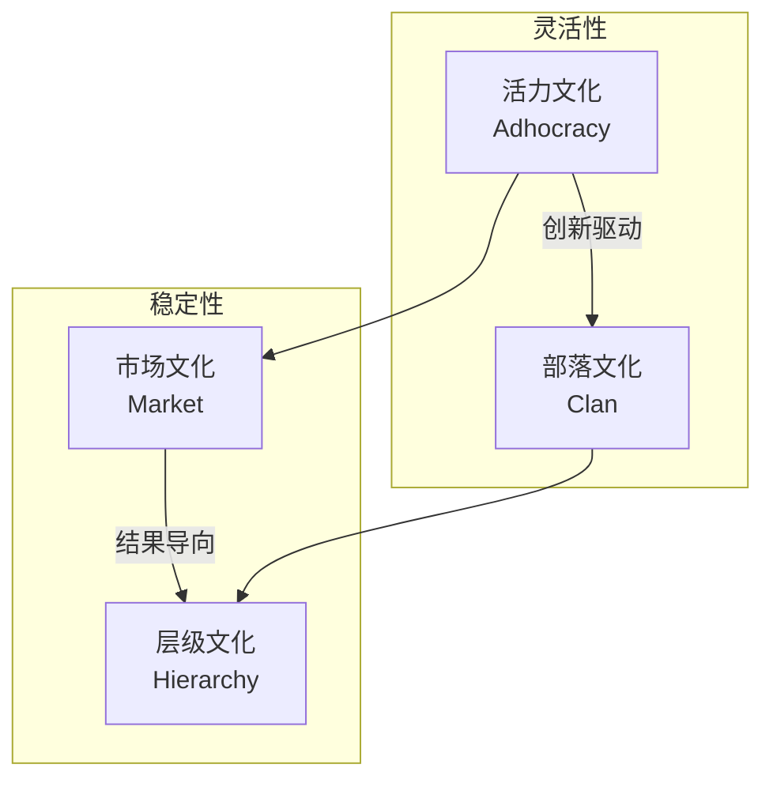

> [!abstract] 核心观点
> 企业文化不仅是"墙上的标语"，更是影响组织绩效和人才留存的关键因素。HR管培生需要掌握Schein三层次模型和CVF竞争性文化价值框架，能够诊断文化现状、设计文化落地路径，并在面试中展现对"文化"这一软性话题的深度思考。

---

## 一、Schein企业文化三层次模型

埃德加·沙因（Edgar Schein）提出的企业文化三层次模型是理解企业文化最经典的理论框架。

### 模型结构

| 层次 | 定义 | 特征 | 可见性 | 例子 |
|------|------|------|--------|------|
| **人工制品**（Artifacts） | 可见的、可感知的组织表象 | 最容易观察，但最难解读 | 表面可见 | 办公环境、着装规范、公司Logo、组织架构图、口号标语、仪式庆典 |
| **价值观**（Espoused Values） | 组织宣称信奉的价值观、战略、目标 | 可以从访谈、文件、演讲中获取 | 部分可见 | "客户第一"、"创新驱动"、"诚信正直"、使命愿景、行为准则 |
| **基本假设**（Basic Assumptions） | 无意识的、理所当然的信念和感知 | 最深层次，决定了前两层的内容 | 不可见 | 对人性的假设（X理论/Y理论）、对工作意义的理解、对竞争的态度 |

### 三层次模型的应用方法

> [!tip] 诊断方法
> 要从"人工制品"出发，经过"价值观"的验证，最终抵达"基本假设"。HR不能只看表面现象，而要透过现象看本质：
> - 公司墙上写着"创新"（人工制品），但员工是否真的敢于试错？（价值观）→ 犯错是否真的不会被惩罚？（基本假设——对"安全"的假设）
> - 公司宣称"以人为本"（价值观），但年终考核是否仍然只看业绩指标？（人工制品）→ 公司是否真的相信员工是资源而非成本？（基本假设）

---

## 二、竞争性文化价值框架（CVF）

由Cameron和Quinn提出的CVF框架是组织文化诊断和变革的实用工具。

### 四种文化类型

| 文化类型 | 核心特征 | 组织像什么 | 典型企业 | 适合场景 | 核心优势 | 潜在风险 |
|---------|---------|-----------|---------|---------|---------|---------|
| **部落文化**（Clan） | 家庭式、合作、导师制、高凝聚力 | 一个大家庭 | 海底捞、西南航空 | 注重员工满意度和团队协作 | 员工忠诚度高、协作好 | 决策效率低、可能过于安逸 |
| **层级文化**（Hierarchy） | 结构化、流程化、规范化、稳定性 | 一座金字塔 | 政府部门、银行 | 注重稳定、效率和可预测性 | 运营高效、风险可控 | 官僚主义、创新不足 |
| **市场文化**（Market） | 结果导向、竞争驱动、目标导向 | 一个竞技场 | 华为、阿里（早期） | 注重业绩增长和市场份额 | 执行力强、成果导向 | 员工压力大、可能忽视长期 |
| **活力文化**（Adhocracy） | 创新驱动、灵活、冒险、创业精神 | 一个实验室 | 字节跳动、特斯拉 | 注重创新和快速迭代 | 创新能力强、适应变化快 | 缺乏稳定性、流程混乱 |

### CVF的实践应用

**应用方法**：
1. **诊断现状**：使用OCAI（Organizational Culture Assessment Instrument）问卷评估组织当前文化类型
2. **明确目标**：结合战略目标，确定组织需要哪种文化类型
3. **识别差距**：对比"现状文化"和"期望文化"之间的差距
4. **制定计划**：针对差距，设计文化变革的优先级和路径

> [!warning] 关键洞察
> - 没有"最好的"文化类型，只有"最适合当前战略"的文化类型
> - 大多数成熟企业是**混合型文化**，但会有一个主导类型
> - 文化转型是一个**3-5年的过程**，而非短期项目

---

## 三、文化诊断方法

### 诊断工具箱

| 方法 | 适用场景 | 优势 | 局限 | 操作要点 |
|------|---------|------|------|---------|
| **深度访谈** | 了解文化背后的"为什么" | 获得深度洞察、发现隐性假设 | 样本量有限、耗时 | 访谈对象覆盖高管/中层/一线，每次45-60分钟 |
| **问卷调查** | 快速大范围收集数据 | 可量化、样本量大、可比性强 | 无法深入理解"原因" | 使用OCAI标准化问卷，配合开放性问题 |
| **现场观察** | 了解"真实发生的"而非"宣称的" | 发现言行不一致、获得第一手资料 | 可能被观察者干扰 | 观察会议/工作场景/非正式互动 |
| **文档分析** | 了解组织宣称的价值观 | 信息量大、可追溯历史 | 文档可能"理想化" | 分析制度文件/内刊/员工手册/领导讲话 |

### 文化诊断的"言行一致性"检查清单

| 检查维度 | 宣称的（Said） | 实际做的（Done） | 差距分析 |
|---------|---------------|-----------------|---------|
| 招聘标准 | "我们看重团队合作" | 晋升的却是"独狼"型高绩效者 | 价值观与选拔标准不一致 |
| 绩效评估 | "创新和试错" | 犯错仍然会影响绩效评分 | 制度设计与文化宣导矛盾 |
| 晋升机制 | "唯才是举" | 晋升看工龄和关系 | 文化与实际运营脱节 |
| 沟通方式 | "开放透明" | 重要信息仅在高层会议中传递 | 宣称与行为不匹配 |

---

## 四、文化落地"三板斧"

### 板斧一：制度固化

| 制度维度 | 文化落地行动 | 示例 |
|---------|------------|------|
| **招聘** | 将文化价值观纳入面试评估标准 | 使用"价值观面试"问题，评估候选人与组织文化的匹配度 |
| **入职** | 设计文化融入计划 | 新员工文化培训、导师制、文化手册 |
| **绩效** | 将文化行为纳入绩效考核 | 360度评估中加入文化维度，如"是否体现了XX价值观" |
| **晋升** | 文化价值观作为晋升的必要条件 | 价值观不达标者，即使业绩优秀也不晋升 |
| **激励** | 设计文化认可机制 | "价值观之星"评选、文化积分 |
| **退出** | 对持续违反文化价值观的行为进行管理 | 文化价值观的硬性约束机制 |

### 板斧二：仪式营造

| 仪式类型 | 目的 | 频次 | 示例 |
|---------|------|------|------|
| **庆典仪式** | 庆祝成就、强化归属感 | 年度/季度 | 年会、周年庆、团队建设活动 |
| **表彰仪式** | 树立榜样、传递价值观 | 月度/季度 | 价值观之星颁奖、月度优秀员工表彰 |
| **入职仪式** | 欢迎新人、传递文化 | 每月 | 新员工欢迎会、拜师仪式 |
| **晋升仪式** | 认可成长、激励他人 | 半年度/年度 | 晋升宣布会、荣誉典礼 |
| **日常仪式** | 日常强化文化氛围 | 每天/每周 | 晨会、站会、团队分享会 |

### 板斧三：故事传播

> [!quote] 文化故事的力量
> 好的故事比任何制度文件都更有感染力。故事是文化的"活载体"。

**文化故事的三种类型**：
1. **创始故事**：公司创立时的艰难和初心（如阿里的"十八罗汉"）
2. **英雄故事**：核心员工践行价值观的真实案例（如华为的"奋斗者"故事）
3. **转折故事**：公司在关键时刻做出价值观选择的经历（如Tylenol胶囊召回事件）

**文化故事传播渠道**：
- 内刊/内网专栏
- 入职培训教材
- 管理者在会议中反复讲述
- 文化墙/展示区
- 企业微信/飞书公众号

---

## 五、面试高频问题

### 面试题1："如何判断一个候选人的价值观是否匹配？"

**考察点**：面试技巧、文化理解、评估能力

**答题框架**：行为面试法 + 多维度评估

**参考回答**：

> 判断价值观匹配不能靠"你认同我们的价值观吗"这种直接提问，因为候选人一定会说"认同"。我建议采用以下方法：
>
> **第一，用行为面试法（BEI）挖掘价值观。** 设计基于价值观的STAR问题，例如：
> - 如果我们的文化强调"客户第一"，就问："请分享一次你为了满足客户需求而突破常规的经历。"
> - 如果我们的文化强调"团队协作"，就问："请分享一次你主动帮助团队成员完成工作的经历。"
> - 如果我们的文化强调"创新"，就问："请分享一次你提出新想法并推动落地，但最终失败了经历。"
>
> **第二，使用情景假设题。** 设计两难情景，看候选人的选择倾向。例如："如果你发现项目有重大风险，但汇报后可能会影响团队KPI，你会怎么做？"
>
> **第三，多维度验证。** 面试官内部对候选人的文化匹配度进行交叉评估，结合背景调查（Reference Check）了解候选人在前公司的行为表现。
>
> **第四，设置试用期观察机制。** 在入职后的前3个月，设置文化融入的观察节点，由导师或HRBP进行反馈。
>
> 需要强调的是，**价值观匹配≠"一模一样"**。适度的多样性反而能带来平衡，关键是要看候选人的核心价值观是否与组织底线一致。

---

### 面试题2："企业文化怎么落地？"

**考察点**：执行力、方法论、系统性思维

**答题框架**：三板斧框架 + 长期主义

**参考回答**：

> 企业文化落地不是"写一条标语"或"开一次文化会"，而是一个**系统工程**，需要从制度、仪式、故事三个维度同时发力，持续3-5年。
>
> **第一，制度固化——让文化"有规矩"。** 将文化价值观嵌入到人才管理的全生命周期：招聘时用价值观面试筛选，入职时做文化融入，绩效考核中加入文化行为评估，晋升时把文化价值观作为必要条件。同时，管理者要带头践行文化，对违反文化价值观的行为要有明确的"红线"机制。
>
> **第二，仪式营造——让文化"有温度"。** 设计仪式感强的文化场景，让员工在参与中感受文化。比如月度"价值观之星"表彰，让践行文化的人被看见、被认可；比如不定期的CEO文化对话，让员工感受到文化不是"挂在墙上的"而是"活着的"。
>
> **第三，故事传播——让文化"有灵魂"。** 挖掘组织内部的真实故事——创始人的初心故事、员工践行价值观的感人故事、关键时刻的价值观选择故事。通过内刊、大会、培训等渠道持续传播，让文化变得可感知、可传递。
>
> **最后，最关键的是"言行一致"**。员工不看你说什么，看你怎么做。如果管理者一边喊着"以人为本"，一边为了业绩不择手段，再好的文化落地方案也没有用。HR要敢于做"文化守门人"。

---

### 面试题3："两家公司并购后文化冲突怎么处理？"

**考察点**：战略思维、冲突管理、文化整合能力

**答题框架**：评估 → 融合策略 → 分阶段推进

**参考回答**：

> 并购后的文化整合是并购失败的主要原因之一（麦肯锡研究表明，约70%的并购失败与文化整合有关）。我的处理思路分三步：
>
> **第一步：文化诊断评估。** 在并购启动阶段，就使用CVF框架对两家公司的文化进行诊断。明确双方的文化类型——比如收购方是"市场文化"，被收购方是"部落文化"，那么冲突几乎是必然的。同时要识别出"哪些文化差异是必须弥合的，哪些是可以保留的"。
>
> **第二步：选择文化融合策略。** 根据并购的战略目的，选择不同的融合策略：
> - **吸收式**（强势文化完全覆盖弱势文化）：适用于"大吃小"的收购，收购方文化明显更优
> - **融合式**（两种文化融合形成新文化）：适用于"强强联合"，各自优势互补
> - **分离式**（各自保留独立文化）：适用于"多元化集团"收购，保持独立运营
> - **消亡式**（双方文化都不保留，创造新文化）：适用于"合资公司"模式
>
> **第三步：分阶段推进执行。**
> 1. **第一阶段（0-3个月）**：稳定人心，避免关键人才流失。建立沟通机制，让双方员工了解文化差异和整合方向。
> 2. **第二阶段（3-12个月）**：推动融合落地。设计统一的价值观和行为准则，组织跨公司团队的活动和项目，促进理解和融合。
> 3. **第三阶段（12-24个月）**：固化和深化。将新的文化准则纳入考核和晋升体系，通过故事和仪式持续强化。
>
> 最重要的是，**文化整合需要"尊重"**——不是"我们的文化更好，你们要改"，而是"我们各自有优势，我们一起创造更好的文化"。

---

### 面试题4："你如何理解企业文化？"

**考察点**：理论深度、思考沉淀、个人见解

**答题框架**：定义 + 理论框架 + 个人理解

**参考回答**：

> 我认为企业文化是**组织在应对内外部挑战过程中形成的、被证明有效并被新成员学习的共享基本假设模式**（借用Schein的定义）。通俗地说，就是一个组织"做事的习惯方式"。
>
> 从理论上看，我比较认同Schein的三层次模型：文化有表层的人工制品（办公环境、着装、口号），中层的外显价值观（宣称的使命、愿景、行为准则），以及深层的、无意识的基本假设（对人性的看法、对风险的态度）。真正决定文化的是**最深层的假设**，而我们常常只看到表面的人工制品。
>
> 从实践角度看，我认为文化有三个关键作用：
> 1. **降低内部交易成本**——当大家有共同的价值观和假设时，沟通和协作效率更高
> 2. **提供行为指引**——在制度覆盖不到的地方，文化告诉员工"应该怎么做"
> 3. **吸引和保留人才**——优秀的人才不仅看薪酬，也看与自己价值观是否匹配
>
> 最后，我认为**文化不是"设计"出来的，而是"长"出来的**。HR能做的是创造一个让好的文化自然生长的环境，而不是生硬地"建设"一个文化。

---

## 六、文化诊断工具包

### OCAI问卷核心维度

| 维度 | 部落文化（A） | 活力文化（B） | 市场文化（C） | 层级文化（D） |
|------|-------------|-------------|-------------|-------------|
| 主导特征 | 像大家庭，成员共享 | 创业精神，动态创新 | 结果导向，任务完成 | 结构化，程序化 |
| 组织领导 | 导师、家长式 | 创新者、冒险家 | 实干家、竞争者 | 协调者、组织者 |
| 员工管理 | 团队合作、参与式 | 个人创新、自由 | 竞争、高要求 | 稳定、可预测 |
| 组织凝聚力 | 忠诚、信任 | 创新、领先 | 目标达成、成功 | 规则、政策 |
| 战略重点 | 人力发展、开放 | 新资源、创造 | 竞争、市场份额 | 稳定、效率 |
| 成功标准 | 人力发展、团队 | 独特产品、领先 | 市场份额、超越 | 高效、低成本 |

### 文化差异诊断表

| 对比维度 | 传统企业 | 互联网企业 | 外企 | 国企 |
|---------|---------|-----------|-----|-----|
| 决策方式 | 自上而下，流程审批 | 扁平化，快速决策 | 会议共识，数据驱动 | 层级分明，程序复杂 |
| 沟通风格 | 正式、保守 | 开放、直接 | 直接但礼貌 | 含蓄、讲究关系 |
| 风险偏好 | 风险规避 | 鼓励试错 | 适度风险 | 极度保守 |
| 时间视角 | 长期稳定 | 快速迭代 | 中期规划 | 长期稳定 |
| 员工关系 | 上下级明确 | 平等、年轻化 | 专业边界清晰 | 人际关系复杂 |

---

> [!tip] 关联学习
> 企业文化诊断与建设是组织变革的核心内容，与[[03-HR人事/HR管培生备战/03-战略篇/03_组织变革管理方法论]]密不可分——文化变革本身就是最深层次的变革。建议结合阅读，构建完整的"组织软实力"知识体系。