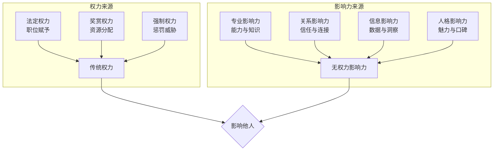
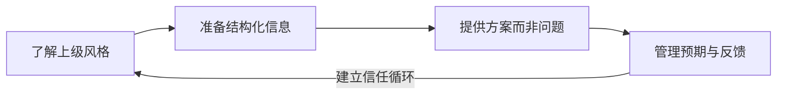
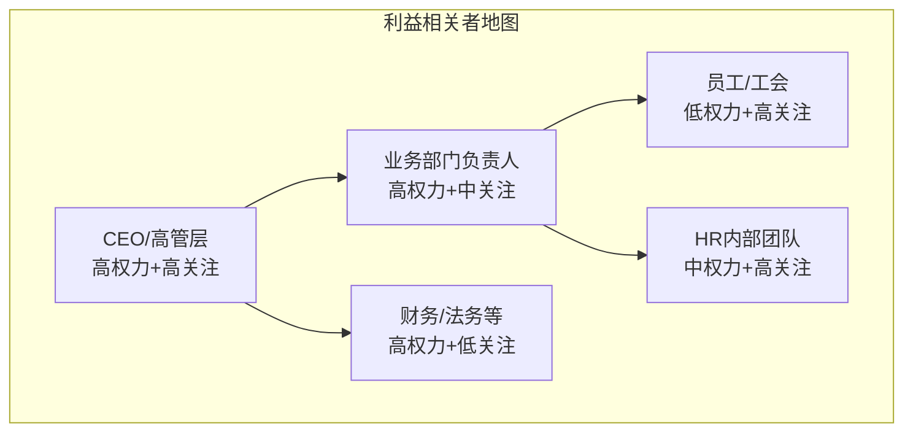
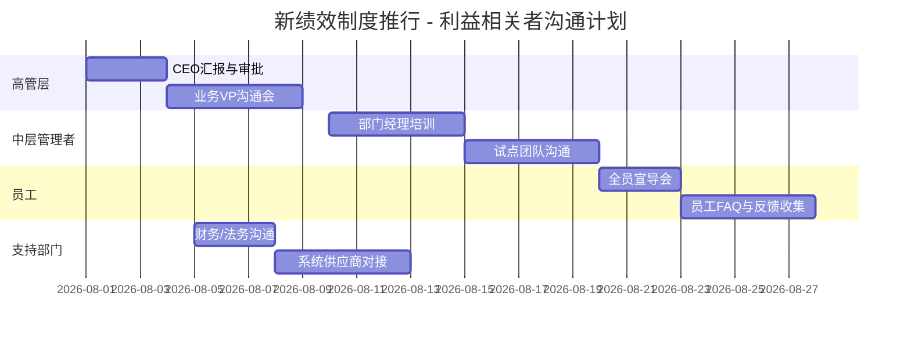

> [!abstract] 核心观点
> HR在组织中往往处于"有职责、无权力"的位置——需要推动业务部门配合，却没有直接的行政命令权。**因此，HR的核心软实力就是"无权力影响力"（Influence without Authority）**：通过专业信任、关系经营、利益共情和沟通策略，让业务方主动愿意配合HR的工作。管培生需要掌握向上、向下、平行三个方向的沟通策略，以及利益相关者管理的系统方法。

---

## 一、HR的"无权力影响力"概念

### 1.1 什么是无权力影响力



**HR的权力特点：**
- 有制度职责（如绩效管理、薪酬设计），但无直接指挥权
- 需要推动业务部门行动，但无法强制命令
- 影响力建立在"别人愿意听你的"而非"别人不得不听你的"

### 1.2 影响力构建四步法

| 步骤 | 核心动作 | 关键问题 | 时间周期 |
|------|----------|----------|----------|
| **Step 1: 建立信任** | 展现专业能力、兑现承诺、保守机密 | "为什么别人要相信我？" | 1-3个月 |
| **Step 2: 创造价值** | 解决业务实际问题、提供有用信息 | "我能为对方带来什么？" | 持续 |
| **Step 3: 经营关系** | 主动沟通、了解对方需求、建立连接 | "我了解对方在乎什么吗？" | 持续 |
| **Step 4: 扩大影响** | 打造成功案例、建立口碑、成为"不可替代" | "别人遇到什么问题会想到我？" | 6-12个月 |

---

## 二、沟通策略：向上/向下/平行

### 2.1 三种沟通方向对比

| 维度 | 向上沟通（对上级/管理层） | 向下沟通（对下属/团队） | 平行沟通（对业务部门/同级） |
|------|--------------------------|--------------------------|----------------------------|
| **核心目标** | 获得信任与支持 | 推动执行与成长 | 达成协作与共识 |
| **常见挑战** | 信息不对称、权威压力 | 执行偏差、动力不足 | 部门利益冲突、优先级不同 |
| **关键能力** | 结构化表达、向上管理 | 教练式沟通、授权 | 利益分析、共赢思维 |
| **沟通频次** | 定期（周报/月报）+ 按需 | 日常（1on1/例会） | 按项目/事件驱动 |

### 2.2 向上沟通策略



**向上沟通黄金法则：**

```markdown
**1. 了解上级风格**
- 细节型：喜欢数据，需要详细报告
- 大局型：关注结论，不要过多细节
- 视觉型：喜欢图表，一图胜千言
- 文字型：喜欢书面材料，需要提前阅读

**2. 提供方案而非问题**
- 错误方式："老板，业务部门不配合招聘，怎么办？"
- 正确方式："老板，业务部门不配合招聘，我分析了三个原因，建议方案A/B/C，推荐方案A，理由是..."

**3. 管理预期与反馈**
- 主动同步进度，而非等上级来问
- 遇到风险提前预警，而非出问题再汇报
- 承诺的事情一定要做到，建立信任
```

### 2.3 平行沟通策略

**平行沟通最关键：找到对方"为什么要配合你"的理由。**

| 对方顾虑 | 应对策略 | 话术示例 |
|----------|----------|----------|
| "这事对我有什么好处？" | 利益关联，找到双赢点 | "我了解你团队最近在冲刺KPI，这个项目可以帮助你..." |
| "我没时间配合你。" | 降低协作成本，提供"拎包入住"方案 | "我已经把大部分工作做完了，只需要你花30分钟确认..." |
| "以前HR的项目都不靠谱。" | 用数据说话，建立信任 | "这次我们做了充分准备，上个月试点效果是..." |
| "这不是我的KPI。" | 对齐公司目标，争取上级支持 | "这个项目是CEO重点关注的，我们已经和XX副总沟通过了..." |

### 2.4 向下沟通策略

对于HR新人而言，向下沟通不是"管理下属"，而是"通过HR专业引导管理者"。

```markdown
**HR引导管理者做绩效面谈的沟通示例：**

"张经理，我知道你最近很忙，但绩效面谈对团队很重要。我帮你准备了一个面谈提纲，只需要30分钟就能完成。
面谈的核心是听员工先说，然后你给反馈。你可以先问这三个问题：
1. '你觉得这半年做得最好的地方是什么？'
2. '有什么困难需要我支持？'
3. '下半年你有什么目标？'

如果你方便，我可以先示范一次，然后你来做，我在旁边观察。"
```

---

## 三、利益相关者管理矩阵

### 3.1 利益相关者映射



### 3.2 利益相关者管理矩阵

| 权力/利益 | 高利益 | 低利益 |
|-----------|--------|--------|
| **高权力** | **重点管理（Key Players）**<br/>CEO、业务VP、HRVP<br/>策略：充分沟通、定期汇报、争取支持 | **保持满意（Keep Satisfied）**<br/>CFO、法务总监<br/>策略：提供必要信息，避免意外 |
| **低权力** | **保持知情（Keep Informed）**<br/>员工、HRBP、招聘专员<br/>策略：及时沟通，收集反馈 | **最低关注（Monitor）**<br/>外部顾问、供应商<br/>策略：常规管理即可 |

### 3.3 利益相关者管理计划模板

```markdown
**利益相关者管理计划（以推行新绩效制度为例）**

| 利益相关者 | 权力 | 利益 | 当前态度 | 管理策略 | 沟通频率 |
|------------|------|------|----------|----------|----------|
| CEO | 高 | 高 | 支持 | 定期汇报进展，展示数据 | 每月1次 |
| 业务VP | 高 | 中 | 观望 | 先试点，用数据说话 | 每双周1次 |
| 部门经理 | 中 | 高 | 抵触 | 培训+赋能，降低执行难度 | 每周1次 |
| 员工 | 低 | 高 | 担忧 | 透明沟通，收集反馈 | 关键节点 |
| 财务总监 | 高 | 低 | 中立 | 控制成本，定期同步 | 每季度1次 |
```

---

## 四、面试高频问题

### 问题1：业务部门不配合HR工作怎么办？

> **考察点**：问题解决能力、沟通策略、利益相关者管理思维

**答题框架**：理解原因 → 建立连接 → 降低门槛 → 争取支持

**参考回答**：
```
业务部门不配合，通常不是针对HR个人，而是有更深层次的原因。我会按以下步骤处理：

**第一步：理解"为什么"不配合**
- 是觉得HR工作不重要？（认知问题）
- 是太忙了没时间？（优先级问题）
- 是之前有过不好的合作经历？（信任问题）
- 是不理解这个项目对TA有什么好处？（利益问题）

**第二步：对症下药**
- 认知问题：用业务语言说明HR项目的价值，比如"绩效管理不是给你们增加工作量，而是帮你识别团队中谁在拖后腿"
- 优先级问题：帮对方降低配合成本，提供"拎包入住"方案，尽量减少对方的时间投入
- 信任问题：从小事做起，先帮对方解决一个小问题，建立信任后再推大项目
- 利益问题：找到双赢点，让HR项目和业务目标对齐

**第三步：建立长期关系**
- 定期1on1，了解业务方的最新需求和痛点
- 成为业务方的"HR顾问"，而非"HR警察"
- 在业务方需要帮助时第一时间响应，建立互惠关系

**第四步：必要时升级**
- 如果以上方法都无效，且项目确实重要，通过上级协调
- 但升级是"最后手段"，不能成为常态

关键原则：**HR的权威不是靠职位，而是靠价值**。当你对业务方有用时，他们自然会配合。
```

**得分点**：
- 先分析"为什么"再"怎么办"，体现诊断思维
- 区分四类原因，展现层次感
- "拎包入住"方案的说法体现HR的服务意识
- 最后一句点明"靠价值而非职位"的核心思想

---

### 问题2：你如何说服业务负责人接受HR的建议？

> **考察点**：说服技巧、数据思维、利益分析能力

**答题框架**：数据说话 → 利益关联 → 降低风险 → 试点验证

**参考回答**：
```
说服业务负责人接受HR的建议，关键在于"用对方听得懂的逻辑说话"：

**第一步：用数据说话（建立理性基础）**
- 不要只说"我觉得"，要展示数据
- 例如："我们分析了去年离职数据，发现入职3个月内离职的员工占比45%，主要原因是缺乏系统培训。如果我们加强入职培训，预计可以降低离职率10%，节省招聘成本约XX万。"

**第二步：利益关联（回答"这对我有什么好处"）**
- 把HR建议翻译成业务价值
- 例如："这个绩效管理方案不仅能帮你识别高潜人才，还能帮你淘汰不合格员工，提升团队整体战斗力。"

**第三步：降低风险感知（让建议"可撤销"）**
- 业务负责人最怕的是"试错成本高"
- 先做试点，而非全面推行
- 设置明确的评估标准和退出机制
- 例如："我们可以在你的团队先试点一个月，如果效果不好随时可以调整，不会有太大影响。"

**第四步：借助外部权威（增加可信度）**
- 引用行业标杆做法："华为、阿里都在用这个方案..."
- 引用数据报告："行业报告显示，使用这个方案的公司平均人效提升了20%..."
- 借力上级支持："CEO对这个方向也非常认可..."
```

**得分点**：
- 四个步骤层层递进，结构清晰
- 有具体话术示例，展示沟通技巧
- "先试点"的策略体现务实和风险意识
- 引用外部权威，展现专业视野

---

### 问题3：你作为新人HR，如何让资深业务负责人认可你的价值？

> **考察点**：新人定位、学习能力、价值创造策略

**答题框架**：谦虚学习 → 从小事做起 → 专业积累 → 建立口碑

**参考回答**：
```
作为新人HR，面对资深业务负责人，天然存在"资历差距"。我的策略是"三步走"：

**第一步：先做学生，再做顾问**
- 主动找业务负责人聊：了解业务、了解团队、了解痛点
- 话术："王总，我刚加入公司，想在HR侧更好地支持你们团队，能花30分钟跟你聊聊吗？我想了解你的团队在人才方面最大的挑战是什么。"
- 这个阶段的目标是"学习"，而不是"建议"

**第二步：从小事做起，建立信任**
- 找一些"小但重要"的事情做好
- 比如：帮业务方优化JD、快速找到1-2个候选人、整理一份行业薪酬报告
- 小事的价值在于验证"这个HR是靠谱的"

**第三步：用专业赢得尊重**
- 当业务方提出一个HR问题时，给出超出预期的解决方案
- 比如：业务方说"帮我招人"，你不仅招到了人，还做了人才画像、竞品人才地图
- 当业务方习惯了"找你有用"时，你的价值就建立了

**核心心态**：新人HR最忌讳的是"不懂装懂"或"一上来就指手画脚"。越是资深的人，越看重"你这个人靠不靠谱"——靠谱比资历更重要。
```

**得分点**：
- 区分三个阶段，体现成长思维
- 有具体话术，展示沟通技巧
- "从小事做起"展现务实态度
- 最后一句"靠谱比资历更重要"点明核心，打动面试官

---

### 问题4：你发现业务部门的管理方式有问题，你会怎么沟通？

> **考察点**：敏感问题处理能力、建设性反馈技巧、沟通分寸感

**答题框架**：确认事实 → 选择时机 → 反馈技巧（SBI模型） → 共同改进

**参考回答**：
```
发现业务部门管理方式有问题，这是一个需要"高情商"处理的敏感场景。我会按照以下原则和步骤：

**第一步：确认事实，避免主观判断**
- 先确认"问题"是客观事实还是我的主观感受
- 收集具体事例和数据，而非"我觉得"
- 例如：不是"你管理方式太粗暴"，而是"我看到你们团队最近3个月有5位员工离职，离职访谈中3位提到'与上级沟通方式'有关"

**第二步：选择合适的时机和方式**
- 私下沟通，而非公开场合（避免让对方丢面子）
- 选择对方情绪平稳的时候，而非压力大或刚发火后
- 以"关心"和"支持"的姿态，而非"批评"和"指责"

**第三步：使用SBI反馈模型**
- S（Situation）情境：描述具体场景
- B（Behavior）行为：描述客观行为
- I（Impact）影响：说明行为带来的影响

**示例：**
"王总，我想和你聊聊团队管理的一些观察。（S）上周的团队周会上，你连续打断了小李的发言三次，并且说'你这些想法没用'。（B）我担心这可能会影响团队成员的表达意愿，长期可能影响团队创新氛围。（I）你看我观察到的是不是实际情况？我们可以一起想想怎么改善？"

**第四步：提供支持，而非评判**
- 询问是否需要HR的支持："需要我帮你做些什么？比如团队沟通培训、或者1on1辅导？"
- 共同制定改进计划，而非单方面建议
- 后续跟进，但给予对方空间和时间

**关键原则**：反馈的目的是"帮助对方成长"，而不是"证明我比你正确"。
```

**得分点**：
- 先用"确认事实"来避免主观判断，体现严谨性
- 选择合适的时机和方式，展示情商
- SBI模型是经典的管理反馈工具，体现专业度
- 最后的"提供支持"姿态，展现建设性而非破坏性
- 结尾金句印象深刻

---

## 五、沟通实战工具箱

### 5.1 不同场景沟通话术示例

```markdown
**场景一：业务方说"这个HR项目我没时间做"**
→ "我理解你很忙，我已经把大部分准备工作做好了，只需要你花30分钟做关键决策，剩下的我来执行。"

**场景二：业务方说"你们HR就知道搞形式主义"**
→ "我理解你的感受，之前可能有些项目确实没有带来实际价值。这次我想先听听你的需求，看看我们能不能一起做点真正有用的事情。"

**场景三：业务方说"这个员工的绩效不达标，HR帮我处理一下"**
→ "好的，我来协助你。首先我们需要确认绩效不达标的具体情况，然后制定一个改进计划。我会帮你准备好所有材料，但需要你作为管理者来主导面谈，因为员工更在意的是上级的看法。"

**场景四：业务方拒绝配合薪酬调研**
→ "我明白薪酬数据比较敏感。这个调研是匿名的，我们只汇报整体趋势，不会暴露个人数据。而且，参与调研可以获得完整的行业薪酬报告，这对你团队的人才保留非常有帮助。"
```

### 5.2 影响力自我评估清单

```markdown
**HR影响力自检清单：**

☐ 业务部门遇到人才问题，会主动来找你吗？
☐ 你提出的建议，业务负责人通常会认真考虑吗？
☐ 你参加业务会议时，你的意见会被重视吗？
☐ 业务部门在制定新计划时，会提前和你沟通吗？
☐ 你是否有至少2-3个业务负责人是你的"盟友"？
☐ 你是否在公司有"靠谱"的口碑？
☐ 你是否能用数据支持你的观点？
☐ 你是否了解每个业务负责人的"痛点和关注点"？
☐ 你是否在过去的项目中兑现了你的承诺？
☐ 你是否被邀请参与业务决策讨论？

**解读**：如果超过5个"是"，说明你已经建立了较好的影响力。
如果少于3个，需要系统性地加强影响力建设。
```

### 5.3 利益相关者沟通计划示例



---

> [!tip] 管培生备考提示
> - "跨部门沟通"类问题考察的是"情商"和"问题解决能力"而非"HR知识"
> - 回答时重点展示：共情能力（理解对方立场）+ 策略思维（对症下药）+ 沟通技巧（具体话术）
> - 新人HR面试中，这类问题特别重要，因为面试官在考察你的"软实力"
> - 记住核心公式：**信任 + 价值 + 关系 = 影响力**
> - 准备一个你成功"说服"别人或"解决冲突"的亲身经历，会很加分

---

## 相关链接
- [[03-HR人事/HR管培生备战/00_MOC_HR管培生备战中枢]]
- [[03-HR人事/HR管培生备战/03-战略篇/01_如何理解业务]]
- [[03-HR人事/HR管培生备战/03-战略篇/02_HR数据分析与人效管理]]
- [[03-HR人事/HR管培生备战/02-专业篇/04_招聘与配置]]
- [[03-HR人事/HR管培生备战/02-专业篇/06_绩效管理]]