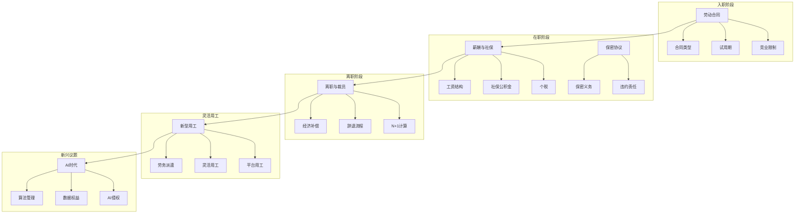
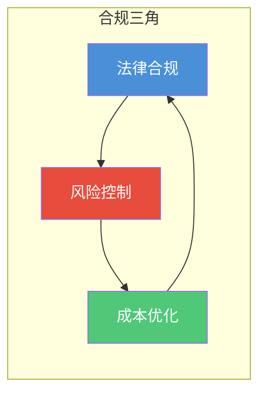

# 劳动法与合规中枢

> [!key] 核心主张
> 劳动法不是"出了问题才想起的法条"，而是**企业运营和个人职业发展的基础框架**。理解劳动法，不是为了让企业"钻空子"，而是为了在合规的前提下最大化效率和公平。本知识库从实操角度出发，覆盖从入职到离职、从传统用工到 AI 时代的全链路合规要点。

---

## 全景图：劳动法与合规的完整体系

---

## 文档索引

| 序号 | 文档名称 | 核心主题 | 难度 |
|:---:|:---|:---|:---:|
| 00 | 本文件 | 全景图与索引 | 入门 |
| 01 | [[03-HR人事/劳动法与合规/01_劳动合同法精要：从签约到解约|劳动合同法精要]] | 合同类型、试用期、解除 | 核心 |
| 02 | [[03-HR人事/劳动法与合规/02_薪酬与社保合规：不踩坑的实操指南|薪酬与社保合规]] | 工资、社保、个税 | 核心 |
| 03 | [[03-HR人事/劳动法与合规/03_离职与裁员法律风险：如何体面分手|离职与裁员法律风险]] | 经济补偿、N+1 | 核心 |
| 04 | [[03-HR人事/劳动法与合规/04_竞业限制与保密协议：保护企业还是保护员工|竞业限制与保密协议]] | 竞业限制、保密 | 进阶 |
| 05 | [[03-HR人事/劳动法与合规/05_灵活用工与外包：新用工模式的法律边界|灵活用工与外包]] | 派遣、灵活用工 | 进阶 |
| 06 | [[03-HR人事/劳动法与合规/06_AI时代的劳动法新议题：算法管理、数据权益|AI时代劳动法新议题]] | 算法、数据权益 | 高阶 |

---

## 劳动法合规的核心框架

### 平衡的三个维度

- **法律合规**：最低要求，也是底线
- **风险控制**：在合规之上，管理潜在风险
- **成本优化**：在合规和风险可控的前提下，优化用工成本

> [!warning] 重要提示
> 本知识库内容仅供参考，不构成法律意见。**具体法律问题请咨询专业律师。** 劳动法的地域差异较大，不同地区（如北京、上海、深圳）的司法实践可能存在差异。

---

## 与其他知识库的关联

- [[02-AI趋势与素养/AI应用发展阶段演进/00_MOC_AI应用发展阶段演进中枢|AI应用发展阶段演进]] — AI 对劳动法的影响是当前最前沿的议题
- [[01-AI技术/AI Agent开发实战/00_MOC_AI Agent开发实战中枢|AI Agent开发实战]] — Agent 商业化中的法律合规问题
- [[04-商业与战略/内容营销与个人品牌/00_MOC_内容营销与个人品牌中枢|内容营销与个人品牌]] — 自由职业者和内容创作者的法律权益保护

---

## 使用指引

> [!tip] 建议阅读顺序
> 如果你是 HR 或创业者，建议按 01 → 02 → 03 → 04 → 05 → 06 的顺序阅读。
> 如果你是普通员工，重点阅读 01、03、04 即可。
> 如果你是法律从业者，可以直接从 06 开始，或跳转到你感兴趣的章节。

---

## 劳动法合规的七大原则

1. **合法是底线** — 任何用工方式都必须建立在法律框架内
2. **书面优先** — 所有重要的劳动条款都要有书面记录
3. **程序正义** — 不仅结果要合法，程序也要合法
4. **地域差异** — 不同地区的劳动法实践存在差异
5. **时效意识** — 劳动仲裁的时效是 1 年，不要错过
6. **证据保留** — 保留所有相关文件和通信记录
7. **专业咨询** — 复杂问题一定要咨询专业律师

---

*创建于 2026-07-31 | 最后更新: 2026-07-31*