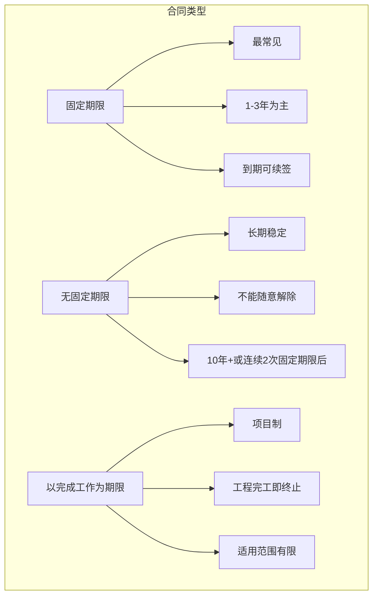
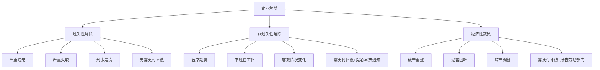

# 劳动合同法精要：从签约到解约

## 劳动合同是劳动关系的"宪法"

> [!key] 劳动合同的核心价值
> 劳动合同是劳动关系的基石，**它既是企业的"保护伞"，也是员工的"护身符"。** 一份规范的劳动合同能避免 90% 以上的劳动争议。但现实中，很多企业和员工对合同的理解停留在"走个形式"的层面。

---

## 劳动合同的类型与选择

### 三种合同类型对比

| 类型 | 适用场景 | 优势 | 劣势 |
|:---|:---|:---|:---|
| 固定期限 | 绝大多数岗位 | 灵活，到期可终止 | 续签两次后需转无固定期限 |
| 无固定期限 | 核心员工、长期岗位 | 稳定，员工安全感强 | 解除难度大，成本高 |
| 以完成工作为期限 | 项目制、工程类 | 天然匹配项目周期 | 适用范围限制严格 |

> [!warning] 无固定期限合同的风险
> 很多人误以为"无固定期限"就是"铁饭碗"，这是误解。**无固定期限合同只是没有到期日，但在法定解除条件（如严重违纪、不胜任工作）下，企业仍然可以解除合同。** 只不过解除的举证责任更重。

---

## 试用期的法律红线

### 试用期期限的法定上限

| 劳动合同期限 | 试用期上限 | 备注 |
|:---|:---:|:---|
| 3个月以上不满1年 | 1个月 | 不满3个月不得约定试用期 |
| 1年以上不满3年 | 2个月 | 以完成工作为期限的合同不得约定试用期 |
| 3年以上或无固定期限 | 6个月 | 同一单位只能约定一次试用期 |

### 试用期常见违规

> [!tip] 试用期违规的"重灾区"
> 1. **试用期过长**：超过法定上限的试用期无效
> 2. **重复约定试用期**：同一单位只能约定一次试用期，即使换岗也不行
> 3. **试用期不缴社保**：试用期是劳动关系存续期，必须缴纳社保
> 4. **试用期工资过低**：试用期工资不得低于合同约定工资的 80%
> 5. **随意延长试用期**：延长试用期需要双方协商一致

---

## 劳动合同解除的条件与程序

### 企业单方解除的情形

### 解除程序的关键要点

1. **通知工会**：企业单方解除劳动合同，必须事先将理由通知工会
2. **书面送达**：解除通知必须书面送达，口头通知无效
3. **证据保留**：解除理由必须有充分证据支持
4. **补偿支付**：需要支付经济补偿的，要及时足额支付

---

## 常见劳动争议的预防

> [!example] 劳动争议的"高发地带"
> 1. **未签书面合同**：企业自用工之日起超过1个月未签合同，需支付双倍工资
> 2. **违法解除**：解除理由不成立，需支付 2 倍经济补偿作为赔偿金
> 3. **加班费争议**：加班费是劳动争议中占比最高的类型
> 4. **社保缴纳**：不缴或少缴社保是高频投诉事项

---

## 与薪酬和离职的衔接

- [[03-HR人事/劳动法与合规/02_薪酬与社保合规：不踩坑的实操指南|薪酬与社保合规]] — 合同中约定的薪酬条款如何落地
- [[03-HR人事/劳动法与合规/03_离职与裁员法律风险：如何体面分手|离职与裁员法律风险]] — 解除合同的经济补偿计算

---

## 关键要点总结

1. **合同类型选择**直接影响用工成本和灵活性
2. **试用期**有严格的法律限制，不能随意约定
3. **合同解除**必须有法定理由和规范程序
4. **书面证据**是劳动争议中的关键
5. **无固定期限合同**不是"铁饭碗"，但解除成本更高

---

*创建于 2026-07-31 | 字数: ~800 字*