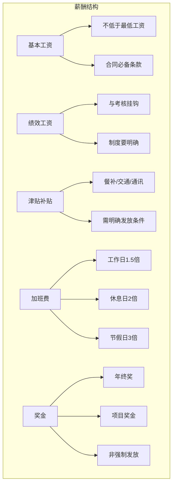
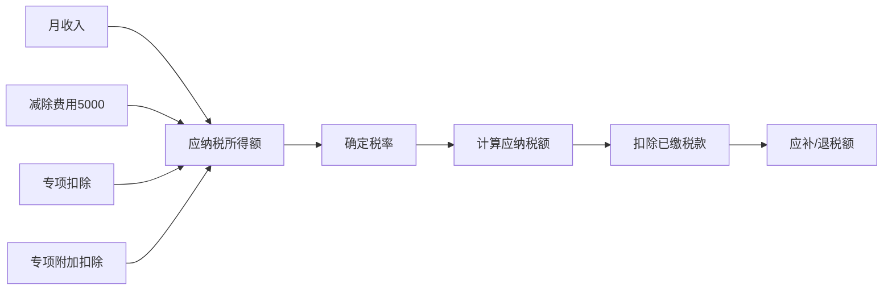

# 薪酬与社保合规：不踩坑的实操指南

## 薪酬是劳动争议的"第一导火索"

> [!key] 薪酬合规的核心
> 薪酬问题占劳动争议的 60% 以上。**很多纠纷不是因为"发少了"，而是因为"说不清楚"。** 薪酬结构的透明和合规，比薪酬数额本身更重要。

---

## 薪酬结构设计

### 薪酬设计的合规要点

| 薪酬项目 | 法律要求 | 常见违规 | 风险等级 |
|:---|:---|:---|:---:|
| 基本工资 | 不低于最低工资 | 低于最低工资标准 | 严重 |
| 加班费 | 法定倍数计算 | 未足额支付 | 高 |
| 绩效工资 | 制度明确、考核公平 | 随意扣减 | 中 |
| 年终奖 | 非强制，但约定需履行 | 约定了不发 | 中 |
| 津贴补贴 | 按制度发放 | 随意取消 | 低 |

> [!warning] 最低工资的"陷阱"
> 最低工资不是"基本工资"，而是**劳动者在法定工作时间内提供正常劳动后，企业应支付的最低劳动报酬**。它不包括加班费、特殊津贴和法定福利。有些企业把最低工资等同于基本工资，这是不合规的。

---

## 社保合规：五险一金的缴纳规则

### 五险一金构成

| 险种 | 企业比例 | 个人比例 | 基数上下限 | 备注 |
|:---|:---:|:---:|:---:|:---|
| 养老保险 | 16% | 8% | 60%-300%社平工资 | 累计缴费满15年可领 |
| 医疗保险 | 8-10% | 2% | 60%-300%社平工资 | 各地比例略有差异 |
| 失业保险 | 0.5-1% | 0.5% | 60%-300%社平工资 | 各地比例不同 |
| 工伤保险 | 0.2-1.9% | 0% | 按行业浮动 | 企业全额承担 |
| 生育保险 | 0.5-1% | 0% | 60%-300%社平工资 | 已并入医保 |
| 住房公积金 | 5-12% | 5-12% | 各地不同 | 企业和个人比例一致 |

### 社保合规的常见问题

> [!tip] 社保合规的关键点
> 1. **试用期必须缴社保**：试用期是劳动关系存续期，不是"观察期"，必须缴纳
> 2. **基数必须合规**：按实际工资作为缴费基数，不能按最低基数
> 3. **跨地区用工**：异地用工需要了解当地社保政策
> 4. **灵活就业人员**：可以以个人身份缴纳养老和医疗保险

---

## 个税计算与合规

### 个人所得税计算框架

### 专项附加扣除项目

1. **子女教育**：每个子女每月 1000 元
2. **继续教育**：每月 400 元或每年 3600 元
3. **大病医疗**：年度限额 80000 元
4. **住房贷款利息**：每月 1000 元
5. **住房租金**：每月 800-1500 元（分城市）
6. **赡养老人**：每月 2000 元
7. **3岁以下婴幼儿照护**：每月 1000 元

---

## 薪酬与社保的联动

薪酬结构直接影响社保基数和个税计算。在 [[03-HR人事/劳动法与合规/03_离职与裁员法律风险：如何体面分手|离职补偿]] 中，经济补偿的计算基数也是以离职前 12 个月的平均工资为准。

---

## 关键要点总结

1. **薪酬结构要清晰**，避免"说不清楚"的纠纷
2. **最低工资是底线**，不能触碰
3. **社保必须合规**，试用期也要缴纳
4. **个税扣缴要准确**，专项附加扣除要充分利用
5. **薪酬与社保、离职补偿联动**，需要整体考虑

---

*创建于 2026-07-31 | 字数: ~800 字*