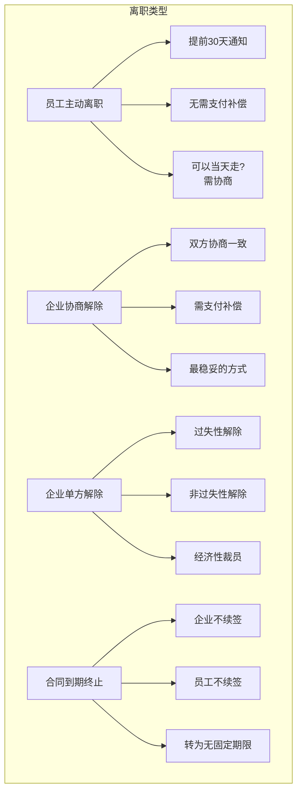
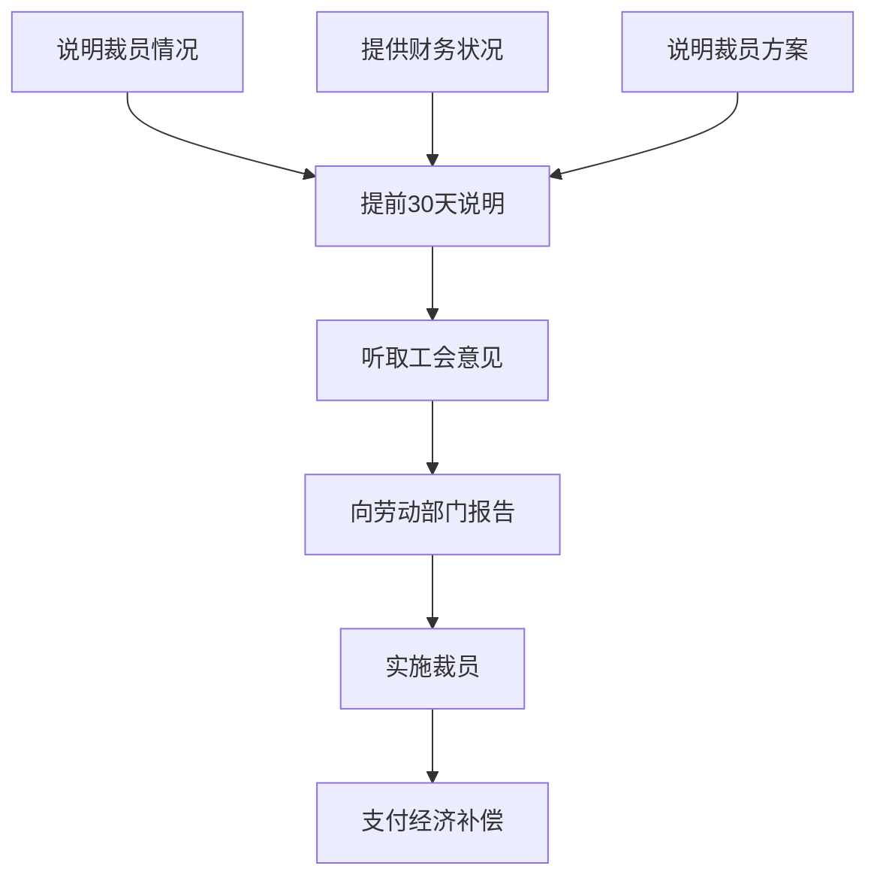

# 离职与裁员法律风险：如何体面分手

## "分手"见人品，更见法律素养

> [!key] 离职管理的核心价值
> 离职是劳动争议的高发期。**一个处理不当的离职，可能让企业付出数月甚至数年的法律成本。** "好聚好散"不仅是人际关系的理想，更应该是法律合规的目标。

---

## 离职的类型与法律后果



---

## 经济补偿的计算（N、N+1、2N）

### 核心概念

| 概念 | 含义 | 适用场景 |
|:---|:---|:---|
| N | 工作年限对应的补偿月数 | 协商解除、非过失性解除 |
| N+1 | N + 代通知金（1个月工资） | 未提前30天通知的非过失性解除 |
| 2N | 2倍经济补偿（赔偿金） | 违法解除 |

### 计算公式

```
经济补偿 = 月平均工资 × N（工作年限）

N = 每满1年支付1个月工资
    6个月以上不满1年 = 1个月
    不满6个月 = 半个月
```

> [!warning] 计算基数的"坑"
> 月平均工资是**离职前 12 个月的平均工资**，包括基本工资、绩效、奖金、津贴等所有货币性收入。**不是基本工资，也不是合同约定工资。**

### 补偿上限

| 情形 | 上限 |
|:---|:---:|
| 月平均工资 ≤ 社平工资 3 倍 | 无上限 |
| 月平均工资 > 社平工资 3 倍 | 按社平工资 3 倍计算，N 不超过 12 年 |

> [!tip] 快速记忆
> 月平均工资超过社平工资 3 倍的高薪人士，补偿有"双限"——基数上限 3 倍社平工资，年限上限 12 年。

---

## 裁员的法律程序

### 经济性裁员的法定条件

根据《劳动合同法》第 41 条，经济性裁员需要满足以下条件之一：

1. 依照企业破产法规定进行重整
2. 生产经营发生严重困难
3. 企业转产、重大技术革新或经营方式调整，经变更合同后仍需裁员
4. 其他因劳动合同订立时所依据的客观经济情况发生重大变化

### 裁员程序



### 不得裁员的"保护名单"

- 从事接触职业病危害作业未进行离岗前健康检查的
- 疑似职业病在诊断或医学观察期间的
- 在本单位患职业病或因工负伤被确认丧失或部分丧失劳动能力的
- 患病或非因工负伤在医疗期内的
- 女职工在孕期、产期、哺乳期的
- 在本单位连续工作满 15 年且距法定退休年龄不足 5 年的

---

## 离职管理的实操要点

> [!example] 离职管理的"五个必须"
> 1. **必须书面通知**：口头通知无效，必须留存书面证据
> 2. **必须开离职证明**：离职证明是员工找下一份工作的必需文件
> 3. **必须结清工资**：离职时一次性结清所有工资和补偿
> 4. **必须办理社保转移**：当月 15 日前离职，企业当月停缴
> 5. **必须做好工作交接**：交接清单双方签字确认

---

## 与相关法规的衔接

- [[03-HR人事/劳动法与合规/01_劳动合同法精要：从签约到解约|劳动合同解除的条件]] 是离职管理的基础
- [[03-HR人事/劳动法与合规/02_薪酬与社保合规：不踩坑的实操指南|薪酬计算]] 直接影响经济补偿的基数
- [[03-HR人事/劳动法与合规/04_竞业限制与保密协议：保护企业还是保护员工|竞业限制]] 在离职时需要明确是否启动

---

## 关键要点总结

1. **离职类型决定补偿标准**，N、N+1、2N 各有适用场景
2. **经济补偿计算基数是离职前 12 个月平均工资**，不是基本工资
3. **裁员有严格的法定程序**，不能随意进行
4. **特定人群在裁员中受保护**，不能随意裁减
5. **书面证据是离职管理的关键**
6. **"好聚好散"需要法律保障**

---

*创建于 2026-07-31 | 字数: ~800 字*