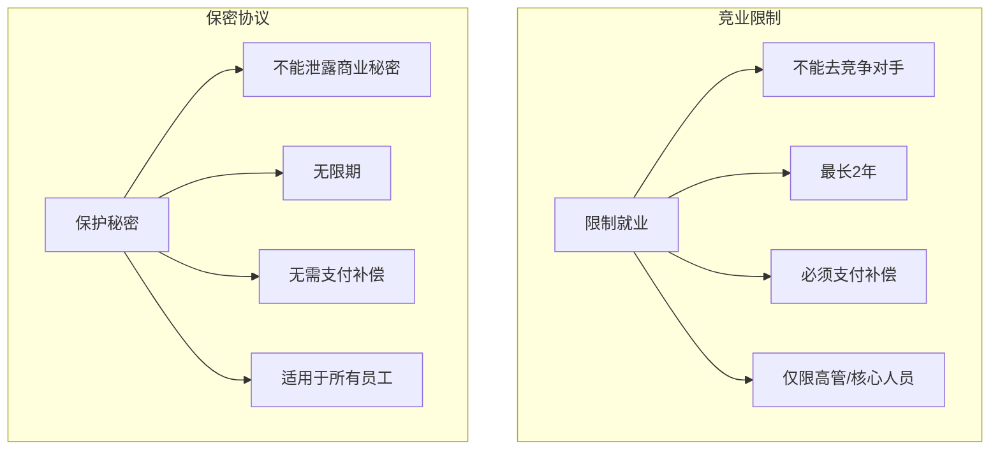

# 竞业限制与保密协议：保护企业还是保护员工

## 这对"双刃剑"应该如何平衡？

> [!key] 竞业限制的平衡点
> 竞业限制和保密协议是企业保护商业秘密的"护城河"，但**如果滥用，就会变成限制员工职业发展的"枷锁"。** 法律需要在保护企业利益和保障员工就业权之间寻找平衡。

---

## 竞业限制 vs 保密协议

| 维度 | 竞业限制 | 保密协议 |
|:---|:---|:---|
| 限制内容 | 限制就业选择 | 限制信息泄露 |
| 适用对象 | 高管、高级技术人员、其他负有保密义务的人员 | 所有接触商业秘密的员工 |
| 期限 | 最长 2 年（离职后） | 无限期（商业秘密存续期间） |
| 补偿 | 必须支付 | 不需要 |
| 违约金 | 可约定 | 可约定 |
| 法律依据 | 《劳动合同法》第 23 条 | 《劳动合同法》第 22 条 |

---

## 竞业限制的实操要点

### 竞业限制的适用对象

> [!warning] 竞业限制的"滥用"问题
> 实践中，很多企业对**全员**签署竞业限制协议，这是不合规的。竞业限制只能适用于：
> - 高级管理人员（CEO、CFO、CTO 等）
> - 高级技术人员（核心研发、架构师等）
> - 其他负有保密义务的人员（核心销售、市场负责人等）

### 竞业限制补偿金

| 地区 | 补偿标准 | 说明 |
|:---|:---:|:---|
| 全国 | 不低于离职前 12 个月平均工资的 30% | 最低标准 |
| 北京 | 不低于离职前 12 个月平均工资的 20-50% | 司法实践中参考 |
| 上海 | 不低于离职前 12 个月平均工资的 20-50% | 司法实践中参考 |
| 深圳 | 不低于离职前 12 个月平均工资的 50% | 地方规定 |

> [!tip] 补偿金的关键
> 竞业限制补偿金是在离职后按月支付的，**不是离职时一次性支付**。如果企业超过 3 个月未支付补偿金，员工可以解除竞业限制协议。

### 竞业限制的范围

- **地域**：不能无限制地限制全国范围，应该与企业的业务范围匹配
- **行业**：不能限制所有行业，应该限定在"有竞争关系"的企业
- **期限**：最长 2 年，超过部分无效

---

## 保密协议的核心条款

### 商业秘密的定义

根据《反不正当竞争法》，商业秘密是指：

> 不为公众所知悉、具有商业价值并经权利人采取相应保密措施的技术信息、经营信息等商业信息。

**构成商业秘密的三个要件：**
1. **秘密性**：不为公众所知悉
2. **价值性**：具有商业价值
3. **保密性**：采取了保密措施

### 保密协议的关键条款

1. **保密范围**：明确哪些信息属于商业秘密
2. **保密义务**：员工在职和离职后的保密义务
3. **保密期限**：商业秘密存续期间
4. **违约责任**：泄露秘密的后果
5. **例外条款**：法律要求披露的信息除外

---

## 竞业限制的争议高发点

> [!example] 常见争议场景
> 1. **"无补偿"的竞业限制是否有效？** — 无效，没有补偿的竞业限制对员工没有约束力
> 2. **"全员签署"是否有效？** — 对不符合条件的员工无效
> 3. **"竞业范围太宽"怎么办？** — 法院可以调整范围
> 4. **"离职后企业不付补偿"怎么办？** — 员工可以解除协议
> 5. **"员工违反竞业限制"怎么办？** — 企业可以要求支付违约金

---

## 与相关法规的衔接

- [[03-HR人事/劳动法与合规/01_劳动合同法精要：从签约到解约|劳动合同]] 中通常包含保密条款
- [[03-HR人事/劳动法与合规/03_离职与裁员法律风险：如何体面分手|离职管理]] 中需要明确是否启动竞业限制
- [[03-HR人事/劳动法与合规/06_AI时代的劳动法新议题：算法管理、数据权益|AI 时代的商业秘密保护]] 面临新的挑战

---

## 关键要点总结

1. **竞业限制和保密协议是两回事**，不能混为一谈
2. **竞业限制有严格的对象限制**，不能全员签署
3. **竞业限制必须支付补偿**，否则无效
4. **保密协议是无限期的**，适用于所有接触商业秘密的员工
5. **竞业限制的范围要合理**，不能无限制扩大
6. **争议的解决需要平衡企业利益和员工权益**

---

*创建于 2026-07-31 | 字数: ~800 字*