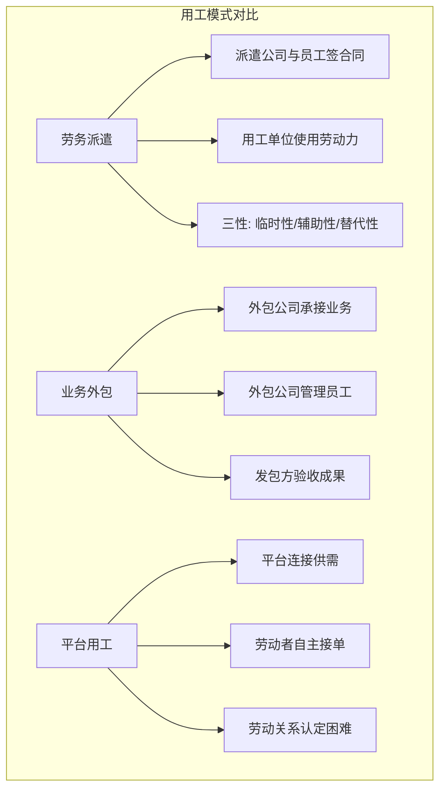

# 灵活用工与外包：新用工模式的法律边界

## 传统用工框架正在被打破

> [!key] 灵活用工的核心
> 灵活用工不是"规避劳动法的手段"，而是**适应新经济形态的用工方式创新**。但法律边界不清晰、监管滞后、劳动权益保障不足，是灵活用工面临的三大核心挑战。

---

## 三种新用工模式的对比



| 维度 | 劳务派遣 | 业务外包 | 平台用工 |
|:---|:---|:---|:---|
| 法律关系 | 派遣公司-员工-用工单位 | 发包方-承包方-员工 | 平台-劳动者 |
| 管理权归属 | 用工单位直接管理 | 承包方独立管理 | 平台算法管理 |
| 用工比例限制 | 不超过 10% | 无限制 | 无限制 |
| 岗位限制 | 三性岗位 | 无限制 | 无限制 |
| 社保缴纳 | 派遣公司缴纳 | 承包方缴纳 | 通常不缴纳 |
| 法律风险 | 中 | 中 | 高 |

---

## 劳务派遣的合规边界

### "三性"原则

> [!warning] 劳务派遣的"三性"限制
> 劳务派遣只能适用于**临时性、辅助性、替代性**岗位：
> - **临时性**：存续时间不超过 6 个月的岗位
> - **辅助性**：为主营业务提供服务的非主营业务岗位
> - **替代性**：因员工脱产学习、休假等原因无法工作时的替代岗位

### 劳务派遣的"红线"

1. **比例限制**：用工单位使用的派遣员工不得超过用工总量的 10%
2. **同工同酬**：派遣员工享有与用工单位员工同工同酬的权利
3. **不得自我派遣**：用工单位不得设立劳务派遣单位向本单位派遣
4. **不得转派遣**：派遣公司不得将派遣员工再派遣到其他单位

---

## 业务外包与"假外包"的识别

### 真外包 vs 假外包

```mermaid
graph TB
    subgraph 真外包
        A[承包方独立管理] --> A1[自主安排工作]
        A --> A2[承担经营风险]
        A --> A3[按成果结算]
    end
    
    subgraph 假外包（实为派遣）
        B[发包方直接管理] --> B1[现场指挥]
        B --> B2[发包方承担风险]
        B --> B3[按人头结算]
    end
```

> [!tip] 识别"假外包"的关键
> 判断是外包还是派遣，核心看**管理权归属**：
> - 谁在管理员工的工作？谁在安排工作时间？
> - 谁在承担经营风险？谁在决定工作方式？
> - 结算方式是"按人头"还是"按成果"？

---

## 平台用工的劳动关系认定

### 平台用工的"三难"

1. **劳动关系认定难**：平台与劳动者之间是否构成劳动关系？
2. **社保缴纳难**：平台从业者的社保如何解决？
3. **工伤认定难**：送餐途中受伤算不算工伤？

### 各地司法实践的差异

| 地区 | 认定标准 | 典型案例 |
|:---|:---|:---|
| 北京 | 综合判断，重实质 | 外卖骑手劳动关系认定 |
| 上海 | 倾向于不认定 | 网约车司机劳动关系 |
| 广东 | 分类处理 | 专职 vs 兼职区分 |
| 浙江 | 平台经济特殊保护 | 灵活就业者权益保障 |

---

## 合规建设的建议

> [!example] 灵活用工的合规框架
> 1. **明确用工模式**：根据业务需求选择合适的用工模式，不混用、不违规
> 2. **规范合同签署**：每种用工模式都有对应的合同模板
> 3. **严格区分管理权**：外包和派遣的管理权归属要清晰
> 4. **保障基本权益**：即使是灵活用工，也要保障最低工资和基本保险
> 5. **关注政策动态**：灵活用工的法律法规正在快速变化中

---

## 与相关法规的衔接

- [[03-HR人事/劳动法与合规/01_劳动合同法精要：从签约到解约|劳动合同法]] 是灵活用工的法律基础
- [[03-HR人事/劳动法与合规/02_薪酬与社保合规：不踩坑的实操指南|社保合规]] 在灵活用工中面临更大挑战
- [[03-HR人事/劳动法与合规/06_AI时代的劳动法新议题：算法管理、数据权益|AI 时代的算法管理]] 对平台用工影响深远

---

## 关键要点总结

1. **劳务派遣**受"三性"和 10% 比例限制
2. **业务外包**的核心是管理权归属，警惕"假外包"
3. **平台用工**的劳动关系认定是当前最大的法律灰色地带
4. **合规建设**需要从模式选择、合同签署、管理权划分三方面入手
5. **政策正在快速变化**，需要持续关注

---

*创建于 2026-07-31 | 字数: ~800 字*