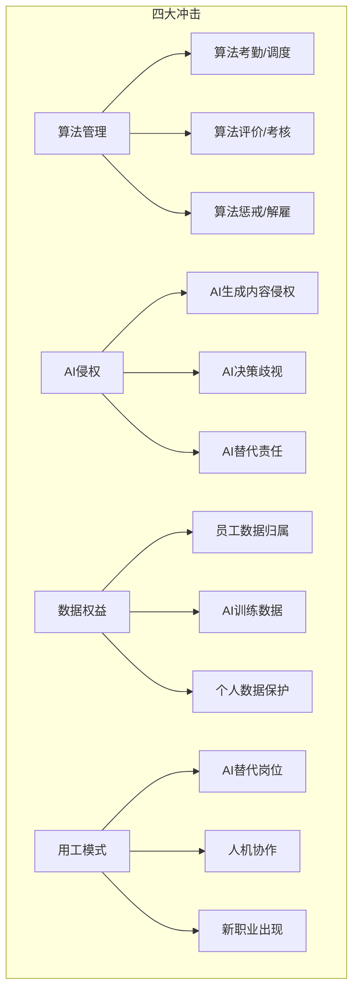
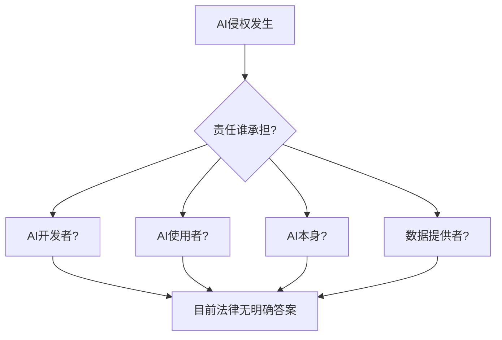

# AI 时代的劳动法新议题：算法管理、数据权益

## 劳动法正在面临"百年未有之变局"

> [!key] AI 时代的核心挑战
> 传统劳动法建立在"雇主-雇员"的二元关系上，**但 AI 正在引入"算法管理者"和"AI 同事"这两个新角色。** 谁对算法决策负责？AI 创作的内容归谁所有？平台用算法"管理"员工是否合法？这些问题都在挑战现有法律框架。

---

## AI 对劳动法的四大冲击

---

## 议题一：算法管理——当"老板"变成一段代码

### 算法管理的表现形式

| 管理环节 | 传统方式 | 算法管理方式 | 法律争议 |
|:---|:---|:---|:---|
| 招聘 | 人工筛选简历 | AI 算法筛选 | 算法歧视 |
| 考勤 | 打卡签到 | 算法定位/面部识别 | 隐私侵犯 |
| 调度 | 主管排班 | 算法自动调度 | 工作强度 |
| 考核 | 主管评价 | 算法评分 | 透明度 |
| 奖惩 | 主管决定 | 算法自动惩戒 | 程序正义 |

### 算法管理的法律问题

> [!warning] 算法管理的"黑箱"问题
> 当算法决定员工的排班、考核、甚至解雇时，**员工是否有权知道算法的决策逻辑？** 目前法律对此没有明确回答。但欧盟的《人工智能法案》和中国的《个人信息保护法》已经开始对算法透明度提出要求。

### 算法管理的基本原则

1. **透明度原则**：算法决策的逻辑应该对员工可见
2. **公平性原则**：算法不能存在歧视性偏见
3. **人工干预原则**：关键决策（如解雇）应该有"人在回路中"
4. **数据最小化原则**：只收集与工作相关的数据

---

## 议题二：AI 侵权——谁为 AI 的错误负责？

### AI 侵权的主要类型

- **AI 生成内容侵权**：AI 生成的文字、图片、代码侵犯他人知识产权
- **AI 决策歧视**：AI 招聘算法歧视特定性别或种族
- **AI 替代责任**：AI 在自动驾驶或自动操作中造成损害

### 责任归属的困境

> [!tip] 当前实践中的责任分配
> 实践中，法院倾向于按照"谁受益、谁负责"的原则分配责任：
> - **AI 开发者**：对算法设计缺陷负责
> - **AI 使用者**：对不当使用 AI 负责
> - **AI 本身**：目前不能作为法律主体承担责任

---

## 议题三：数据权益——员工的数据属于谁？

### 员工数据权益的核心问题

| 数据类型 | 产生场景 | 权益归属争议 | 当前实践 |
|:---|:---|:---|:---|
| 工作产出数据 | 日常工作产生的数据 | 员工 vs 企业 | 通常归企业 |
| 个人生物数据 | 面部识别、指纹打卡 | 隐私权 vs 管理权 | 需员工同意 |
| AI 训练数据 | 用于训练 AI 的数据 | 数据提供者 vs AI 开发者 | 灰色地带 |
| 行为数据 | 键盘记录、屏幕监控 | 管理权 vs 隐私权 | 需告知并同意 |

### 数据权益的保护框架

> [!example] 数据合规清单
> 1. **告知同意**：收集员工数据前必须告知并取得同意
> 2. **目的限制**：收集的数据只能用于告知的目的
> 3. **数据最小化**：只收集必要的数据
> 4. **存储限制**：数据不能无限期保存
> 5. **安全保护**：采取技术措施保护数据安全
> 6. **删除权**：员工有权要求删除个人数据

---

## AI 时代的劳动法前瞻

### 可能的法律变革方向

1. **算法劳动法**：专门针对算法管理出台法规
2. **AI 责任保险**：强制 AI 使用者购买责任保险
3. **数据权益法**：明确员工数据的权属和使用规则
4. **新就业形态**：为平台用工和 AI 相关职业制定专门规则

---

## 与相关知识和法规的衔接

- [[03-HR人事/劳动法与合规/04_竞业限制与保密协议：保护企业还是保护员工|商业秘密保护]] 在 AI 时代面临新挑战
- [[03-HR人事/劳动法与合规/05_灵活用工与外包：新用工模式的法律边界|灵活用工]] 与 AI 算法管理高度相关
- [[02-AI趋势与素养/AI应用发展阶段演进/00_MOC_AI应用发展阶段演进中枢|AI应用发展阶段演进]] — 了解 AI 技术发展对法律的影响
- [[01-AI技术/AI Agent开发实战/00_MOC_AI Agent开发实战中枢|AI Agent开发实战]] — Agent 开发中需要考虑的法律合规问题

---

## 关键要点总结

1. **算法管理**正在改变传统的"雇主-雇员"关系，需要新的法律框架
2. **AI 侵权**的责任归属尚未明确，需要"谁受益、谁负责"原则
3. **数据权益**是 AI 时代劳动法最核心的议题之一
4. **法律正在快速演变**，需要持续关注政策动态
5. **合规前置**是应对不确定性的最佳策略
6. **AI 时代劳动法**将是未来十年最活跃的法律领域之一

---

*创建于 2026-07-31 | 字数: ~800 字*