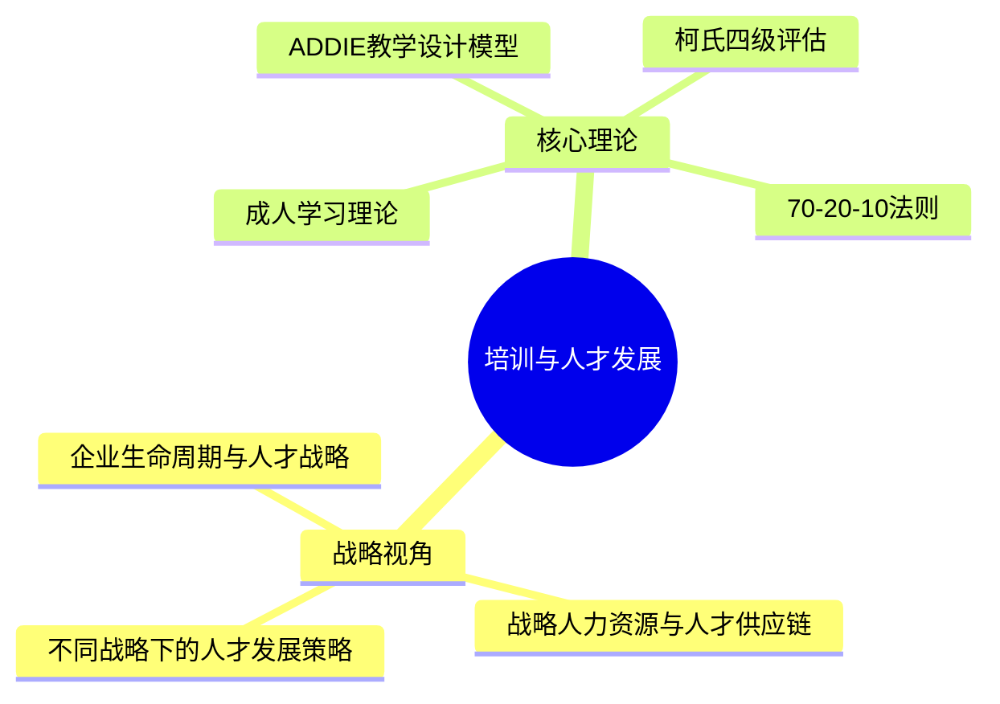
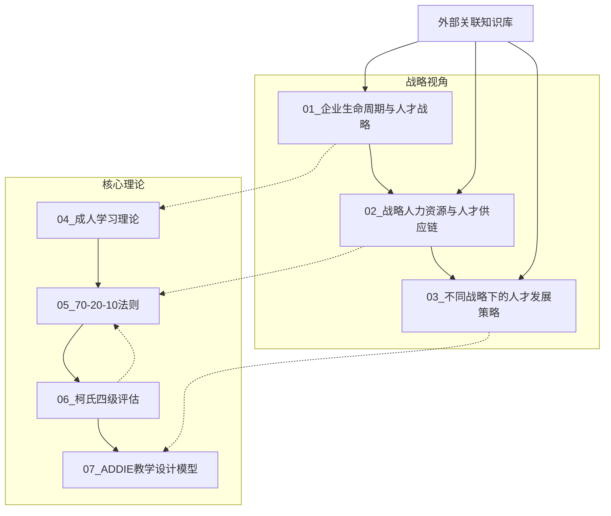

# 培训与人才发展知识库中枢

> [!abstract] 知识库定位
> 本知识库以**战略+人力+AI复合视角**构建，系统梳理培训与人才发展的核心理论、战略框架和实操方法论。面向产品经理/COE岗位面试，兼顾专业深度与可操作性。核心问题：**在AI时代，如何构建面向未来的组织人才能力？**

---

## 知识体系导航

---

## 文档索引

### 模块一：战略视角

| 编号 | 文档 | 核心问题 | 面试场景 |
|:---:|------|----------|----------|
| 01 | [[03-HR人事/培训与人才发展/01-战略视角/01_企业生命周期与人才战略]] | 企业不同阶段需要什么样的人才策略？ | "如何分析一家企业的人才需求？" |
| 02 | [[03-HR人事/培训与人才发展/01-战略视角/02_战略人力资源与人才供应链]] | HR如何成为战略伙伴而非支持职能？ | "你如何理解战略人力资源？" |
| 03 | [[03-HR人事/培训与人才发展/01-战略视角/03_不同战略下的人才发展策略]] | 业务战略如何决定培训方向？ | "培训如何支撑业务战略？" |

### 模块二：核心理论

| 编号 | 文档 | 核心问题 | 面试场景 |
|:---:|------|----------|----------|
| 04 | [[03-HR人事/培训与人才发展/02-核心理论/04_成人学习理论]] | 成年人怎么学才有效？ | "你如何设计一门培训课程？" |
| 05 | [[03-HR人事/培训与人才发展/02-核心理论/05_70-20-10法则]] | 培训、实践、社交如何配比？ | "培训体系如何落地？" |
| 06 | [[03-HR人事/培训与人才发展/02-核心理论/06_柯氏四级评估]] | 怎么证明培训真的有效？ | "你如何衡量培训效果？" |
| 07 | [[03-HR人事/培训与人才发展/02-核心理论/07_ADDIE教学设计模型]] | 培训项目如何系统化开发？ | "请描述一个你设计的培训项目" |

### 模块三：实战案例（基于真实项目）

| 编号 | 文档 | 核心问题 | 面试场景 |
|:---:|------|----------|----------|
| 08 | [[03-HR人事/培训与人才发展/08_721动态培养模型]] | 如何打破静态721，做差异化培养？ | "你怎么设计人才培养方案？" |
| 09 | [[03-HR人事/培训与人才发展/09_O-P-I逆向评价体系]] | 培训效果怎么量化评估？ | "你如何证明培训有效？" |

---

## 使用指南

### 按面试场景推荐

> [!tip] 场景一：COE/产品经理面试（通用）
> 1. 先读 [[03-HR人事/培训与人才发展/02-核心理论/04_成人学习理论]] —— 建立"学习如何发生"的底层认知
> 2. 再读 [[03-HR人事/培训与人才发展/02-核心理论/05_70-20-10法则]] 和 [[03-HR人事/培训与人才发展/02-核心理论/07_ADDIE教学设计模型]] —— 掌握培训设计的核心方法论
> 3. 补充 [[03-HR人事/培训与人才发展/02-核心理论/06_柯氏四级评估]] —— 掌握培训效果评估的完整框架
> 4. 最后读 [[03-HR人事/培训与人才发展/01-战略视角/02_战略人力资源与人才供应链]] —— 拔高到战略层面

> [!tip] 场景二：回答"培训如何支撑战略"类问题
> 1. [[03-HR人事/培训与人才发展/01-战略视角/03_不同战略下的人才发展策略]] —— 建立战略→培训的映射逻辑
> 2. [[03-HR人事/培训与人才发展/01-战略视角/01_企业生命周期与人才战略]] —— 补充时间维度的分析框架
> 3. [[03-HR人事/培训与人才发展/01-战略视角/02_战略人力资源与人才供应链]] —— 整合为人才供应链视角

> [!tip] 场景三：回答"你如何设计一个培训项目"类问题
> 1. [[03-HR人事/培训与人才发展/02-核心理论/07_ADDIE教学设计模型]] —— 提供结构化流程
> 2. [[03-HR人事/培训与人才发展/02-核心理论/04_成人学习理论]] —— 注入学习设计原则
> 3. [[03-HR人事/培训与人才发展/02-核心理论/05_70-20-10法则]] —— 确保混合式学习组合
> 4. [[03-HR人事/培训与人才发展/02-核心理论/06_柯氏四级评估]] —— 前置评估设计

### 按学习场景推荐

> [!tip] 从零到一：建立培训与人才发展知识体系
> 按模块顺序阅读：战略视角（01-03）→ 核心理论（04-07）。战略视角建立"为什么做"的认知，核心理论解决"怎么做"的能力。

> [!tip] 快速查阅：面试前突击
> 直接阅读每篇文档末尾的"面试应用"部分，快速掌握核心话术和分析框架。

---

## 关联知识库

本知识库与以下知识库形成互链，构成完整的HR知识体系：

- [[电网项目人才培养实践]] —— 行业案例：电网行业的人才供应链实践
- [[HR AI转型全景图]] —— 前沿话题：AI如何重塑培训与人才发展
- [[产品经理能力模型]] —— 岗位对标：产品经理需要哪些核心能力
- [[COE面试准备指南]] —— 面试策略：COE岗位面试的核心考察点

> [!note] 知识库联动建议
> 阅读本知识库时，建议同步查阅关联知识库，形成"理论-案例-应用"的完整闭环。特别是电网项目案例，可以作为面试中"理论结合实践"的素材。

---

## 核心概念速查

| 概念 | 一句话定义 | 出处 |
|------|-----------|------|
| 企业生命周期 | 企业从孕育到死亡经历十个阶段，不同阶段需要不同的人才策略 | [[03-HR人事/培训与人才发展/01-战略视角/01_企业生命周期与人才战略]] |
| 人才供应链 | 像管理供应链一样管理人才，实现需求预测到动态补给的全流程 | [[03-HR人事/培训与人才发展/01-战略视角/02_战略人力资源与人才供应链]] |
| Make or Buy | 内部培养与外部招聘的决策框架 | [[03-HR人事/培训与人才发展/01-战略视角/02_战略人力资源与人才供应链]] |
| 成人学习六原则 | 诺尔斯提出的成人学习特征：需要知道why、自我导向、经验基础等 | [[03-HR人事/培训与人才发展/02-核心理论/04_成人学习理论]] |
| Kolb经验学习圈 | 体验→反思→概念化→实验的循环学习过程 | [[03-HR人事/培训与人才发展/02-核心理论/04_成人学习理论]] |
| 70-20-10 | 70%在岗实践 + 20%社交学习 + 10%正式培训 | [[03-HR人事/培训与人才发展/02-核心理论/05_70-20-10法则]] |
| 柯氏四级 | 反应→学习→行为→结果，四层递进的培训效果评估模型 | [[03-HR人事/培训与人才发展/02-核心理论/06_柯氏四级评估]] |
| ADDIE | 分析→设计→开发→实施→评估，系统化教学设计模型 | [[03-HR人事/培训与人才发展/02-核心理论/07_ADDIE教学设计模型]] |
| 培训ROI | （培训收益-培训成本）/培训成本 × 100% | [[03-HR人事/培训与人才发展/02-核心理论/06_柯氏四级评估]] |