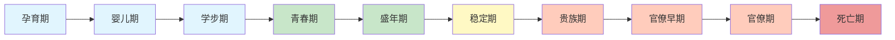
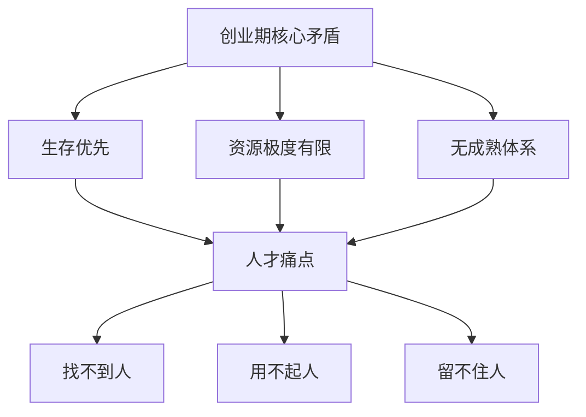
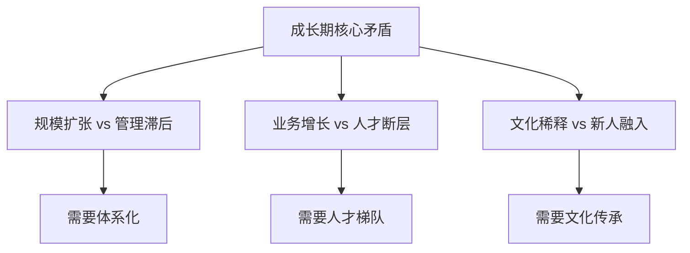
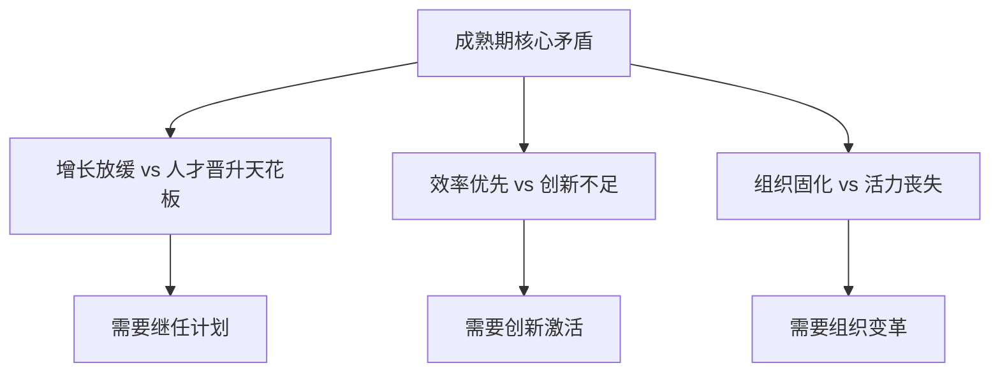
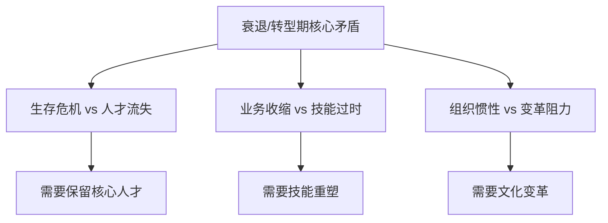

# 企业生命周期与人才战略

> [!abstract] 一句话总结
> 企业在不同生命周期阶段面临截然不同的人才挑战。识别企业所处阶段，是制定正确人才策略的前提。伊查克·爱迪思的十阶段模型为这一判断提供了系统框架。

---

## 伊查克·爱迪思企业生命周期模型

爱迪思（Ichak Adizes）在《企业生命周期》（Corporate Lifecycles）中提出，企业从孕育到死亡经历十个阶段。本笔记聚焦于**四个关键阶段**，建立"阶段识别→人才诊断→策略制定"的分析框架。

> [!note] 阶段聚类
> 为便于实操，将十阶段归并为四个关键阶段：
> - **创业期**（孕育→婴儿→学步）：求生存，验证商业模式
> - **成长期**（学步→青春→盛年）：规模化，建立组织能力
> - **成熟期**（盛年→稳定）：优化效率，构建竞争壁垒
> - **衰退/转型期**（贵族→官僚→死亡）：变革求生，寻找第二曲线

---

## 四阶段人才策略详解

### 一、创业期（孕育、婴儿、学步）

> [!important] 阶段特征
> - **核心任务**：验证产品-市场匹配（PMF），活下来
> - **组织特征**：扁平、灵活、一人多岗、创始人驱动
> - **人才痛点**：找不到人、用不起人、留不住人

| 维度 | 人才特点 | 策略建议 |
|------|----------|----------|
| **人才画像** | 多面手、创业心态、高自驱、容忍模糊性 | 不追求"完美匹配"，看潜力和意愿 |
| **招聘策略** | 以内推和创始人网络为主，重视文化契合 | 早期核心团队宁可"慢招" |
| **培训重点** | 在岗带教、快速试错、生存技能 | 正式培训投入少，以战代练 |
| **组织能力** | 创始团队能力=组织能力上限 | 关注核心团队的能力互补 |
| **激励方式** | 股权/期权 + 使命愿景 | 薪酬偏低，长期激励为主 |

> [!example] 面试话术
> "创业期企业的人才策略核心是'用愿景吸引人，用成长留住人'。培训不是重点，'在战争中学习战争'才是。但需要警惕的是——创始人能力的边界就是组织能力的边界，越早引入关键人才，越能突破天花板。"

### 二、成长期（学步、青春、盛年）

> [!important] 阶段特征
> - **核心任务**：规模化复制，建立管理体系
> - **组织特征**：层级增加、专业分工、制度先行
> - **人才痛点**：人才断层（中层缺位）、文化稀释、新人成活率低

| 维度 | 人才特点 | 策略建议 |
|------|----------|----------|
| **人才画像** | 专业化+通用能力，重视文化契合和执行 | 分层分类画像，批量引进 |
| **招聘策略** | 校招+社招并行，建设雇主品牌 | 建立标准化招聘流程 |
| **培训重点** | 新员工入职培训、管理者培养、专业能力建设 | 从"游击队"变"正规军" |
| **组织能力** | 从个人能力到组织能力，建设流程和体系 | 知识沉淀、经验萃取 |
| **激励方式** | 薪酬+晋升+发展机会 | 职级体系、晋升通道 |

> [!example] 面试话术
> "成长期企业最典型的症状是'腰部无力'——高层有战略、基层有执行，但中层管理者断层。此时培训的核心任务是两个：一是新员工快速融入（降低成活率），二是管理者培养（解决腰部问题）。电网行业就是典型案例，业务扩张期必须建立标准化培训体系。"

### 三、成熟期（盛年、稳定）

> [!important] 阶段特征
> - **核心任务**：优化效率，构建竞争壁垒，探索第二曲线
> - **组织特征**：科层制、流程完善、职业经理人主导
> - **人才痛点**：人才晋升天花板、大企业病、创新乏力

| 维度 | 人才特点 | 策略建议 |
|------|----------|----------|
| **人才画像** | 专家型+管理型，重视系统思维和变革能力 | 内部培养为主，关键岗位外部引入 |
| **招聘策略** | 精准招聘，关键岗位引入外部新鲜血液 | 高端人才猎聘 |
| **培训重点** | 继任计划、干部梯队、领导力、创新思维 | 体系化+个性化的混合培养 |
| **组织能力** | 标准化+持续改进，关注知识管理 | 学习型组织建设 |
| **激励方式** | 长期激励+事业平台+组织荣誉 | 内部创业、合伙人机制 |

> [!example] 面试话术
> "成熟期企业的人才策略关键词是'继任'和'激活'。继任解决的是'关键岗位有人接'的问题，特别是干部梯队建设；激活解决的是'大企业病'，需要通过轮岗、内部创业、跨界学习等方式打破组织僵化。这一阶段，培训从'培养能力'升级为'驱动变革'。"

### 四、衰退/转型期（贵族、官僚、死亡）

> [!important] 阶段特征
> - **核心任务**：自救或变革，寻找第二曲线
> - **组织特征**：臃肿、僵化、政治化、回避风险
> - **人才痛点**：核心人才流失、技能过时、变革阻力大

| 维度 | 人才特点 | 策略建议 |
|------|----------|----------|
| **人才画像** | 变革型+复合型，重视适应力和学习力 | 识别"变革代理人" |
| **招聘策略** | 外部引入变革型领导者，激活组织 | 关键岗位外部空降 |
| **培训重点** | 技能重塑（reskilling）、变革管理、数字化能力 | 大规模再培训 |
| **组织能力** | 瘦身+聚焦，砍掉非核心业务 | 组织架构重组 |
| **激励方式** | 保留奖金+变革激励 | 止血优先，保留核心人才 |

> [!example] 面试话术
> "衰退期企业最需要的是'变革代理人'。培训的重点是技能重塑（reskilling）——员工的现有技能可能已经过时，必须大规模学习新能力。比如制造业向数字化转型，培训团队需要设计'数字技能提升计划'，帮助一线员工掌握新工具。同时，文化变革也是培训的重要使命——打破'不犯错就是成功'的贵族心态。"

---

## 生命周期阶段的判断框架

> [!tip] 面试中如何分析一家企业处于什么阶段

可以从以下维度快速判断：

| 判断维度 | 创业期 | 成长期 | 成熟期 | 衰退/转型期 |
|----------|--------|--------|--------|-------------|
| 营收增速 | 不确定 | >30% | 5%-10% | 负增长或停滞 |
| 组织规模 | <100人 | 快速扩张 | 稳定 | 缩减 |
| 管理层级 | 1-2层 | 3-4层 | 5层以上 | 臃肿 |
| 制度成熟度 | 无 | 建设中 | 完善 | 冗余 |
| 创新氛围 | 极强 | 强 | 减弱 | 几乎消失 |
| 人才流动率 | 高（被动） | 高（主动） | 低 | 高（核心人才流失） |

> [!warning] 注意
> 企业生命周期不是线性的。盛年期企业可以通过"创新孵化"重新进入成长期（第二曲线）。判断时不要简单贴标签，要关注趋势而非静态状态。

---

## 面试应用

> [!question] 高频面试题
> **"如果让你负责一家企业的人才发展，你首先会做什么？"**

**推荐回答框架**：

1. **第一步：诊断企业生命周期阶段**
   - 看营收增速、组织规模、管理层级、制度成熟度
   - 判断处于创业/成长/成熟/衰退哪个阶段

2. **第二步：识别该阶段的人才核心痛点**
   - 创业期：多面手+快速试错
   - 成长期：人才断层+文化稀释
   - 成熟期：继任+激活
   - 衰退期：保留核心+技能重塑

3. **第三步：制定针对性人才策略**
   - 结合业务战略，设计"培训+招聘+激励"组合拳
   - 举例说明：如果判断企业处于成长期，我会优先建立新员工培训体系和管理者培养项目

4. **第四步：动态调整**
   - 人才策略不是一成不变的，需要持续监测阶段变化
   - 关注"第二曲线"信号，提前布局

---

## 关联笔记

- [[03-HR人事/培训与人才发展/01-战略视角/02_战略人力资源与人才供应链]] —— 人才供应链视角补充
- [[03-HR人事/培训与人才发展/01-战略视角/03_不同战略下的人才发展策略]] —— 战略类型与人才策略的交叉分析
- [[03-HR人事/培训与人才发展/02-核心理论/05_70-20-10法则]] —— 不同阶段如何配置70-20-10比例
- [[03-HR人事/培训与人才发展/00_MOC_培训与人才发展中枢]] —— 返回知识库目录
- [[电网项目人才培养实践]] —— 案例：成长期企业的标准化培训体系建设
- [[HR AI转型全景图]] —— 前沿：AI如何加速企业生命周期中的人才策略迭代