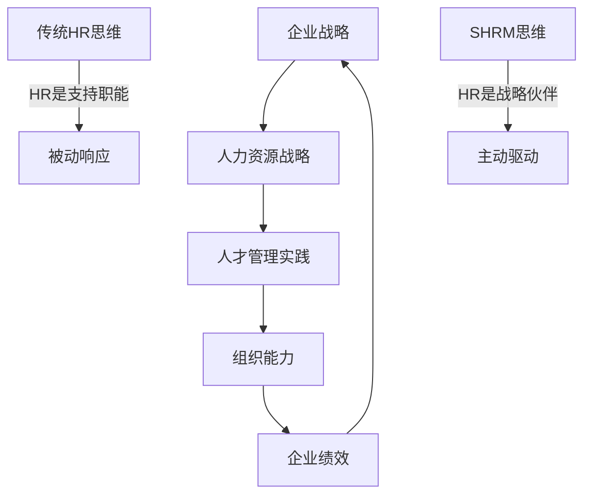
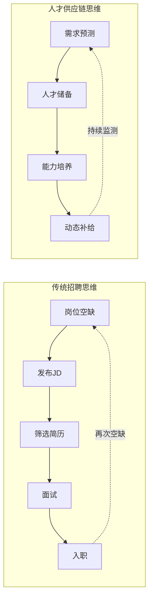
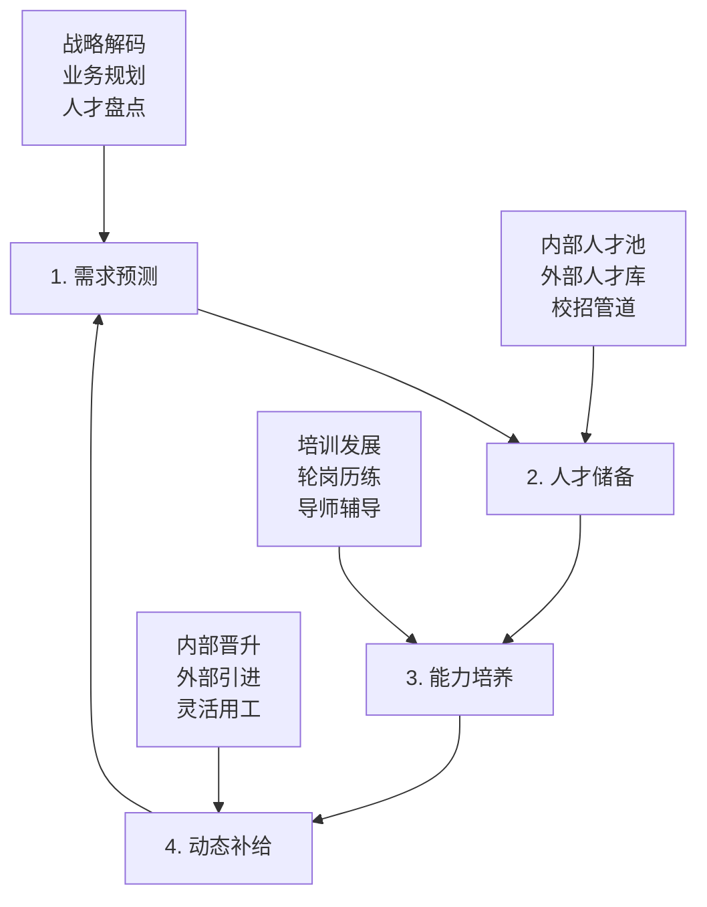
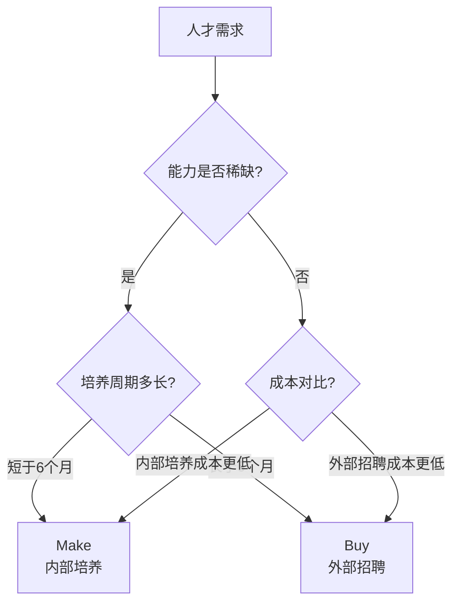

# 战略人力资源与人才供应链

> [!abstract] 一句话总结
> HR不是支持职能，而是战略伙伴。人才供应链的核心思想是：像管理供应链一样管理人才，实现从需求预测到动态补给的全流程贯通。

---

## 战略人力资源管理（SHRM）核心思想

> [!important] SHRM vs 传统HR

| 维度 | 传统HR | 战略HR（SHRM） |
|------|--------|----------------|
| **定位** | 行政支持、服务部门 | 战略伙伴、业务驱动者 |
| **工作方式** | 被动响应业务需求 | 主动参与战略制定 |
| **关注焦点** | 事务执行（招聘、发薪、考勤） | 组织能力建设、人才竞争力 |
| **衡量标准** | 效率指标（招聘周期、培训场次） | 效果指标（人效、人才梯队健康度） |
| **思维模式** | "业务要什么人，我招什么人" | "战略需要什么能力，我建什么能力" |
| **与业务关系** | 服务与被服务 | 并肩作战的伙伴 |

> [!quote] 经典论述
> "人力资源管理的核心命题不是'管人'，而是'构建组织能力'。一个企业的竞争力，最终取决于它的人才密度和人才结构。" —— 戴夫·尤里奇（Dave Ulrich）

---

## 人才供应链思维

### 传统招聘思维 vs 人才供应链思维

> [!important] 核心差异

| 维度 | 传统招聘 | 人才供应链 |
|------|----------|-----------|
| **触发方式** | 岗位空缺后启动 | 战略驱动，提前布局 |
| **时间视角** | 短期（填坑） | 长期（建管道） |
| **人才来源** | 外部招聘为主 | 内外结合，动态平衡 |
| **评估标准** | 招到人 | 建好梯队 |
| **风险态度** | 接受断档 | 主动预防断档 |
| **比喻** | 口渴了才挖井 | 建好水库，持续供水 |

### 人才供应链四环节

> [!tip] 各环节关键动作

**环节一：需求预测**
- 战略解码：将业务战略翻译为人才需求（数量、质量、结构、时间）
- 人才盘点：识别现有人才的数量、质量、结构差距
- 情景规划：考虑不同业务情景下的人才需求变化

**环节二：人才储备**
- 内部人才池：高潜人才库、关键岗位继任计划
- 外部人才库：行业人才地图、目标公司人才清单
- 校招管道：管培生计划、校企合作

**环节三：能力培养**
- 培训发展：系统化培训项目、在岗学习
- 轮岗历练：跨部门、跨职能岗位轮换
- 导师辅导：导师制、行动学习

**环节四：动态补给**
- 内部晋升：优先内部选拔，激励员工成长
- 外部引进：关键岗位、稀缺能力外部招聘
- 灵活用工：项目制、顾问、外包等弹性用工方式

---

## Make or Buy 决策框架

> [!important] 核心问题
> 什么时候内部培养（Make），什么时候外部招聘（Buy）？

> [!tip] Make or Buy 决策矩阵

| 决策因素 | 倾向 Make（内部培养） | 倾向 Buy（外部招聘） |
|----------|----------------------|----------------------|
| **能力稀缺性** | 市场供给充足 | 市场极度稀缺 |
| **培养周期** | 短期可培养（<6个月） | 需要长期积累（>1年） |
| **文化匹配度** | 文化要求极高 | 需要新鲜血液 |
| **成本效益** | 培养成本 < 招聘溢价 | 培养成本 > 招聘溢价 |
| **紧迫性** | 不急，可以等 | 即刻需要，不能等 |
| **战略价值** | 核心能力，必须自建 | 非核心能力，可以外包 |
| **行业特点** | 行业知识壁垒高（如电力、金融） | 通用能力（如互联网技术） |

> [!example] 电网案例：为什么电网行业必须"Make"
>
> **背景**：电网行业（国家电网、南方电网）的知识壁垒极高，电力系统运行、调度、检修等核心能力无法从外部市场直接获取。
>
> **分析**：
> - **能力稀缺性**：电力系统运行人才极度稀缺，外部市场几乎不存在
> - **培养周期**：一名合格的调度员需要3-5年培养，工程师需要5-8年
> - **文化匹配度**：电网安全文化、央企文化需要长期浸润
> - **战略价值**：电力运行是核心能力，必须自主掌控
>
> **结论**：电网行业的人才策略必须是"Make"为主，"Buy"为辅。核心岗位100%内部培养，边缘岗位（如IT通用技术）可以适当外部引进。
>
> **实践**：
> - 国网技术学院：每年培训上万名新员工
> - 师带徒制度：6-12个月带教周期
> - 技能鉴定：从初级工到高级技师的完整晋升通道
> - 仿真培训：电力系统仿真平台，降低培训风险

---

## 面试应用

> [!question] 高频面试题
> **"你如何理解战略人力资源？"**

**推荐回答框架**：

1. **先破后立：对比传统HR和SHRM**
   - "传统HR是'业务要什么人，我招什么人'，SHRM是'战略需要什么能力，我构建什么能力'"
   - 用尤里奇的理论引出：HR的核心价值是构建组织能力

2. **引入人才供应链概念**
   - "我理解SHRM最核心的落地抓手是人才供应链"
   - 解释四环节：需求预测→人才储备→能力培养→动态补给

3. **用Make or Buy框架展示决策能力**
   - "不是所有人才都需要外部招聘，也不是所有能力都需要内部培养"
   - 结合行业特点分析：知识壁垒高的行业必须Make，通用能力可以Buy

4. **举例说明**
   - "以电网行业为例，核心调度和检修人才必须内部培养，因为外部市场不存在这类人才"
   - "而以互联网行业为例，技术人才市场供给充足，可以Buy为主"

5. **收尾拔高**
   - "SHRM的终极目标不是'管好人'，而是'让组织能打仗、打胜仗'"
   - "在AI时代，SHRM还要回答一个问题：哪些能力需要人，哪些能力可以用AI替代"

> [!tip] 加分项
> - 提到"人才密度"（Talent Density）概念
> - 提到"人才供应链的安全库存"类比
> - 结合具体行业特点做差异化分析

---

## 关联笔记

- [[03-HR人事/培训与人才发展/01-战略视角/01_企业生命周期与人才战略]] —— 不同阶段的人才供应链策略差异
- [[03-HR人事/培训与人才发展/01-战略视角/03_不同战略下的人才发展策略]] —— 战略类型如何影响人才供应链配置
- [[03-HR人事/培训与人才发展/02-核心理论/05_70-20-10法则]] —— 能力培养环节的混合式学习设计
- [[03-HR人事/培训与人才发展/00_MOC_培训与人才发展中枢]] —— 返回知识库目录
- [[电网项目人才培养实践]] —— 深度案例：电力行业的人才供应链实践
- [[HR AI转型全景图]] —— 前沿：AI如何重塑人才供应链